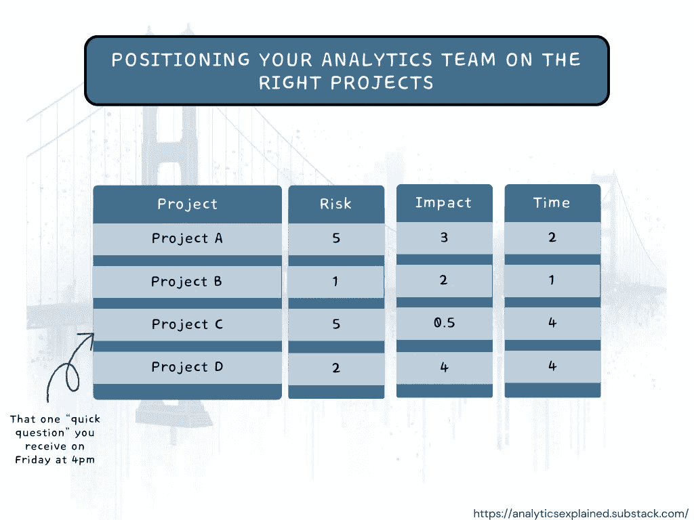

# 将你的分析团队定位到正确的项目上

> 原文：[`towardsdatascience.com/positioning-your-analytics-team-on-the-right-projects-a42f9a2ef2b8?source=collection_archive---------6-----------------------#2023-12-23`](https://towardsdatascience.com/positioning-your-analytics-team-on-the-right-projects-a42f9a2ef2b8?source=collection_archive---------6-----------------------#2023-12-23)

## “好的足球运动员会跟随足球——最好的足球运动员已经在球落地时就在那里”

 [乔丹·戈梅斯](https://medium.com/@jordangom?source=post_page-----a42f9a2ef2b8--------------------------------)

·

[关注](https://medium.com/m/signin?actionUrl=https%3A%2F%2Fmedium.com%2F_%2Fsubscribe%2Fuser%2Fbd72dcfe2a5a&operation=register&redirect=https%3A%2F%2Ftowardsdatascience.com%2Fpositioning-your-analytics-team-on-the-right-projects-a42f9a2ef2b8&user=Jordan+Gomes&userId=bd72dcfe2a5a&source=post_page-bd72dcfe2a5a----a42f9a2ef2b8---------------------post_header-----------) 发表在 [Towards Data Science](https://towardsdatascience.com/?source=post_page-----a42f9a2ef2b8--------------------------------) · 5 分钟阅读 · 2023 年 12 月 23 日

--

你将要参与的项目对你团队的成功（以及你自己的成功）有着很大的影响。在某种程度上，这也是你每月/每季度/每天（取决于你的优先级排序流程）必须做出的最重要的决定之一。

然而——我从未真正遇到过适合我需求的分析世界的思维模型，用于帮助决定该参与哪些项目。因此，这就是我们将在本文中尝试的练习——制定一个思维模型来帮助做出更好的优先级决策。

项目优先级排序表（图片来源于作者）

# 任何项目都有其相关的风险。

正如我们在[上一篇文章](https://analyticsexplained.substack.com/p/why-data-projects-fail-to-deliver)中讨论的那样，有多个宏观元素可以影响你的研究：数据可用性、技能水平、时间框架、组织准备情况和政治环境。

这些因素中的每一个都可能在你的研究中产生一些风险。如果你没有正确的数据，你很可能无法得到正确的答案。如果你没有合适的技能，或者你当前的技能与需要掌握的技能之间的差距太大，或者你的组织没有准备好实施任何结果，或者可能会有一些政治障碍阻碍实施——你的项目失败的风险就会更高。

尽管有许多不同和复杂的因素在起作用，但在你这边，你可以用简单的方法对潜在项目进行评分——使用 1-5 分评分系统（或 0-100%），基于你克服上述任何障碍的能力的信心。

# 影响有不同的规模和形式。

理解项目的影响力需要你正确理解你的分析项目将在实际中如何使用。在某种程度上，这是一种很好的强制因素，用来正确理解“需要完成的工作”以及你的工作如何被操作化。

在进行此项工作时，有几个方面需要考虑：

+   重要的是要考虑“第二层次”的影响。有些数据项目将会有“自身”的影响。其他的则会使其他人能够产生更大的影响（例如：仪表板）。还有一些将解锁之前“锁定”的数据分析（例如：数据管道）。

+   “价值的深度”并不是唯一需要考虑的标准——“宽度”也很重要。例如，构建一个仪表板可能会产生少量的价值，但面向大量用户——总的来说，这实际上是很多价值。

+   影响需要根据工作的时效性和需求来考虑。如果你的行业正在快速发展，或者公司战略有早期变化的迹象——在你的影响计算中考虑这些因素是很重要的。

同样地，使用 5 分制评分系统可以是对不同项目进行排序并理解哪些项目可能产生最高价值的简单方法。

# 你的时间有限。

时间是另一个重要的强制因素——因为要准确计算完成研究所需的时间，你必须对项目的范围有清晰的理解。这不仅仅是关于数据项目本身，而是关于所有能够使项目成功的因素：

+   确保在项目开始前，每个人对目标和交付物达成一致。

+   实际执行项目。

+   使其易于理解。

+   将其传达给你的受众。

+   在项目结束后达成对结果和行动项的共识。

请注意，项目进行到一半时总会有一个意外的挑战。这就是任何数据项目的魅力，它就像《福瑞斯特·冈普》中的巧克力盒——你永远不知道你会得到什么。考虑到这些意外的“惊喜”是很重要的，最好预留稍多的时间。如果你对所需时间毫无头绪，以下是一些建议：

+   与过去类似的项目进行基准比较

+   使用 [群体智慧](https://en.wikipedia.org/wiki/Wisdom_of_the_crowd) 并询问其他同行他们认为这样的项目需要多少时间。

+   进行一个 “[思想实验](https://fs.blog/thought-experiment/)”（但是真正的实验，而不是仅仅思考 2 分钟）。花些时间想象整个过程以及你需要经历的所有步骤来完成项目。从你的视觉化练习中，评估一下从开始到完成所需的时间。

# 综合考虑

现在你已经有了一个清晰的了解：

+   每个项目所需的时间

+   这些项目将带来的影响

+   每个项目相关的风险

你可以将所有这些信息综合起来，定义你的“投资理论”。

基本上，就像风险投资基金投资于初创公司一样——你决定将比金钱更宝贵的东西投资到哪里：你的时间。你可以选择（在合理范围内）如何平衡团队的投资组合：你对什么风险水平感到舒适？你是想选择几个冒险项目还是众多简单/经过验证的项目？你是否想加倍投入那些已经在过去显示出成功影响的项目？你决定。

我的个人投资理论：我总是尽量每季度选择一两个低信心/高回报的项目，同时还有众多较小/更容易/有保证价值的项目。

# 简而言之

把自己当作数据项目领域的风险投资家。你做出的每一个选择都是一种投资——不是金钱的投资，而是更宝贵的东西：你的时间和精力。

你面临着所有这些潜在项目争夺你的注意力，每个项目都有其自身的风险和回报。就像风险投资家一样，你需要选择那些承诺能带来最佳回报的项目。这意味着有时需要选择那些低信心、高回报的长期项目，这些项目可能会真正带来收益。其他时候，则是积累那些较小的成功，确保稳定的价值和进展。

最终，你负责定义自己的投资组合——并且主动承担这一活动非常重要，因为如果你不这样做，别人会。
