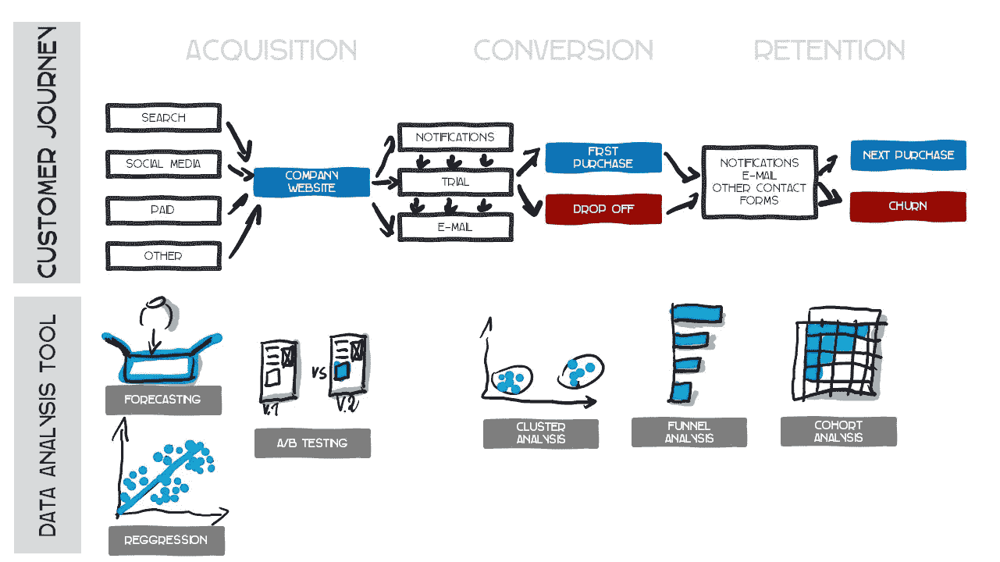
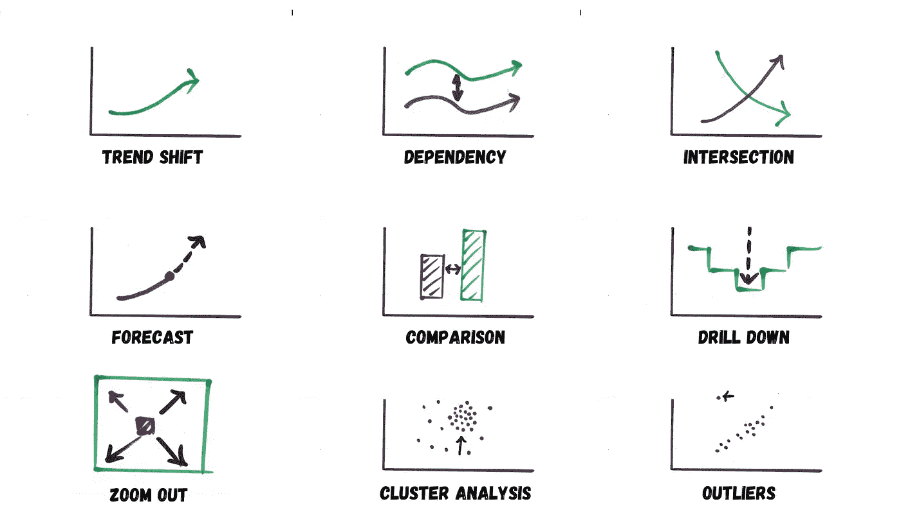

# 数据驱动讲故事中的上下文力量

> 原文：[`towardsdatascience.com/power-of-context-in-data-driven-storytelling-b4dc48a402e`](https://towardsdatascience.com/power-of-context-in-data-driven-storytelling-b4dc48a402e)

## **要么正确开始，要么立刻放弃**

 [Michal Szudejko](https://medium.com/@michalszudejko?source=post_page-----b4dc48a402e--------------------------------)

·发表于 [Towards Data Science](https://towardsdatascience.com/?source=post_page-----b4dc48a402e--------------------------------) ·阅读时间 12 分钟·2023 年 9 月 5 日

--

# **什么是数据驱动讲故事，它为何如此重要？**

**数据驱动讲故事是一种通过叙述和可视化来传达数据信息的方式。其目标是吸引观众，并帮助他们更好地理解主要结论和趋势。**

**数据可视化**有助于吸引观众。仅仅展示原始事实或信息是不够的。以一种能引起观众注意并且令人愉悦的方式展示数据是很重要的。

**叙事** 就是故事本身。叙事位于数据驱动故事的核心，帮助创造一个连贯的、有意义的信息。

**上下文是数据驱动讲故事中的一个关键组成部分，在我看来，占据了故事成功的 80%。叙事和视觉元素占据了剩下的 20%。**

今天，我们拥有丰富的数据、工具和方法。然而，即使有了这些资源，将它们付诸实践仍然是相当具有挑战性的。讲故事可以弥合这个差距。今天公司的决策者、董事会成员、总监和经理们，不应担心数据清理、分析技术或具体工具。对他们而言，重要的是解释、建议及其潜在影响。他们希望能够提出问题、提供反馈并理解答案。**他们都需要数据驱动的讲故事！**

# **但如果我们不认识到上下文，数据讲故事必然会失败！**

**故事的上下文有三个基本维度：情境、功能和数据。**

**本质上，上下文** 指的是故事双方（即讲述者和观众）都需要理解的背景信息。它回答三个主要问题：**谁**，**什么**，和 **如何**？

## **谁？**

这关乎于确定故事的受众是谁，并理解讲述者与听众之间的关系。

## **什么？**

这关乎于故事的主要主题以及你希望受众在听完后做出什么决定或行动。

## **怎么做？**

这关乎于选择正确的数据和分析工具，并决定如何将发现与受众分享。

# **如果我们没有做好这些功课，会发生什么？**

哦，很多。我给你举几个例子。

## **切斯托霍瓦防守**

切斯托霍瓦是波兰南部的一座城市，拥有一座可以追溯到 15 世纪的著名大教堂。它有一幅受人尊敬的圣母像，对许多波兰人来说极为神圣。这座城市还因其在 1655 年战胜强大的瑞典军队而闻名，被誉为勇气和抵抗的经典例证。

切斯托霍瓦防守，[source](https://commons.wikimedia.org/wiki/File%3AJasna_G%C3%B3ra_1655.jpg)。

当波兰足球队面对强大的对手并必须防守自己的球门（这种情况经常发生）时，我们波兰人开玩笑地称之为“防守切斯托霍瓦”。我们希望他们能像 17 世纪的防御者那样获胜，但这通常只是愿望罢了。

不幸的是，当我们不认识或不关心上下文时，这也是我们故事中相当常见的情形。大多数关于数据的批评（无论是否有效）都源于模糊性或不一致性。当数据不清晰或自相矛盾时，人们更容易质疑其有效性。而且，事实证明，捍卫我们的立场会更加困难。

回到我的切斯托霍瓦例子，那里（只有）一个对手。假设有更多的对手。两个、三个、更多，**所有的对手**！这时我们就陷入了

## 问题的交火

问题的交火。来源：由作者在 DALL-E 2 生成的图像

当有影响力或权威人士提出疑虑或担忧时，这种轰炸会显著加剧。一旦种下了怀疑的种子，其他人可能会迅速跟进，提出问题或放大初步的担忧。

这里的危险有两方面。首先，这些疑虑和担忧很容易遮蔽我们的故事和支持分析。其次，当面临无情的提问，特别是如果没有准备好，就有可能显得不够可信或知识浅薄，即使数据和故事最初是扎实且经过良好研究的。

我们自己也可能会对这种混乱作出贡献。尤其是如果我们在某些时候，可能无意中做了一些事，这会...

## 牵连某人

这很经典。确实，不太好。

来源：由作者在 DALL-E 2 生成的图像

在展示数据驱动的洞察时，有可能无意中让观众中的某个人处于不舒服的境地，特别是当数据揭示敏感或意外的结果时。这可能导致紧张局势并打乱讨论的整体流程。这种不适可能源于挑战现有信念的数据，暗示意外的后果，或突显某些特定领域或个人。

这些情况可能会偏离主要的数据洞察，并破坏预期的叙事。个体可能会感到被针对或防御，特别是当数据似乎在批评他们的工作或决策时。此外，其他观众成员可能会小心翼翼，因为他们担心后续的数据点可能会突显他们的领域。以同理心和策略来展示数据至关重要，以维持建设性的环境。

**好的。现在我们知道了可能出现的问题。让我们看看如何避免或摆脱困难情况。**

# 情境背景

## 准备的威力

在制作以数据为驱动的演示或沟通时，设定合适的背景并了解受众的动态至关重要，无论他们是同事、上级还是下属。预测可能的异议并确保数据的清晰性非常关键。与利益相关者进行预先的数据验证会议尤其重要，特别是在使用不熟悉的工具或数据集时。决定是进行详细的演示还是简短的沟通（如电子邮件）更为适宜。为沟通设定明确的目标，并始终准备好主要信息，以应对有限的注意力跨度。

考虑进行利益相关者访谈、调查、直接观察和焦点小组，以获得全面的理解。技术上的不确定性？咨询领域专家。社交媒体也可以提供公众情绪和潜在受众观点的见解。

## 动力是关键

在我一次关于讲故事的演示中，我构建了一个非凡的结构（在我主观看来）。我们都同意生活中的故事能够引起情感共鸣，对吧？我们认同英雄，憎恨邪恶角色，经历恐惧和快乐。这些都是情感。但是如何在企业生活中激发这些情感呢？嗯，通过**动机**。**你看到了连接了吗？**

企业生活中的动机实际上有两个方面：

+   我们让利益相关者**高兴**或

+   我们让他们**不高兴**。

当他们看到良好的结果、项目进展或战略的首次积极效果时，他们会感到高兴。如果他们看到相反的情况，他们会感到不高兴。或者他们可能会感到受到威胁：一个**邪恶角色**。

来源：作者在 DALL-E 2 生成的图片

在叙事中，三个常见的对手塑造了叙事的框架。第一个是**竞争**。这种外部挑战迫使企业或个人进行创新并保持领先。接着是**全球不确定性**。后 COVID 时代的持续担忧和 2022 年乌克兰战争的影响示例了此类事件如何造成广泛的忧虑。这些不可预测的情况通常需要对计划或策略进行调整。最后是**内部斗争**。像过时的技术这样的问题看似微不足道，但随着时间的推移可能会导致更严重的问题，从而使应对外部挑战变得更加困难。这些元素共同构成了我们故事中的核心障碍，为克服逆境和成长奠定了基础。

[情景分析](https://medium.com/artificial-corner/chatgpt-and-scenario-planning-a342b7186fc0)可以像一个“假如”游戏，帮助企业在面对坏角色时进行导航。对于竞争，它帮助我们预测对手的下一步动作并做好准备。它帮助我们思考不同的结果，并为像 COVID 或冲突这样的意外事件提前制定计划（至少在某种程度上）。对于我们的问题，比如旧技术，它展示了修复这些问题的好处或忽视它们的风险。这是一个帮助企业为不同情况做好准备的工具。

## **应对挑战情境**

“切斯托霍瓦防御”陷阱强调了预先采取行动的必要性。数据必须以透明且连贯的方式呈现。不一致或模糊的可视化可能会损害数据的完整性，导致怀疑。强大的数据管理实践和基于数据科学原则的精确可视化技术对增强数据的可信度至关重要。必须精心准备，预见潜在挑战，并保持一致的数据驱动叙事。数据熟练的同事的审查可以发现分析中的潜在陷阱或偏见。在展示可能敏感或有争议的发现时，调整对观众反应的敏感性至关重要。迅速回应关切，提供数据支持的澄清，并在话题变得有争议时提议后续讨论。在动态的数据科学领域，营造一个开放的、基于证据的沟通环境可以确保每个人都感受到被重视，并做出数据驱动的决策。

# 功能性背景

上下文的功能性方面，尤其是在考虑数据和数据科学时，本质上更具“实际性”。这一务实维度强调将原始数据转化为可操作的洞察，这些洞察与利益相关者产生共鸣，并对业务决策产生直接影响。虽然更广泛的视角提供了总体概述，但功能性上下文确保数据驱动的叙事不仅仅是信息性的，而是真正有影响力、有意义的，并且与业务目标紧密对齐。这是一个不可忽视的元素。

**功能性上下文是关于使数据对现实世界决策有用和相关。** 它将原始数据转化为可以帮助业务的洞察。**情境上下文，另一方面，是关于设定场景。** 它回答了谁应该关心数据，主要信息是什么，以及如何分享。将功能性上下文视为数据故事的“实质”，而情境上下文则是故事发生的“背景”。**这两者都很重要，以确保数据故事既清晰又有影响力。**

## 数据素养

一个重要的方面是[数据素养](https://medium.com/towards-data-science/the-might-of-data-literacy-3d91fcc5f46b)，它有助于保持功能性上下文的连贯性。

数据素养就像是能够阅读和理解数字背后的深层故事。它是关于真正理解数字所传达的信息，并确保我们分享真实且重要的信息。这项技能有助于将复杂的数据转化为人们可以轻松联系的简单故事。

当你具备数据素养时，你可以识别趋势、关系或异常值，并确保数据质量良好。这使得你用数据讲述的故事既有趣又值得信赖。简而言之，就是将数字转化为每个人都能理解并相信的清晰故事。

## 相关性

相关性是引人入胜的叙事的基石，尤其是如果根植于数据科学的话。这是关于确保你展示的问题、概念或机会直接影响业务。虽然不一定需要是有形的，但效果越显著，你的故事就会越有影响力。

在制定叙事时，确定与你的利益相关者产生共鸣的关键绩效指标（KPIs）和关键结果指标（KRIs）至关重要。理解这些通常并不困难。也许你的组织使用[平衡计分卡](https://balancedscorecard.org/bsc-basics-overview/)，这是一个突出目标如何贯穿整个公司的工具，每个目标都有相关的指标。或者，即使没有确切的数字，了解影响某人激励措施的指标也可以增强你故事的影响力。

理解你公司的价值创造链至关重要。这将数据素养与相关性连接起来。例如，你可以向利益相关者展示特定的数据驱动方法如何提升客户旅程的效率。**请看下面的图示。** 教育你的听众关于特定数据分析工具在优化关键业务流程中的好处是一项值得优先考虑的宝贵投资。

来源：由作者基于[1]的灵感制作的图像。

## 情节要点

故事的结构和流程赋予其形式，但情节要点使其独特。这些是塑造每个场景的关键细节。它们让观众能够对呈现的数据的重要性做出自己的评估。它们帮助观众可视化预期的背景。以下是九个需要考虑的关键情节要点：

1.  **趋势变化：** 观察趋势是否在上升或下降以及其进展。例如，即使在投资了安全措施后，生产线上的事故数量可能增加。

1.  **依赖性：** 显示两个事物之间的关系。例如，更高的净推荐值（NPS）可能与更多的客户留存相关联。

1.  **交集：** 这涉及一个变量超越另一个变量。它可以是正面的，比如初创企业的收入超过成本；也可以是负面的，比如一个产品的销售低于竞争对手。

1.  **预测：** 预测未来。例如，一个国家的人口可能因移民和其他人口变化而发生的变化。

1.  **比较：** 指出两个或多个项目之间的相似性或差异性。这可以是比较一台旧机器的效率与我们考虑购买的新机器。这在商业故事中经常使用。

1.  **深入分析：** 将一般数据拆分为详细的细分。你可能在仪表板上看到整体区域结果，然后深入到子区域或单个商店。

1.  **聚合（缩小视图）：** 与深入分析相反。例如，我们将一个商店的结果与区域或全国平均水平进行比较。

1.  **聚类分析：** 揭示数据集中存在的集中或分布情况。显著的聚类可能表明一个机会或问题。例如，一个诊所中最贵的病人可能都居住在特定工厂附近。

1.  **离群值：** 这些是从其他数据点中突出的数据点。离群值可能表示问题或机会，具体取决于背景。例如，某个特定产品的购买频率可能远高于其类别中的其他产品[2]。

来源：由作者基于[2]制作的图像。

# 数据背景

**数据背景指的是附加在原始数据旁的额外信息或“元数据”，以使数据更易于理解和有价值。** 这些元数据本质上就像一张路线图，提供重要细节，比如谁收集了数据、何时何地收集的以及收集数据的初衷。了解背景有助于更准确地解读数据并进行有效的决策。

带有背景的元数据 :)。图片由作者提供。

在企业环境中，管理这些元数据需要各个角色的合作：

1.  **数据生产者**：创建数据的个人或系统。他们负责确保在数据生成或收集时，元数据的准确性和完整性。

1.  **数据使用者**：依赖数据进行各种任务的最终用户，如分析、报告或决策。他们需要元数据来正确解读数据，并信任其有效性。

1.  **元数据管理者**：专门负责管理元数据的人员或系统。他们确保元数据以有序的方式存储，并且数据使用者能够方便地访问这些信息。

正确管理元数据的重要性不容忽视，尤其是在一个日益数据驱动的世界中。**没有这些背景信息，数据很容易被误解或误用，导致错误的结论和不良的决策。**

技术进步促使了更具动态性的元数据管理方法，包括“主动元数据管理”。在这种方法中，元数据不仅仅是静态地存储，而是不断更新和在不同系统间同步。这使得数据的无缝集成和交叉引用成为可能，提供了更全面和最新的视图。主动元数据管理在数据不断更新且需要快速、准确的解读以进行实时决策的环境中至关重要 [[3](https://www.thoughtspot.com/data-trends/best-practices/data-context)]。

## 引用数据来源

关于背景还有最后一点值得提及，那就是引用数据来源。当你在工作中使用数据时，就像从别人那里借书一样。正如你会感谢借书的人，你也应该给予提供数据的人员应有的信用。这不仅是对他人的尊重，还帮助其他人追溯原始数据。如果他们想查看数据本身，这是双赢的：数据的提供者得到认可，使用数据的人可以展示他们的工作基于可靠的信息。为了给予信用，提到数据的创造者、数据生成时间以及数据的名称 [[4](https://library.cumc.columbia.edu/insight/citing-data-sources)]。**在我看来，适当地给予信用尤其在我们之前讨论的前三种情况中可能会起到救命作用。如果数据来源于知名或可信的地方，那就更好了。**

# 结论

**用数据讲故事不仅仅是关于数字。** 这涉及到用视觉效果和好的故事使这些数字易于理解。**关键是背景：** 了解情况，使数据有用，并了解数据来源。想象一下讲解一场著名的战役：如果你没有正确设定背景，人们就无法理解。讲好一个故事，你需要了解你的听众，选择合适的主题，并准备回答任何问题。这也是与人们的情感连接，尤其是在商业中。**擅长数据意味着你的故事既令人兴奋又可信。** 了解数据对公司为何重要以及发现数据中的有趣点使故事更丰富。在充满数据的世界中，适当的背景至关重要。理解数据的来源和其可信度对做出明智决策至关重要。

**作者的主观评估**

你喜欢这篇文章吗？[**考虑订阅**](https://medium.com/@michalszudejko/subscribe)以获取我发布的新故事通知，或[**关注我**](http://michalszudejko/)。

## 参考文献

[1] **艾薇·刘**，*数据策略中的连接点*，2022 年 1 月 2 日

[2] **布伦特·戴克斯**，*《有效的数据讲述》*，Wiley，2019

[3] **彼得·克罗克**，[*增强数据背景的指南：谁，什么，何时，哪里，为什么，以及如何*](https://www.thoughtspot.com/data-trends/best-practices/data-context)*,* 2023 年 8 月 11 日

[4] **哥伦比亚大学**，[*引用数据来源——为什么这样做是好的，以及如何做到？*](https://library.cumc.columbia.edu/insight/citing-data-sources)
