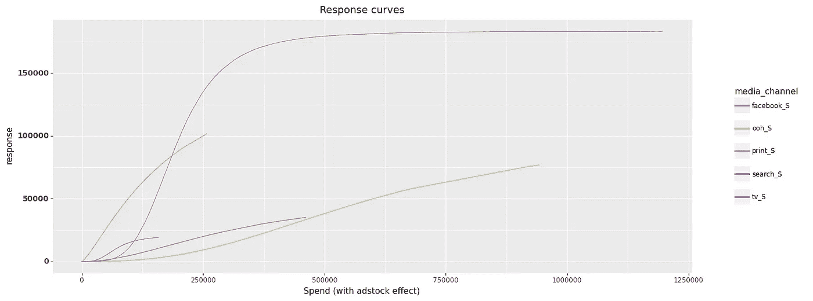
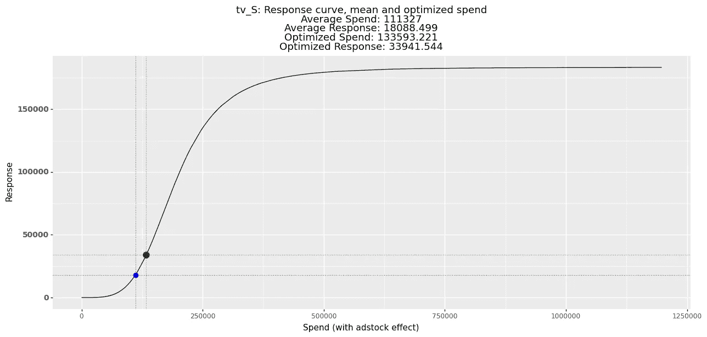

# 实用的预算优化方法在营销组合建模中的应用

> 原文：[`towardsdatascience.com/practical-approaches-to-optimizng-budget-in-marketing-mix-modeling-7816a27f2f71?source=collection_archive---------1-----------------------#2023-02-28`](https://towardsdatascience.com/practical-approaches-to-optimizng-budget-in-marketing-mix-modeling-7816a27f2f71?source=collection_archive---------1-----------------------#2023-02-28)

## 如何使用饱和曲线和统计模型优化媒体组合

[](https://medium.com/@slavax?source=post_page-----7816a27f2f71--------------------------------)[](https://towardsdatascience.com/?source=post_page-----7816a27f2f71--------------------------------) [Slava Kisilevich](https://medium.com/@slavax?source=post_page-----7816a27f2f71--------------------------------)

·

[关注](https://medium.com/m/signin?actionUrl=https%3A%2F%2Fmedium.com%2F_%2Fsubscribe%2Fuser%2Fba0d56f8b910&operation=register&redirect=https%3A%2F%2Ftowardsdatascience.com%2Fpractical-approaches-to-optimizng-budget-in-marketing-mix-modeling-7816a27f2f71&user=Slava+Kisilevich&userId=ba0d56f8b910&source=post_page-ba0d56f8b910----7816a27f2f71---------------------post_header-----------) 发表在 [Towards Data Science](https://towardsdatascience.com/?source=post_page-----7816a27f2f71--------------------------------) · 9 分钟阅读 · 2023 年 2 月 28 日 [](https://medium.com/m/signin?actionUrl=https%3A%2F%2Fmedium.com%2F_%2Fvote%2Ftowards-data-science%2F7816a27f2f71&operation=register&redirect=https%3A%2F%2Ftowardsdatascience.com%2Fpractical-approaches-to-optimizng-budget-in-marketing-mix-modeling-7816a27f2f71&user=Slava+Kisilevich&userId=ba0d56f8b910&source=-----7816a27f2f71---------------------clap_footer-----------)

--

[](https://medium.com/m/signin?actionUrl=https%3A%2F%2Fmedium.com%2F_%2Fbookmark%2Fp%2F7816a27f2f71&operation=register&redirect=https%3A%2F%2Ftowardsdatascience.com%2Fpractical-approaches-to-optimizng-budget-in-marketing-mix-modeling-7816a27f2f71&source=-----7816a27f2f71---------------------bookmark_footer-----------)

图片由 [Joel Filipe](https://unsplash.com/@joelfilip?utm_source=medium&utm_medium=referral) 提供，来源于 [Unsplash](https://unsplash.com/?utm_source=medium&utm_medium=referral)

市场营销组合建模（MMM）是一种数据驱动的方法，用于识别和分析业务结果（如销售或收入）的关键驱动因素，通过检验各种因素对响应的影响。MMM 的目标是提供有关如何优化营销活动（包括广告、定价和促销）以改善业务表现的见解。在所有影响业务结果的因素中，营销贡献（例如各种媒体渠道的广告支出）被认为对响应有直接和可衡量的影响。通过分析不同媒体渠道广告支出的效果，MMM 可以提供有价值的见解，帮助确定哪些渠道最有效于增加销售或收入，以及哪些渠道可能需要优化或淘汰，以最大化营销投资回报。

# 对 MMM 的简短介绍

市场营销组合建模（MMM）是一个多步骤的过程，涉及一系列独特的步骤，这些步骤由正在分析的营销效果驱动。首先，将媒体渠道的系数限制为正值，以考虑广告活动的正面效应。

[](/modeling-marketing-mix-with-constrained-coefficients-234b23190ee2?source=post_page-----7816a27f2f71--------------------------------) ## 受限系数的市场营销组合建模

### 如何在 Python 中使用 RPy2 接口拟合 SciPy 线性回归并调用 R 岭回归

[towardsdatascience.com

其次，应用广告库存转换，以捕捉广告对消费者行为的滞后和衰减影响。

[](/modeling-marketing-mix-using-pymc3-ba18dd9e6e68?source=post_page-----7816a27f2f71--------------------------------) ## 使用 PyMC3 进行市场营销组合建模

### 实验先验、数据归一化，并将贝叶斯建模与 Robyn（Facebook 的开源 MMM）进行比较…

[towardsdatascience.com

第三，广告支出与相应业务结果之间的关系不是线性的，而是遵循递减效应法则。在大多数 MMM 解决方案中，建模者通常采用线性回归来训练模型，这带来了两个主要挑战。首先，建模者必须应用饱和转换步骤来建立媒体活动变量与响应变量之间的非线性关系。其次，建模者必须制定关于适用于每个媒体渠道的可能转换函数的假设。然而，更复杂的机器学习模型可能在不应用饱和转换的情况下捕捉非线性关系。

[## 使用平滑样条建模营销组合](https://towardsdatascience.com/modeling-marketing-mix-using-smoothing-splines-98dc8e84c367?source=post_page-----7816a27f2f71--------------------------------)

### 捕捉非线性广告饱和度和递减回报，而无需显式转换媒体变量

[使用平滑样条建模营销组合](https://towardsdatascience.com/modeling-marketing-mix-using-smoothing-splines-98dc8e84c367?source=post_page-----7816a27f2f71--------------------------------) [](/improving-marketing-mix-modeling-using-machine-learning-approaches-25ea4cd6994b?source=post_page-----7816a27f2f71--------------------------------) [## 使用机器学习方法改善营销组合建模

### 使用基于树的集成方法构建 MMM 模型，并使用 SHAP（Shapley 加性解释）解释媒体渠道表现

[改善营销组合建模使用机器学习方法](https://towardsdatascience.com/improving-marketing-mix-modeling-using-machine-learning-approaches-25ea4cd6994b?source=post_page-----7816a27f2f71--------------------------------)

最后一步是通过估计系数以及广告库存和饱和函数的参数来构建营销组合模型。

# 预算优化

饱和曲线和经过训练的模型都可以用于营销组合建模，以优化预算支出。使用饱和曲线的优势包括：

+   简化可视化支出对结果的影响

+   不再需要基础模型，因此预算优化程序简化，仅需饱和转换的参数

其中一个缺点是饱和曲线基于历史数据，可能无法始终准确预测未来支出的响应。

使用训练模型进行预算优化的优势在于，模型使用媒体活动与其他变量（包括趋势和季节性）之间的复杂关系，可以更好地捕捉递减回报。

## 数据

我继续使用[Robyn](https://github.com/facebookexperimental/Robyn)提供的 MIT 许可证数据集进行实际示例，并按照相同的数据准备步骤应用 Prophet 来分解趋势、季节性和假期。

数据集包括 208 周的收入（从 2015 年 11 月 23 日到 2019 年 11 月 11 日），包含：

+   5 个媒体支出渠道：**tv_S, ooh_S, print_S, facebook_S, search_S**

+   2 个也包含曝光信息（印象，点击）的媒体渠道：facebook_I, search_clicks_P（本文未使用）

+   无支出的有机媒体：**新闻通讯**

+   控制变量：**事件，假期**，竞争对手销售 (**competitor_sales_B)**

## 建模

我构建了一个完整的工作 MMM 流程，可以在现实生活中用于分析媒体支出对响应变量的影响，包含以下组件：

+   [广告库存转换](https://medium.com/towards-data-science/modeling-marketing-mix-using-pymc3-ba18dd9e6e68)具有无限衰减率（0 < α < 1）

+   [饱和 Hill 变换](https://static.googleusercontent.com/media/research.google.com/en//pubs/archive/46001.pdf) 具有两个参数：斜率/形状参数（控制曲线的陡峭度（s > 0））和半饱和点（0 < k ≤ 1）

+   来自 [scikit-learn](https://scikit-learn.org/stable/modules/generated/sklearn.linear_model.Ridge.html) 的岭回归

+   [基于时间的交叉验证](https://scikit-learn.org/stable/modules/generated/sklearn.model_selection.TimeSeriesSplit.html)

+   [Optuna 超参数调优](https://optuna.org)

**关于系数的说明**

在 scikit-learn 中，岭回归不提供设置部分系数为正值的选项。然而，一个可能的解决方法是，如果某些媒体系数为负值，则拒绝 optuna 解决方案。这可以通过返回一个非常大的值来实现，表明负系数是不可接受的，必须排除。

**关于饱和变换的说明**

Hill 饱和函数假设输入变量在 0 到 1 的范围内，这意味着在应用变换之前必须对输入变量进行归一化。这一点很重要，因为 Hill 函数假设输入变量的最大值为 1。

然而，可以通过使用以下方程式将半饱和参数缩放到支出范围，从而将 Hill 变换应用于未归一化的数据：

```py
half_saturation_unscaled = half_saturation * (spend_max - spend_min) + spend_min
```

其中 *half_saturation* 是在 0 和 1 之间的原始半饱和参数，*spend_min* 和 *spend_max* 分别表示最小和最大支出值。

完整的变换函数如下：

```py
class HillSaturation(BaseEstimator, TransformerMixin):
    def __init__(self, slope_s, half_saturation_k):
        self.slope_s = slope_s
        self.half_saturation_k = half_saturation_k

    def fit(self, X, y=None):
        return self

    def transform(self, X: np.ndarray, x_point = None):

        self.half_saturation_k_transformed  = self.half_saturation_k * (np.max(X) - np.min(X)) + np.min(X)

        if x_point is None:
            return (1 + self.half_saturation_k_transformed**self.slope_s / X**self.slope_s)**-1

        #calculate y at x_point
        return (1 + self.half_saturation_k_transformed**self.slope_s / x_point**self.slope_s)**-1
```

**使用饱和曲线进行预算优化**

一旦模型训练完成，我们可以使用通过 Hill 饱和变换生成的响应曲线来可视化媒体支出对响应变量的影响。下图展示了五个媒体渠道的响应曲线，描述了每个渠道的支出（按周）与 208 周期间响应之间的关系。



作者提供的图片

使用饱和曲线优化预算涉及确定每个媒体渠道的最佳支出，以在保持总预算固定的情况下实现最高的整体响应。

为了启动优化，通常使用特定时间段的平均支出作为基准。然后，优化器使用每个渠道的预算，这些预算可以在预定的最小和最大限度（边界）内波动，以进行受限优化。

以下代码片段演示了如何使用[*minimize*](https://docs.scipy.org/doc/scipy/reference/generated/scipy.optimize.minimize.html)函数（来自*scipy.optimize*包）实现预算优化。然而，值得注意的是，也可以使用其他优化包，如[nlopt](https://nlopt.readthedocs.io/en/latest/NLopt_Python_Reference/)或[nevergrad](https://github.com/facebookresearch/nevergrad)。

```py
optimization_percentage = 0.2

media_channel_average_spend = result["model_data"][media_channels].mean(axis=0).values

lower_bound = media_channel_average_spend * np.ones(len(media_channels))*(1-optimization_percentage)
upper_bound = media_channel_average_spend * np.ones(len(media_channels))*(1+optimization_percentage)

boundaries = optimize.Bounds(lb=lower_bound, ub=upper_bound)

def budget_constraint(media_spend, budget):  
  return np.sum(media_spend) - budget

def saturation_objective_function(coefficients, 
                                  hill_slopes, 
                                  hill_half_saturations, 
                                  media_min_max_dictionary, 
                                  media_inputs):

    responses = []
    for i in range(len(coefficients)):
        coef = coefficients[i]
        hill_slope = hill_slopes[i]
        hill_half_saturation = hill_half_saturations[i]

        min_max = np.array(media_min_max_dictionary[i])
        media_input = media_inputs[i]

        hill_saturation = HillSaturation(slope_s = hill_slope, half_saturation_k=hill_half_saturation).transform(X = min_max, x_point = media_input)
        response = coef * hill_saturation
        responses.append(response)

    responses = np.array(responses)
    responses_total = np.sum(responses)
    return -responses_total

partial_saturation_objective_function = partial(saturation_objective_function, 
                                                media_coefficients, 
                                                media_hill_slopes, 
                                                media_hill_half_saturations, 
                                                media_min_max)

max_iterations = 100
solver_func_tolerance = 1.0e-10

solution = optimize.minimize(
      fun=partial_saturation_objective_function,
      x0=media_channel_average_spend,
      bounds=boundaries,
      method="SLSQP",
      jac="3-point",
      options={
          "maxiter": max_iterations,
          "disp": True,
          "ftol": solver_func_tolerance,
      },
      constraints={
          "type": "eq",
          "fun": budget_constraint,
          "args": (np.sum(media_channel_average_spend), )
      })
```

一些重要点：

+   **fun** — 需要最小化的目标函数。在这种情况下，它接受以下参数：

    *媒体系数* — 每个媒体渠道的岭回归系数，与相应的饱和度水平相乘，以估计每个媒体渠道的响应水平。

    *斜率*和*半饱和度* — Hill 变换的两个参数，用于每个媒体渠道的支出最小值和最大值，以正确估计给定媒体支出的响应水平。

    目标函数遍历所有媒体渠道，并根据每个媒体渠道的个体响应水平的总和计算总响应。为了在优化函数中最大化响应，我们需要将其转换为最小化问题。因此，我们获得总响应的负值，并将其作为优化函数的目标。

+   **method = SLSQP** — 顺序最小二乘规划（SLSQP）算法是一种流行的约束优化问题方法，通常用于优化市场营销组合建模中的预算分配。

+   **x0** — 初始猜测。一个大小为(n,)的实数数组，其中`n`是独立变量的数量。在这种情况下，x0 对应于媒体渠道的平均支出，即每个渠道的平均支出数组。

+   **bounds** — 指每个渠道的媒体支出范围。

+   **约束条件** — SLSQP 的约束条件被定义为字典列表，其中`budget_constraint`是一个确保媒体支出总和等于固定预算的函数：`np.sum(media_channel_average_spend)`。

优化过程完成后，我们可以为每个媒体渠道生成响应曲线，并比较优化前后的支出分配，以评估优化过程的影响。



图片由作者提供

**使用训练模型进行预算优化**

使用训练模型优化预算的过程与之前的方法非常相似，并且可以应用于有饱和度变换和没有饱和度变换的模型。这种方法为优化营销组合提供了更大的灵活性，允许在包括未来在内的各种时间周期中进行优化。

以下代码突出了当前方法和之前方法之间的差异：

每个渠道的平均支出乘以期望的优化周期。

```py
optimization_period = result["model_data"].shape[0]
print(f"optimization period: {optimization_period}")

optimization_percentage = 0.2

media_channel_average_spend = optimization_period * result["model_data"][media_channels].mean(axis=0).values

lower_bound = media_channel_average_spend * np.ones(len(media_channels))*(1-optimization_percentage)
upper_bound = media_channel_average_spend * np.ones(len(media_channels))*(1+optimization_percentage)

boundaries = optimize.Bounds(lb=lower_bound, ub=upper_bound)
```

我们可以将优化结果解释为“在特定时间区间内，每个渠道的适当支出量”。

目标函数还需要两个额外参数：`*optimization_period*`和`*additional_inputs*`*—* 所有其他用于模型训练并在所选时间周期内可用的变量，如*趋势*、*季节性*、*控制变量*：

```py
def model_based_objective_function(model, 
                                   optimization_period, 
                                   model_features, 
                                   additional_inputs, 
                                   hill_slopes, 
                                   hill_half_saturations, 
                                   media_min_max_ranges, 
                                   media_channels, 
                                   media_inputs):

    media_channel_period_average_spend = media_inputs/optimization_period

    #transform original spend into hill transformed
    transformed_media_spends = []
    for index, media_channel in enumerate(media_channels):
        hill_slope = hill_slopes[media_channel]
        hill_half_saturation = hill_half_saturations[media_channel]

        min_max_spend = media_min_max_ranges[index]
        media_period_spend_average = media_channel_period_average_spend[index]

        transformed_spend = HillSaturation(slope_s = hill_slope, half_saturation_k=hill_half_saturation).transform(np.array(min_max_spend), x_point = media_period_spend_average)
        transformed_media_spends.append(transformed_spend)

    transformed_media_spends = np.array(transformed_media_spends)

    #replicate average perio spends into all optimization period
    replicated_media_spends = np.tile(transformed_media_spends, optimization_period).reshape((-1, len(transformed_media_spends)))

    #add _hill to the media channels
    media_channels_input = [media_channel + "_hill" for media_channel in media_channels]
    media_channels_df = pd.DataFrame(replicated_media_spends, columns = media_channels_input)

    #prepare data for predictions
    new_data = pd.concat([additional_inputs, media_channels_df], axis = 1)[model_features]

    predictions = model.predict(X = new_data)

    total_sum = predictions.sum()

    return -total_sum
```

目标函数通过`*media_inputs*`参数接收在时间周期内受约束的媒体支出。我们假设这些媒体支出在时间周期的所有周内均匀分布。因此，我们首先将`*media_inputs*`除以时间周期以获得平均支出，然后使用`np.tile`进行复制。接着，我们将非媒体变量与媒体支出进行拼接，并在时间区间内的每一周使用`model.predict(X=new_data)`来预测响应。最后，我们计算总响应作为每周响应的总和，并返回总响应的负值以进行最小化。

# 结论

在营销组合建模中优化预算支出很重要，因为它使营销人员能够以最有效的方式分配资源，最大化营销效果，并实现业务目标。

我展示了两种使用饱和曲线和训练模型优化营销组合的实际方法。

有关详细实现，请参阅我的[Github repo](https://github.com/slavakx/medium_posts)上的完整代码。

感谢阅读！
