# 使用 Python 进行时间序列异常检测的实用指南

> 原文：[`towardsdatascience.com/practical-guide-for-anomaly-detection-in-time-series-with-python-d4847d6c099f`](https://towardsdatascience.com/practical-guide-for-anomaly-detection-in-time-series-with-python-d4847d6c099f)

## 一篇关于使用 Python 和 sklearn 检测时间序列数据异常值的实践文章

[](https://medium.com/@marcopeixeiro?source=post_page-----d4847d6c099f--------------------------------)[](https://towardsdatascience.com/?source=post_page-----d4847d6c099f--------------------------------) [Marco Peixeiro](https://medium.com/@marcopeixeiro?source=post_page-----d4847d6c099f--------------------------------)

·发表于 [Towards Data Science](https://towardsdatascience.com/?source=post_page-----d4847d6c099f--------------------------------) ·阅读时长 13 分钟·2023 年 3 月 16 日

--


图片由 [Will Myers](https://unsplash.com/@will_myers?utm_source=medium&utm_medium=referral) 提供，来源于 [Unsplash](https://unsplash.com/?utm_source=medium&utm_medium=referral)

异常检测是一个任务，我们希望识别出明显偏离数据大多数部分的稀有事件。

时间序列中的异常检测有广泛的实际应用，从制造业到医疗保健。异常值表示意外事件，它们可能由生产故障或系统缺陷引起。例如，如果我们监控一个网站的访客数量，数量降到 0，可能意味着服务器出现故障。

在进行预测建模之前，检测时间序列数据中的异常值也很有用。许多预测模型是自回归的，这意味着它们会考虑过去的值来进行预测。过去的异常值肯定会影响模型，因此去除这些异常值可能是一个好的主意，以获得更合理的预测。

在本文中，我们将介绍三种不同的异常检测技术，并在 Python 中实现它们。

1.  平均绝对偏差（MAD）

1.  隔离森林

1.  局部离群因子（LOF）

第一个方法是基线方法，如果系列满足某些假设，它可以很好地工作。其他两种方法是机器学习方法。

> ***使用我的*** [***免费时间序列备忘单***](https://www.datasciencewithmarco.com/pl/2147608294) ***学习最新的时间序列分析技术！获取统计学和深度学习技术的实现，全部使用 Python 和 TensorFlow！***

让我们开始吧！

# 时间序列中的异常检测任务类型

时间序列数据中的异常检测任务主要有两种类型：

+   基于点的异常检测

+   基于模式的异常检测

在第一种类型中，我们希望找到被认为异常的单个时间点。例如，一次欺诈交易就是一个点状异常。

第二种类型关注于寻找作为离群点的子序列。一个例子可能是一个股票在许多小时或几天内以异常水平交易。

在本文中，我们将只关注基于点的异常检测，这意味着我们的离群点是在时间上的孤立点。

# 场景：AWS 云上的 CPU 利用率

我们在一个监控 AWS 云中 EC2 实例 CPU 利用率的数据集上应用不同的异常检测技术。这是实际数据，每 5 分钟记录一次，从 2014 年 2 月 14 日 14:30 开始。数据集包含 4032 个数据点。它通过[Numenta Anomaly Benchmark (NAB)](https://github.com/numenta/NAB)在 AGPL-3.0 许可证下提供。

本文所用的特定数据集可以在[这里](https://github.com/numenta/NAB/blob/master/data/realAWSCloudwatch/ec2_cpu_utilization_24ae8d.csv)找到，相关标签在[这里](https://github.com/numenta/NAB/blob/master/labels/combined_labels.json)。完整源代码可在[GitHub](https://github.com/marcopeix/datasciencewithmarco/blob/master/time_series_anomaly_detection.ipynb)上找到。

在开始之前，我们需要格式化数据，以便将每个值标记为离群点或内点。

```py
df = pd.read_csv('data/ec2_cpu_utilization.csv')

# The labels are listed in the NAB repository for each dataset
anomalies_timestamp = [
        "2014-02-26 22:05:00",
        "2014-02-27 17:15:00"
    ]

# Ensure the timestamp column is an actual timestamp
df['timestamp'] = pd.to_datetime(df['timestamp'])
```

现在，离群点被标记为-1，而内点被标记为 1。这与 scikit-learn 中的异常检测算法输出一致。

```py
df['is_anomaly'] = 1

for each in anomalies_timestamp:
    df.loc[df['timestamp'] == each, 'is_anomaly'] = -1
```

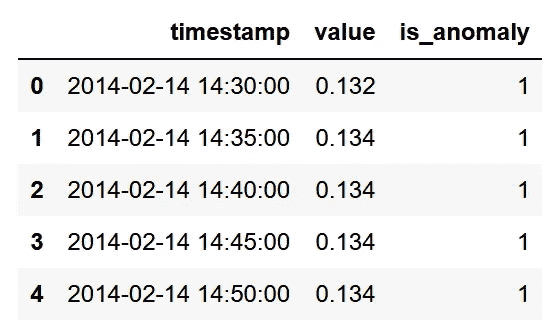

格式化的数据包括时间戳、值和标签，以确定其是否为离群点（-1）或内点（1）。图像由作者提供。

到目前为止，我们拥有一个格式正确的数据集，包括时间戳、值和标签，以指示值是否为离群点（-1）或内点（1）。

现在，让我们绘制数据以可视化异常。

```py
anomaly_df = df.loc[df['is_anomaly'] == -1]
inlier_df = df.loc[df['is_anomaly'] == 1]

fig, ax = plt.subplots()

ax.scatter(inlier_df.index, inlier_df['value'], color='blue', s=3, label='Inlier')
ax.scatter(anomaly_df.index, anomaly_df['value'], color='red', label='Anomaly')
ax.set_xlabel('Time')
ax.set_ylabel('CPU usage')
ax.legend(loc=2)

fig.autofmt_xdate()
plt.tight_layout()
```

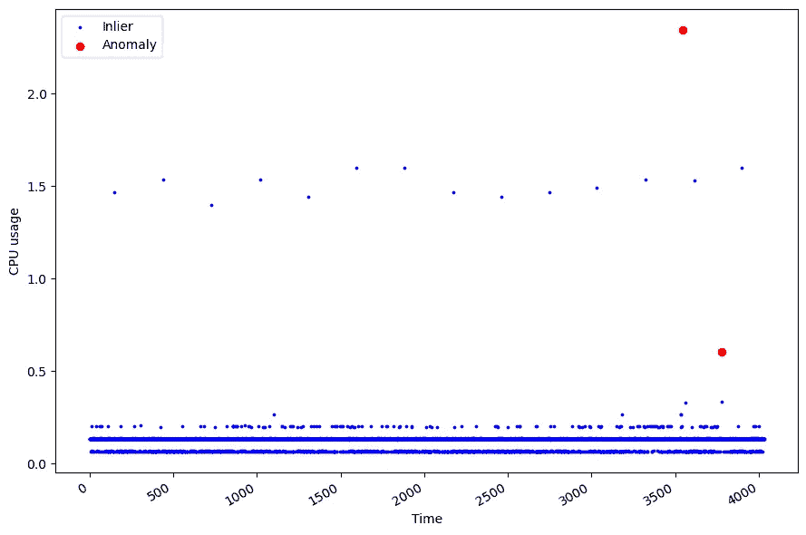

监控 EC2 实例上的 CPU 使用情况。两个红点表示异常点，而其他蓝点被认为是正常的。图像由作者提供。

从上面的图中，我们可以看到我们的数据仅包含两个离群点，如红色点所示。

这显示了异常检测的挑战性！由于这些事件很少，我们很少有机会从中学习。在这种情况下，只有 2 个点是离群点，占数据的 0.05%。这也使得模型评估更具挑战性。一个方法基本上只有两次正确的机会，而有 4030 次错误的机会。

鉴于以上所有内容，让我们应用一些时间序列异常检测技术，从平均绝对偏差开始。

# 平均绝对偏差（MAD）

如果我们的数据是正态分布的，我们可以合理地说，尾部的每个数据点都可以被视为离群点。

为了识别它们，我们可以使用 Z 分数，这是一个以标准差为单位的均值测量。如果 Z 分数为 0，则值等于均值。通常，我们设置 Z 分数阈值为 3 或 3.5，以指示一个值是否是异常值。

现在，回想一下 Z 分数的计算方法。

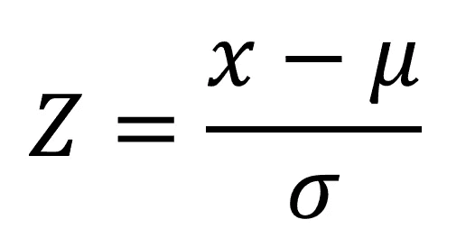

Z 分数的公式。作者提供的图像。

其中 *mu* 是样本的均值，*sigma* 是标准差。基本上，如果 Z 分数很大，意味着该值远离均值，接近分布尾部的一端，这也可能表示它是一个异常值。

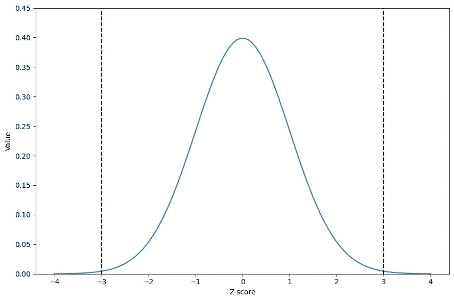

带有 Z 分数的正态分布。我们可以看到，当 Z 分数为 3 时，我们达到了分布的尾部，因此我们可以说，超过该阈值的数据是异常值。作者提供的图像。

从上图中，我们可以直观地看到经典的 Z 分数阈值 3，用于确定一个值是否是异常值。如黑色虚线所示，Z 分数为 3 时，我们达到了正态分布的尾部。因此，任何 Z 分数大于 3（或小于 -3，如果我们不处理绝对值的话）都可以标记为异常值。

现在，这在我们假设有一个完全正态分布的情况下效果很好，但异常值的存在必然会影响均值，从而影响 Z 分数。因此，我们将注意力转向中位绝对偏差或 MAD。

## 强健 Z 分数方法

为了避免异常值对 Z 分数的影响，改用中位数，这在存在异常值时是更强健的指标。

中位绝对偏差或 MAD 定义为：

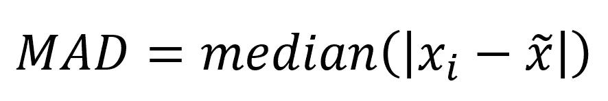

MAD 是值与样本中位数之间绝对差值的中位数。作者提供的图像。

基本上，MAD 是样本值与样本中位数之间绝对差值的中位数。然后，我们可以使用以下公式计算强健 Z 分数：

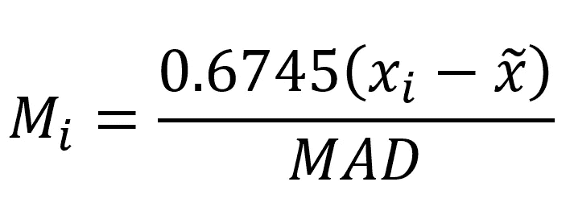

强健 Z 分数公式。请注意，0.6745 是 MAD 收敛的标准正态分布的第 75 个百分位数。作者提供的图像。

在这里，强健 Z 分数计算方法是：取值与样本中位数之间的差值，乘以 0.6745，然后除以 MAD。请注意，0.6745 代表标准正态分布的第 75 个百分位数。

## **为什么是 0.6745？（可选阅读）**

与传统的 Z 分数不同，强健 Z 分数使用中位绝对偏差，这通常小于标准差。因此，为了获得类似 Z 分数的值，我们必须进行缩放。

在没有异常值的正态分布中，MAD 大约是标准差的 2/3（精确来说是 0.6745）。因此，由于我们是除以 MAD，我们乘以 0.6745 以回到正态 Z 分数的尺度。

稳健 Z 分数方法在两个重要假设下效果最佳：

1.  数据接近正态分布

1.  MAD 不等于 0（当超过 50%的数据具有相同值时会发生）

第二点很有趣，因为如果是这种情况，那么任何不等于中位数的值都会被标记为异常值，无论阈值如何，因为稳健 Z 分数将会非常大。

鉴于此，让我们将此方法应用到我们的场景中。

## 应用 MAD 进行异常值检测

首先，我们需要检查数据的分布情况。

```py
import seaborn as sns

sns.kdeplot(df['value']);
plt.grid(False)
plt.axvline(0.134, 0, 1, c='black', ls='--')
plt.tight_layout()
```

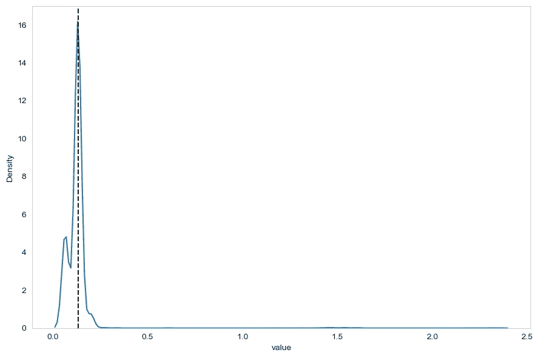

我们的数据分布情况。我们已经看到数据不符合正态分布！更糟的是，许多数据点正好落在中位数（黑色虚线）上，这意味着 MAD 要么是 0，要么非常接近 0。图片由作者提供。

从上图中，我们可以看到两个问题。首先，数据接近正态分布。其次，黑色虚线表示样本的中位数，它正好位于分布的峰值上。这意味着许多数据点等于中位数，意味着我们处于 MAD 可能为 0 或非常接近 0 的情况。

尽管如此，我们还是继续应用该方法，以便了解如何使用它。

下一步是计算样本的 MAD 和中位数，以计算稳健 Z 分数。*scipy*包包含了 MAD 公式的实现。

```py
from scipy.stats import median_abs_deviation

mad = median_abs_deviation(df['value'])
median = np.median(df['value'])
```

然后，我们简单地编写一个函数来计算稳健 Z 分数，并创建一个新列来存储分数。

```py
def compute_robust_z_score(x):
    return .6745*(x-median)/mad

df['z-score'] = df['value'].apply(compute_robust_z_score)
```

注意，我们得到了 0.002 的 MAD，这确实接近 0，意味着这个基准可能表现不佳。

完成后，我们决定一个阈值来标记异常值。典型的阈值是 3 或 3.5。在这种情况下，任何稳健 Z 分数大于 3.5（右尾）或小于-3.5（左尾）的值将被标记为异常值。

```py
df['baseline'] = 1

df.loc[df['z-score'] >= 3.5, 'baseline'] = -1 # Right-end tail
df.loc[df['z-score'] <=-3.5, 'baseline'] = -1 # Left-hand tail
```

最后，我们可以绘制混淆矩阵，看看我们的基准是否正确识别了异常值和正常值。

```py
from sklearn.metrics import confusion_matrix, ConfusionMatrixDisplay

cm = confusion_matrix(df['is_anomaly'], df['baseline'], labels=[1, -1])

disp_cm = ConfusionMatrixDisplay(cm, display_labels=[1, -1])

disp_cm.plot();

plt.grid(False)
plt.tight_layout()
```

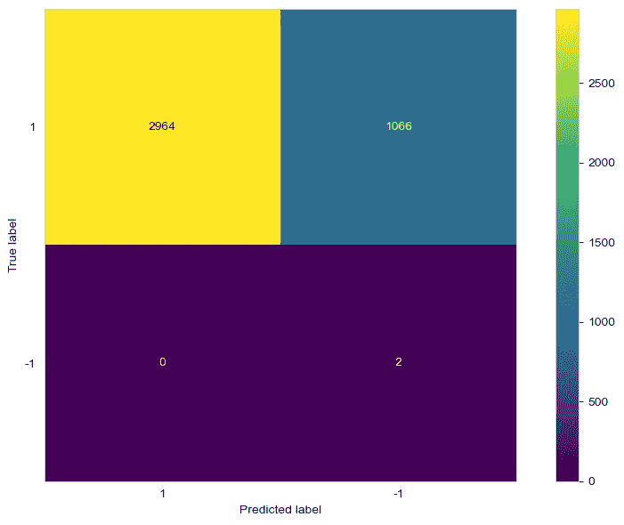

基准异常值检测方法的混淆矩阵。显然，许多正常值被标记为异常值，这在预期之中，因为我们的数据没有符合 MAD 方法的假设。图片由作者提供。

毫不意外地，我们看到基准方法表现不佳，因为 1066 个正常值被标记为异常值。这再次是预期中的情况，因为我们的数据没有符合该方法的假设，且 MAD 非常接近 0。尽管如此，我还是想介绍这种方法的实现，以防在其他场景中对你有用。

尽管结果令人失望，但当假设对你的数据集成立时，这种方法仍然有效，现在你知道在有意义的情况下如何应用它。

现在，让我们转到机器学习方法，首先从隔离森林开始。

# 隔离森林

孤立森林算法是一种基于树的算法，通常用于异常检测。

算法首先随机选择一个属性，并在该属性的最大值和最小值之间随机选择一个分裂值。这个分区过程会重复多次，直到算法隔离了数据集中的每个点。

然后，这个算法的直觉是，离群点隔离所需的分区会比正常点少，如下图所示。

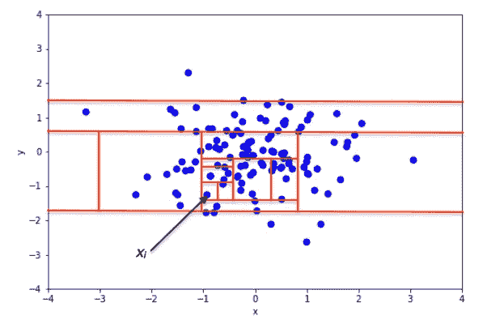

隔离一个内点。注意在点被隔离之前，数据必须经过多次分区。图像由 Sai Borrelli 提供 — [维基百科](https://commons.wikimedia.org/w/index.php?curid=82709489)

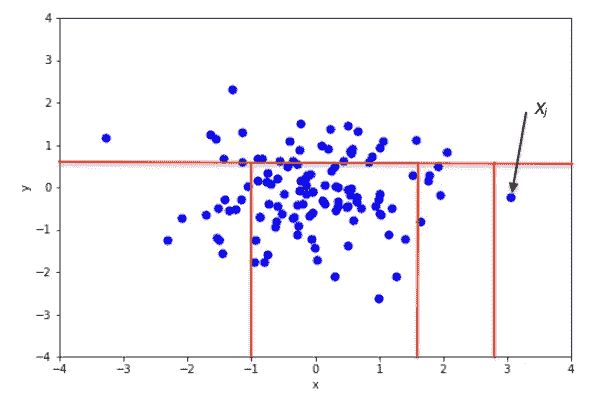

隔离一个离群点。现在，我们看到隔离它所需的分区较少。因此，它很可能是一个异常值。图像由 Sai Borrelli 提供 — [维基百科](https://commons.wikimedia.org/w/index.php?curid=82709491)

在上面的两个图中，我们可以看到在隔离内点和离群点时，分区的数量如何不同。在顶部图中，隔离一个内点需要很多分裂。在底部图中，隔离点所需的分裂较少。因此，它很可能是一个异常值。

所以我们看到在孤立森林中，如果隔离数据点的路径很短，那么它就是一个异常值！

## 应用孤立森林

首先，让我们将数据分成训练集和测试集。这样，我们可以评估模型是否能够在未见数据上标记异常值。这有时被称为新颖性检测，而不是异常检测。

```py
train = df[:3550]
test = df[3550:]
```

然后，我们可以训练我们的孤立森林算法。在这里，我们需要指定一个污染水平，这只是训练数据中离群点的比例。在这个例子中，我们的训练集只有一个离群点。

```py
from sklearn.ensemble import IsolationForest

# Only one outlier in the training set
contamination = 1/len(train)

iso_forest = IsolationForest(contamination=contamination, random_state=42)

X_train = train['value'].values.reshape(-1,1)

iso_forest.fit(X_train)
```

训练完成后，我们可以生成预测。

```py
preds_iso_forest = iso_forest.predict(test['value'].values.reshape(-1,1))
```

再次，我们可以绘制混淆矩阵以查看模型的表现。

```py
cm = confusion_matrix(test['is_anomaly'], preds_iso_forest, labels=[1, -1])

disp_cm = ConfusionMatrixDisplay(cm, display_labels=[1, -1])

disp_cm.plot();

plt.grid(False)
plt.tight_layout()
```

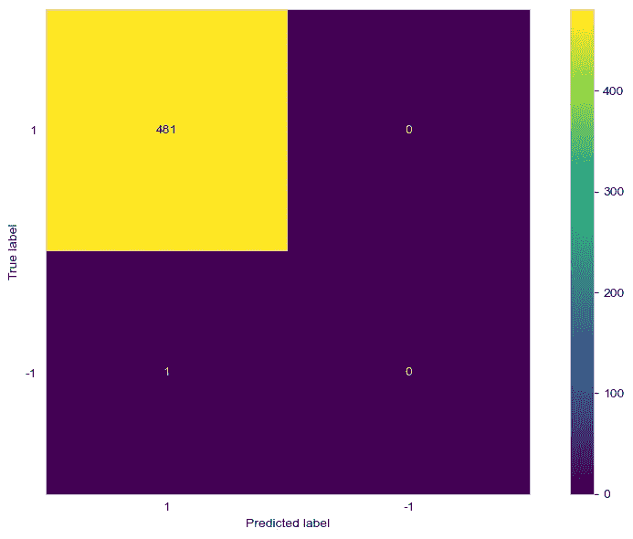

孤立森林算法的混淆矩阵。在这里，我们可以看到算法没有标记任何异常值。它还错误地将一个异常值标记为正常点。图像由作者提供。

从上面的图中，我们注意到算法无法标记新的异常值。它还将一个异常值标记为正常点。

再次，这是一项令人失望的结果，但我们还有一种方法需要介绍，即局部离群因子。

# 局部离群因子

直观上，局部离群因子（LOF）通过比较点的局部密度与其邻居的局部密度来工作。如果点和邻居的密度相似，那么该点就是一个内点。然而，如果点的密度远小于邻居的密度，那么它一定是一个离群点，因为较低的密度意味着该点更孤立。

当然，我们需要设置要查看的邻居数量，*scikit-learn* 的默认参数是 20，这在大多数情况下效果很好。

一旦设置了邻居的数量，我们就计算*可达距离*。仅用文字和图片解释这有点复杂，但我会尽力说明。

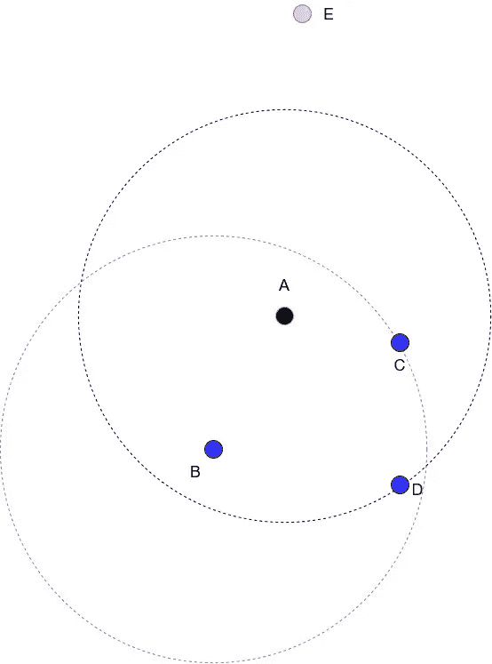

可视化可达距离，图像由作者提供。

假设我们正在研究点 A，并且我们将邻居数量设置为 3（k=3）。在保持点 A 在中间的情况下画一个圆圈，就会得到你在上图中看到的黑色虚线圆圈。点 B、C 和 D 是离 A 最近的三个邻居，而点 E 在这种情况下太远，因此被忽略。

现在，可达距离被定义为：

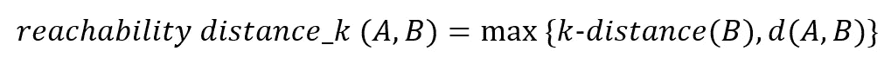

可达距离方程。图像由作者提供。

换句话说，从 A 到 B 的可达距离是 B 的 k-距离和 A 到 B 的实际距离之间的较大值。

B 的 k-距离只是从点 B 到其第三个最近邻的距离。这就是为什么在上面的图中，我们画了一个以 B 为中心的蓝色虚线圆圈，以体现从 B 到 C 的距离是 B 的 k-距离。

一旦计算了 A 的所有 k 个最近邻的可达距离，将计算局部可达密度。这仅仅是可达距离的平均值的倒数。

直观上，可达密度告诉我们到达邻近点需要走多远。如果密度大，则点彼此靠近，我们不需要走太远。

最后，局部异常因子仅仅是局部可达密度的比率。在上面的图中，我们将 *k* 设置为 3，因此我们会有三个比率需要进行平均。这允许我们将点的局部密度与其邻居进行比较。

如前所述，如果该因子接近 1 或小于 1，则为正常点。如果大于 1，则为异常值。

当然，这种方法也有缺点，因为大于 1 的值并不是一个完美的阈值。例如，LOF 为 1.1 可能意味着某个数据集中的异常值，但对另一个数据集则不适用。

## 应用局部异常因子方法

使用*scikit-learn*应用局部异常因子方法是直接的。我们使用与隔离森林相同的训练/测试拆分，以便获得可比较的结果。

```py
from sklearn.neighbors import LocalOutlierFactor

lof = LocalOutlierFactor(contamination=contamination, novelty=True)

lof.fit(X_train)
```

然后，我们可以生成预测以标记测试集中的潜在异常值。

```py
preds_lof = lof.predict(test['value'].values.reshape(-1,1))
```

最后，我们绘制混淆矩阵来评估性能。

```py
cm = confusion_matrix(test['is_anomaly'], preds_lof, labels=[1, -1])

disp_cm = ConfusionMatrixDisplay(cm, display_labels=[1, -1])

disp_cm.plot();
```


局部异常因子的混淆矩阵。我们看到该算法成功识别了测试集中唯一的异常值。图像由作者提供。

在上面的图中，我们可以看到 LOF 方法能够标记测试集中唯一的异常值，并且正确地将其他每个点标记为正常点。

和往常一样，这并不意味着局部异常因子比孤立森林方法更好。这只是表示在这个特定情况下，局部异常因子效果更好。

# 结论

在本文中，我们探讨了三种不同的时间序列数据异常检测方法。

首先，我们探讨了一种使用平均绝对偏差（MAD）的强健 Z-score。这在数据呈正态分布且 MAD 不为 0 时效果良好。

然后，我们看了孤立森林方法，这是一种机器学习算法，它确定数据集需要多少次分割才能孤立一个点。如果需要的分割次数很少，那么这个点就是一个异常点。如果需要很多分割，那么这个点很可能是内点。

最后，我们看了局部异常因子（LOF）方法，这是一种无监督学习方法，它将一个点的局部密度与其邻居的密度进行比较。基本上，如果一个点的密度相对于其邻居较小，这意味着它是一个孤立点，很可能是异常点。

希望你喜欢这篇文章，并学到了新知识！

想要掌握时间序列预测吗？查看[Python 中的应用时间序列预测](https://www.datasciencewithmarco.com/offers/zTAs2hi6/checkout?coupon_code=ATSFP10)，这是唯一涵盖统计学、深度学习和最先进模型的 100% Python 课程。

干杯 🍻

# 支持我

享受我的工作吗？通过[请我喝咖啡](http://buymeacoffee.com/dswm)来支持我，这是一种简单的方式来鼓励我，而我也可以享受一杯咖啡！如果你愿意，点击下面的按钮 👇


