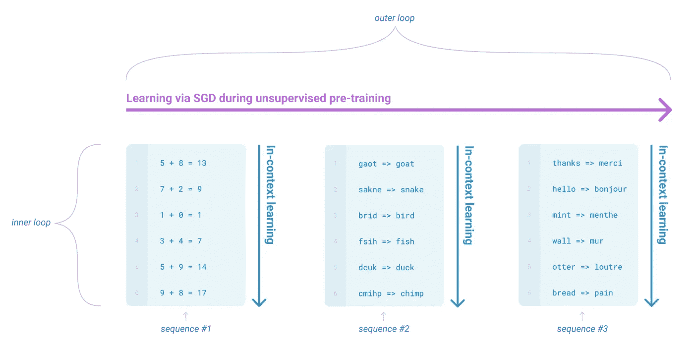

# 实用的提示工程

> 原文：[`towardsdatascience.com/practical-prompt-engineering-74e96130abc4`](https://towardsdatascience.com/practical-prompt-engineering-74e96130abc4)

## 成功提示 LLMs 的技巧和窍门…

 [Cameron R. Wolfe, Ph.D.](https://wolfecameron.medium.com/?source=post_page-----74e96130abc4--------------------------------)

·发表于[Towards Data Science](https://towardsdatascience.com/?source=post_page-----74e96130abc4--------------------------------) ·15 分钟阅读·2023 年 7 月 30 日

--

（照片由[Jan Kahánek](https://unsplash.com/@honza_kahanek?utm_source=unsplash&utm_medium=referral&utm_content=creditCopyText)提供，来源于[Unsplash](https://unsplash.com/photos/g3O5ZtRk2E4?utm_source=unsplash&utm_medium=referral&utm_content=creditCopyText)）

由于其文本到文本的格式，大型语言模型（LLMs）能够用一个模型解决各种任务。这种能力最初通过像[GPT-2](https://cameronrwolfe.substack.com/p/language-models-gpt-and-gpt-2)和[GPT-3](https://cameronrwolfe.substack.com/i/88082618/language-models-are-few-shot-learners)这样的模型的零样本和少样本学习得到了展示[5, 6]。然而，当经过微调以符合人类的偏好和指示时，LLMs 变得更具吸引力，推动了流行的生成应用，如[编码助手](https://cameronrwolfe.substack.com/i/93578656/evaluating-large-language-models-trained-on-code)、[信息寻求对话代理](https://cameronrwolfe.substack.com/i/93578656/training-language-models-to-follow-instructions-with-human-feedback)和[基于聊天的搜索体验](http://microsoft.com/en-us/bing?form=MW00X7&ef_id=_k_Cj0KCQjwgLOiBhC7ARIsAIeetVB3LkqQ31NslKZ7qj1J1Sx3PYJltfeBZs6bYulrUtPSrChf8KLmmZMaAkoKEALw_wcB_k_&OCID=AIDcmmf8m4fdss_SEM__k_Cj0KCQjwgLOiBhC7ARIsAIeetVB3LkqQ31NslKZ7qj1J1Sx3PYJltfeBZs6bYulrUtPSrChf8KLmmZMaAkoKEALw_wcB_k_&gclid=Cj0KCQjwgLOiBhC7ARIsAIeetVB3LkqQ31NslKZ7qj1J1Sx3PYJltfeBZs6bYulrUtPSrChf8KLmmZMaAkoKEALw_wcB&ch=)。

由于其能够实现的应用，LLMs 在研究界和大众文化中迅速崛起。在这一过程中，我们还见证了一个新的、互补的领域的出现：*提示工程*。从高层次看，LLMs 通过 *i)* 以文本（即提示）作为输入和 *ii)* 生成文本输出，从中提取有用信息（例如，分类、摘要、翻译等）。这种方法的灵活性非常有利。然而，我们必须确定如何正确构造输入提示，以便 LLM 能够生成所需的输出。

提示工程是一门实证科学，研究不同的提示策略如何优化 LLM 性能。尽管存在各种方法，我们将通过本概述构建对提示的一般机制的理解，以及一些基本的（但极其有效的！）提示技术，如零样本/少样本学习和指令提示。在此过程中，我们将学习实用技巧，并获得可立即采纳的要点，以成为更有效的提示工程师和 LLM 从业者。

（作者创建）

**理解大型语言模型（LLMs）。** 由于本文重点讨论提示技术，这里不会解释语言模型的[历史](https://twitter.com/cwolferesearch/status/1639378997627826176?s=20)或[机制](https://twitter.com/cwolferesearch/status/1635693551584522256?s=20)。为了更好地理解语言模型（这是深入理解提示的一个重要前提），我写了一些概述，供大家参考。以下是这些概述的列表（按重要性排序）：

+   语言建模基础（GPT 和 GPT-2）[[link](https://cameronrwolfe.substack.com/p/language-models-gpt-and-gpt-2)]

+   语言模型规模的重要性（GPT-3）[[link](https://cameronrwolfe.substack.com/p/language-model-scaling-laws-and-gpt)]

+   现代 [[link](https://cameronrwolfe.substack.com/p/modern-llms-mt-nlg-chinchilla-gopher)] 和专业化 [[link](https://cameronrwolfe.substack.com/p/specialized-llms-chatgpt-lamda-galactica)] 的 LLMs

+   [PaLM](https://cameronrwolfe.substack.com/p/palm-efficiently-training-massive)、T5（第 [一部分](https://cameronrwolfe.substack.com/p/t5-text-to-text-transformers-part) 和 [二部分](https://cameronrwolfe.substack.com/p/t5-text-to-text-transformers-part-354)）、LLaMA（第 [一部分](https://cameronrwolfe.substack.com/p/llama-llms-for-everyone) 和 [二部分](https://cameronrwolfe.substack.com/p/beyond-llama-the-power-of-open-llms)）

# 提示一览

语言模型可以使用其通用的文本到文本格式解决各种任务（来自 [1]）

鉴于当前对 LLM 的热度，我们可能会问自己：*LLM 的基本优势是什么，使它们如此强大？* 尽管这个问题没有单一的答案（例如，[模型规模](https://cameronrwolfe.substack.com/i/88082618/language-models-are-few-shot-learners)，[大规模预训练数据](https://cameronrwolfe.substack.com/i/91134599/training-compute-optimal-llms)，[人类反馈](https://cameronrwolfe.substack.com/i/93578656/training-language-models-to-follow-instructions-with-human-feedback) 等），LLM 的一个主要优势是其通用的文本到文本格式。这些模型擅长 [下一个词预测](https://cameronrwolfe.substack.com/i/85568430/language-modeling)，因此通过正确调整和利用这一技能可以解决许多不同的任务！

要解决一个任务，我们需要做的就是 *i)* 向模型提供包含相关信息的文本输入，并 *ii)* 从模型返回的文本中提取输出。这样统一的方法可以用于翻译、总结、问答、分类等。然而，事情并不（完全）那么简单。即，提供给 LLM 的提示（即输入文本）的措辞和结构可以显著影响模型的准确性。换句话说，*提示工程非常重要。*

## 什么是提示工程？

> “提示工程是一个相对较新的学科，旨在开发和优化提示，以高效使用 LMs 处理各种应用和研究主题。” *— 来自 [2]*

由于正确制作提示内容对与 LLM 获得有用结果至关重要，提示工程在最近几个月引起了很多关注。然而，这是一门经验科学——发现最佳提示通常是基于启发式的，需要实验。我们可以通过 [跟踪和版本管理](https://python.langchain.com/en/latest/modules/prompts/prompt_templates/getting_started.html)我们的提示，测试不同的想法，来发现更好的提示。

用指令来提示 LLM（由作者创建）

**提示的组成部分。** 提示可以创建的选项有很多种。然而，大多数提示由相同的几个（可选）组件组成：

+   *输入数据*：这是 LLM 预计处理的实际数据（例如，要翻译或分类的句子，要总结的文档等）。

+   *示例*：展示 LLM 正确行为的最佳方法之一是提供几个具体的输入-输出对作为提示。

+   *指令*：我们可以通过指令在提示中用文字描述要做的事情，而不是展示具体的正确行为示例；见上文。

+   *指标*：以固定且可预测的结构向 LLM 提供输入是有帮助的，因此我们可以通过使用指标来分隔提示的不同部分；见下文。

+   *上下文*：除了上述描述的组件，我们可能还希望以某种方式向 LLM 提供额外的“上下文”或信息。

指标可以用来以多种方式结构化提示（由作者创建）

**一般提示。** 提示工程的细节根据所使用的模型和我们试图解决的任务差异很大。然而，有一些普遍接受的提示工程原则是有帮助的，要牢记这些原则 [1, 3]。

+   *从简单开始*：从简单的提示开始，然后逐步修改提示，同时跟踪经验结果。

+   *直接*：如果我们希望 LLM 匹配特定的风格或格式，我们应当明确而直接地说明。准确地说出你想要什么可以传达信息。

+   *具体性*：模糊性是每个提示工程师的敌人。我们应当使提示详细且具体，但不要过度提供过长的输入（即，提示的长度有 [限制](https://platform.openai.com/docs/models/gpt-3)！）。

+   *示例是强大的*：如果描述我们想要的内容很困难，提供几个不同输入的正确输出或行为的具体示例可能会很有用。

语言模型的上下文窗口可视化（由作者创建）

**上下文窗口。** 当我们考虑不同的提示技巧和方法时，我们需要记住我们只能在提示中包含有限的数量的信息。所有 LLM 都有一个预定义的上下文窗口，设定了可以一次处理的总令牌数（即文本序列中的单词或子词）的限制。上下文窗口的大小在模型之间有所不同，但目前有强烈的推动力来增加上下文窗口的大小。例如，GPT-4 的上下文窗口为 32K 令牌，比 OpenAI 之前的任何模型都要 [大 4 倍](https://platform.openai.com/docs/models/overview)。

# 常见的提示技术

零样本和少样本学习的出现（来自 [4, 5, 6]）

尽管 LLM 由于像[ChatGPT](https://openai.com/blog/chatgpt)这样的热门模型最近经历了爆炸性增长，但提示技术已经存在了[相当一段时间](https://twitter.com/cwolferesearch/status/1639378997627826176?s=20)。最初，像[GPT](https://cameronrwolfe.substack.com/i/85568430/improving-language-understanding-by-generative-pre-training-gpt) [4]这样的模型经过微调以解决下游任务。随着[GPT-2](https://cameronrwolfe.substack.com/i/85568430/language-models-are-unsupervised-multitask-learners-gpt) [5]的提出，我们看到研究人员开始使用零样本学习来用单一的[基础模型](https://cameronrwolfe.substack.com/i/85568430/creating-foundation-models)解决多个下游任务。最后，GPT-3 向我们展示了随着模型规模的增大，语言模型在少样本学习方面变得非常出色。在本节中，我们将深入探讨这些思想，以更好地了解零样本和少样本学习的工作原理，并提供一些更复杂的提示技术的细节。

## 零样本学习

(来自 [6])

零样本学习的基本思想相当简单。我们只需将任务描述和相关的输入数据提供给 LLM，并让它生成结果；见上文。由于观察到的大量预训练数据，LLM 通常非常有能力以这种方式解决任务。也就是说，它们可以利用其知识库来解决（相对）大量的任务；请见下文示例（由[GPT-3.5](https://platform.openai.com/docs/models/gpt-3-5)生成）。

零样本学习与 GPT-3.5（作者创建）

零样本学习被像 GPT-2 这样的模型广泛探索，并在某些情况下表现良好。然而，*如果零样本学习无法解决我们的任务，我们应该怎么做？* 在许多情况下，我们可以通过提供更具体和明确的信息来大幅提高 LLM 的性能。特别是，我们可以开始在提示中添加期望输出的示例，让模型能够复制从提示中看到的数据模式。

## 少样本学习

除了任务描述之外，我们还可以通过高质量的输入输出示例来增强我们的提示。这种技术形成了少样本学习的基础，少样本学习试图通过提供明确的正确行为示例来提高大型语言模型（LLM）的性能。如果使用得当并应用于正确的模型，少样本学习非常有效，这一点通过如[GPT-3](https://cameronrwolfe.substack.com/i/88082618/language-models-are-few-shot-learners) [6]等 LLM 的突破性能力得到了证明；请见下文。

(来自 [3])

然而，学习如何正确利用大型语言模型的少量示例学习能力可能很复杂。*我们应该在提示中包含哪些示例？是否有正确的提示结构方式？提示的变化是否会显著影响大型语言模型？*

大多数大型语言模型对提示的构造方式很敏感，这使得提示工程既困难又重要。尽管像 GPT-4 这样的最新模型似乎对提示中的小扰动不那么敏感 [2]，但研究社区 [7] 给我们提供了一些有关如何正确使用少量示例学习的提示，这些提示仍然有助于理解：

+   示例的排序很重要，打乱少量示例的顺序可能会显著改变大型语言模型的表现。增加更多少量示例并不能解决这个问题。

+   少量示例中的标签分布很重要，应与实际的数据分布相匹配。令人惊讶的是，标签的正确性并不是那么重要。

+   大型语言模型倾向于重复最后一个少量示例（即近期效应）。

+   包含在提示中的示例应该是多样化且随机排序的。

**最佳数据采样。** 选择多样化、随机排序且与测试示例相关的示例是最好的。除此之外，还进行了大量研究，以确定如何为提示选择最佳示例。例如，少量学习样本可以通过多样性选择 [8]、基于不确定性的选择 [9]，甚至是根据与测试示例的相似性进行选择 [10]。

（来源 [3]）

**少量学习 vs. 微调。** 在继续之前，我想解决一个显著的 [混淆点](https://twitter.com/NaveenGRao/status/1650255798365462530?s=20)。*少量学习不是微调。* 少量学习是在提示中向大型语言模型提供示例，这些示例可以作为生成正确输出的相关上下文。这个过程被称为“上下文学习”；见上文。模型的参数不会通过少量学习进行修改。相比之下，微调明确地训练模型（即通过反向传播更新其权重）在选定的数据集上。

## 指令提示

使用调整过指令的语言模型作为编码助手（来源 [15]）

少量学习非常强大，但它有一个显著的缺点：*示例消耗大量的标记*。由于大型语言模型的上下文窗口是有限的，我们可能需要探索不会消耗太多标记的提示方法。例如，*我们能否通过文字解释正确的行为给大型语言模型？* 简短的回答是可以！这种技术，即将书面指令作为提示的一部分，包括在内，被称为指令提示，它在特定类型的大型语言模型上表现最佳。

**指令调优与对齐。** 最近，语言模型的发展主要集中在提高指令跟随能力上。预训练的 LLM 在开箱即用时并不擅长遵循指令。然而，教会这些模型如何遵循指令能使它们更好地完成用户的需求（即，改善人类[对齐](https://openai.com/blog/our-approach-to-alignment-research)）。遵循指令的 LLM 支持多种有用的应用，从信息检索对话代理（例如，[ChatGPT](https://openai.com/blog/chatgpt)）到编码助手（例如，[Codex](https://cameronrwolfe.substack.com/i/93578656/evaluating-large-language-models-trained-on-code)[13]）；见下文。

（见[13, 14]）

正如在之前的帖子中[广泛讨论](https://cameronrwolfe.substack.com/i/91134599/a-primer-on-language-modeling)的那样，创建 LLM 的第一步是使用[语言建模目标](https://cameronrwolfe.substack.com/i/85568430/language-modeling)在大规模的未标记文本语料库上进行预训练。在此过程中，模型获取信息并学会准确地进行下一个词预测。然而，模型的输出并不总是有趣、引人入胜或有帮助，并且模型通常难以遵循复杂的指令。为了鼓励这种行为，我们需要[超越基本的预训练](https://twitter.com/cwolferesearch/status/1635693551584522256?s=20)。

**创建遵循指令的 LLM。** 有几种不同的方法可以教会 LLM 如何遵循指令。例如，我们可以进行[指令调优](https://twitter.com/cwolferesearch/status/1652064977493057545?s=20)[12]，或者在包含指令的对话示例上微调 LLM。一些显著的模型采用了这种方法，比如[LLaMA](https://cameronrwolfe.substack.com/p/llama-llms-for-everyone)（及其[变体](https://cameronrwolfe.substack.com/p/beyond-llama-the-power-of-open-llms)）[15]、所有 FLAN 模型[12]、OPT-IML[16]等。或者，我们可以使用由[监督微调（SFT）](https://cameronrwolfe.substack.com/i/93578656/refining-llm-behavior)和来自人类反馈的强化学习（RLHF）组成的[三步法](https://cameronrwolfe.substack.com/i/93578656/training-language-models-to-follow-instructions-with-human-feedback)；见下文。这种方法已经创造出了令人惊叹的模型，如 ChatGPT、[GPT-4](https://openai.com/research/gpt-4)、[Sparrow](https://cameronrwolfe.substack.com/i/93578656/improving-alignment-of-dialogue-agents-via-targeted-human-judgements)[17]等。

基于人类反馈对 LLM 进行对齐（见[13]）

**制定有用的指令。** 如果我们能够访问到一个已经训练来遵循指令的 LLM，我们可以通过给模型提供有用和信息丰富的指令来完成很多工作。以下是一些使用指令提示的关键技巧和想法：

+   就像我们提示的其余部分一样，指令应该是具体和详细的。

+   我们应避免在提示中告诉 LLM 不要做某事。相反，我们应该专注于告诉 LLM 要做什么。

+   使用具有清晰指示的输入结构来识别提示中的指令是非常有帮助的；见下文。

指令提示的不同格式（由作者创建）

**角色提示。** 另一种与指令提示相关的有趣提示技术是角色提示，它给模型分配一个“角色”或人格。这个角色在提示中通过一个文本片段被分配，例如：

+   你是一位著名且杰出的数学家。

+   你是一名医生。

+   你是一个音乐专家。

有趣的是，最近的 LLM 能够在对话中很好地承担和维持这些角色[18]；见下文。

角色提示与 LaMDA（来自[18]）

更进一步，角色提示不仅仅是一个有趣的技巧。给 LLM 提供一个角色实际上可以提高性能（例如，将 GPT-3 角色提示为“杰出的数学家”可以[提高性能](https://learnprompting.org/docs/basics/roles) 在基于算术的问题上）。然而，角色提示仅在某些情况下能提高性能。

> “当给 AI 分配一个角色时，我们给了它一些背景信息。这个背景帮助 AI 更好地理解问题。理解问题越好，AI 通常会给出更好的答案。” *— 来自* [*learnprompting.org*](https://learnprompting.org/)

**现实世界中的指令提示。** 用指令提示 LLMs 是一个非常强大的工具，我们可以用它来处理各种应用。为了理解如何利用这一技术，我们可以看看最近发布的[ChatGPT 插件](https://openai.com/blog/chatgpt-plugins)，其中包括一个开源的[信息检索 API](https://github.com/openai/chatgpt-retrieval-plugin)。在这个 API 内部，提供了两个特定的模块用于[从文档中提取元数据](https://github.com/openai/chatgpt-retrieval-plugin/blob/main/services/extract_metadata.py)和[过滤个人身份信息（PII）](https://github.com/openai/chatgpt-retrieval-plugin/blob/main/services/pii_detection.py)。有趣的是，这些服务完全基于 LLM，并使用如下所示的提示。

用于从 ChatGPT 信息检索 API 中提取元数据和检测个人身份信息（由作者创建）

在这些提示中，LLM 获得了有关如何执行期望任务的具体和详细指令。指令的一些显著方面包括：

+   期望的输出格式（无论是 json 还是 true/false）明确说明。

+   指令使用结构化格式（即，以项目符号分隔的列表）来描述重要信息。

+   LLM 的任务（即识别 PII 或提取元数据）在提示中明确说明。

+   有趣的是，这些提示多次告诉模型不要做什么，这通常是不被建议的。

鉴于 LLMs 的局限性，信任 LLM 准确执行如 PII 检测等关键任务可能不是最佳选择。不过，这种方法展示了指令提示的巨大潜力。与其编写整个程序或服务，我们或许可以通过编写一个提示来快速解决许多任务。

# 重点

> “为聊天机器人角色编写一个真正出色的提示是一个极具杠杆效应的技能，并且是用一点自然语言编程的早期示例” *—* [*Sam Altman*](https://twitter.com/sama/status/1627796054040285184?s=20)

如果我们从这次概述中学到的其他东西，我们应该知道构造正确的提示（即提示工程）是成功利用 LLMs 的关键部分。由于语言模型的文本到文本结构，它们非常通用，可以用来解决各种任务。然而，我们必须为这些模型提供详细和适当的上下文，以便它们表现良好。尽管最佳提示技术因模型和任务而异，但有许多高层次的要点可以帮助我们最大化成功的机会。

**从零到少样本学习。** 由于其广泛的预训练（以及如今的微调）数据集，大型语言模型（LLMs）包含大量信息，并能够开箱即用地解决各种任务。为此，我们仅需向模型提供任务描述和相关输入数据，然后模型会生成正确的输出。然而，由于提供给模型的上下文有限，零样本学习的效果有限。为了提升零样本学习的表现，我们应该通过在提示中插入示例来利用少样本学习。

**指令跟随 LLMs。** 尽管表现良好，少样本学习通常会消耗大量的 tokens，这在大多数 LLMs 的上下文窗口有限的情况下是个问题。为了应对这一点，我们可以采用一种指令提示的方法，提供 LLM 期望行为的精确文本描述，而不是通过正确输出的具体示例来捕捉这种行为。指令提示是强大的，但它需要一种经过特定形式微调的 LLM（例如，通过指令调优或 RLHF）才能良好工作。预训练的 LLMs 在开箱即用时并不擅长跟随指令。

**技巧和窍门。** 提示工程有各种技巧和最佳实践可以采纳。通常，这些技巧会随着每次新模型发布而变化（例如，GPT-4 在处理非结构化提示方面比之前的模型 [2] 更加出色），但一些原则已经适用了一段时间。首先，我们应该始终从简单的提示开始，然后逐渐增加复杂性。在发展我们的提示时，我们应当尽量具体和详细，同时避免过于冗长（由于有限的上下文窗口）。最后，为了真正最大化 LLM 的性能，我们通常需要利用少样本学习、指令提示或 [更复杂的方法](https://cameronrwolfe.substack.com/p/chain-of-thought-prompting-for-llms)。

## 结束语

非常感谢阅读这篇文章。我是 [Cameron R. Wolfe](https://cameronrwolfe.me/)， [Rebuy](https://www.rebuyengine.com/) 的 AI 总监。我研究深度学习的实证和理论基础。你也可以查看我在 medium 上的 [其他文章](https://medium.com/@wolfecameron)！如果你喜欢这篇文章，请关注我的 [twitter](https://twitter.com/cwolferesearch) 或订阅我的 [Deep (Learning) Focus 时事通讯](https://cameronrwolfe.substack.com/)，在这里我通过对流行论文的易懂概述，帮助读者深入理解 AI 研究中的主题。

## 参考文献

[1] Raffel, Colin 等。“使用统一的文本到文本变换器探索迁移学习的极限。” *机器学习研究杂志* 21.1 (2020)：5485–5551。

[2] Saravia, Elvis 等。“提示工程指南”， [`github.com/dair-ai/Prompt-Engineering-Guide`](https://github.com/dair-ai/Prompt-Engineering-Guide) (2022)。

[3] Weng, Lilian. (2023 年 3 月)。提示工程。Lil’Log。 [`lilianweng.github.io/posts/2023-03-15-prompt-engineering/.`](https://lilianweng.github.io/posts/2023-03-15-prompt-engineering/.)

[4] Radford, Alec 等。“通过生成性预训练提高语言理解。” (2018)。

[5] Radford, Alec 等。“语言模型是无监督的多任务学习者。”

[6] Brown, Tom 等。“语言模型是少样本学习者。” *神经信息处理系统进展* 33 (2020)：1877–1901。

[7] Tony Z. Zhao, Eric Wallace, Shi Feng, Dan Klein 和 Sameer Singh. 2021 年。使用前的校准：提高语言模型的少样本性能。ICML。

[8] Su, Hongjin 等。“选择性标注使语言模型成为更好的少样本学习者。” *arXiv 预印本 arXiv:2209.01975* (2022)。

[9] Diao, Shizhe 等。“使用思维链的主动提示用于大型语言模型。” *arXiv 预印本 arXiv:2302.12246* (2023)。

[10] Liu, Jiachang 等。“什么样的上下文示例对 GPT-$3 $? 有效。” *arXiv 预印本 arXiv:2101.06804* (2021)。

[11] Wei, Jason 等。“思维链提示在大型语言模型中引发推理。” *arXiv 预印本 arXiv:2201.11903* (2022)。

[12] Wei, Jason, 等. “微调语言模型是零样本学习者。” *arXiv 预印本 arXiv:2109.01652* (2021)。

[13] Chen, Mark, 等. “评估训练于代码上的大型语言模型。” *arXiv 预印本 arXiv:2107.03374* (2021)。

[14] Ouyang, Long, 等. “通过人类反馈训练语言模型以遵循指令。” *神经信息处理系统进展* 35 (2022): 27730–27744。

[15] Touvron, Hugo, 等. “Llama：开放且高效的基础语言模型。” *arXiv 预印本 arXiv:2302.13971* (2023)。

[16] Iyer, Srinivasan, 等. “OPT-IML：通过广义化视角扩展语言模型指令元学习。” *arXiv 预印本 arXiv:2212.12017* (2022)。

[17] Glaese, Amelia, 等. “通过针对性的人工判断改善对话代理的对齐。” *arXiv 预印本 arXiv:2209.14375* (2022)。

[18] Thoppilan, Romal, 等. “Lamda：对话应用的语言模型。” *arXiv 预印本 arXiv:2201.08239* (2022)。
