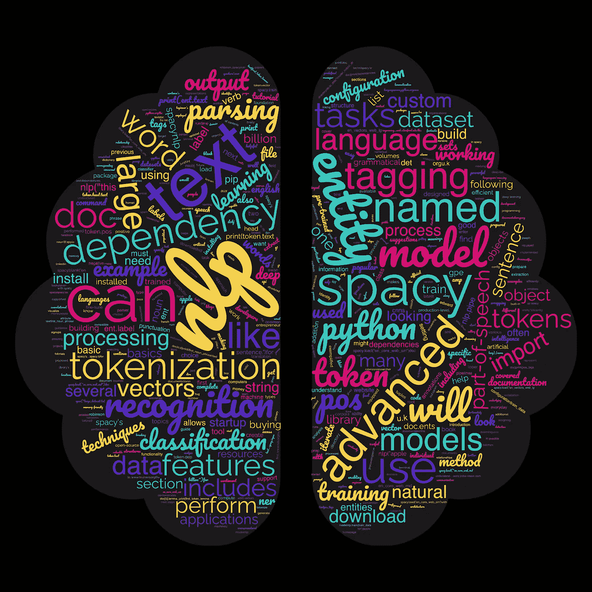
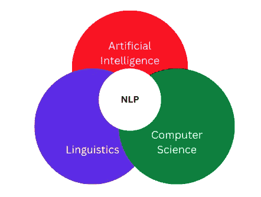
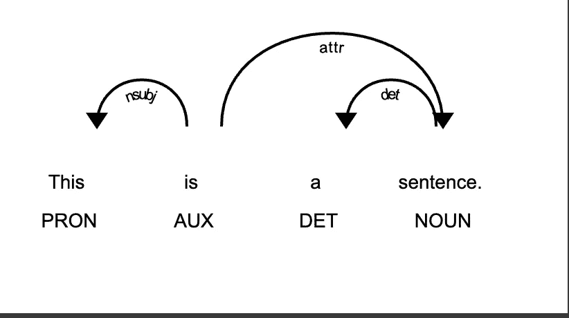

# 实用 Python：spaCy 在 NLP 中的应用

> 原文：[`towardsdatascience.com/practical-python-spacy-for-nlp-b9d626cf53ed`](https://towardsdatascience.com/practical-python-spacy-for-nlp-b9d626cf53ed)

## 高效的 Python 编程

## 自然语言处理入门指南

[](https://jvision.medium.com/?source=post_page-----b9d626cf53ed--------------------------------)[](https://towardsdatascience.com/?source=post_page-----b9d626cf53ed--------------------------------) [Joseph Robinson, Ph.D.](https://jvision.medium.com/?source=post_page-----b9d626cf53ed--------------------------------)

·发表于 [Towards Data Science](https://towardsdatascience.com/?source=post_page-----b9d626cf53ed--------------------------------) ·12 分钟阅读·2023 年 1 月 9 日

--

spaCy Python 库是一个流行的自然语言处理（NLP）工具。它旨在帮助开发者构建处理和“理解”大量文本的应用程序。spaCy 配备了先进的分词、解析和实体识别功能。它还支持多种流行语言。spaCy 在运行时速度快、效率高，使其成为构建生产级 NLP 应用的良好选择。spaCy 的一个重要部分是其创建和使用特定 NLP 任务的自定义模型的能力，例如命名实体识别或词性标注。开发者可以使用特定于其应用程序的数据进行微调，以满足特定用例的需求。

# 目录

· 概述

· NLP 和 spaCy 介绍

· 安装和设置 spaCy

· 使用 spaCy 的基本 NLP：分词和词性标注

· 高级 NLP 与 spaCy：NER 和依存句法分析

· 在 spaCy 中处理大型语料库和自定义模型

· 高级 spaCy 技巧：文本分类和词向量

· spaCy 实践

∘ spaCy 和深度学习

∘ spaCy 的功能示例

· 总结：进一步资源和下一步

· 联系

# 概述

我们介绍了使用 spaCy 进行 NLP 的基础知识，包括分词和词性标注，以及更高级的主题，如命名实体识别和依存句法分析。指南还涉及了处理大型数据集、自定义模型以及文本分类和词向量等高级技巧。最后，它还提供了一些进一步资源的建议以及希望继续学习 spaCy 的 NLP 的下一步。



博客的词云。作者通过[`www.wordclouds.com/`](https://www.wordclouds.com/)生成。

# NLP 和 spaCy 简介

自然语言处理（NLP）是计算机科学和人工智能的一个领域，致力于使计算机能够理解和处理人类语言（图 2）。NLP 有许多应用，包括机器翻译、文本分类、情感分析和聊天机器人开发。



图 2\. NLP 是一个交叉 AI、计算机科学和语言学的话题。视觉效果由作者创建。

在 NLP（自然语言处理）领域中，最受欢迎的 Python 库之一是 spaCy：这是一个开源库，旨在帮助开发者构建能够以速度和效率处理大量文本的应用程序，使其成为构建生产级 NLP 应用程序的不错选择。

# 安装和设置 spaCy

要安装和设置 spaCy，你必须在计算机上安装 Python 和 pip，即 Python 包管理器。如果你还需要获取 Python 和 pip，你可以从官方网站下载和安装它们。

[`www.python.org/?source=post_page-----b9d626cf53ed--------------------------------`](https://www.python.org/?source=post_page-----b9d626cf53ed--------------------------------) [## 欢迎访问 Python.org

### Python 编程语言的官方网站

[www.python.org](https://www.python.org/?source=post_page-----b9d626cf53ed--------------------------------)

一旦你安装了 Python 和 pip，你可以使用 pip 来安装 spaCy。首先，打开终端或命令提示符并输入以下命令：

```py
pip install spacy
```

这将安装 spaCy 的最新版本及其所有依赖项。

安装后，你必须下载一个 spaCy 的预训练语言模型。spaCy 包括几种语言的模型，包括英语、德语、法语和西班牙语。例如，要下载英语模型，你需要输入以下命令：

```py
python -m spacy download en_core_web_sm
```

这将下载小型英语模型，其中包括基本的 NLP 功能，如分词、词性标注和依存解析。如果你需要更多高级功能，你还可以下载包含额外功能的大型模型，如命名实体识别和词向量。

# 基本的 NLP 与 spaCy：分词和词性标注

NLP 中最基本的任务之一是分词，即将文本字符串拆分成单独的标记（词汇和标点符号）。分词在许多 NLP 管道中至关重要，因为它使我们能够将特定的单词和标点符号作为离散的单元进行处理。

spaCy 通过其`nlp`对象和`Doc`类使得分词变得容易。要使用 spaCy 对文本字符串进行分词，你可以将字符串传递给`nlp`对象：

```py
import spacy

nlp = spacy.load("en_core_web_sm")

doc = nlp("This is a sentence.")
```

返回的`Doc`对象包含对象的标记，你可以通过`text`访问。例如，你可以像这样迭代这些标记：

```py
for token in doc: 
  print(token.text)
```

这将输出输入字符串中的单个标记：

```py
This 
is 
a 
sentence
```

除了分词之外，另一个常见的 NLP 任务是词性标注（POS tagging），即标记每个词语的对应词性。词性标注通常用于帮助消除词义的歧义，并识别句子的基本语法结构。

spaCy 使得通过 `Token` 对象的 `pos_` 属性执行词性标注变得简单。例如，你可以遍历 `Doc` 对象中的词语，并像这样打印出它们的词性标签：

```py
for token in doc: 
  print(token.text, token.pos_)
```

这将输出词语及其词性标签：

```py
This DET 
is VERB 
a DET 
sentence NOUN
```

spaCy 包含了大量的词性标签，这些标签在所有支持的语言中是一致的。你可以在 spaCy 文档中找到完整的词性标签列表。

在下一节中，我们将探讨如何使用 spaCy 执行更高级的 NLP 任务，如命名实体识别和依存句法分析。

# 使用 spaCy 进行高级 NLP：命名实体识别和依存句法分析



作者生成的图像。

在前一节中，我们介绍了使用 spaCy 的分词和词性标注的基础知识。在这一节中，我们将探讨两个可以使用 spaCy 执行的更高级的 NLP 任务：命名实体识别和依存句法分析。

命名实体识别（NER）识别并分类文本中的命名实体，如人名、组织名和地点名。NER 通常用于从非结构化文本中提取结构化信息，并且可以成为信息提取和实体链接等任务的宝贵工具。

spaCy 包含了一个预训练的 NER 模型，可以识别和分类文本中的命名实体。要使用 NER 模型，你可以遍历 `Doc` 对象中的实体，并打印出它们的文本和标签：

```py
for ent in doc.ents:
    print(ent.text, ent.label_)
```


spaCy 包含几个预定义的实体类型，如 `PERSON`、`ORG` 和 `GPE`（地缘政治实体）。你可以在 spaCy 文档中找到完整的实体类型列表。

依存句法分析是分析句子的语法结构并确定单词之间的依赖关系。依存句法分析常用于句子的主要主语和宾语，并且可以成为总结和问答等任务的有用工具。

spaCy 包含一个依存句法分析器，可以用来分析句子的语法结构。要使用依存句法分析器，你可以遍历 `Doc` 对象中的词语，并打印出词语文本、依存标签和头词：

```py
for token in doc:
    print(token.text, token.dep_, token.head.text)
```

这将输出词语、它们的依存标签以及依存关系的头词：

```py
This nsubj is
is ROOT is
a attr a
sentence dobj is
```

spaCy 包含几个依存标签，这些标签描述了词语与其头词之间的语法关系。你可以在 spaCy 文档中找到完整的依存标签列表。

在下一节中，我们将探讨如何使用 spaCy 处理大数据集并为特定的 NLP 任务构建自定义模型。

# 在 spaCy 中处理大规模语料库和自定义模型

在前面的章节中，我们涵盖了使用 spaCy 进行分词、词性标注、命名实体识别和依存解析的基础知识。本节将探讨两个更高级的话题：处理大数据集和构建自定义模型。

在处理大数据集时，将整个数据集加载到内存中通常是不切实际的。幸运的是，spaCy 提供了几种工具和技术来以流式方式处理大数据集。

一种方法是使用 spaCy 的 `nlp.pipe` 方法，它允许你在小批量中处理大数据集。`nlp.pipe` 方法接受一个文本文档的可迭代对象，并返回处理后的 `Doc` 对象。例如，你可以像这样使用 `nlp.pipe` 处理大数据集：

```py
import spacy

nlp = spacy.load("en_core_web_sm")

with open("large_dataset.txt") as f:
    for doc in nlp.pipe(f):
        # Process the doc here
        print(doc)
```

`nlp.pipe` 方法旨在高效且节省内存，因此非常适合处理大数据集。

除了处理大数据集外，spaCy 还允许你为特定的自然语言处理任务构建自定义模型。例如，你可以使用 spaCy 的 `train` 方法在标记数据集上微调一个预训练的模型。这在构建适用于特定领域或语言的模型时非常有用。

要使用 spaCy 训练自定义模型，你必须准备一个训练数据集和配置文件。训练数据集应该是 `(text, annotations)` 元组的列表，其中 `text` 是一段文本，`annotations` 是命名实体注释的字典。配置文件应该指定模型类型、训练数据和配置，以及训练模型的输出目录。

准备好训练数据和配置文件后，你可以使用 `spacy.train` 方法来训练模型：

```py
import spacy

nlp = spacy.blank("en")  # Create a blank English model

# Load the training data and configuration
train_data = [("This is a text.", {"entities": [(4, 10, "ENTITY")]})]
config = {"iterations": 100}

# Train the model
nlp.train(train_data, config)

# Save the trained model to a directory
nlp.to_disk("/model_output_dir")
```

这让你了解了如何使用 spaCy 处理大数据集和构建自定义模型。接下来的章节将介绍一些高级的 spaCy 技巧，如文本分类和词向量。

# 高级 spaCy 技巧：文本分类和词向量

高级 spaCy 技巧：文本分类和词向量

在前面的章节中，我们涵盖了使用 spaCy 进行自然语言处理任务的基础知识，如分词、词性标注、命名实体识别和依存解析。本节将探讨两种可以使用 spaCy 执行的更高级的技术：文本分类和词向量。

文本分类是根据文本内容为文本分配标签。文本分类是自然语言处理中的常见任务，可用于各种应用，如情感分析和垃圾邮件检测。

spaCy 包含了几个实用的结构，可用于进行文本分类。一个方法是使用 spaCy 内置的`Thinc`库的线性模型训练支持。要使用 spaCy 训练文本分类器，你必须准备一个训练数据集和一个配置文件。训练数据集应为`(text, label)`元组的列表，其中`text`是文本字符串，`label`是目标标签。配置文件应指定模型类型、训练数据和配置，以及训练模型的输出目录。

一旦你准备好训练数据配置文件，就可以使用`spacy.train`方法来训练分类器：

```py
import spacy

nlp = spacy.blank("en")  # Create a blank English model

# Load the training data and configuration
train_data = [("This is a positive text.", {"cats": {"POSITIVE": 1}}),
              ("This is a negative text.", {"cats": {"NEGATIVE": 1}})]
```

词向量是词的数值表示，能够捕捉数据集中词的意义和关系。词向量常用于自然语言处理（NLP），用于表示词之间的相似性，对于文档分类和机器翻译等任务非常有用。

spaCy 包含许多词向量模型，可用于计算数据集的词向量。要在 spaCy 中使用词向量模型，你需要从 spaCy 网站下载一个预训练模型。

[](https://spacy.io/models?source=post_page-----b9d626cf53ed--------------------------------) [## 训练模型与管道 · spaCy 模型文档]

### 一般而言，spaCy 的所有管道包遵循[lang]_[name]的命名约定。对于 spaCy 的...

[spacy.io](https://spacy.io/models?source=post_page-----b9d626cf53ed--------------------------------)

例如，要下载`en_vectors_web_lg`模型，你可以使用以下命令：

```py
python -m spacy download en_core_web_lg
```

一旦你下载了词向量模型对象，可以使用它来计算数据集的词向量。例如，`.vector`访问一个标记的词向量：

```py
import spacy 

nlp = spacy.load("en_core_web_lg") 
doc = nlp("This is a sentence.") 
for token in doc: 
  print(token.text, '\n', token.vector)
```

这将输出标记及其词向量：

```py
This [  1.6849     1.9826    -0.77743   ...    -2.9454    -0.83337 ]
is [ 1.4750e+00  6.0078e+00  1.1205e+00 ... -8.5967e-01  9.7466e+00]
a [ -9.3629     9.2761    -7.2708     ...    -6.816      3.5737  ]
sentence [-2.7653e+00 -7.9512e-01  ... 1.0124e+00  1.7035e-01]
. [-0.076454 -4.6896   -4.0431  ...    -0.52699  -1.3622  ]
```

每个向量都是一个固定大小的嵌入。

```py
print(len(token.vector))
# 300
```

## spaCy 和深度学习

spaCy 的一个关键特性是它能够使用卷积神经网络（CNNs）执行深度学习任务。这包括命名实体识别（NER）、词性标注（POS tagging）和依赖解析。

要使用 spaCy 的深度学习特性，你需要安装带有`en_core_web_md`模型的软件包，其中包括 CNNs。安装后，你可以通过调用 spaCy 对象的方法（如`doc`和`span`对象）来访问 CNNs 和其他高级特性。

再次，通过终端下载模型：

```py
python -m spacy download en_core_web_md
```

现在，使用 spaCy 的深度学习特性执行 NER：

```py
import spacy

nlp = spacy.load("en_core_web_md")

doc = nlp("Apple is looking at buying U.K. startup for $1 billion")

for ent in doc.ents:
    print(ent.text, ent.label_)
```

这将输出以下内容：

```py
Apple ORG
U.K. GPE
$1 billion MONEY
```

正如你所见，spaCy 的深度学习特性使得用几行代码就能轻松执行高级 NLP 任务。

## spaCy 的功能示例

这里是如何使用 spaCy 的多个不同特性来执行高级自然语言处理任务的示例：

```py
import spacy

# Load the spaCy model with the "en_core_web_md" model
nlp = spacy.load("en_core_web_md")

# Process a text
doc = nlp("Apple is looking at buying U.K. startup for $1 billion. The startup specializes in machine learning and artificial intelligence.")

# Iterate over the named entities in the document
for ent in doc.ents:
    # Print the text and label of the entity
    print(ent.text, ent.label_)

# Extract the first noun phrase in the text
first_noun_phrase = doc[0:2]
print(first_noun_phrase.text)

# Get the part-of-speech tags for the tokens in the text
pos_tags = [token.pos_ for token in doc]
print(pos_tags)

# Extract the dependencies of the tokens in the text
dependencies = [(token.text, token.dep_, token.head.text) for token in doc]
print(dependencies)

# Get the lemma of the first token in the text
first_token_lemma = doc[0].lemma_
print(first_token_lemma)
```

**输出：**

```py
Apple ORG
U.K. GPE
$1 billion MONEY
Apple 
['PROPN', 'AUX', 'VERB', 'VERB', 'ADP', 'VERB', 'ADP', 'NOUN', 'NUM', 'NOUN']
[('Apple', 'nsubj', 'is'), ('is', 'aux', 'looking'), ('looking', 'ROOT', 'looking'), ('at', 'prep', 'looking'), ('buying', 'pcomp', 'at'), ('U.K.', 'compound', 'startup'), ('startup', 'dobj', 'buying'), ('for', 'prep', 'buying'), ('$1', 'nummod', 'billion'), ('billion', 'pobj', 'for')]
apple
```

本示例演示了如何使用 spaCy 的多个不同功能，包括命名实体识别、名词短语提取、词性标注、依存解析和词形还原。

# 总结：进一步的资源和下一步

本教程涵盖了在 Python 中使用 spaCy 进行自然语言处理的基础知识。随后，我们查看了诸如分词、词性标注、命名实体识别、依存解析等日常 NLP 任务，以及更高级的技术，如文本分类和词向量。

如果你想继续学习有关 spaCy 的 NLP，许多资源可以利用。spaCy 文档是一个很好的起点，其中包括有关库的 API 和功能的详细信息。

[## 库架构 · spaCy API 文档](https://spacy.io/api?source=post_page-----b9d626cf53ed--------------------------------)

### spaCy 的核心数据结构是类和对象。Language 类用于处理文本…

[spacy.io](https://spacy.io/api?source=post_page-----b9d626cf53ed--------------------------------)

你还可以在 spaCy 网站上找到许多教程和示例。

[## 安装 spaCy · spaCy 使用文档](https://spacy.io/usage?source=post_page-----b9d626cf53ed--------------------------------)

### spaCy 与 64 位 CPython 3.6+ 兼容，并且可以在 Unix/Linux、macOS/OS X 和 Windows 上运行。最新的 spaCy 版本…

[spacy.io](https://spacy.io/usage?source=post_page-----b9d626cf53ed--------------------------------)

除了 spaCy 文档，还有许多其他资源可以学习 NLP。以下是一些建议：

+   Coursera 上的自然语言处理课程：

[## 最佳自然语言处理（NLP）课程与认证 [2023] | Coursera](https://www.coursera.org/courses?query=natural+language+processing&source=post_page-----b9d626cf53ed--------------------------------)

### 自然语言处理（NLP）是人工智能（AI）领域的一个分支，专注于使计算机能够…

[www.coursera.org](https://www.coursera.org/courses?query=natural+language+processing&source=post_page-----b9d626cf53ed--------------------------------)

+   Steven Bird、Ewan Klein 和 Edward Loper 合著的《Python 自然语言处理》一书：

[## NLTK 书籍

### Steven Bird、Ewan Klein 和 Edward Loper 这本 NLTK 书籍的版本“为 Python 3 和 NLTK 3 进行了更新”。第一…

[www.nltk.org](https://www.nltk.org/book/?source=post_page-----b9d626cf53ed--------------------------------)

+   Dan Jurafsky 和 James H. Martin 合著的《言语与语言处理》一书

[## 言语与语言处理](https://web.stanford.edu/~jurafsky/slp3/?source=post_page-----b9d626cf53ed--------------------------------)

### 我们列出了许多对改进工作提出了大量精彩建议和修复的优秀人士。

[web.stanford.edu](https://web.stanford.edu/~jurafsky/slp3/?source=post_page-----b9d626cf53ed--------------------------------)

这个教程对你有帮助，并为你使用 spaCy 进行 Python NLP 奠定了坚实的基础。祝你的 NLP 项目好运！

未来的博客将深入探讨在 spaCy 中实现的深度学习机制以及各种可视化 NLP 结果的技术。

如果你有任何进一步的问题或需要更多帮助，请告诉我。

# 联系方式

想要联系？关注**罗宾逊博士**在[LinkedIn](https://www.linkedin.com/in/jrobby/)、[Twitter](https://twitter.com/jrobvision)、[Facebook](https://www.facebook.com/joe.robinson.39750)和[Instagram](https://www.instagram.com/doctor__jjj/)。访问我的主页获取论文、博客、邮件订阅等更多信息！

[## AI 研究工程师和企业家 | 约瑟夫·P·罗宾逊](https://www.jrobs-vision.com/?source=post_page-----b9d626cf53ed--------------------------------)

### 研究员和企业家问候！作为一名研究员，**罗宾逊博士**提出并运用了先进的 AI 来理解……

[www.jrobs-vision.com](https://www.jrobs-vision.com/?source=post_page-----b9d626cf53ed--------------------------------)
