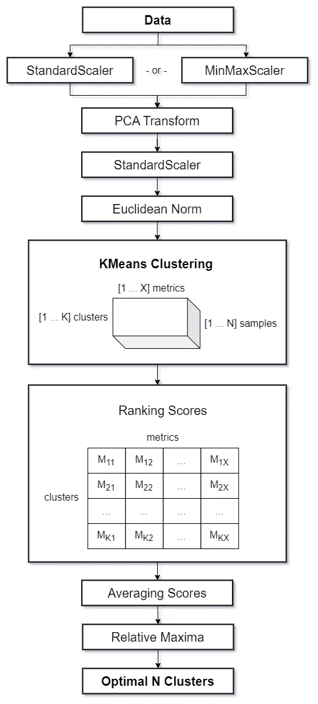

# 精准聚类简化版：kscorer 的自动选择最佳 K-means 聚类指南

> 原文：[`towardsdatascience.com/precision-clustering-made-simple-kscorers-guide-to-auto-selecting-optimal-k-means-clusters-51fb39fde44c?source=collection_archive---------3-----------------------#2023-11-10`](https://towardsdatascience.com/precision-clustering-made-simple-kscorers-guide-to-auto-selecting-optimal-k-means-clusters-51fb39fde44c?source=collection_archive---------3-----------------------#2023-11-10)

## kscorer 简化了聚类过程，通过先进的评分和并行化提供了实用的数据分析方法

 [Volodymyr Holomb](https://wldmrgml.medium.com/?source=post_page-----51fb39fde44c--------------------------------)

·

[关注](https://medium.com/m/signin?actionUrl=https%3A%2F%2Fmedium.com%2F_%2Fsubscribe%2Fuser%2F95923fba037b&operation=register&redirect=https%3A%2F%2Ftowardsdatascience.com%2Fprecision-clustering-made-simple-kscorers-guide-to-auto-selecting-optimal-k-means-clusters-51fb39fde44c&user=Volodymyr+Holomb&userId=95923fba037b&source=post_page-95923fba037b----51fb39fde44c---------------------post_header-----------) 发表在 [Towards Data Science](https://towardsdatascience.com/?source=post_page-----51fb39fde44c--------------------------------) · 7 分钟阅读·2023 年 11 月 10 日

--

由 DALL-E-2 根据作者的描述制作

无监督机器学习，尤其是聚类，在数据科学中是一项具有挑战性的任务。它对广泛的实际商业分析项目至关重要。聚类可以独立运行，但它也是复杂数据处理管道中的一个有价值的组成部分，这些管道提升了其他算法的效率。例如，聚类在开发[推荐系统](https://medium.com/towards-data-science/building-memory-efficient-meta-hybrid-recommender-engine-back-to-front-part-2-51a7d4546e90)时起着关键作用。

好吧，Scikit-Learn 著名地提供了各种经过验证的聚类算法。尽管如此，其中大多数都是参数化的，需要设置簇数，这是聚类中最重要的挑战之一。

通常，使用迭代方法来决定最佳的簇数。这意味着你多次进行聚类，每次使用不同的簇数，并评估相应的结果。虽然这种技术很有用，但也有其局限性。

[yellowbrick 包](https://www.scikit-yb.org/en/latest/api/cluster/index.html)是一个常用工具，可以轻松识别最佳簇数。然而，它也有一些缺点。一个显著的缺点是评估多个指标时可能会出现冲突的结果，以及在图表上识别[肘部](https://en.wikipedia.org/wiki/Elbow_method_(clustering))的挑战。

此外，数据集的大小也是一个问题，不论使用何种包。当处理大数据集时，资源消耗困难可能会妨碍你有效地迭代多个簇。如果是这种情况，可以考虑探索诸如[MiniBatchKMeans](https://scikit-learn.org/stable/modules/generated/sklearn.cluster.MiniBatchKMeans.html)等技术，它可以实现并行聚类。

但对你的聚类程序进行高级优化可能需要一些鲜为人知的技术，稍后会详细介绍。你还将了解[kscorer 包](https://pypi.org/project/kscorer/)，它简化了这些技术，提供了一种更强大和高效的方法来确定最佳簇数。

这些技术毫无疑问是：

+   **降维。** 在应用聚类算法之前，对数据进行主成分分析（PCA）可能会有益。这将减少数据干扰，并导致更可靠的聚类过程。

+   **余弦相似度。** 有一种简单的方法可以在 K-means 中使用（近似）余弦距离，即通过对数据进行欧几里得归一化。这样你就不需要预先计算距离矩阵，比如在进行凝聚聚类时。

+   **多指标手头。** 为了找到最佳簇数，应该依赖多指标评估，而不是仅仅依靠单一指标。

+   **数据采样。** 为了解决资源消耗问题并改进聚类结果，可以从数据中获取随机样本以执行聚类操作并评估指标。通过多次迭代的平均得分可以减少随机性的影响，从而产生更一致的结果。

下面展示了这个工作流程。

图片由作者提供

幸运的是，无需从头开始构建整个管道，因为 [kscorer 包](https://pypi.org/project/kscorer/)中已经有现成的实现。

# 现在，让我们深入探讨一下

> 我曾在一次会议演讲中听到一位数据科学家说：“基本上，只要你知道自己在做什么，**你可以做任何你想做的事情**。” © [Alex2006](https://datascience.stackexchange.com/a/36003/101016)

在聚类之前建议对数据进行缩放，以确保所有特征处于同一水平，避免因特征的大小而主导。**标准化**（以均值为中心并按标准差缩放）或**最小-最大缩放**（将值缩放到指定范围）是常用的缩放技术。

值得注意的是，特征缩放的重要性在[这里](https://scikit-learn.org/stable/auto_examples/preprocessing/plot_scaling_importance.html)得到了完美的说明，它不仅限于 KNeighbors 模型，还适用于各种数据科学方法。通过 z-score 归一化对特征进行标准化可以确保所有特征在相同的尺度上，防止任何特征因其大小而主导模型调整。这个缩放过程可能会显著影响模型的性能，与使用未缩放数据时进行的模型调整相比，可能会导致不同的模型调整。

此外，K-means 聚类与**主成分分析（PCA）**之间存在基本联系，这在丁和赫的论文 [“K-means Clustering via Principal Component Analysis”](https://ranger.uta.edu/%7Echqding/papers/KmeansPCA1.pdf)中进行了探讨。尽管最初这两种技术的目的不同，但最终它们都旨在有效地表示数据，同时最小化重构误差。PCA 旨在将数据向量表示为减少数量的特征向量的组合。而 K-means 聚类则旨在将数据向量表示为簇中心向量的组合。这两种方法都力求最小化均方重构误差。

在应用 PCA 后，由于可能出现的计算问题（有些值可能接近零，而其他值可能非常大），我们需要再次对数据进行缩放。这完全有意义，因为我们在 PCA 后已经失去了对初始特征的跟踪，因此数据将无法解释。

另一个可能不为人知的有趣相关性是**余弦相似度**与欧几里得距离之间的关系。[理解这种关系](https://medium.com/ai-for-real/relationship-between-cosine-similarity-and-euclidean-distance-7e283a277dff)在这些度量间接互换使用时至关重要。这些知识在将传统的 K-means 聚类算法转换为球面 K-means 聚类算法时具有实际应用，其中余弦相似度是聚类数据的关键指标。如前所述，我们可以通过对数据应用欧几里得归一化来“建立”余弦相似度与欧几里得距离之间的联系。

在缺乏真实簇标签的情况下，聚类模型的评估必须依赖于内在度量，而[kscorer 包](https://pypi.org/project/kscorer/)提供了一套全面的指标来评估聚类质量。这些指标提供了有关识别簇之间分离程度的有价值见解：

+   [**轮廓系数**](https://scikit-learn.org/stable/modules/clustering.html#silhouette-coefficient)。它通过计算数据点到其不属于的最近簇的平均距离与每个数据点的簇内平均距离之间的差异来量化簇的分离程度。结果经过标准化，并表示为两者之间的比例，值越高表示簇分离越优越。

+   [**Calinski-Harabasz 指数**](https://scikit-learn.org/stable/modules/clustering.html#calinski-harabasz-index)。它计算簇间散度与簇内散度的比率。Calinski-Harabasz 测试得分越高，表示聚类性能越好，簇定义越清晰。

+   [**Davies-Bouldin 指数**](https://scikit-learn.org/stable/modules/clustering.html#davies-bouldin-index)。它衡量簇间离散度与簇内离散度的比率，值越低表示聚类性能越优越，簇的区分度越高。

+   [**邓恩指数**](https://en.wikipedia.org/wiki/Dunn_index)。它通过比较簇间距离（任意两个簇质心之间的最小距离）与簇内距离（簇内任意两点之间的最大距离）来评估簇的质量。邓恩指数越高，表示簇定义越清晰。

包中使用的指标的 Python 计算方法如下：

+   [**贝叶斯信息准则 (BIC)**](https://stackoverflow.com/a/35379657/6025592)。BIC 作为一个额外的、在某种程度上是独立的度量。虽然 K-means 没有提供直接的概率模型，但 BIC 可以帮助估计应用 K-means 模型后的数据分布。这种方法提供了对簇质量更全面的评估。

所有指标都经过标准化，确保较高的评分始终表示定义明确的聚类。这种彻底的评估对于识别数据集中最佳聚类数至关重要。

为了克服记忆限制，并迅速执行数据预处理和评分操作以进行 K-means 聚类，[kscorer 包](https://pypi.org/project/kscorer/)利用 N 个随机数据样本。这种方法确保了无缝执行，并能适应不同大小和结构的数据集。类似于交叉验证技术，它能够保持稳健的结果，即使每次迭代只关注数据的一个有限子集。

# 使用 kscorer 动手操作

因此，我们有一些数据用于聚类。请注意，我们在此场景中假设不知道确切的聚类数。

接下来，我们将把数据集分成训练集和测试集，并拟合一个模型来检测最佳聚类数。该模型将自动在 3 到 15 之间搜索最佳聚类数。这可以轻松实现，如下所示：

完成拟合过程后，我们可以查看所有应用指标的标准化评分。这将帮助我们确定适合我们数据的最佳聚类数。当查看图表时，你会注意到一些聚类被突出显示，并带有相应的评分。这些标记点对应于所有指标的平均评分中的局部最大值，因此代表了选择最佳聚类数的最佳选项。

现在，我们可以评估我们新的聚类标签与真实标签的匹配程度。请确保这种选项在实际商业场景中通常是不可用的😉

在聚类中，你可以尝试对之前未见过的数据进行聚类。但请注意，这并不是一个典型的聚类任务。一种不同且通常更有用的策略是使用聚类标签作为目标来构建分类器。这将使得将聚类标签分配给新数据变得更容易。

最后，提供一个新的[互动视角](https://medium.com/analytics-vidhya/visualizing-data-made-easy-with-prosphera-40f8994ee60f)来观察我们的数据。

因此，这就是我们如何利用[kscorer 包](https://pypi.org/project/kscorer/)深入研究 K-means 聚类，该包简化了寻找最佳聚类数的过程。由于其复杂的指标和并行处理，它已被证明是一个实用的数据分析工具。
