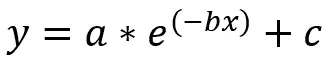
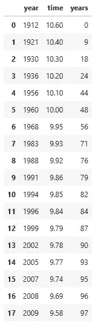
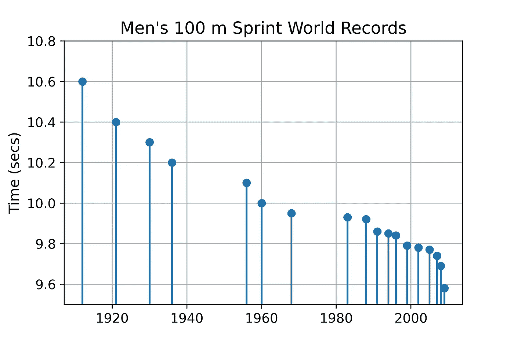
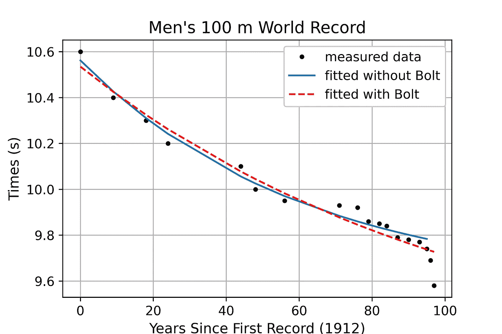
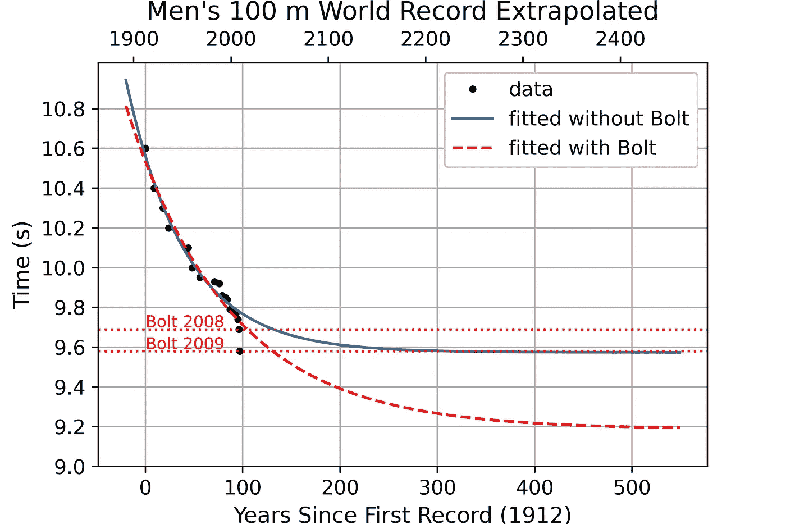

# 使用 Python 预测人类表现的极限

> 原文：[`towardsdatascience.com/predict-the-limits-of-human-performance-with-python-50cc824d2539`](https://towardsdatascience.com/predict-the-limits-of-human-performance-with-python-50cc824d2539)

## 使用 SciPy 建模指数衰减

[](https://medium.com/@lee_vaughan?source=post_page-----50cc824d2539--------------------------------)[](https://towardsdatascience.com/?source=post_page-----50cc824d2539--------------------------------) [Lee Vaughan](https://medium.com/@lee_vaughan?source=post_page-----50cc824d2539--------------------------------)

·发表于 [Towards Data Science](https://towardsdatascience.com/?source=post_page-----50cc824d2539--------------------------------) ·10 分钟阅读·2023 年 5 月 1 日

--


一幅表现奥运跑者冲过终点线的生动油画，描绘成星云的爆炸（由 DALL-E2 制作）

人类会不会跑得比法拉利快？当然不会。人类表现本质上是有限的，许多因素限制了我们的速度，包括血液输送氧气的速度和肌肉的反应速度。除非我们进行重大基因工程，否则我们现在的速度就是我们能达到的极限。

那么我们怎么知道这一点呢？事实上，人类表现，像许多其他特质一样，遵循一个[*钟形曲线分布*](https://en.wikipedia.org/wiki/Normal_distribution)[1]。这意味着大多数人都在曲线的峰值附近的平均范围内，只有少数人特别慢或特别快。当我们离峰值越来越远时，具有这种表现水平的个体数量会以指数方式下降。在短跑的情况下，这意味着最快的短跑运动员已经达到了曲线的平坦、收缩部分。因此，取得显著的速度提升将变得越来越困难。


2005 年以来记录的 100 米试验时间图，低于 9.93 秒[2]。（参考[麦考密克工程学院](https://www.mccormick.northwestern.edu/news/articles/2016/08/how-long-will-it-take-to-break-usain-bolts-100-meter-dash-record.html)（2016））

这并不是说没有改进的空间。训练、营养、设备和其他因素可以帮助个人在其基因限制范围内提高表现。然而，重要的是要认识到，我们不能从根本上改变我们的身体极限，尤其是当监管机构继续限制在田径比赛中使用先进的生物技术时。

由于人类表现是*有限的*，我们可以预测许多运动项目的未来结果[3]。例如，100 米短跑世界纪录的减少，像许多其他自然现象一样，似乎遵循[*指数衰减*](https://en.wikipedia.org/wiki/Exponential_decay)的模式[4]。因此，我们可以用指数方程来建模：



指数方程（图片由作者提供）

在这个方程中，`y`表示对世界纪录短跑时间的预测（以秒为单位）；`x`表示自首次记录设立以来的年数；`a`、`b`和`c`表示*曲线拟合*参数：

+   `a`是*尺度因子*或*幅度*。它决定了指数函数的垂直伸展或压缩。

+   `b`是*衰减常数*。它表示当`x`增加时，函数衰减的速度。

+   `c`是*垂直位移*的量。它决定了水平渐近线的`y`值，即当`x`趋近于无穷大时，指数函数接近的一条水平线。

这三个参数是通过将指数函数拟合到一组数据点来解决的，使用的是*曲线拟合算法*。通过最小化`y`的预测值与每个`x`值处实际`y`值之间差异的平方和，来确定最适合数据的值。

当然，如果你不是数学家，找到正确的参数可能会有些困难。幸运的是，对于我们其他人来说，有一个 Python 库可以让曲线优化变得非常简单。

# SciPy 库

开源的[SciPy 库](https://scipy.org/)在 NumPy 的基础上扩展，提供了物理常数、转换因子和用于数学、科学及工程的数值例程[5]。这些包括用于曲线拟合的优化例程，这正是我们项目所需要的。

使用 conda 安装 SciPy：

`conda install scipy`

使用 pip 安装：

`pip install scipy`

# 代码

该项目的 Python 代码是在 JupyterLab 中编写的。如果你想下载笔记本，可以在这个[Gist](https://gist.github.com/rlvaugh/f1c293c7b31fa878b0cdeb256c6e99ab)找到。

## 导入库并设置 RC 参数

以下单元导入库并为 matplotlib 图形设置运行配置参数。提前设置这些参数不是严格必要的，但在绘制多个图形时可以减少后续代码量。

```py
import warnings
import numpy as np
import matplotlib.pyplot as plt
import pandas as pd
import scipy.optimize

# Suppress warnings for using np.exp() on large values during optimization:
warnings.filterwarnings('ignore')

# Set default run configuration for plots:
plt.rcParams['figure.figsize'] = (6, 4)
plt.rc('font', size=12)
plt.rc('axes', titlesize=14) 
plt.rc('axes', labelsize=12) 
plt.rc('xtick', labelsize=11) 
plt.rc('ytick', labelsize=11) 
plt.rc('legend', fontsize=11) 
```

## 加载数据

世界纪录不经常被打破，因此匹配的数量少于二十个。我们将使用*topend sports* [网站](https://www.topendsports.com/sport/athletics/record-100m.htm)上的纪录列表，并将其作为字典[6]输入。然后我们将字典转换为 pandas DataFrame，以便于使用。我们的大部分分析将使用纪录（以秒为单位）与自首次记录以来的年数，因此我们将添加一个表示年数的列。

```py
# Input men's 100 m world records in seconds.
# If two records were set in the same year, list only the latest (lowest):
records = {2009: 9.58, 2008: 9.69, 2007: 9.74, 2005: 9.77, 2002: 9.78,
           1999: 9.79, 1996: 9.84, 1994: 9.85, 1991: 9.86, 1988: 9.92, 
           1983: 9.93, 1968: 9.95, 1960: 10, 1956: 10.1, 1936: 10.2, 
           1930: 10.3, 1921: 10.4, 1912: 10.6} 

# Turn dictionary into a DataFrame:
df = pd.DataFrame(records.items(), columns=['year', 'time'])
df['years'] = df['year'] - 1912  # Years since first record.
df = df.sort_values('year').reset_index(drop=True)
display(df)
```



男子 100 米世界纪录数据框（作者提供的图片）

## 绘制世界纪录

尽早查看数据总是一个好主意，因此让我们从数据框中制作一个茎状图。这应该可以轻松地查看数据中的趋势和异常值。

```py
# Graph the world records:
plt.stem(df.year, df.time)
plt.title("Men's 100 m Sprint World Records")
plt.ylabel("Time (secs)")
plt.ylim(9.5, 10.8)
plt.grid(True);
```



按年份绘制的男子 100 米世界纪录茎状图（作者提供的图片）

正如你可能对指数衰减的预期，纪录时间最初下降得相当快，但随后开始趋于平稳，就像飞机接近跑道一样。虽然现代运动员拥有优化的训练、营养和设备，但随着接近人类表现极限，进步变得越来越困难。*或者并非如此*？

看一下右侧的最后两个数据点。它们看起来像是从悬崖上掉下来的。这不是一个温和的曲线平稳着陆。这很奇怪。*这*就是*乌塞恩·博尔特*。


牙买加跑者蒙太奇，由 DALL-E2 生成（提示：一幅戏剧性的油画，描绘一位穿着黄色衬衫和绿色短裤的牙买加奥运跑者，冲过终点线的画面如星云爆炸）

# 乌塞恩·博尔特的疯狂故事

[乌塞恩·博尔特](https://en.wikipedia.org/wiki/Usain_Bolt)是一位牙买加跑者，拥有“世界上最快的人”称号[6][7]。2008 年，他在男子 100 米短跑中以 9.69 秒的时间赢得了奥运金牌。这创造了新的世界纪录，尽管他在庆祝时提前放慢了速度（你可以[在这里](https://www.youtube.com/watch?v=93dC0o2aHto)观看）。

一年后，博尔特保持专注，以 9.58 秒的时间和 44.72 公里/小时（27.79 英里/小时）的最高速度越过终点线。这个纪录比生物统计学家基于当时数学模型的预期*早了几十年*。

今天，多亏了博尔特，对于 100 米的最终时间预测充满了*谦逊*和不确定性。在讨论的数字中，包括相对较高的 9[.44 秒](https://www.wired.com/2008/08/bolt-is-freaky/)和非常低的[9.27](https://www.runnersworld.com/races-places/a20791832/ultimate-100-meter-time-9-27-seconds/) [8][9]。

为了评估博尔特对 100 米冲刺预测的影响，我们来做一些自己的预测。这些预测将完全基于以前的*世界纪录*，而不是*所有*职业比赛的结果。我们将首先预测*没有*博尔特的情况，然后重复这个过程*有*博尔特的情况。由于我们会做多次预测，因此我们将首先编写用于创建和优化指数函数的函数。

## 定义指数衰减的函数

第一个函数将接受`x`值（自第一个记录以来的年数）和曲线拟合参数`a`、`b`、`c`，并返回预测的`y`值（时间）。第二个函数将接受第一个函数作为参数，以及`x`和`y`数据，并使用 SciPy 的`[optimize.curve_fit()](https://docs.scipy.org/doc/scipy/reference/generated/scipy.optimize.curve_fit.html#scipy.optimize.curve_fit)`方法自动选择最佳拟合参数。我们将`p0`参数设置为`None`，这意味着我们让方法决定`y`的最佳最小值和最大值，而不是提供猜测。

```py
def expo(x, a, b, c):
    """Return y values for exponential decay curve."""
    return a * np.exp(-b * x) + c

def optimize_curve_fit(a_func, x, y):
    """Return optimized parameters for curve fit."""
    params, covar = scipy.optimize.curve_fit(a_func, x, y, p0=None)
    return params
```

## 优化曲线拟合参数

在调用我们的函数之前，我们需要构建包含博尔特时间（`_all`后缀）和不包含博尔特时间（`_nB`后缀）的世界纪录数据集。我们将这些数据集连同我们的`expo()`函数一起传递给`optimize_curve_fit()`函数。该函数返回优化后的`a`、`b`和`c`拟合参数作为 NumPy 数组。

```py
# Generate datasets with and without Bolt's times (nB = No Bolt):
x_all, y_all = df.years, df.time
x_nB, y_nB = x_all[:-2], y_all[:-2]

# Find optimized parameters for fitting the curve to the points:
params_nB = optimize_curve_fit(expo, x_nB, y_nB)
params_all = optimize_curve_fit(expo, x_all, y_all)
print(f"Parameters without Bolt (a, b, c) = {params_nB}") 
print(f"   Parameters with Bolt (a, b, c) = {params_all}")
```

```py
Parameters without Bolt (a, b, c) = [0.98795896 0.01631187 9.57391395]
   Parameters with Bolt (a, b, c) = [1.34836526 0.00941746 9.18654695]
```

## 绘制结果

为了绘制我们的预测曲线，我们将把我们的指数衰减函数（`expo()`）传递给 matplotlib 的`plot()`方法，并使用优化后的拟合参数。

```py
# Plot exponential curves for data with and without Bolt's times:
plt.plot(x_all, y_all, '.', label='measured data', c='k')
plt.plot(x_nB, expo(x_nB, *params_nB), 
         '-', label='fitted without Bolt')
plt.plot(x_all, expo(x_all, *params_all), '--', 
         label='fitted with Bolt', c='red')
plt.title("Men's 100 m World Record")
plt.xlabel('Years Since First Record (1912)')
plt.ylabel('Times (s)')
plt.grid(True)
plt.legend(framealpha=1);
```



两条拟合世界纪录数据的指数曲线（作者提供的图像）

哇。尤塞恩·博尔特真的是超出了曲线。这是因为，从物理上讲，他是一个*异常值*。尽管比大多数短跑运动员高且步幅更长，但他仍能保持类似的*步频*，这意味着他可以用更少的步伐覆盖相同的距离。这可能是因为他结合了较矮短跑运动员的快肌纤维和较高个子人的身体机械优势[8]。

一个有效的问题是他是否*打破了曲线*，还是仅仅*加快了我们沿曲线的进展*。要调查这一点，我们需要将两条曲线外推到未来。

## 预测未来表现

以下代码首先将指数曲线外推 570 年（从 1912 年首次记录前 20 年到 550 年后）。绘制曲线后，标记博尔特的数据点，以便我们可以看到它们在未来与曲线交点的位置。最后，打印每条曲线预测的最小时间。请注意，这些值与曲线拟合练习中的`c`参数相同。

```py
# Extrapolate exponential curves to predict future performance:
x_extrap = np.arange(-20, 550)
y_nB_extrap = expo(x_extrap, *params_nB)  # Without Bolt.
y_B_extrap = expo(x_extrap, *params_all)  # With Bolt.

# Create a plot of the world record times and the extrapolated curves.
fig, ax = plt.subplots()
ax.plot(x_all, y_all, '.', label='data', c='k')
ax.plot(x_extrap, y_nB_extrap, '-', label='fitted without Bolt')
ax.plot(x_extrap, y_B_extrap, '--', c='red', label='fitted with Bolt')
ax.set(title="Men's 100 m World Record Extrapolated",
       xlabel='Years Since First Record (1912)',
       ylabel='Time (s)',
       yticks=np.arange(9.0, 11.0, 0.2))
ax.grid(True)
ax.legend(framealpha=1)

# Add a dotted horizontal line for each of Bolt's world record times.
bolt_times = {2009: 9.58, 2008: 9.69}
for year, time in bolt_times.items():
    ax.axhline(time, ls=':', linewidth=1.3, color='red')
    ax.text(0, time + 0.01, f"Bolt {year}", color='red',
            horizontalalignment='left', size=9)

# Define function and inverse function to permit a secondary x-axis for year:
axis_transform = lambda x_extrap: x_extrap + 1912
axis_inverse = lambda x_extrap: x_extrap - 1912
ax2 = ax.secondary_xaxis('top', functions=(axis_transform, axis_inverse))

print(f"\nMinimum predicted time without Bolt data = {min(y_nB_extrap):.2f} sec.")
print(f"Minimum predicted time with Bolt data =    {min(y_B_extrap):.2f} sec.\n")
```

```py
Minimum predicted time without Bolt data = 9.57 sec.
Minimum predicted time with Bolt data =    9.19 sec.
```



外推到未来的两条曲线（作者提供的图像）

从技术上讲，这两条曲线都允许博尔特当前的 9.58 秒记录。如果我们假设红色曲线*包含*博尔特的数据，并且提供了有效的预测，那么博尔特的成就就提前了数十年。

红色曲线预测，100 米冲刺的*终极*人类极限为 9.19 秒，并将在约 400 年内达到。虽然 9.19 秒确实很快，但这并不与其他已发布的预测值相悖，如[9.27](https://www.runnersworld.com/races-places/a20791832/ultimate-100-meter-time-9-27-seconds/)、[9.26](https://ideaisaac.blogspot.com/2008/08/world-records-for-mens-100-m-defy.html)和[9.09](https://ideaisaac.blogspot.com/2009/08/world-record-progression-for-mens-100-m.html)秒 [9][10][11]。

虽然 400 年是很长时间，但一些研究人员认为博尔特的*当前*纪录将再保持约[230 年](https://www.mccormick.northwestern.edu/news/articles/2016/08/how-long-will-it-take-to-break-usain-bolts-100-meter-dash-record.html) [2]！无论如何，我们的 9.57 秒和 9.19 秒的值都是合理的，有很大可能夹住*终极*值。数学（以及 Python）真是太神奇了！

# 摘要

许多自然现象，如放射性衰变、岩石断裂和人口增长，可以使用指数方程、幂律和逻辑斯蒂函数等工具进行数学建模。除了匹配现有数据，这些模型还可以预测未来行为。在这个*快速成功数据科学*项目中，我们使用了指数方程来预测男子 100 米赛跑的*终极*跑步时间。

拟合曲线到数据需要操作多个参数。目标是最小化实际数据点和预测数据点之间的误差。Python 的 SciPy 库包括自动化这一过程的函数，使曲线拟合对所有人都易于实现。

# 来源

[1] 正态分布。 (2023 年 4 月 16 日)。在维基百科。 [`en.wikipedia.org/wiki/Normal_distribution`](https://en.wikipedia.org/wiki/Normal_distribution)。

[2] 西北大学麦考密克工程学院：[*打破博尔特 100 米纪录需要多长时间？Luis Amaral 教授计算了几率*](https://www.mccormick.northwestern.edu/news/articles/2016/08/how-long-will-it-take-to-break-usain-bolts-100-meter-dash-record.html) (2016)。

[3] Little, Brown and Company, [*公式：成功的普遍法则*](https://a.co/d/hbMZ1x4) 作者 Albert-László Barabási (2018)。

[4] [*指数衰减*](https://en.wikipedia.org/wiki/Exponential_decay)。 (2023 年 3 月 11 日)。在维基百科。

[5] SciPy: [*https://scipy.org/*](https://scipy.org/) (2023)。

[6] Robert Wood, “*100 米世界纪录*。” Topend Sports 网站，2008，[`www.topendsports.com/sport/athletics/record-100m.htm,`](https://www.topendsports.com/sport/athletics/record-100m.htm,) 访问日期 2023 年 5 月 1 日。

[7] [*尤赛恩·博尔特*](https://en.wikipedia.org/wiki/Usain_Bolt)。 (2023 年 4 月 15 日)。在维基百科。

[8] Wired: [*博尔特飞速无比，但远未接近人类极限*](https://www.wired.com/2008/08/bolt-is-freaky/) 作者 Alexis Madrigal (2008)。

[9] Runner’s World: [*终极 100 米时间：9.27 秒？*](https://www.runnersworld.com/races-places/a20791832/ultimate-100-meter-time-9-27-seconds/) 作者：安比·伯富特 (2014)。

[10] Idea & Issac: Femto Essays: [*男子 100 米世界纪录挑战简单曲线拟合*](https://ideaisaac.blogspot.com/2008/08/world-records-for-mens-100-m-defy.html) 作者：田端达夫 (2008)。

[11] Idea & Issac: Femto Essays: [*博尔特的世界纪录再次改变了经验预测*](https://ideaisaac.blogspot.com/2009/08/world-record-progression-for-mens-100-m.html) 作者：田端达夫 (2009)。

# 谢谢！

感谢阅读，并确保关注我，以获取未来更多的*快速成功数据科学*项目。
