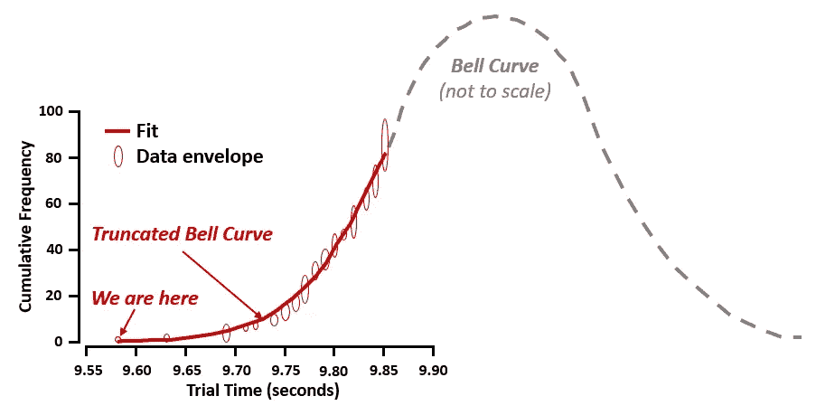

# 使用 Python 预测人类表现的极限

> 原文：[`towardsdatascience.com/predict-the-limits-of-human-performance-with-python-50cc824d2539?source=collection_archive---------7-----------------------#2023-05-01`](https://towardsdatascience.com/predict-the-limits-of-human-performance-with-python-50cc824d2539?source=collection_archive---------7-----------------------#2023-05-01)

## 使用 SciPy 进行指数衰减建模

 [李·沃恩](https://medium.com/@lee_vaughan?source=post_page-----50cc824d2539--------------------------------)

·

[关注](https://medium.com/m/signin?actionUrl=https%3A%2F%2Fmedium.com%2F_%2Fsubscribe%2Fuser%2F5d604015c08b&operation=register&redirect=https%3A%2F%2Ftowardsdatascience.com%2Fpredict-the-limits-of-human-performance-with-python-50cc824d2539&user=Lee+Vaughan&userId=5d604015c08b&source=post_page-5d604015c08b----50cc824d2539---------------------post_header-----------) 发表在 [数据科学前沿](https://towardsdatascience.com/?source=post_page-----50cc824d2539--------------------------------) ·10 分钟阅读·2023 年 5 月 1 日

--

一幅表现力丰富的油画，描绘了一名奥林匹克跑者突破终点线的瞬间，如同星云爆炸般的场景（由 DALL-E2 创作）

人类会超越法拉利的速度吗？当然不会。人类的表现本质上是有限的，许多因素限制了我们的速度，包括血液输送氧气的速度以及肌肉的快速收缩。除非我们进行重大遗传工程改造，否则我们已经接近最快速度的极限了。

那么我们怎么知道这一点呢？事实上，人类表现就像许多其他特质一样，遵循[*钟形曲线分布*](https://en.wikipedia.org/wiki/Normal_distribution) [1]。这意味着大多数人落在曲线的平均范围内，接近曲线的峰值，只有一小部分人表现特别慢或特别快。随着我们远离峰值，具有该表现水平的人数会呈指数下降。在短跑的情况下，这意味着最快的短跑运动员已经达到曲线的平坦、收敛部分。因此，取得显著的速度提升将变得越来越困难。

下面的图表显示了自 2005 年以来，100 米试跑次数少于 9.93 秒的记录[2]。 （参考[麦考密克工程学院](https://www.mccormick.northwestern.edu/news/articles/2016/08/how-long-will-it-take-to-break-usain-bolts-100-meter-dash-record.html)（2016 年））

这并不是说没有提升的空间。训练、营养、设备和其他因素可以帮助个人在遗传限制内提升表现。然而…
