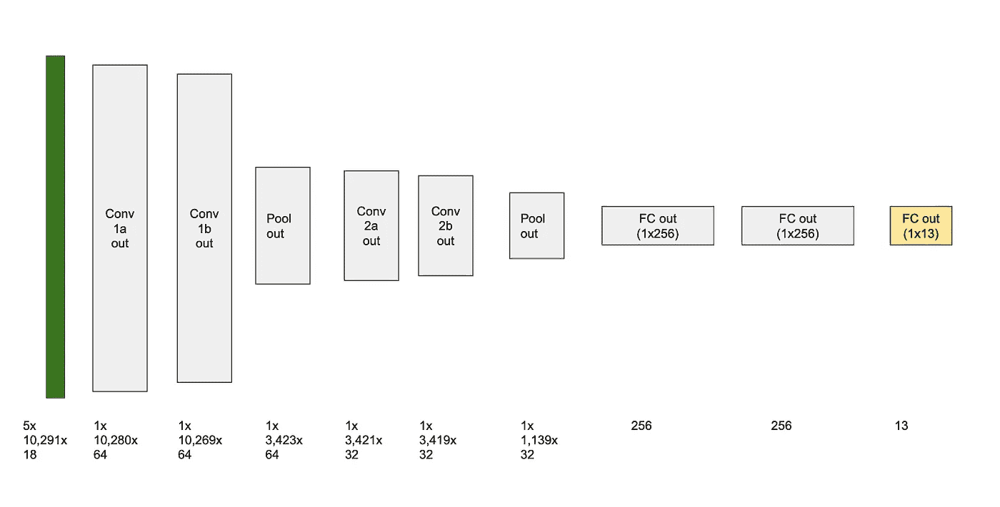

# 使用卷积网络预测结核分枝杆菌的药物耐药性 — 论文评审

> 原文：[`towardsdatascience.com/predicting-drug-resistance-in-mycobacterium-tuberculosis-using-a-convolutional-network-paper-b5905e3e3977?source=collection_archive---------20-----------------------#2023-03-20`](https://towardsdatascience.com/predicting-drug-resistance-in-mycobacterium-tuberculosis-using-a-convolutional-network-paper-b5905e3e3977?source=collection_archive---------20-----------------------#2023-03-20)

 [Uri Almog](https://urialmog.medium.com/?source=post_page-----b5905e3e3977--------------------------------)

·

[关注](https://medium.com/m/signin?actionUrl=https%3A%2F%2Fmedium.com%2F_%2Fsubscribe%2Fuser%2F73e96a4bfbfa&operation=register&redirect=https%3A%2F%2Ftowardsdatascience.com%2Fpredicting-drug-resistance-in-mycobacterium-tuberculosis-using-a-convolutional-network-paper-b5905e3e3977&user=Uri+Almog&userId=73e96a4bfbfa&source=post_page-73e96a4bfbfa----b5905e3e3977---------------------post_header-----------) 发表在 [Towards Data Science](https://towardsdatascience.com/?source=post_page-----b5905e3e3977--------------------------------) ·6 分钟阅读·2023 年 3 月 20 日

--

图片来源：[CDC](https://unsplash.com/@cdc?utm_source=unsplash&utm_medium=referral&utm_content=creditCopyText) 在 [Unsplash](https://unsplash.com/photos/iwkcspbMWx8?utm_source=unsplash&utm_medium=referral&utm_content=creditCopyText)

# 神经网络可以提高对病原体药物耐药性的预测能力

在这篇文章中，我将回顾一篇关于医学研究与建模及机器学习之间接口的最新论文。论文***Green, A.G., Yoon, C.H., Chen, M.L. 等. 卷积神经网络突显与抗微生物耐药性相关的结核分枝杆菌突变. Nat Commun 13, 3817 (2022).*** [***https://doi.org/10.1038/s41467-022-31236-0***](https://doi.org/10.1038/s41467-022-31236-0)描述了两种培训神经网络模型以预测给定 M. tuberculosis (MTB)菌株对 13 种抗生素的耐药性的 Approaches。这种建模技术的优点是能够生成一个**显著性图**，突显出对预测影响最大的特征，从而解决了一些关于模型可解释性的担忧。

# 问题陈述

结核病（TB）是导致全球感染性病原体死亡的主要原因。其病原体 M. tuberculosis（或 MTB）正逐渐对抗生素产生耐药性——这一过程对公共卫生构成威胁。虽然对每个患者的 MTB 分离株进行一系列抗生素的耐药性实证测试可能是最准确的方法，但可能需要几周才能完成，并且无法及时治疗。分离株的分子诊断只需数小时或数天，但仅关注基因组序列中的特定位点。因此，学习表型（药物耐药性）与病原体基因型（被诊断位点的结构）之间依赖关系的机器学习模型可能提供所需的解决方案。

图片由[Julia Koblitz](https://unsplash.com/ko/@jkoblitz?utm_source=unsplash&utm_medium=referral&utm_content=creditCopyText)拍摄，发布于[Unsplash](https://unsplash.com/photos/RlOAwXt2fEA?utm_source=unsplash&utm_medium=referral&utm_content=creditCopyText)

# 单药和多药模型

作者描述了两种建模方法：第一种名为 SD-CNN（单药 CNN），训练 13 个不同的 CNN，每个 CNN 预测对不同药物的耐药性。第二种名为 MD-CNN（多药 CNN），同时预测对 13 种药物的耐药性。这种建模技术背后的见解是关于多任务学习的开创性研究（Caruana, R. 多任务学习. *Mach. Learn.* **28**, 41–75 (1997)），该研究表明，与直觉相反，训练 CNN 同时执行不同任务，确实可以提高其在每个单独任务上的表现，前提是这些任务是相关的。这个结果的解释是，一个任务生成的特征对其他任务的表现是有利的（例如，通过路标检测的辅助任务训练自动驾驶汽车转向模型）。多任务学习在遗传学研究中的优势由*Dobrescu, A., Giuffrida, M. V. & Tsaftaris, S. A. 以更少做更多：一种植物表型的多任务深度学习方法. Front. Plant Sci.* ***11****, 141 (2020)*证明。

# 模型输入

用于训练的数据是 10,201 个 M. tuberculosis 病原体分离株，这些分离株在 13 种抗生素上进行了耐药性测试。MD-CNN 的输入是一个 5x18x10,291 的数组，其中 5 是 4 种核苷酸的独热编码（***腺嘌呤、胸腺嘧啶、鸟嘌呤、胞嘧啶***和一个缺口字符），18 是 locus 索引（作者使用 18 个与药物耐药性相关的 loci），10,291 是最长 locus 的长度。locus（复数—loci）是染色体上的一个特定固定位置，其中存在特定基因或基因序列。locus 由其起始索引和结束索引定义，从约定的起点计算核苷酸。不同的 loci 具有不同的长度。

每个 13 个 SD-CNN 模型的输入包含 18 个 loci 中的一个子集，这些 loci 对该药物的抗性有已知影响。

# 模型输出

MD-CNN 模型的输出是一个 13 元素的向量（按抗结核药物索引），每个元素包含该菌株对该药物的抗性信心的 sigmoid 结果。SD-CNN 模型返回一个对应于该药物抗性信心的单一 sigmoid 值。

# 模型架构

该模型是一个 CNN，由 2 个 1-D 卷积和最大池化块组成，之后是 3 个全连接层。描述见图 1。

图 1 — MD-CNN 架构。Conv 1a 和 1b 的卷积核尺寸为 5x12 和 1x12。Conv 2a 和 2b 的卷积核尺寸为 1x3。最大池化层的形状为 1x3。所有步幅均为 1x1。所有激活函数均为 ReLU，输出层除外，输出层使用 sigmoid。每层的输出维度在图形表示下方给出。SD-CNN 模型与此图的不同之处在于它们的 locus 维度不是 18，输出维度是 1。图像由作者提供。

# 结果

SD-CNN 和 MD-CNN 模型在相互之间及与两个先前模型：Reg+L2 和 SOTA 模型 WDNN（[Chen, M. L. 等. 超越多药耐药性：利用稀有变异通过机器和统计学习模型进行*结核分枝杆菌*耐药性预测。*EBioMedicine* **43**, 356–369 (2019)](https://www.thelancet.com/journals/ebiom/article/PIIS2352-3964(19)30250-6/fulltext)*）的基准测试。基准测试使用了对训练集的 5 折交叉验证。

测试显示，MD-CNN 的表现与 WDNN（当前的 SOTA 模型，使用布尔编码已知突变的基因组序列作为输入。它被设计为多层感知器的组合，即不使用卷积）相当。MD-CNN 的平均 AUC 在一线药物上为 0.948（WDNN 为 0.960），在二线药物上为 0.912（WDNN 为 0.924）。SD-CNN 的准确率略低，两组药物的 AUC 均为 0.888。MD-CNN 和 SD-CNN 展示了对新数据的泛化能力，在一个单独收集的 12,848 个样本的测试集上取得了大致相同的 AUC）。— **有关模型的图形比较，请参见** [**原始论文**](https://www.nature.com/articles/s41467-022-31236-0#Fig1)。

作者指出，MD-CNN 模型的敏感性高于 SD-CNN 模型（即药物耐药性的漏检率较低），而 SD-CNN 模型的特异性更高（即错误将样本分类为耐药药物的比例较低）。换句话说——MD-CNN 不那么保守，倾向于将更多案例分类为‘耐药’。

分析 SD-CNN 的性能时，作者检查了假阴性案例。在检查数据时，他们观察到具有相同模型输入的样本在某些情况下对同一种药物具有耐药性，而在其他情况下则对该药物敏感（即它们的实际分类不同）。这使得作者假设，SD-CNN 模型未包含的位点中的突变可能是耐药性的原因。

# 可解释性和显著性映射

作者使用***DeepLIFT***（*Avanti Shrikumar, Peyton Greenside, and Anshul Kundaje. 2017\. 通过传播激活差异来学习重要特征。发表于第 34 届国际机器学习大会 — 第 70 卷（ICML’17）。JMLR.org, 3145–3153。）*，这是一种计算输入特征对输出贡献的方法，来解释模型的预测。通过在计算机中变更基因型输入（模拟输入）并将结果与‘参考结果’进行比较，作者发现了以前未知的变异对 MTB 药物耐药性的影响。

# 对模型架构的几点思考

作为一名机器学习工程师和研究员，大部分关注点在计算机视觉领域，我从阅读这篇论文和相关背景材料中学到了很多。显然，神经网络在医学和生物学领域的建模技术方面具有巨大潜力。在将此模型中使用的技术与我自己的经验进行比较时，我想到了一些如果我在研究的第二阶段工作时会感兴趣尝试的东西：

1.  **Gap encoding** — 四种核苷酸以 1-hot 编码表示，并额外增加一个表示间隙的元素。我很好奇如果将间隙表示改为[0, 0, 0, 0]，结果是否会有所改善。

1.  **特征深度**——此处呈现的架构在整个模型中使用单一特征。我对计算机视觉的直觉让我对特征多样化的可能性感到好奇。正如在计算机视觉中，训练过程可能会收敛到图像中的单一位置具有多种特征，如‘圆度’，‘金属性’，‘平滑度’，我猜在基因组序列中也可能是这样。

1.  **填充类型**——作者在其卷积层中使用‘***valid***’填充，而不是计算机视觉中常用的‘***same***’填充。这会随着序列在层之间传递逐渐缩短序列。‘Same’填充保持序列的空间大小，允许序列边缘附近的结构即使在模型的后期阶段仍然保持一些效果。它还允许诸如将来自不同阶段的层的输出连接起来等操作。

1.  **注意机制**——([***Vaswani 等人，Attention Is All You Need, 2017, NIPS***](https://papers.nips.cc/paper/2017/file/3f5ee243547dee91fbd053c1c4a845aa-Paper.pdf))——注意块在发现序列中远程标记之间的微妙关系（例如，NLP 中的句子不同部分）时非常有用，当一个标记的值可能对另一个标记的值的解释产生重大影响时，它们尤其相关。看看添加注意块是否能改善结果，如果能——则使用它来追溯基因组中的区域间隐藏关系会很有趣。
