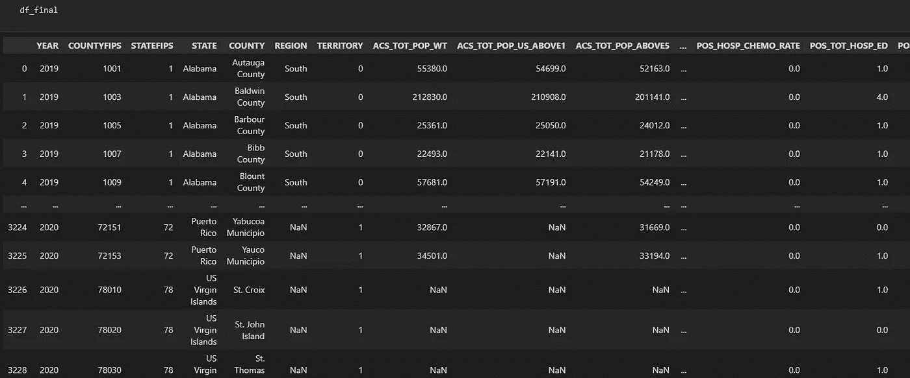
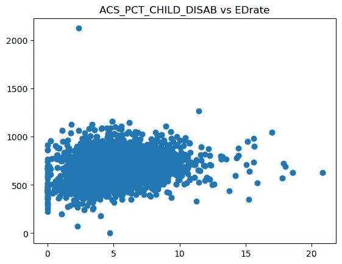
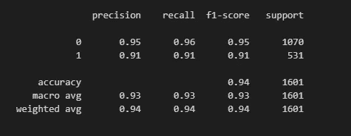

# 预测高急诊室使用率

> 原文：[`towardsdatascience.com/predicting-high-emergency-room-visit-rates-5fff6a8950f4`](https://towardsdatascience.com/predicting-high-emergency-room-visit-rates-5fff6a8950f4)

## 使用 Python 分析健康的社会决定因素（SDOH）

[](https://meaganburkhart.medium.com/?source=post_page-----5fff6a8950f4--------------------------------)[](https://towardsdatascience.com/?source=post_page-----5fff6a8950f4--------------------------------) [Meagan Burkhart](https://meaganburkhart.medium.com/?source=post_page-----5fff6a8950f4--------------------------------)

·发布于[数据科学前沿](https://towardsdatascience.com/?source=post_page-----5fff6a8950f4--------------------------------) ·10 分钟阅读·2023 年 5 月 23 日

--


照片由[国家癌症研究所](https://unsplash.com/@nci?utm_source=medium&utm_medium=referral)拍摄，[来自 Unsplash](https://unsplash.com/?utm_source=medium&utm_medium=referral)

本项目的目标是利用来自[AHRQ](https://www.ahrq.gov/sdoh/data-analytics/sdoh-data.html)的按县划分的社会决定因素（SDoH）数据，查找特定变量与县急诊就诊率之间的关系。**最终**，我希望开发一个与高急诊率相关的顶级特征的预测模型。我决定查看 2019 年和 2020 年的数据（2018 年数据不可用）。该数据集经过[AHRQ](https://www.hrsa.gov/)的明确许可使用。

这个逐步教程介绍了我加载、清理、分析和建模数据的过程。

# 加载数据

第一步是加载两个数据文件并检查其形状。


作者的代码

由于两个数据框的列数不同，我将导入数据字典并提取相同的列。

我根据列名（内连接）合并了数据字典，以获取最终的公共列列表。一旦获得列，我选择了每个数据框中这些列的子集，并将它们与轴=0 进行连接，以垂直添加它们。我的 df_final 包含了 2019 年和 2020 年数据中的公共列。

```py
dictionary2019=pd.read_csv('Data/datadictionary2019.csv', encoding= "ISO-8859–1")
dictionary2020=pd.read_csv('Data/datadictionary.csv', encoding= "ISO-8859–1")
commoncolumns=dictionary2020.merge(dictionary2019, how='inner', left_on='name', right_on='name')['name'].values.tolist()

dfa=df2019[commoncolumns]
dfb=df2020[commoncolumns]
df_final=pd.concat([dfa, dfb], axis=0)
df_final
```

# 关于数据

该数据有 674 列，因此我们需要尝试缩小需要查看的特征。让我们从我感兴趣的变量——急诊访问率开始。

数据集包括每 1,000 名男性医疗保险（双重和非双重）受益人的急诊科访问次数。然而，数据提供了单独的男性和女性比率，因此我将创建一个加权平均的整体急诊率。

为此，我将比率分别乘以男性的百分比和女性的百分比，然后将这些值相加。

**男性 ED 比率**：597.1129158207091

**女性 ED 比率**：639.9023742580443

```py
import numpy as np
#create an average overall ED rate by weighting the male and female rates by their percentage of the population and adding
df_final['Malerate']=(df_final['ACS_PCT_MALE']*df_final['MMD_ED_VISITS_M_RATE'])/100
df_final['Femalerate']=(df_final['ACS_PCT_FEMALE']*df_final['MMD_ED_VISITS_F_RATE'])/100
df_final['EDrate']=df_final['Malerate']+df_final['Femalerate']
#print the mean ED rate to use as our baseline for Good and Bad outcomes
```

# 数据清理



查看数据框后，我们可以看到一些县的数据缺失。为了解决这个问题，我删除了某些列，并用均值插补了其他列。

对于这个项目，我们将删除 ED 比率计算中缺失值的行，因为这意味着他们没有相关的急诊访问数据。

然后，我们将找到数据集的 80 百分位数，作为‘高 ED 比率’的截断点。这将成为我未来预测的结果变量。整体 ED 比率将用于相关性和探索性数据分析。

```py
#create cutoff value for high EDrate
cutoff=np.percentile(df_final['EDrate'], 80)
#if ED rate is greater than the 50th percentile then flag as high or else 0 for low
df_final['HighED']=np.where(df_final['EDrate']>cutoff, 1, 0)
```

为了处理一些缺失数据，我开始时删除了任何缺失值超过 10%的列。然后，我得到了剩余列中有缺失值的列表，如下所示。

```py
# drop columns with >10% missing
df_final.dropna(thresh=0.90*len(df_final),axis=1, inplace=True)

#list columns remaining with missing values
df_final.isnull().sum().to_frame(name='counts').query('counts > 0').sort_values(by='counts', ascending=False)
```

我们先用均值对所有浮点型列进行简单插补。首先，我们需要将训练集和测试集分开：

```py
from sklearn.impute import SimpleImputer
from sklearn.model_selection import train_test_split
columns=df_final.loc[:, df_final.dtypes == float].columns.values
X_train, X_test, y_train, y_test = train_test_split( df_final.index, df_final['HighED'], stratify=df_final['HighED'], test_size=0.25,  random_state=42)
df_train=df_final.iloc[X_train]
df_test=df_final.iloc[X_test]
imp = SimpleImputer( strategy='mean')
df_impute_train=df_train[columns].copy(deep=True)
df_impute_test=df_test[columns].copy(deep=True)
df_impute_train[:]=imp.fit_transform(df_train[columns])
df_impute_test[:]=imp.fit_transform(df_test[columns])

df_impute_train
```

接下来，我们将选择所有浮点型列，以便我们可以运行每个特征与目标特征之间的相关性分析。根据相关性，我们将设定阈值，并保留那些与 ED 比率显著正相关或负相关的列。

```py
#print positive correlations over .2 (small-moderate effect size)
def positivecorrelations(threshold=.2):
    columns=df_impute_train.columns.values
    positivecolumns=[]
    for col in columns:        
        if df_impute_train['EDrate'].corr(df_impute_train[col])>threshold:
            positivecolumns.append(col)
    return positivecolumns

poscols=(positivecorrelations())
#print negative correlations less than -.2 (small-moderate effect size)
def negativecorrelations(threshold=-.2):
    columns=df_impute_train.columns.values
    negativecolumns=[]
    for col in columns:        
        if df_impute_train['EDrate'].corr(df_impute_train[col])<threshold:
            negativecolumns.append(col)
    return negativecolumns

negcols=(negativecorrelations())
```

我制作了一个最终的列列表，如下所示：

```py
#make a final list of significant columns
sigcols=poscols+negcols
print(sigcols)
len(sigcols)
```

我们最终得到了 140 列。在打印列的列表后，我意识到我仍然需要进一步清理 -

我们要确保不包括任何包含 ED 的变量，因此我们会通过以下代码过滤掉所有这些列，以及我们计算出的女性比率和男性比率。

```py
stringVal = "ED"
sigcols.remove('Femalerate')
sigcols.remove('Malerate')
finalcols=[x for x in sigcols if stringVal not in x]

len(finalcols)
```

这使我们剩下了 140 列。我们将数据集缩小到 112 列。但现在我查看列的列表时，看到我们还应排除任何包含 _IP（住院）、_PA（急性后期）和 _EM（E&M）的列。我们也不关心每月的最低和最高温度，因此我会删除这些列。

```py
stringVal = "_IP"

finalcols=[x for x in finalcols if stringVal not in x]
stringVal2="TEMP_"

finalcols=[x for x in finalcols if stringVal2 not in x]
stringVal3="_PA"
stringVal4="_EM"

finalcols=[x for x in finalcols if stringVal3 not in x]
finalcols=[x for x in finalcols if stringVal4 not in x]
len(finalcols)
#result is 77
```

基于对输出的另一轮仔细检查，我发现有些特征测量的是非常相似的事物（即整体估计百分比与年龄 X-Y）。如果整体值存在，就删除那些指定年龄范围的列。此外，PQI 在所有不同的人群子集中的重复，因此我们将采用加权平均来找出整体比率，就像我们之前用 ED 比率一样。

```py
finalcols=[x for x in finalcols if x not in ('ACS_PCT_PRIVATE_SELF_BELOW64', 'ACS_PCT_PRIVATE_SELF','SAIPE_PCT_POV_0_17', 'ACS_PCT_PRIVATE_ANY_BELOW64', 'SAIPE_PCT_POV_5_17', 'NEPHTN_HEATIND_90', 'NEPHTN_HEATIND_95', 'NEPHTN_HEATIND_100')]

df_impute_train.loc[:, 'MalePQI']=(df_impute_train['ACS_PCT_MALE']*df_impute_train['MMD_OVERALL_PQI_M_RATE'])/100
df_impute_train.loc[:, 'FemalePQI']=(df_impute_train['ACS_PCT_FEMALE']*df_impute_train['MMD_OVERALL_PQI_F_RATE'])/100
df_impute_train.loc[:, 'PQI']=df_impute_train['MalePQI']+df_impute_train['FemalePQI']
df_impute_train['PQI'].describe()

df_impute_test.loc[:, 'MalePQI']=(df_impute_test['ACS_PCT_MALE']*df_impute_test['MMD_OVERALL_PQI_M_RATE'])/100
df_impute_test.loc[:, 'FemalePQI']=(df_impute_test['ACS_PCT_FEMALE']*df_impute_test['MMD_OVERALL_PQI_F_RATE'])/100
df_impute_test.loc[:, 'PQI']=df_impute_test['MalePQI']+df_impute_test['FemalePQI']
df_impute_test['PQI'].describe()

rate="_RATE"
finalcols=[x for x in finalcols if rate not in x]
race="ACS_PCT_BLACK_"
finalcols=[x for x in finalcols if race not in x]

dictionary2020[['name', 'label']][dictionary2020['name'].isin(finalcols)]
```

我还从数据字典中提取了所有列的完整标签，并审查了它们，以确保所有列在我对医疗分析的背景知识下都是实用的。


最终结果得到 78 个可以使用的列。接下来，我想快速可视化这些变量与 EDrate 之间的关系，于是写了一个小循环来创建散点图：

```py
import matplotlib.pyplot as plt
def create_scatterplots(var='EDrate'):
    for col in finalcols:
        plt.scatter(df_impute_train[col], df_impute_train[var])
        plt.title(("{} vs {}".format(col, var)))
        plt.show()
create_scatterplots()
```



本分析的下一部分涉及开发几个预测模型。在这个项目中，我使用了逻辑回归、支持向量机、随机森林分类器和 XGBoost 分类器。我们首先测试的是逻辑回归和 SVM，因此需要对数据进行缩放。

我选择了 MinMaxScaler 来尝试减少异常值的影响。

```py
from sklearn.preprocessing import MinMaxScaler
scaler = MinMaxScaler()

X_train=df_impute_train[finalcols].copy(deep=True)
X_test=df_impute_test[finalcols].copy(deep=True)
y_train=df_train['HighED']
y_test=df_test['HighED']
scaler.fit(X_train)
X_train_scaled=scaler.transform(X_train)
X_test_scaled=scaler.transform(X_test)
```

# 逻辑回归

如果你对分类问题不熟悉，可以查看逻辑回归介绍这篇文章，由[Ayush Pant](https://medium.com/u/49005e363e74?source=post_page-----5fff6a8950f4--------------------------------)撰写。对于这次逻辑回归，我决定设置 class_weight=’balanced’，因为这是一个不平衡的分类问题：

```py
from sklearn.linear_model import LogisticRegression
model = LogisticRegression(solver='liblinear', random_state=0, class_weight='balanced').fit(X_train_scaled, y_train)

model.score(X_test_scaled, y_test)
```

下方的混淆矩阵显示了 TP、TN、FP 和 FN。我们还打印了分类报告。

```py
from sklearn.metrics import classification_report, confusion_matrix
import matplotlib.pyplot as plt

cm = confusion_matrix(y_test, model.predict(X_test_scaled))

fig, ax = plt.subplots(figsize=(8, 8))
ax.imshow(cm, cmap='summer', alpha=0.3)
ax.grid(False)
ax.xaxis.set(ticks=(0, 1), ticklabels=('Predicted LowED', 'Predicted HighED'))
ax.yaxis.set(ticks=(0, 1), ticklabels=('Actual LowED', 'Actual HighED'))
ax.set_ylim(1.5, -0.5)
for i in range(2):
    for j in range(2):
        ax.text(j, i, cm[i, j], ha='center', va='center', color='black')
plt.show()
```


# 支持向量机

我尝试的下一个模型是支持向量机。如果这是一个你不熟悉的话题，我推荐查看[Ajay Yadav](https://medium.com/u/1c3ce86ec41f?source=post_page-----5fff6a8950f4--------------------------------)的文章支持向量机(SVM)

在我的项目中，我对类别权重进行了调整，以观察哪些设置能在模型结果方面取得平衡。

```py
from sklearn.svm import SVC
clf=SVC(class_weight='balanced')
clf.fit(X_train_scaled, y_train)
clf.score(X_test_scaled, y_test)
cm = confusion_matrix(y_test, clf.predict(X_test_scaled))

fig, ax = plt.subplots(figsize=(8, 8))
ax.imshow(cm, cmap='summer', alpha=0.3)
ax.grid(False)
ax.xaxis.set(ticks=(0, 1), ticklabels=('Predicted LowED', 'Predicted HighED'))
ax.yaxis.set(ticks=(0, 1), ticklabels=('Actual LowED', 'Actual HighED'))
ax.set_ylim(1.5, -0.5)
for i in range(2):
    for j in range(2):
        ax.text(j, i, cm[i, j], ha='center', va='center', color='black')
plt.show()
print(classification_report(y_test, clf.predict(X_test_scaled)))
```


接下来要测试的模型是随机森林分类器和 XGBoost。由于基于树的模型不需要缩放，我将使用原始的 X 数据来进行这两项测试。

# 随机森林分类器

在你开始运行随机森林分类器之前，可能需要阅读一篇背景文章，例如[Tony Yiu](https://medium.com/u/840a3210fbe7?source=post_page-----5fff6a8950f4--------------------------------)的文章理解随机森林。一旦你对概念有了良好的理解，可以尝试运行下面的简单示例代码：

```py
from sklearn.ensemble import RandomForestClassifier
from sklearn.datasets import make_classification
clf = RandomForestClassifier( max_features=None, random_state=0, class_weight='balanced')
clf.fit(X_train, y_train)
clf.score(X_test, y_test)
cm = confusion_matrix(y_test, clf.predict(X_test))

fig, ax = plt.subplots(figsize=(8, 8))
ax.imshow(cm, cmap='summer', alpha=0.3)
ax.grid(False)
ax.xaxis.set(ticks=(0, 1), ticklabels=('Predicted LowED', 'Predicted HighED'))
ax.yaxis.set(ticks=(0, 1), ticklabels=('Actual LowED', 'Actual HighED'))
ax.set_ylim(1.5, -0.5)
for i in range(2):
    for j in range(2):
        ax.text(j, i, cm[i, j], ha='center', va='center', color='black')
plt.show()
print(classification_report(y_test, clf.predict(X_test)))
```


到目前为止，我们的随机森林分类报告如下：


凭借 94%的准确率，这个模型表现得相当不错，但我对假阴性率感到担忧。让我们看看 XGBoost 是否能做得更好。

# XGBoost

对 XGBoost 不熟悉？查看[George Seif](https://medium.com/u/e2af5c8737ec?source=post_page-----5fff6a8950f4--------------------------------)的文章——XGBoost 初学者指南，在运行下面的代码之前熟悉一下提升树。

```py
 import xgboost as xgb

# Init classifier
xgb_cl = xgb.XGBClassifier(random_state=0)

# Fit
xgb_cl.fit(X_train, y_train)

# Predict
preds = xgb_cl.predict(X_test)
cm = confusion_matrix(y_test, xgb_cl.predict(X_test))

fig, ax = plt.subplots(figsize=(8, 8))
ax.imshow(cm)
ax.grid(False)
ax.xaxis.set(ticks=(0, 1), ticklabels=('Predicted LowED', 'Predicted HighED'))
ax.yaxis.set(ticks=(0, 1), ticklabels=('Actual LowED', 'Actual HighED'))
ax.set_ylim(1.5, -0.5)
for i in range(2):
    for j in range(2):
        ax.text(j, i, cm[i, j], ha='center', va='center', color='red')
plt.show()
print(classification_report(y_test, xgb_cl.predict(X_test)))
```



看起来随机森林分类器是明显的赢家，具有更高的准确性、精确度、召回率和 f1。

让我们来看看一些特征重要性值：

```py
 features = df_impute_test.columns.values
importances = clf.feature_importances_
indices = np.argsort(importances)
plt.figure(figsize=(8, 20))
plt.title('Feature Importances')
plt.barh(range(len(indices)), importances[indices], color='b', align='center')
plt.yticks(range(len(indices)), [features[i] for i in indices])
plt.xlabel('Relative Importance')
plt.show()
```


```py
 import shap
explainer = shap.TreeExplainer(clf)
shap_values = explainer.shap_values(X_test)
shap.summary_plot(shap_values, X_test, plot_type="bar")
```


# 主要发现

1.  **最重要的特征是黑人女性的比例**

— 这表明少数群体在急性医疗方面面临更大的困难，任何歧视或健康不平等问题应立即解决。

2. **残疾退伍军人的比例也是一个重要特征**

— 这表明残疾和退伍军人身份导致了急诊科的高使用率，需要解决潜在的风险因素

3. **SHAP 值显示 PQI 和过去 12 个月领取食物券/SNAP 的家庭比例有显著影响**

— 这间接地将社会经济地位与健康不良结果联系起来，表明如果医疗提供者能够在这一领域提供帮助，患者可能不会那么频繁地去急诊科。

# 推荐和未来方向

基于这些发现，医疗保健领域的数据专业人员可能考虑开发预测模型，以隔离与健康不良结果相关的社会决定因素特征。

希望目标医疗程序可以解决诸如由于种族、残疾或社会经济地位而产生的歧视等社会决定健康需求。通过为高风险个体或高风险区域提供更密集的护理和支持，医疗保健分析师可以致力于在非急性（非急诊）环境中更好地治疗这些患者。

这可以通过社区健康设施、家庭护理机构以及与健康保险公司合作的其他伙伴来实现。

# 结论

在这篇文章中，我介绍了一个与社会决定健康相关的公共数据集。通过分析 2019 年和 2020 年的数据，我得出了几个预测模型。该模型的目标是根据社会决定健康因素预测一个县是否会有高急诊科使用率。我的分析中最好的模型是随机森林分类器。我们回顾了驱动模型的核心特征，并解释了对医疗保健分析师的影响。

— — — — — — — — — — — — — — — — — — — — — — — — — — — — — — — — — — — — — —

查看 [我的 GitHub](https://github.com/meagvo/SDOHproject/tree/master/SDOHproject) 上的整个笔记本

如果你是 Medium 的新用户，喜欢这样的故事，可以在[这里](https://medium.com/@meagvo/membership)注册。

*互联网引用：* 社会决定健康数据库。内容最后审查于 2022 年 11 月。医疗保健研究与质量局，罗克维尔，MD。[`www.ahrq.gov/sdoh/data-analytics/sdoh-data.html`](https://www.ahrq.gov/sdoh/data-analytics/sdoh-data.html)
