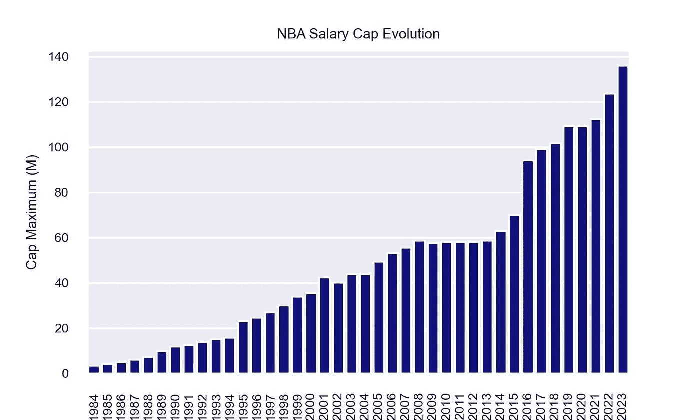
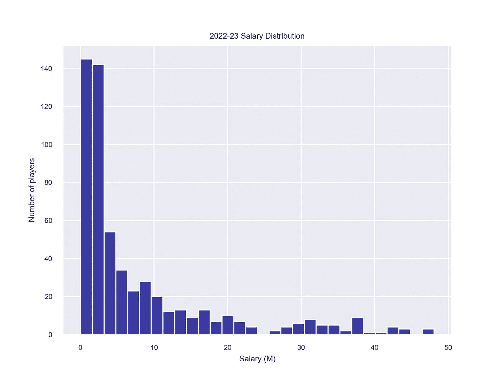
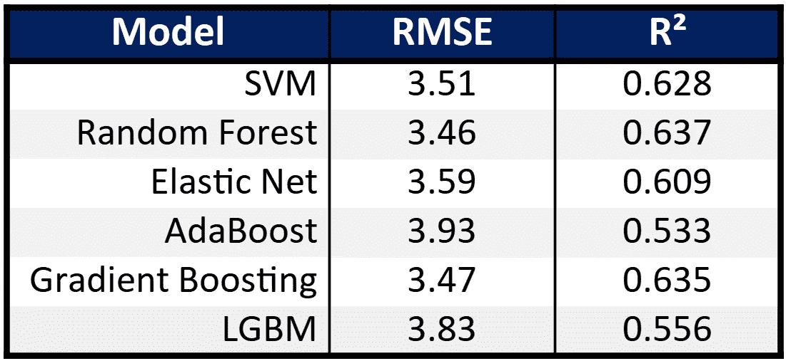
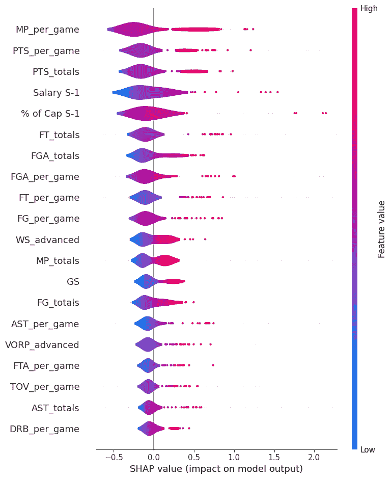
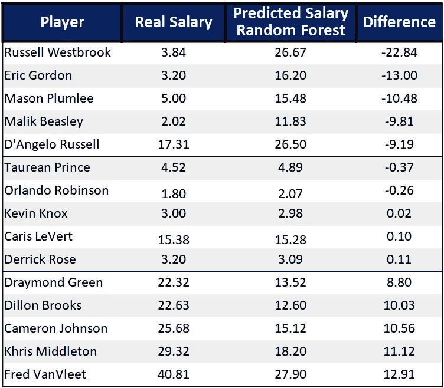

# 预测 NBA 薪资的机器学习方法

> 原文：[`towardsdatascience.com/predicting-nba-salaries-with-machine-learning-ed68b6f75566?source=collection_archive---------7-----------------------#2023-08-24`](https://towardsdatascience.com/predicting-nba-salaries-with-machine-learning-ed68b6f75566?source=collection_archive---------7-----------------------#2023-08-24)

## 使用 Python 构建机器学习模型，以预测 NBA 薪资并分析最有影响力的变量

 [Gabriel Pastorello](https://medium.com/@gabriel.pastorello?source=post_page-----ed68b6f75566--------------------------------)

·

[关注](https://medium.com/m/signin?actionUrl=https%3A%2F%2Fmedium.com%2F_%2Fsubscribe%2Fuser%2Fd0fbeabd7791&operation=register&redirect=https%3A%2F%2Ftowardsdatascience.com%2Fpredicting-nba-salaries-with-machine-learning-ed68b6f75566&user=Gabriel+Pastorello&userId=d0fbeabd7791&source=post_page-d0fbeabd7791----ed68b6f75566---------------------post_header-----------) 发表在 [Towards Data Science](https://towardsdatascience.com/?source=post_page-----ed68b6f75566--------------------------------) · 9 分钟阅读 · 2023 年 8 月 24 日

--

（照片由 [Emanuel Ekström](https://unsplash.com/@emanuelekstrom?utm_source=medium&utm_medium=referral) 提供，来源于 [Unsplash](https://unsplash.com/?utm_source=medium&utm_medium=referral)）

NBA 作为体育界最**盈利**和**竞争激烈**的联赛之一脱颖而出。在过去几年里，NBA 球员的薪资呈**上升**趋势，但每一个令人惊叹的扣篮和三分球背后都隐藏着决定这些薪资的复杂因素。

从球员表现和球队成功到市场需求和代言交易，许多变量都会影响结果。谁没想过为什么他们的球队会在表现不佳的球员身上花这么多钱，或对成功的交易感到惊讶？

在本文中，我们利用 Python 的机器学习能力来**预测 NBA 薪资**，并揭示对球员收入影响最大的**关键因素**。

所有使用的代码和数据都可以在[**GitHub**](https://github.com/GabrielPastorello/NBASalaryPrediction)上找到。

# 理解问题

在深入探讨问题之前，了解联赛薪资系统的基本原理至关重要。当一名球员在市场上待签合同时，他被称为**自由球员**（FA），这是本项目中将频繁出现的术语。

NBA 在一套复杂的规则和规定下运营，旨在保持球队之间的竞争平衡。这个系统的核心有两个关键概念：**薪资上限**和**奢侈税**。

**薪资上限**作为支出限制，限制了球队在一个赛季中可以花费的球员薪资总额。上限由联赛收入决定，每年更新一次，以确保球队在合理的财务框架内运营。它还旨在防止大市场球队显著超支，促进球队之间的公平竞争。

薪资上限在球员之间的分配可以有所不同，顶级球员有最高薪资，而新秀和老将则有最低薪资。

然而，**超越薪资上限并不罕见**，尤其是对那些希望组建争冠阵容的球队。当一支球队超过薪资上限时，它进入了**奢侈税**的范畴。奢侈税对超支的球队施加处罚，抑制球队过度支出，同时为联赛提供额外收入。

还有许多其他规则作为例外，例如**中层例外**（MLE）和**交易例外**，允许球队进行战略性的阵容调整，但对于这个项目来说，了解薪资上限和奢侈税就足够了。

NBA 薪资上限从 1984 年到 2023 年的演变（图片来源：作者）

由于薪资上限的持续增长，选择的方式将是使用**薪资上限的百分比作为目标，而不是薪资金额本身**。这个决定旨在融入薪资上限的演变特性，确保结果不会受到时间变化的影响，并在评估历史赛季时仍然适用。然而，需要注意的是，这并不完美，仅仅是一个近似值。

# 数据

对于这个项目，目标是使用**仅来自上一个赛季**的数据来**预测球员签订新合同的薪资**。

使用的个人统计数据包括：

+   **每场比赛**的**平均**统计数据

+   **总**统计数据

+   **高级**统计数据

+   **个体变量**：年龄、位置

+   **与薪资相关的变量**：上一赛季的薪资、上一赛季和当前赛季的最大薪资上限以及该薪资的上限百分比。

2022–23 赛季的薪资分布（图片由作者提供）

由于我们不知道球员将签约的球队，只包括了个体特征。

总体而言，这项研究为每名球员提供了**78 个特征**加上目标。

大部分数据通过[**BRScraper**](https://github.com/GabrielPastorello/BRScraper)获得，这是我最近创建的**Python 包**，可以轻松抓取和访问来自[Basketball Reference](https://www.basketball-reference.com/)的篮球数据，包括 NBA、G 联盟和其他国际联赛。遵守了所有关于不对网站造成伤害或阻碍其性能的指南。

# 数据处理

一个值得考虑的有趣方面是**选择球员**来训练模型。最初，我选择了所有可用的球员，但大多数球员可能已经有合同，在这种情况下，薪资值不会发生剧烈变化。

例如，假设一名球员签订了为期 4 年的 2000 万美元合同。他每年大约获得 500 万美元（虽然很少每年的薪资完全相同，通常薪资在 500 万美元左右会有一定的递增）。然而，当自由球员签订新合同时，薪资值可能会发生更大幅度的变化。

这意味着**用所有可用球员训练模型可能会整体上表现更好**（毕竟，大多数球员的薪资接近最后一个！），但在评估**仅自由球员时，表现会显著变差**。

由于目标是预测**签订新合同的球员**的薪资，因此数据中仅应包含这种类型的球员，以便模型能更好地理解这些球员之间的模式。

关注的赛季是即将到来的 2023–24 赛季，但会使用**2020–21 赛季及之后**的数据来增加样本量，这得益于目标的选择。由于缺乏自由球员的数据，未使用较早的赛季。

这使得在选择的三个赛季中有**426 名球员**，其中 84 名是 2023–24 赛季的自由球员。

# 建模

训练-测试拆分的设计是为了确保 2023–24 赛季的所有自由球员仅包含在测试集中，保持了大约 70/30 的拆分比例。

最初使用了几种回归模型：

+   **支持向量机（SVM）**

+   **弹性网**

+   **随机森林**

+   **AdaBoost**

+   **梯度提升**

+   **轻量级梯度提升机（LGBM）**

通过均方根误差（**RMSE**）和决定系数（**R²**）评估了每种方法的表现。

你可以在我之前的文章中找到每个指标的公式和解释，[**使用机器学习预测 NBA MVP**](https://medium.com/towards-data-science/predicting-the-nba-mvp-with-machine-learning-c3e5b755f42e)。

 ## 使用机器学习预测 NBA MVP

### 构建一个机器学习模型来预测 NBA MVP 并分析最有影响力的变量。

towardsdatascience.com

# 结果

查看整个数据集中的所有赛季，获得了以下结果：

各种模型中获得的 RMSE 和 R²值（图像由作者提供）

模型整体表现良好，其中**随机森林**和**梯度提升**取得了最低的 RMSE 和最高的 R²，而**AdaBoost**在使用的模型中表现最差。

# 变量分析

一种有效的可视化模型预测关键变量的方法是通过[**SHAP 值**](https://shap.readthedocs.io/en/latest/index.html)，这是一种提供合理解释每个特征如何影响模型预测的技术。

关于 SHAP 及其图表解读的更深入解释可以在[**使用机器学习预测 NBA MVP**](https://medium.com/towards-data-science/predicting-the-nba-mvp-with-machine-learning-c3e5b755f42e)中找到。

与随机森林模型相关的 SHAP 图表（图像由作者提供）

我们可以从这个图表中得出一些重要结论：

+   **每场比赛的分钟数** (MP) 和 **得分** (PTS) **每场比赛** 和 **总数** 是三个最有影响力的特征。

+   **上赛季薪资** (Salary S-1) 和 **该薪资的薪资占比** (% Cap S-1) 也非常有影响力，分别排在第 4 位和第 5 位。

+   **先进统计数据** 在最重要的特征中并不占主导地位，只有两个出现了在列表中，**WS** (*胜利贡献值*) 和 **VORP** (*替代球员价值*)。

这是一项非常令人惊讶的结果，因为与**MVP 项目**不同，在该项目中，先进的统计数据主导了 SHAP 的最终结果，球员薪资似乎与**常见统计数据**如分钟、得分和首发场次有更大的关系。

这令人惊讶，因为大多数先进统计数据的设计初衷正是为了更好地评估球员的表现。**PER** (*球员效率评级*) 在前 20 名中缺席（排名第 43）尤为引人注目。

这提出了一个可能性，即在薪资谈判过程中，总经理可能遵循了一种相对简单的方法，可能忽视了更广泛的表现评估指标。

**也许问题并没有那么复杂！** 简化来看，打得时间最长、得分最多的球员赚得更多！

# 附加结果

聚焦于**今年的自由球员**，并将他们的预测与实际薪水进行比较：

2023–24 赛季随机森林模型的主要结果（单位：百万）（图片由作者提供）

在顶部，我们有五名被**低估**的球员（收入低于他们应得的），中间是五名**估值正确**的球员，底部是五名**被高估**的球员（收入高于他们应得的）。值得注意的是，这些评估仅基于模型的输出。

从顶部开始，前 MVP**拉塞尔·威斯布鲁克**是模型中**最被低估**的球员，我认为这是事实，因为他与快船签下了约每年 400 万美元的合同。**埃里克·戈登**、**梅森·普拉姆利**和**马利克·比斯利**也处于类似的情况，他们在获得良好表现的同时收入非常少。**达安吉洛·拉塞尔**也出现在这五人榜单中，尽管他的年薪为 1700 万美元，这表明他应该赚得更多。

值得注意的是，这些球员都签约了**竞争性**的**球队**（快船、太阳、雄鹿和湖人）。这是一种已知行为，球员们选择减少薪水以有机会为能够赢得冠军的球队效力。

在中间，**塔雷安·普林斯**、**奥兰多·罗宾逊**、**凯文·诺克斯**和**德里克·罗斯**的薪水都较低，看似足够。**卡里斯·勒弗特**年薪 1500 万美元，但也确实值这个价钱。

在底部，**弗雷德·范弗利特**被评为**最被高估**的球员。火箭队作为一支重建中的球队，在他的三年合同上投入了 1.285 亿美元，这是一项引人注目的举动。他们还签下了**迪龙·布鲁克斯**，合同金额高于预期。

**克里斯·米德尔顿**在这个夏天签下了大合同。尽管雄鹿队是一个竞争者队伍，但他们属于非主要市场，无法承受失去其中一名最佳球员的风险。**德雷蒙德·格林**和**卡梅隆·约翰逊**在各自的球队中也有类似的情况。

# 结论

预测体育结果始终充满挑战。从目标选择到球员筛选，这个项目证明比预期要复杂。然而，结果证明其实相当简单，取得的结果非常令人满意！

当然，还有多种改进的方法，其中之一是使用特征选择或降维技术来减少特征空间，从而减少方差。

此外，访问之前赛季的自由球员数据也会使样本数量增加。然而，目前似乎没有公开获取这些数据的途径。

许多其他外部变量也会影响此问题。例如，毫无疑问，如果某种方式能够知道球队，像**去年种子**、**季后赛结果**和**已经使用的薪资百分比**这样的变量可能会非常有用。然而，保持镜像实际自由球员场景的方式，即球队未知，可能会得出更贴近球员**“真实价值”**的结果，不管签约球队的背景如何。

本项目的主要前提之一是仅使用上一赛季的数据来预测下一赛季的薪水。加入旧赛季的统计数据确实可能会提高结果，因为球员的历史表现可以提供有价值的见解。然而，这些数据的广泛性质将需要精心的特征选择来管理其复杂性和高维度。

再次说明，所有使用的代码和数据都可以在[**GitHub**](https://github.com/GabrielPastorello/NBASalaryPrediction)上找到。

（照片由[Marius Christensen](https://unsplash.com/@mariuschristensen?utm_source=medium&utm_medium=referral)拍摄，来源于[Unsplash](https://unsplash.com/?utm_source=medium&utm_medium=referral)）

我始终可以通过我的渠道联系到（[**LinkedIn**](https://www.linkedin.com/in/gabriel-speranza-pastorello/) 和 [**GitHub**](https://github.com/GabrielPastorello)）。

感谢您的关注！👏

**加布里埃尔·斯佩兰扎·帕斯托雷洛**
