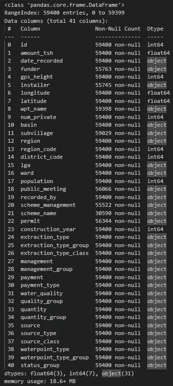
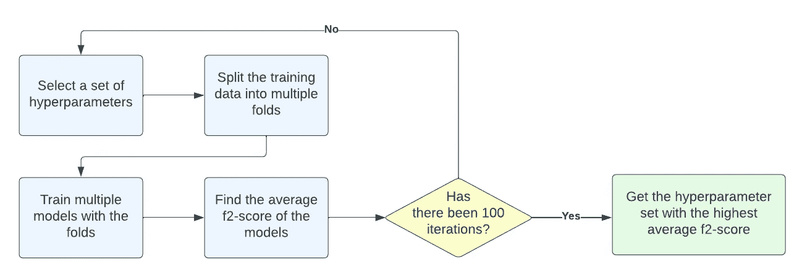

# 使用 XGBoost 预测水泵的功能性

> 原文：[`towardsdatascience.com/predicting-the-functionality-of-water-pumps-with-xgboost-8768b07ac7bb`](https://towardsdatascience.com/predicting-the-functionality-of-water-pumps-with-xgboost-8768b07ac7bb)

## 一个从“数据挖掘水表”竞赛中获得灵感的端到端机器学习项目

 [Aashish Nair](https://medium.com/@aashishnair?source=post_page-----8768b07ac7bb--------------------------------)

·发表于 [Towards Data Science](https://towardsdatascience.com/?source=post_page-----8768b07ac7bb--------------------------------) ·10 分钟阅读·2023 年 6 月 1 日

--

图片由 Kelly 拍摄：[`www.pexels.com/photo/close-up-of-a-child-s-hands-catching-water-from-the-spout-of-a-water-pump-3030281/`](https://www.pexels.com/photo/close-up-of-a-child-s-hands-catching-water-from-the-spout-of-a-water-pump-3030281/)

## 目录

∘ 介绍

∘ 目标

∘ 工具/框架

∘ 探索性数据分析

∘ 特征工程

∘ 创建训练和测试数据集

∘ 确定评估指标

∘ 创建基线模型

∘ 数据建模方法

∘ 超参数调优方法

∘ XGBoost 模型

∘ CatBoost 模型

∘ LightGBM 模型

∘ 选择最佳模型

∘ 模型解释

∘ 模型部署

∘ 限制

∘ 结论

∘ 参考文献

## 介绍

> 注：此项目灵感来自 DrivenData 主办的[Pump it Up: 数据挖掘水表竞赛](https://www.drivendata.org/competitions/7/pump-it-up-data-mining-the-water-table/page/23/)。

坦桑尼亚目前面临严重的水危机，[28%的居民缺乏安全用水](https://water.org/our-impact/where-we-work/tanzania/#:~:text=Tanzania's%20water%20and%20sanitation%20crisis,safely%20managed%20household%20sanitation%20facilities.)。一种可行的解决办法是确保全国安装的水泵保持功能正常。

利用 Taarifa 提供的数据，这些数据来自坦桑尼亚水务部，有机会利用机器学习来检测不再功能或需要维修的水泵。

## 目标

本项目的目标是训练和部署一个机器学习模型，以预测水泵是否功能正常、无法运作或正常但需要维修。

## 工具/框架

本项目需要使用各种工具和框架。

便于数据分析和建模的脚本都使用 Python 编写。

数据预处理和特征工程使用 Pandas 和 Scikit Learn 模块完成。数据建模则结合了 Scikit Learn 和其他机器学习库进行。

最终模型被集成在一个使用 Streamlit 库构建的 Web 应用程序中。该应用程序随后通过 Heroku 进行部署。

为了更全面地了解项目的依赖关系，请访问[GitHub 仓库](https://github.com/anair123/Detecting-Faulty-Water-Pumps-With-Machine-Learning)。

## 探索性数据分析

进行探索性数据分析（EDA）将揭示数据集的组成、数据应经历的过程以及应该考虑的机器学习算法。

提供的数据包括 59400 个数据点和 41 个特征，其中包括目标标签。

41 个特征如下：

代码输出（作者创建）

> 注意：有关这些特征的详细信息，请访问[竞赛问题描述](https://www.drivendata.org/competitions/7/pump-it-up-data-mining-the-water-table/page/25/)。

`status_group`特征将作为项目的目标标签。它揭示了水泵是否正常运作、无法运作，或正常但需要维修。

如代码输出所示，数据主要由类别特征组成。

此外，许多特征报告了类似的信息。例如，`latitude`、`longitude`、`region`和`region_code`特征都显示了水泵的位置。包含所有这些特征是多余的，甚至可能会影响模型的性能。

此外，数据集中有几个特征存在缺失值。

缺失值（作者创建）

最终，目标标签中的值分布表明数据是不平衡的，其中“功能需要维修”类别的样本较少。

目标标签（作者创建）

## 特征工程

从 EDA 的结果可以看出，许多特征在建模之前需要移除或修改。

1.  **移除不相关的列**

`id`、`recorded_by`和`wpt_name`特征已被移除，因为它们对目标标签没有影响。

**2. 移除冗余列**

包含冗余信息的特征也应当被移除。这些特征包括：`subvillage`、`latitude`、`longitude`、`region_code`、`district_code`、`lga`、`ward`、`scheme_name`、`extraction_type`、`extraction_type_group`、`payment`、`water_quality`、`quantity`、`source`、`source_type`、`waterpoint_type` 和 `management`。

**3\. 创建“年龄”特征**

`construction_year` 和 `date_recorded` 特征与水泵的状态无关。然而，通过使用这两个特征，我们可以推导出水泵的“年龄”（即从建设开始的年数），以了解它们有多旧。

**2\. 移除弱预测变量**

最后，应移除与目标标签关系不够强的预测变量。

数值特征与目标标签之间的关系通过 ANOVA 进行评估。以下代码片段创建了一个图表，显示了每个特征的 p 值。

代码输出（作者创建）

类别特征与目标标签之间的关系通过卡方独立性检验进行评估。以下代码片段创建了一个图表，显示了每个特征的 p 值。

代码输出（作者创建）

在测试的数值特征和类别特征中，只有 `num_private` 特征因其高 p 值而被移除。

在特征选择过程后，数据集从 41 个特征缩减为 18 个特征。

## 创建训练集和测试集

原始数据集被分割为训练集和测试集，并采用分层抽样，以确保目标标签中的各组在每个划分中有相同的代表性。

## 确定评估指标

数据已为建模做好准备，但首先需要确定最适合该项目的评估指标。

为此，我们需要考虑最终用户的优先级。

作者创建

机器学习解决方案应通过检测非功能性或需要修理的水泵来提高获取清洁水的可及性。该解决方案还应通过正确识别不需要修理或更换的水泵来限制资金和资源的浪费。

值得注意的是，错误预测是非常不受欢迎的。

未能正确识别需要修理或更换的水泵（即假阴性）将减少清洁水的获取。依赖这些水泵的居民将无法用于农业和卫生目的，生活水平将下降。此外，建造水泵的政府和/或组织将失去声誉。

另一方面，未能正确识别功能正常的水泵（即假阳性）也是一种不理想的结果。这将导致将有限的资金和资源浪费在不需要修理或更换的水泵上。

鉴于假阳性和假阴性的巨大成本，机器学习模型应考虑精确度和召回率指标。然而，由于假阴性似乎更具后果，因此应更加重视提高召回率。

因此，用于项目的评估指标是 f2 分数指标，该指标考虑了精确度和召回率，但对召回率给予更大权重。

F2-score 公式

## 创建基线模型

基线将有助于为机器学习模型的结果提供背景。本项目将利用两个基线模型作为参考：一个哑分类器和一个逻辑回归。

哑分类器将始终对水泵的功能进行随机预测。

在对类别特征和缺失数据进行编码和填补后，将训练一个具有默认超参数的逻辑回归模型。

逻辑回归的作用是展示一个简单模型在现有数据上的表现。如果逻辑回归的表现不如哑分类器，则会表明数据存在问题。

代码输出（作者创建）

如输出所示，逻辑回归的 f2 分数明显高于哑分类器，这表明数据有足够的信号。

## 数据建模方法

构建模型的过程可以在以下流程图中呈现：

数据建模流程图（作者创建）

将用于项目的三种模型包括[Catboost 分类器](https://catboost.ai/en/docs/concepts/python-reference_catboostclassifier)、[LGBM 分类器](https://lightgbm.readthedocs.io/en/latest/pythonapi/lightgbm.LGBMClassifier.html)和[XGBoost 分类器](https://xgboost.readthedocs.io/en/stable/python/python_intro.html#training)。所有这些分类器都包含集成学习，非常适合处理不平衡的数据。此外，它们支持类别特征和/或缺失数据。

对于这些模型中的每一个，都确定了最佳超参数集。然后使用这些超参数训练模型，并用测试集进行评估。

一旦每个模型都经过测试，最终将选择最佳模型（即 f-2 分数最高的模型）。该模型将用于网络应用程序。

## 超参数调整方法

超参数调整方法本身包含许多关键技术，因此值得通过另一个流程图进行详细说明。

超参数调优流程图（作者创建）

超参数调优将使用 Optuna 库执行。

该过程包括创建一个 Optuna 研究。在每个研究中，分类器使用 100 个超参数集进行训练和评估。每个超参数集都通过分层交叉验证进行评估，该方法将训练数据分成多个折叠，每个折叠用来训练一个模型。

每个超参数集将通过训练模型的平均 f-2 分数来衡量。产生最高 f-2 分数的超参数集将被认为是最佳超参数集。

## XGBoost 模型

为了展示对分类器进行的数据建模和超参数调优，以下代码片段展示了 XGBoost 的训练和评估过程。

首先，运行 Optuna 研究以找到 XGBoost 分类器的最佳超参数。

该研究将确定最佳超参数组合。这些超参数随后用于训练 XGBoost 分类器，然后在测试集上进行评估。

代码输出（作者创建）

## CatBoost 模型

使用 XGBoost 分类器的程序，对 CatBoost 分类器进行训练并在测试集上进行评估（有关整个代码库，请访问 [GitHub 仓库](https://github.com/anair123/Detecting-Faulty-Water-Pumps-With-Machine-Learning)）。

代码输出（作者创建）

## LightGBM 模型

使用 XGBoost 分类器的程序，对 LightGBM 分类器进行训练并在测试集上进行评估（有关整个代码库，请访问 [GitHub 仓库](https://github.com/anair123/Detecting-Faulty-Water-Pumps-With-Machine-Learning)）。

代码输出（作者创建）

## 选择最佳模型

所有模型的性能记录在下表中。

每个模型的性能（作者创建）

由于 XGBoost 分类器产生了最高的 f-2 分数（≈0.80），因此被认为是最佳模型。

## 模型解释

XGBoost 模型的性能可以通过分类报告和混淆矩阵进行背景说明，这些报告将预测值与实际值进行比较。

分类报告（作者创建）

混淆矩阵（作者创建）

如分类报告和混淆矩阵所示，功能性和非功能性水泵的精度和召回率相对较高。然而，该模型在功能正常但需要修理的水泵上的表现不佳。

## 模型部署

现在建模过程已完成，该模型应部署到一个可供最终用户访问的 Web 应用程序中。

该网页应用程序是使用 Streamlit 库构建的，文件名为 `app.py`。该文件的底层代码如下所示：

当使用 `streamlit run app.py` 命令运行时，应用程序应如下所示：

Streamlit 应用程序（由作者创建）

该应用程序包含一个侧边栏，用户可以在其中输入感兴趣的水泵参数。在点击“预测水泵状态”后，XGBoost 模型将预测具有选定特征的水泵是否功能正常、功能失效或功能正常但需要维修。结果会在应用程序中输出。

进行预测（由作者创建）

该网络应用程序也已通过 Heroku 托管，因此你可以通过点击下面的链接访问它：

[## Streamlit

### 预测水泵功能的 Streamlit 应用程序

water-pump-functionality-app.herokuapp.com](https://water-pump-functionality-app.herokuapp.com/?source=post_page-----8768b07ac7bb--------------------------------)

## 限制

尽管该项目已经产生了一个功能性网络应用程序，但它仍然存在值得注意的某些限制。

**1\. 没有现成的解决方案作为参考**

尽管所提出的解决方案确实使用户能够确定坦桑尼亚水泵的功能，但由于没有现成的解决方案可以作为参考，因此很难向客户推介。因此，很难确定此模型能节省多少资金以及它能在多大程度上改善水的可及性。

**2\. 约束条件知识有限**

项目在假设下进行，即假阴性（即将非功能水泵识别为功能正常）比假阳性（即将功能正常的水泵识别为非功能）更不可取。然而，只有在修理和更换水泵的资金和资源没有重大限制的情况下，这一假设才成立。

不幸的是，没有对这些约束条件的清晰理解，就无法确定最适合的机器学习模型评估指标。

**3\. 缺乏领域知识**

数据集中在分类特征中存在许多独特的值。然而，DrivenData 没有提供这些值代表的含义。因此，该项目缺乏基于证据的分类特征处理策略。

## 结论

图片由 [Alexas_Fotos](https://unsplash.com/@alexas_fotos?utm_source=medium&utm_medium=referral) 提供，来源于 [Unsplash](https://unsplash.com/?utm_source=medium&utm_medium=referral)

总体而言，该项目旨在利用 Taarifa 收集的数据训练一个预测水泵功能的机器学习模型，并将其纳入具有商业价值的应用程序中。

要访问整个代码库，请访问 GitHub 仓库：

 [## GitHub - anair123/Detecting-Faulty-Water-Pumps-With-Machine-Learning

### 目前无法执行该操作。您在另一个标签或窗口中已登录。您在另一个标签或…

github.com](https://github.com/anair123/Detecting-Faulty-Water-Pumps-With-Machine-Learning/tree/main?source=post_page-----8768b07ac7bb--------------------------------)

感谢您的阅读！

## 参考文献

Bull, P., Slavitt, I., & Lipstein, G. (2016 年 6 月 24 日). *利用群众的力量来提高社会部门的数据科学能力*。arXiv.org. [`arxiv.org/abs/1606.07781`](https://arxiv.org/abs/1606.07781)
