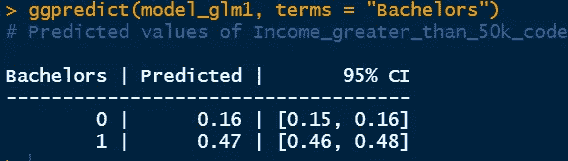

# 各种逻辑回归模型的预测（第一部分）

> 原文：[`towardsdatascience.com/prediction-in-various-logistic-regression-models-2543281cd55a`](https://towardsdatascience.com/prediction-in-various-logistic-regression-models-2543281cd55a)

## R 系列统计

 [Md Sohel Mahmood](https://mdsohel-mahmood.medium.com/?source=post_page-----2543281cd55a--------------------------------)

·发表于[Towards Data Science](https://towardsdatascience.com/?source=post_page-----2543281cd55a--------------------------------) ·阅读时间 8 分钟·2023 年 4 月 16 日

--

图片由[Jen Theodore](https://unsplash.com/@jentheodore?utm_source=unsplash&utm_medium=referral&utm_content=creditCopyText)拍摄，来源于[Unsplash](https://unsplash.com/photos/FaZD0xRotMk?utm_source=unsplash&utm_medium=referral&utm_content=creditCopyText)

> **介绍**

在之前的几篇文章中，我们已经涵盖了各种类型的逻辑回归模型。这些模型的目标是尽可能准确地预测未来的数据点以及中间数据点。在本文中，我们将讨论如何在 R 中进行预测分析，包括简单和多重逻辑回归，使用二分类和有序数据。

***数据集***

[成人数据集](https://archive.ics.uci.edu/ml/datasets/adult)将作为我们研究的一部分案例研究。该数据集中收集的数据包括超过 30,000 名个体的详细信息。数据包括每个人的种族、教育背景、职业、性别、工资、每周工作小时数、持有的工作数量以及他们的收入水平。

[成人数据集](https://archive.ics.uci.edu/ml/datasets/adult)来自 UCI 机器学习库

数据集简述：

+   *Bachelors*：1 表示该人拥有学士学位，0 表示该人没有学士学位。

+   *Income_greater_than_50k_code*：1 表示家庭总收入超过 50,000 美元，0 表示家庭总收入低于 50,000 美元。

+   *Marital_status_code*：1 表示该人已婚，0 表示该人未婚或离婚。

+   *Race_code*：1 表示非白人，2 表示白人。

> **用于二分类数据的简单逻辑回归预测**

我们将通过上述数据集来识别两个可以用于预测二元收入结果的变量，这些收入结果可以大于 $59K 或小于 $50K，利用教育水平和婚姻状况变量。 该研究提出了以下问题：

> 教育水平对收入的影响是什么？

要进行预测分析，首先需要安装*ggpredict*库。第一个命令将提供二元“学士学位”变量的预测概率。我们知道*Bachelors*变量可以有两个值：0 和 1。R 将为家庭收入（也是一个二元变量）提供大于 $50k 的概率。

第一个输出提供了预测收入概率的表格数据。在这里，如果**学士学位** = 1，则家庭收入大于 $50k 的概率变为 0.47，而如果没有学士学位，该概率降至 0.16。 这告诉我们教育对家庭收入有重要影响。

> **多重逻辑回归预测二元数据**

使用上述数据集，我们将采用两个预测变量：教育水平和婚姻状况，以预测二元收入结果，这些结果可以大于 $50K 或小于 $50k。这里的研究问题是：

> 教育水平和婚姻状况对收入的综合影响是什么？

使用二元数据进行多重逻辑回归的实现与下面的简单逻辑回归非常相似。

在这里，我们希望将婚姻状况作为另一个预测变量来预测家庭收入。使用类似的*ggpredict*命令，我们得到以下结果。

对于第二个有 2 个预测变量的模型，概率数据已经为另一个变量的均值进行了调整。这里我们有第二个预测变量为*Marital_status_code*，其均值为 0.47。 这告诉我们，数据集中有 47% 的人已婚，而 53% 的人要么未婚要么离婚。保持该值不变，如果一个人有学士学位，则家庭收入大于 $50k 的概率为 0.44。如果没有，则概率降至 0.17。

> **简单逻辑回归预测有序数据**

有时我们可能会有多于 2 个响应水平的结果变量，且该变量是有序的。我们数据集中家庭收入变量只有两个结果水平，但如果响应变量有超过 2 个结果，则可以遵循相同的方法。

回归模型的目的是对以下数据集中的问题提供定量解释：

> 教育水平、性别和种族对收入的个体影响是什么？

为了定义一个响应变量为有序的逻辑回归模型，我们可以使用*clm()*命令来自*ordinal*包。首先，我们需要将预测变量和响应变量转换为因子。这里响应变量有两个以上的类别，通常这个模型被称为比例奇数（PO）模型。

我们将使用相同的数据集来进行 PO 模型的预测。预测时，我们也将使用来自*ggeffects*库的*ggpredict()*命令。

首先预测*教育代码*为 5、10 和 13 的家庭收入是否大于$50k，这些代码分别代表 9 年级、高中毕业和博士学位。这里响应水平 1 表示家庭收入低于$50k 的群体，响应水平 2 表示家庭收入高于$50k 的群体。如果个人拥有 9 年级教育，那么家庭收入低于$50k 的概率是 0.98，家庭收入高于$50k 的概率是 0.02。如果个人拥有博士学位，家庭收入低于$50k 的概率是 0.35，家庭收入高于$50k 的概率是 0.65。因此，教育水平越高，家庭收入一般也越高。

如果我们使用“学士学位”作为预测变量进行相同的预测，我们观察到没有学士学位的个体家庭收入低于$50k 的概率是 0.84，家庭收入高于$50k 的概率是 0.16。

以“教育年限”作为预测变量，我们可以得出教育年限越长，获得高收入的概率越高。如果个体有 16 年的教育，家庭收入高于$50k 的概率是 0.69。值得注意的是，所有响应水平的概率总和等于 1。

> **多重逻辑回归在有序数据中的预测**

在有序逻辑回归中，预测变量可以是有序的、二元的或连续的，而响应变量是有序的。

考虑预测收入的例子，其中教育的等级只有两个响应级别。例如，要进行回归分析，我们可以从 1 年级到博士学位分配有序的数字。也可以使用二进制变量来预测收入。例如，我们可以将 1 分配给拥有学士学位的人，将 0 分配给没有学士学位的人。这有点像一个有两个级别的有序变量。最后，我们还可以使用连续变量如教育年限来预测收入。在这里，我们尝试定量回答以下问题。

> 教育水平、性别和种族对收入的综合影响是什么？

在第一个模型中，我们使用了所有三个预测变量来预测收入，结果如下所示。

收入水平分为两种（收入超过 50000 美元和收入低于 50000 美元），因此也有两个响应级别（如上图所示的红色）。在第二列中，你会发现每个教育水平的预测概率。教育水平为 3（5-6 年级）时，收入低于 50000 美元的概率为 0.99，而教育水平为 13（博士学位）时，收入低于 50000 美元的概率为 0.36。根据第二个响应级别的预测结果，可以得出相同的结论。因此，很明显家庭收入与教育水平有正相关关系。较高的教育水平与家庭收入的提高相关联。与往常一样，这些结果使用了其他两个变量*Gender_code*和*Race_code*的均值进行调整。

当在第二个*ggpredict*命令中包含性别时，我们得到以下结果。

现在我们有了性别和收入水平的 2 个层次，因此我们有了 4 个表格。如果一个人的性别代码为 1（女性），并且他们拥有博士学位（教育代码 13），那么他们预期收入超过 50000 美元的概率为 0.42；而如果这个人的性别代码为 2（男性），且他拥有博士学位，那么预期收入超过 50000 美元的概率为 0.74。换句话说，这表明女性在相同教育水平下没有得到与男性相等的薪酬。与往常一样，该模型只使用了*Race_code*的均值进行调整。

> **结论**

在这篇文章中，我们对二项和序数逻辑回归模型进行了预测分析，使用了单一和多个预测变量。我们涵盖了这四个模型中*ggpredict()*命令的使用，并且定量讨论了结果。作为提醒，模型的整体表现将取决于数据清理的程度。存在不必要的数据、重复的数据或错误的数据会导致模型结果误导。

> **数据集致谢**

[Dua, D. 和 Graff, C. (2019). UCI 机器学习库 [http://archive.ics.uci.edu/ml]. 加州欧文：加州大学信息与计算机科学学院。](https://archive.ics.uci.edu/ml/datasets/adult)

感谢阅读。

[阅读 Md Sohel Mahmood 的所有故事](https://mdsohel-mahmood.medium.com/subscribe)

[加入 medium](https://mdsohel-mahmood.medium.com/membership)
