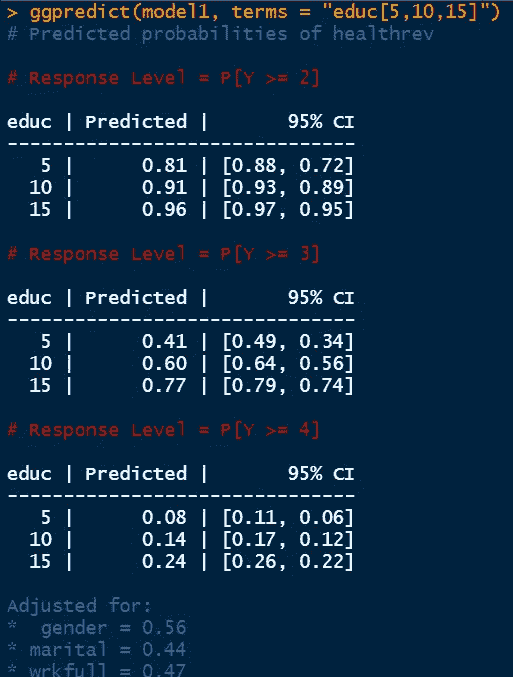
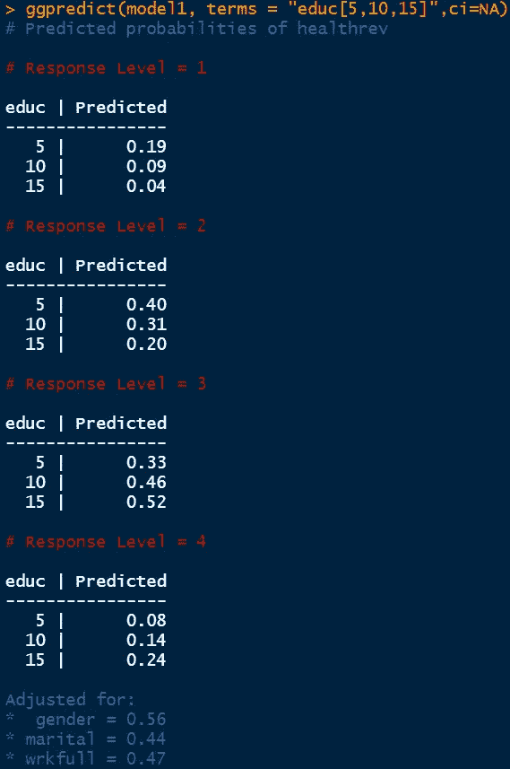
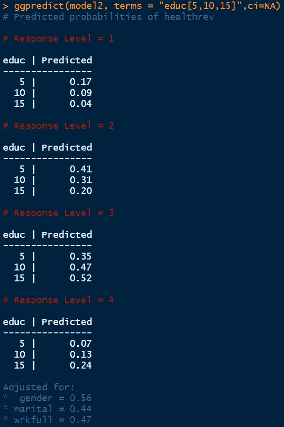
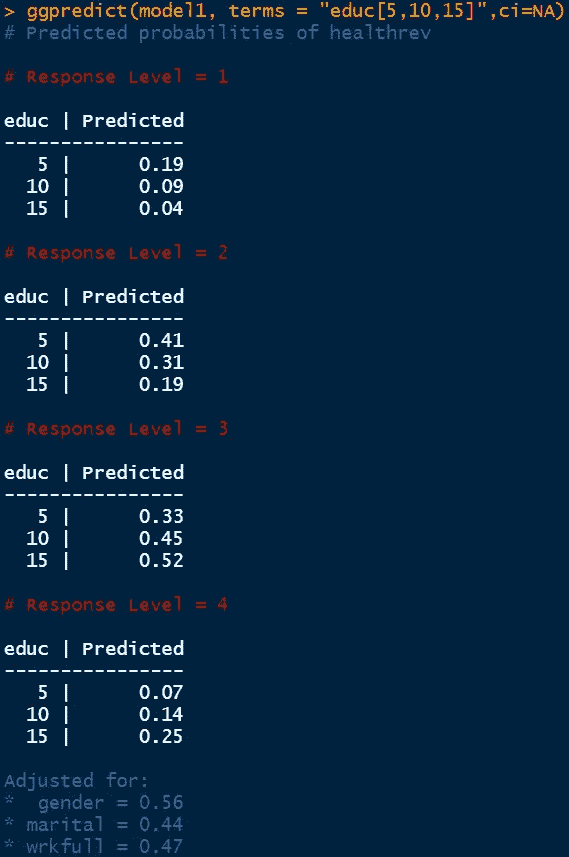
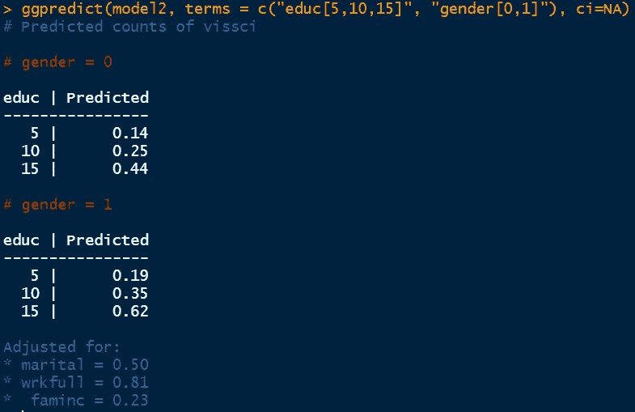

# 各种逻辑回归模型的预测（第二部分）

> 原文：[`towardsdatascience.com/prediction-in-various-logistic-regression-models-part-2-f8994e306a4c`](https://towardsdatascience.com/prediction-in-various-logistic-regression-models-part-2-f8994e306a4c)

## R 语言统计系列

 [Md Sohel Mahmood](https://mdsohel-mahmood.medium.com/?source=post_page-----f8994e306a4c--------------------------------)

·发布在[Towards Data Science](https://towardsdatascience.com/?source=post_page-----f8994e306a4c--------------------------------) ·阅读时长 8 分钟·2023 年 4 月 27 日

--

[Vladimir Fedotov](https://unsplash.com/@fedotov_vs?utm_source=unsplash&utm_medium=referral&utm_content=creditCopyText)拍摄，发布在[Unsplash](https://unsplash.com/backgrounds/colors/light?utm_source=unsplash&utm_medium=referral&utm_content=creditCopyText)

> **介绍**

我们已经涵盖了二元和有序数据的逻辑回归模型，并演示了如何在 R 语言中实现该模型。此外，使用 R 库的预测分析也在早期文章中讨论过。我们已经看到单一和多个预测变量对响应变量的影响，并对其进行了量化。我们采用了二元和有序响应变量，展示了如何处理不同类型的数据。在本文中，我们将探讨四种额外的逻辑回归模型预测分析，即广义有序回归模型、[部分比例奇数模型](https://medium.com/towards-data-science/partial-proportional-odd-model-in-r-dc5face36e40)、[多项逻辑回归](https://medium.com/towards-data-science/multinomial-logistic-regression-in-r-428d9bb7dc70)模型和[泊松回归](https://medium.com/towards-data-science/poisson-regression-in-r-957752266a34)模型。

> **数据集**

我们的研究将使用相同的[UCI 机器学习库的成人数据集](https://archive.ics.uci.edu/ml/datasets/adult)作为案例研究。该数据集中收集了超过 30000 名个体的人口统计数据。数据包括每个人的种族、教育、工作、性别、工资、持有的工作数量、每周工作小时数和收入。为了更好地理解，以下是所考虑的变量。

+   教育：数值型和连续型。个人的健康状况可以受到教育的重大影响。

+   婚姻状态：二元（0 代表未婚，1 代表已婚）。这个变量的影响可能会很小，但它仍然被纳入了分析中。

+   性别：二元（0 代表女性，1 代表男性）。它也有可能影响较小，但这值得关注。

+   家庭收入：二元（0 代表平均或低于平均，1 代表高于平均）。健康状况可能受到影响。

+   健康状态：有序（1 代表差，2 代表一般，3 代表良好，4 代表优秀）

> **广义有序回归模型中的预测**

考虑我们收集了数百个个体的数据。数据中包括有关个人的教育、年龄、婚姻状态、健康状态、性别、家庭收入和全职就业状态的信息。教育、性别、婚姻状态和家庭收入将作为回归模型中的预测变量。除了教育外，预测变量都是二元的，这意味着它们的值要么是 0，要么是 1。教育是一个连续变量，表示个人受教育的年限。以下变量被考虑用于此次回归分析。

+   教育年限

+   婚姻状态

+   性别

+   家庭收入

+   健康状态

如果我们执行有序逻辑回归并保持比例奇数假设，那么每个预测变量的系数值将为 1。假设家庭收入的系数为‘x’，这意味着每单位家庭收入增加（在这种情况下从 0 到 1），健康状态的更高类别的对数概率或对数赔率将增加‘x’。因此，我们可以得出关于此模型的以下结论。

1.  如果家庭收入增加到高于平均水平，从差健康状态变为平均健康状态的对数赔率是‘x’。

1.  如果家庭收入增加到高于平均水平，从一般健康状态变为良好健康状态的对数赔率是‘x’。

1.  如果家庭收入增加到高于平均水平，从良好健康状态变为优秀健康状态的对数赔率是‘x’。

比例奇数模型的特点是所有结果水平上的对数赔率相同。现实数据常常违反这一假设，因此我们不能使用比例奇数模型。如前所述，解决这一非比例奇数问题的两个可能解决方案是采用广义有序模型或部分比例奇数模型。

+   广义有序回归模型 -> 所有预测变量的所有级别的效果可能会有所不同

+   部分比例奇数模型 -> 所有/部分预测变量的某些级别的效果允许变化

我们已经在早期文章中实现了广义方法和部分比例奇数方法的模型。

 ## 广义有序回归模型在 R 中的应用

### R 语言中的统计系列

[towardsdatascience.com  ## 部分比例奇数模型在 R 中

### R 统计系列

[towardsdatascience.com

现在我们将使用这些模型实现预测过程。

在这里，我们可以看到提供的教育值下，不同健康状态的累计预测概率。我们知道我们的健康状态有四个独特的值。

如果个人有 15 年的教育，

+   健康一般及以上的累计概率是 96%

+   健康良好及以上的累计概率是 77%

+   健康优秀的累计概率是 24%

如果个人只有 5 年的教育，

+   健康一般及以上的累计概率是 81%

+   健康良好及以上的累计概率是 41%

+   健康优秀的累计概率是 8%

因此，很明显，教育年限在决定个人健康状态方面起着重要作用。如果我们只想获得预测概率，可以执行以下命令。

> `ggpredict(model1, terms = “educ[5,10,15]”,ci=NA)`

如果个人有 15 年的教育，

+   健康不良的概率是 4%

+   健康一般的概率是 20%

+   健康良好的概率是 52%

+   健康优秀的概率是 24%

如果个人只有 5 年的教育，

+   健康不良的概率是 19%

+   健康一般的概率是 40%

+   健康良好的概率是 33%

+   健康优秀的概率是 8%

显然，教育年限增加了拥有更好健康的概率。所有这些值都已针对婚姻状况、性别和全职工作状态的均值进行了调整。

> **部分比例奇数模型中的预测**

在部分比例奇数模型中，我们可以选择希望不同结果水平的效应变化的预测变量。我们可以首先确定哪些预测变量违反了比例奇数假设，然后将这些变量放在*parallel = FALSE ~* 命令之后。这里，我们将婚姻状况和家庭收入作为违反假设的预测变量。

如果个人有 15 年的教育，

+   健康不良的概率是 4%

+   健康一般的概率是 20%

+   健康良好的概率是 52%

+   健康优秀的概率是 24%

如果个人只有 5 年的教育，

+   健康状况差的概率为 17%

+   健康状况一般的概率为 41%

+   健康良好的概率为 35%

+   健康状况优秀的概率为 7%

累积概率也可以使用之前描述的方法计算。

> **多项回归模型中的预测**

我们在以下文章中介绍了多项逻辑回归分析。

 ## R 中的多项逻辑回归

### R 中的统计系列

[towardsdatascience.com

多项回归是一种统计方法，用于估计个体落入特定类别的可能性，相对于基准类别，利用对数几率或对数几率比的方法。实质上，当名义响应变量有多个结果时，它作为二项分布的扩展来工作。作为多项回归的一部分，我们需要定义一个参考类别，模型将基于参考类别确定各种二项分布参数。

在以下代码中，我们定义了健康状态的第一个级别作为参考水平，我们将基于这个参考水平比较多个二项回归模型。

我们的预测方法得出了以下结果。

如果个体接受了 15 年的教育，

+   健康状况差的概率为 4%

+   健康状况一般的概率为 19%

+   健康状况良好的概率为 52%

+   健康状况优秀的概率为 25%

再次，这些预测的概率是在保持其他预测变量均值的情况下计算的。在多项逻辑回归中，响应变量应为名义变量。然而，这里的响应被转换为序数变量以使用*ggpredict()*命令。

> **泊松回归模型中的预测**

有时我们需要处理涉及计数的数据。为了对计数响应变量建模，例如博物馆访问次数，我们需要使用泊松回归。到医院的访问次数或特定学生群体修读的数学课程数量也可以作为示例。我们在以下文章中介绍了泊松回归。

 ## R 中的泊松回归

### R 中的统计系列

[towardsdatascience.com

我们将使用相同的数据集，预测从教育年限、性别、婚姻状况、全职工作状态和家庭收入中得出的科学博物馆访问次数。代码块如下所示。

使用相同的*ggpredict()*命令，我们获得了不同教育年限以及不同性别的以下结果。

+   如果个体是女性（性别=0）且教育年限为 15 年，则预测的科学博物馆访问次数为 0.44。

+   如果个体是男性（性别=1）且教育年限为 15 年，则预测的科学博物馆访问次数为 0.62。

+   这表明女性访问科学博物馆的频率低于男性。结论已针对婚姻状况、全职工作状况和家庭收入的均值进行调整。

> **结论**

在这篇文章中，我们覆盖了四种不同类型回归模型的预测分析。部分比例奇数模型可以视为广义序数回归模型的一个子集，因为 PPO 模型允许只有少数预测变量在不同层次上变化。多项式回归模型适用于类别没有顺序的名义响应变量。最后，泊松回归模型适合预测计数变量。我们展示了在所有四种回归模型中使用*ggpredict()*函数以及结果的解释。

> ***数据集致谢***

[Dua, D. 和 Graff, C. (2019). UCI 机器学习库 [http://archive.ics.uci.edu/ml]。加州欧文：加州大学信息与计算机科学学院（CC BY 4.0）](https://archive.ics.uci.edu/ml/datasets/adult)

感谢阅读。

 [## 使用我的推荐链接加入 Medium - Md Sohel Mahmood

### 阅读 Md Sohel Mahmood（以及 Medium 上的成千上万其他作者）的每一个故事。您的会员费直接...

mdsohel-mahmood.medium.com](https://mdsohel-mahmood.medium.com/membership?source=post_page-----f8994e306a4c--------------------------------)  [## 每当 Md Sohel Mahmood 发布文章时，您将收到电子邮件。

### 每当 Md Sohel Mahmood 发布文章时，您将收到电子邮件。通过注册，您将创建一个 Medium 账户（如果您还没有的话）...

mdsohel-mahmood.medium.com](https://mdsohel-mahmood.medium.com/subscribe?source=post_page-----f8994e306a4c--------------------------------)

[请请我喝咖啡](https://ko-fi.com/learningfromdata)
