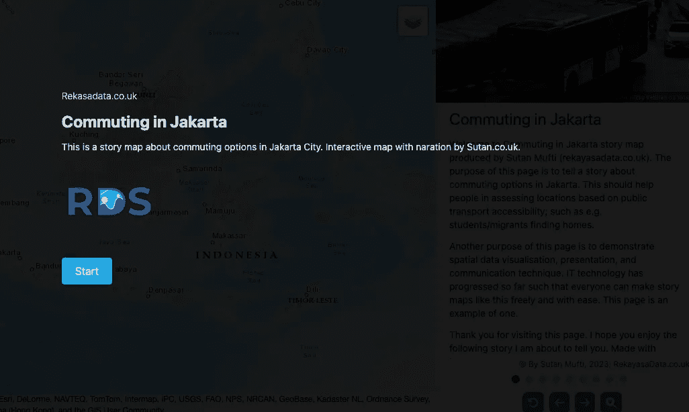

# 用故事地图互动地呈现空间数据 #2

> 原文：[`towardsdatascience.com/presenting-spatial-data-interactively-with-story-maps-2-17363598208f?source=collection_archive---------9-----------------------#2023-08-22`](https://towardsdatascience.com/presenting-spatial-data-interactively-with-story-maps-2-17363598208f?source=collection_archive---------9-----------------------#2023-08-22)

## 用互动地图讲述故事和见解

 [Sutan Mufti](https://sutan.co.uk/?source=post_page-----17363598208f--------------------------------)

·

[关注](https://medium.com/m/signin?actionUrl=https%3A%2F%2Fmedium.com%2F_%2Fsubscribe%2Fuser%2F6b3de0d6aa21&operation=register&redirect=https%3A%2F%2Ftowardsdatascience.com%2Fpresenting-spatial-data-interactively-with-story-maps-2-17363598208f&user=Sutan+Mufti&userId=6b3de0d6aa21&source=post_page-6b3de0d6aa21----17363598208f---------------------post_header-----------) 发表在 [Towards Data Science](https://towardsdatascience.com/?source=post_page-----17363598208f--------------------------------) ·7 分钟阅读·2023 年 8 月 22 日

--

自定义故事地图，作者为 Sutan.co.uk（作者，2023）

演示链接：

 [## 雅加达通勤故事地图

### 在雅加达的通勤故事，作者为 Sutan.co.uk。我们在雅加达如何通勤？使用 HTML、CSS 和 Javascript 来呈现……

jakarta.sutan.co.uk](https://jakarta.sutan.co.uk/?source=post_page-----17363598208f--------------------------------)

仓库链接：

 [## GitHub — sutanmufti/story-maps

### 通过在 GitHub 上创建账户，为 sutanmufti/story-maps 的开发做出贡献。

[github.com](https://github.com/sutanmufti/story-maps?source=post_page-----17363598208f--------------------------------)

之前的文章：

 ## 通过滚动交互式展示空间数据

### 用响应式地图讲述故事/见解。用地图讲故事！

[towardsdatascience.com

# 空间数据科学与制图

作为一名空间数据专家和数据科学家，我的工作是从（地理）空间数据中生成见解。当然，最终结果是将这些见解可视化，以便人们理解这些见解。这需要沟通技巧。虽然普通数据…
