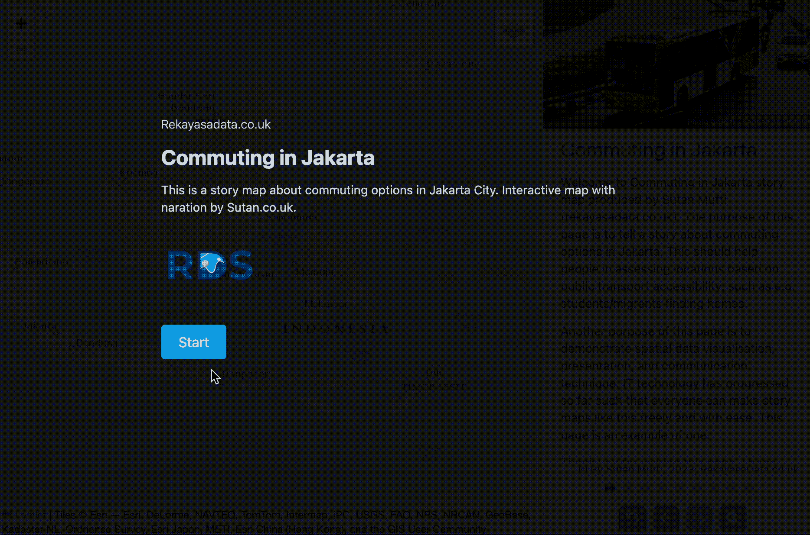
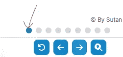
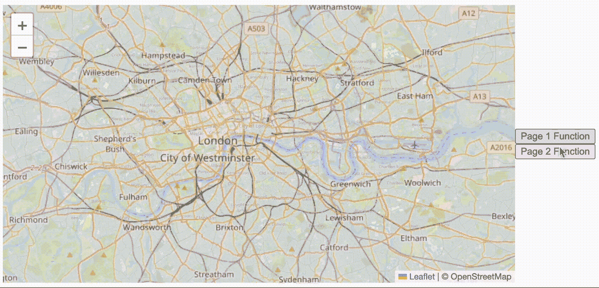
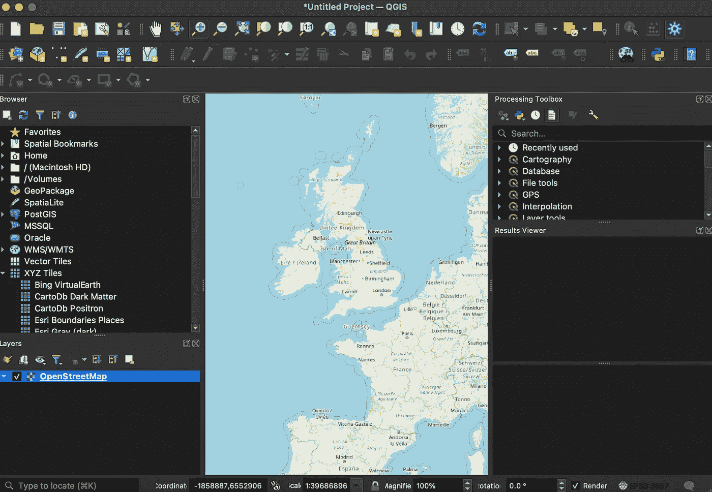
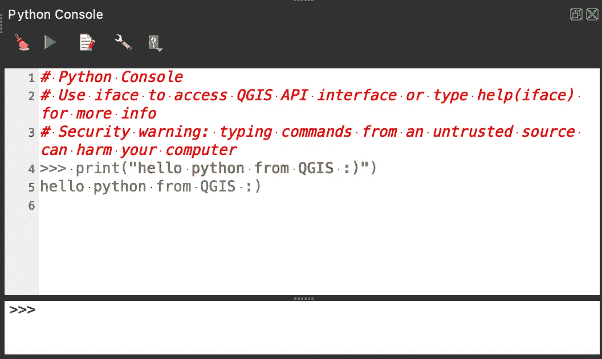

# 用故事地图互动展示空间数据 #2

> 原文：[`towardsdatascience.com/presenting-spatial-data-interactively-with-story-maps-2-17363598208f`](https://towardsdatascience.com/presenting-spatial-data-interactively-with-story-maps-2-17363598208f)

## 通过互动地图讲述故事和洞察

[](https://sutan.co.uk/?source=post_page-----17363598208f--------------------------------)[](https://towardsdatascience.com/?source=post_page-----17363598208f--------------------------------) [Sutan Mufti](https://sutan.co.uk/?source=post_page-----17363598208f--------------------------------)

·发表于 [Towards Data Science](https://towardsdatascience.com/?source=post_page-----17363598208f--------------------------------) ·7 分钟阅读·2023 年 8 月 22 日

--


由 Sutan.co.uk 定制的故事地图（作者，2023）

演示链接：

[](https://jakarta.sutan.co.uk/?source=post_page-----17363598208f--------------------------------) [## 雅加达通勤故事地图

### 由 Sutan.co.uk 提供的雅加达通勤故事。我们如何在雅加达通勤？使用 HTML、CSS 和 JavaScript 进行呈现…

jakarta.sutan.co.uk](https://jakarta.sutan.co.uk/?source=post_page-----17363598208f--------------------------------)

仓库链接：

[](https://github.com/sutanmufti/story-maps?source=post_page-----17363598208f--------------------------------) [## GitHub — sutanmufti/story-maps

### 通过在 GitHub 上创建账户来为 sutanmufti/story-maps 的开发做贡献。

github.com](https://github.com/sutanmufti/story-maps?source=post_page-----17363598208f--------------------------------)

相关文章：

[](/presenting-spatial-data-interactively-by-scrolling-502df345dea6?source=post_page-----17363598208f--------------------------------) ## 通过滚动互动展示空间数据

### 通过响应式地图讲述故事/洞察。用地图讲故事！

towardsdatascience.com

# 空间数据科学与制图

作为空间数据专家和数据科学家，我的工作是从（地理）空间数据中生成洞察。自然，最终的结果是将这些洞察可视化，以便人们理解这些洞察是什么。这需要沟通技巧。虽然普通的数据可视化围绕图表和图形展开，但空间数据可视化则围绕地图展开。制图师，负责制作地图的人员，本质上就是完成这项工作的人。

然而，我感觉“制图学”和“数据科学”之间的界限正在消退或融合。90 年代由 ESRI（环境系统研究所）推动的 GIS 的显著性，将信息技术整合到了制图学领域。这意味着地图不再是手工绘制的；相反，地图是基于你提供的表格绘制的。这是一个强大且新颖的范式！每个表格都可以通过一系列规则转换为地图。

> “我们对制图学的定义将其描述为‘地图制作的艺术、科学和技术’，这一定义展示了这一学科的广度。” — [英国制图学会](https://www.cartography.org.uk/careers)

什么使空间数据分析不同于数据分析？空间数据分析具有我称之为“空间属性”的东西；一个几何列。了解更多关于空间数据结构的信息，请参阅我的其他文章：

[](/spatial-data-science-data-structures-a00c484b8a00?source=post_page-----17363598208f--------------------------------) ## 空间数据科学：数据结构

### 空间数据表达指南

towardsdatascience.com

## 从静态地图到互动地图

在互联网出现之前，空间数据分析的输出是静态地图。然而，随着 IT 技术的进步，我们现代的互联网浏览器能够处理互动性。这利用了 Javascript，一种使网站具有互动性的编程语言。这也惠及了制图界；我们可以将地图呈现为互动网页。看看 Google Maps 或 Openstreetmap。

好消息是，在这个开源和现代环境中，每个人都可以访问构建这种互动地图的工具。

## 本文

我想分享如何制作带有互动地图的空间数据可视化。更确切地说，它是一个故事地图；一个与段落相关的逐页地图。我希望这能激励人们生成更多互动地图，并作为点燃新颖空间数据可视化创意的灯塔。

我不会深入讲解代码。然而，我会讨论使事物互动的基本理念，并突出代码片段。你可以在 GitHub 仓库 [这里](https://github.com/sutanmufti/story-maps) 查看代码。

请注意，我将讨论的范围限制在使用 Javascript 处理的互动性。我不会讨论使用 CSS 的样式和使用 HTML 的布局。



雅加达故事地图（来源：作者，2023）

# 引入 Javascript 的互动性

虽然 Python 主要用于 GIS、数据科学和空间数据科学，但我们使用 HTML、CSS 和 Javascript 开发网站。要了解更多关于这些语言及其在空间数据科学中角色的信息，请阅读我的其他文章。

## Spatial Data Science: Javascript & Python

### 从数据工程到全栈应用，你需要掌握的语言。入门以及精选学习资源……

towardsdatascience.com

你正在阅读的这篇文章的亮点是充分利用 JavaScript。处理用户输入或使我们的网站发生变化并活跃使用 JavaScript。

## 使用地图绘制库

我们不从零开始编码；使用模块/库是不可避免的。在地图绘制的情况下，经典的地图绘制库是 Leaflet（如前面文章中的链接所讨论的）。在上面的演示链接中，我使用 leaflet 来显示和动画化地图。

[## Leaflet - an open-source JavaScript library for interactive maps](https://leafletjs.com/index.html?source=post_page-----17363598208f--------------------------------)

### Leaflet 是一个现代的、轻量级的开源 JavaScript 库，用于移动友好的交互式地图。

[leafletjs.com](https://leafletjs.com/index.html?source=post_page-----17363598208f--------------------------------)

请注意，这并不是唯一的地图绘制库，例如，Openlayers、Google Maps Javascript API、ArcGIS Javascript API、Mapbox 等！但我喜欢 leaflet，因为它重量轻，非常简单，并且最有可能解决 80%的问题。此外，它们的文档也很直接，并附有示例。

# 技术理念

在跳入代码高亮之前，我想先讨论一下代码试图实现的思想。代码只是实现目的的工具；我们必须先了解目的，然后再进行编码。

## 每页地图

故事地图由包含相关地图的页面组成，以说明页面内容。每个页面通常具有不同的地图。这意味着当激活页面时（发出事件），会调用一个函数。这是人们在学习 JavaScript 时通常会学到的内容。



页面（来源：作者，2023 年）

这是每个页面按钮的最简单伪代码

```py
const pageButtonOne = document.querySelector('#pagebutton')
pageButtonOne.addEventListener('click',handlePageOne)

function handlePageOne(){
  // remove the map layers
  // adds the relevant layers
  // zoom to the view
} 
```

这就是处理事件（例如用户点击）的方式；每个按钮都有一个事件处理函数。Leaflet 中这样代码的一个简单示例可以在以下页面找到（[演示链接](https://jakarta.sutan.co.uk/pagebuttonexample)）：



页面响应性演示（来源：作者，2023 年）

[## story-maps/pagebuttonexample.html at main · sutanmufti/story-maps](https://github.com/sutanmufti/story-maps/blob/main/pagebuttonexample.html?source=post_page-----17363598208f--------------------------------)

### 通过在 GitHub 上创建账户，为 sutanmufti/story-maps 的开发做出贡献。

[github.com](https://github.com/sutanmufti/story-maps/blob/main/pagebuttonexample.html?source=post_page-----17363598208f--------------------------------)

实际的 Javascript 代码在以下代码块中：

```py
let map = L.map('map').setView([51.505, -0.09], 13);
L.tileLayer('https://tile.openstreetmap.org/{z}/{x}/{y}.png', {
    maxZoom: 19,
    attribution: '© OpenStreetMap'
}).addTo(map);

const pageone = document.getElementById('pageone')
const pagetwo = document.getElementById('pagetwo')

pageone.addEventListener('click', ()=>{
    map.flyTo([51.510, -0.08], 10);
    // add or remove layers
})

pagetwo.addEventListener('click', ()=>{
    map.flyTo([52.545, -0.091], 8);
    // add or remove layers,
    // or other animation functions that reponse to the interactions
})
```

上述代码捕获了“点击”事件并运行相应的箭头函数（这是一个 JavaScript 的特性）。

# 处理地理空间数据

一张地图由数据图层组成。每个“图层”是一个包含几何列的表。这就是我们显示地理空间数据的方式。我还有另一篇文章讨论空间数据结构。

## 空间数据科学：数据结构

### 一个阐述空间数据的指南

towardsdatascience.com

我用 QGIS 处理、分析、绘制和操作地理空间数据。它是一个免费开源软件，旨在向每个人提供 GIS（地理信息系统）访问权限。作为免费软件，它竟然如此强大，实在令人印象深刻！



QGIS 用户界面（来源：作者，2023）

你可以用 QGIS 做什么？你可以进行空间数据分析和生成地图图层。它可以连接到如 Postgresql 这样的企业数据库，并管理系统中的空间数据。然后，进行空间 SQL 并根据 SQL 分析生成图层。

## 空间数据科学：空间查询

### 用 SQL 回答每一个“哪里”问题；附示例

towardsdatascience.com

这些分析（无论是来自 QGIS 工具箱还是空间 SQL 分析）会导出为适当的格式；最有可能是 GeoJSON 格式。这是一种符合 GeoJSON 标准的 JSON 格式，用于标准化地理空间数据序列化。这确保了数据的互换属性，允许 ogr2ogr 或 Leaflet 等多种软件处理空间数据。

## 使用 Python 扩展

当你想确保可重复性时，你可以使用 Python 控制台并生成你的脚本。QGIS 的 API 使用起来非常直接，还有一个 [cook book](https://docs.qgis.org/3.28/en/docs/pyqgis_developer_cookbook/index.html)。



Python 控制台（QGIS）

## 将 GeoJSON 与 Leaflet 集成

这些输出然后被添加到 leaflet 中，如下代码所示。对每个图层都要这样做。

```py
async function loadGeojsonToMap(){
  // using http request to obtain the geojson file from qgis
  const resp = await fetch('./data.geojson')
  const geojsonfeature = await resp.json()

  const mapLayer = L.geoJSON(geojsonFeature)

  mapLayer.addTo(map) // map was instanciated in the previous code block
  return mapLayer
}

const mapLayer = await loadGeojsonToMap();
```

# 结论

制图是视觉艺术和数据科学的产物。计算机技术的进步使得制图变得互动。这样的互动，如果设计得当，可以生成丰富插图的叙事，允许读者进行探索。首先，我们使用 QGIS 或其他 GIS 软件分析并生成图层。然后，我们通过 Leaflet（HTML、Javascript 和 CSS）提供分析结果。最棒的是，这完全免费，每个人都可以做到。你也可以做到这一点。

如果你喜欢空间和网络数据科学内容，请关注我。我撰写与城市规划、基础设施发展和交通背景相关的高级空间数据分析内容。
