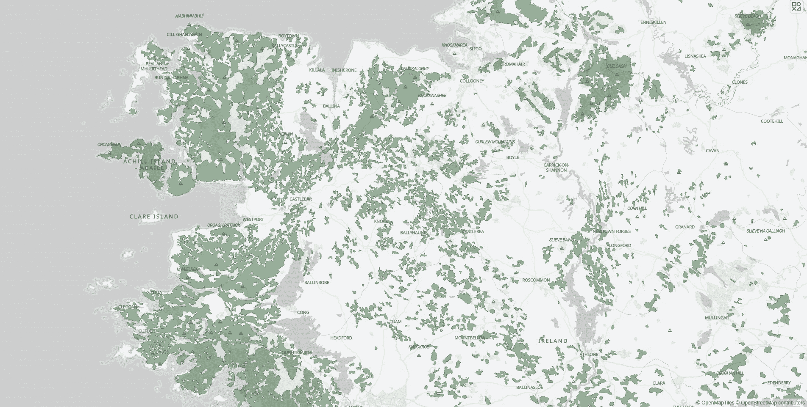

# 使用网页地图展示空间数据

> 原文：[`towardsdatascience.com/presenting-spatial-data-with-web-maps-4069c01e26ac?source=collection_archive---------4-----------------------#2023-08-15`](https://towardsdatascience.com/presenting-spatial-data-with-web-maps-4069c01e26ac?source=collection_archive---------4-----------------------#2023-08-15)

## 深入探讨地图瓦片、基础地图、地图层和矢量数据

 [Mary M](https://medium.com/@mm1718?source=post_page-----4069c01e26ac--------------------------------)

·

[关注](https://medium.com/m/signin?actionUrl=https%3A%2F%2Fmedium.com%2F_%2Fsubscribe%2Fuser%2Fb86005dffae1&operation=register&redirect=https%3A%2F%2Ftowardsdatascience.com%2Fpresenting-spatial-data-with-web-maps-4069c01e26ac&user=Mary+M&userId=b86005dffae1&source=post_page-b86005dffae1----4069c01e26ac---------------------post_header-----------) 发表在 [Towards Data Science](https://towardsdatascience.com/?source=post_page-----4069c01e26ac--------------------------------) ·15 分钟阅读·2023 年 8 月 15 日

--

爱尔兰西部历史泥炭沼泽地图，Corine 土地覆盖数据 2000

[`github.com/mmc1718/webmap-ireland`](https://github.com/mmc1718/webmap-ireland)

# 🗺 目录

+   **简介**

    - 网页地图的工作原理

+   **准备基础地图**

    - 创建矢量瓦片集

    - 识别所需的更改

    - 修改瓦片集

+   **基础地图样式设置** **-** 创建 JSON 样式文件

    - 服务样式化的地图瓦片

+   **创建网页地图** **-** 加载基础地图

    - 将数据叠加到地图上

制作地图有很多方法。我们可以使用桌面 GIS 软件如 QGIS 或 ArcGIS，网页框架如 Leaflet 或 Mapbox GL JS，或用传统的墨水和纸张来完成。

网络地图是展示空间数据的绝佳选择，因为它们易于分享且具有互动性。有很多工具可以使创建网络地图的过程变得简单，同时给予我们对地图不同元素的完全控制。

**我将全面讲解使用开源软件和开放数据源创建自己地图的过程**，包括如何使用**OpenStreetMap**和**Natural** **Earth** 数据创建自定义矢量底图，使用**Tileserver**提供瓦片，将底图加载到网页上，并在地图上叠加空间数据……
