# 使用网络地图展示空间数据

> 原文：[`towardsdatascience.com/presenting-spatial-data-with-web-maps-4069c01e26ac`](https://towardsdatascience.com/presenting-spatial-data-with-web-maps-4069c01e26ac)

## 深入探讨地图图块、基础地图、地图图层和矢量数据

[](https://medium.com/@mm1718?source=post_page-----4069c01e26ac--------------------------------)[](https://towardsdatascience.com/?source=post_page-----4069c01e26ac--------------------------------) [Mary M](https://medium.com/@mm1718?source=post_page-----4069c01e26ac--------------------------------)

·发布于 [Towards Data Science](https://towardsdatascience.com/?source=post_page-----4069c01e26ac--------------------------------) ·15 分钟阅读·2023 年 8 月 15 日

--


爱尔兰西部历史泥炭沼泽地图，Corine 土地覆盖数据 2000

[`github.com/mmc1718/webmap-ireland`](https://github.com/mmc1718/webmap-ireland)

# 🗺 内容

+   **简介**

    - 网络地图的工作原理

+   **准备基础地图**

    - 创建矢量图块集

    - 识别所需的更改

    - 修改图块集

+   **样式化基础地图** **-** 创建 JSON 样式文件

    - 提供样式化的地图图块

+   **创建网络地图** **-** 加载基础地图

    - 在地图上叠加数据

制作地图的方式有很多种。我们可以使用桌面 GIS 软件，如 QGIS 或 ArcGIS，使用 Web 框架，如 Leaflet 或 Mapbox GL JS，或者使用传统的墨水和纸张来完成。

网络地图是展示空间数据的绝佳选择，因为它们易于分享且具有互动性。现在有许多工具可以使创建网络地图的过程变得简单，同时让我们完全控制地图的各个元素。

**我将介绍使用开源软件和开放数据源创建您自己的地图的完整过程**，包括如何使用**OpenStreetMap**和**Natural** **Earth**数据创建自定义矢量基础地图，使用**Tileserver**提供图块，将基础地图加载到网页上，并使用**Maplibre**在地图上叠加空间数据。

作为示例，我将创建一个展示十年期间泥炭沼泽损失的爱尔兰泥炭沼泽地图。我已准备好来自 Corine 土地覆盖清单的数据，使其可以在网络地图上显示。最终结果将是一个在浏览器中可查看的美观的爱尔兰沼泽地图。

你可以在这里查看已部署的最终地图版本: [`marymcguire.dev/ireland-bog-map`](https://marymcguire.dev/ireland-bog-map.html)

这个项目的代码库可以在[这里](https://github.com/mmc1718/webmap-ireland)找到：

[](https://github.com/mmc1718/webmap-ireland?source=post_page-----4069c01e26ac--------------------------------) [## GitHub - mmc1718/webmap-ireland: 显示爱尔兰泥炭沼泽的网络地图

### 显示爱尔兰泥炭沼泽的网络地图。通过创建账户来为 mmc1718/webmap-ireland 的发展做贡献…

github.com](https://github.com/mmc1718/webmap-ireland?source=post_page-----4069c01e26ac--------------------------------)

Docker 将是这个项目的主要依赖，因此如果你还没有安装，你需要先安装它才能继续。假设你具有一些基本的 GIS 概念知识，基本的终端使用、读取 JSON 文件的能力，并能够跟随使用 JavaScript 和 HTML 的简单示例。

## 网络地图如何工作

数字地图由两个主要部分组成：基础地图和数据层。如果你还不熟悉网络地图，它们与此无异。

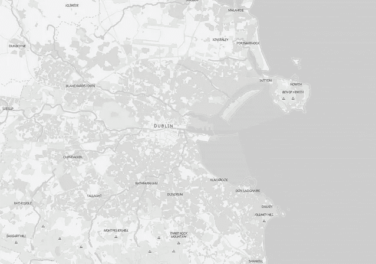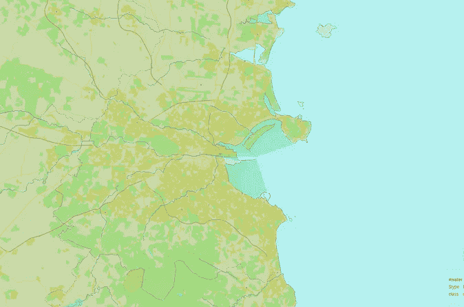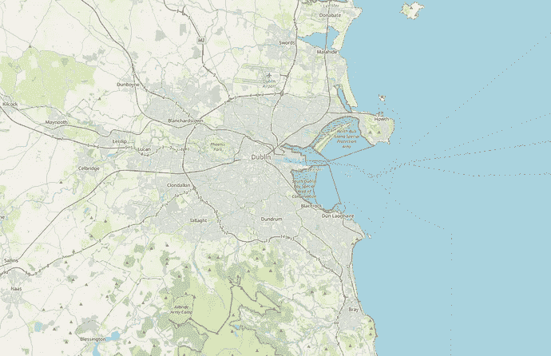

都柏林的三个网络地图视图，地图数据版权归 OpenStreetMap 所有

数据层通常是制作地图的根本原因。基础地图为我们提供了一个基础地图，以便我们在其上叠加数据。样式设计对基础地图很重要，以支持数据层而不分散注意力，并且对数据层也很重要，使数据可读并传达关于其价值的附加信息（较暗或较亮的颜色，或较大或较小的符号传达不同的意义）。

通常，网络基础地图以一组单独的地图瓦片的形式出现，这些瓦片拼接在一起形成一张地图。

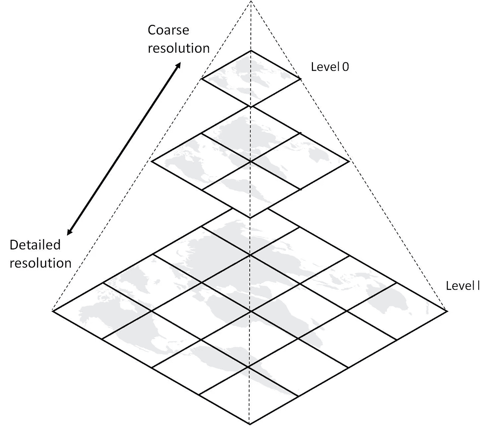

图示摘自**《空间数据基础设施的 Web 地图瓦片服务：管理与优化》**，该章节在 CC BY 许可证下发布，详细信息请参见[`www.intechopen.com/chapters/38302#F1`](https://www.intechopen.com/chapters/38302#F1)

重要的是，这些地图瓦片被分类为不同的缩放级别，这意味着完整的地图瓦片集实际上包括了许多版本的地图——每个缩放级别一个。当你在网络地图（或“滑动地图”）上放大或缩小时，地图特征会变得更加详细或不那么详细，有些特征只有在达到某些缩放级别时才会出现。在后台，页面会加载与当前查看的缩放级别和地图部分相对应的新瓦片。

将这些瓦片拼凑在一起，就形成了一个瓦片金字塔。我们将其视为金字塔，因为缩放级别越高，覆盖整个区域所需的瓦片就越多。[Maptiler 提供了一个很好的可视化图示](https://www.maptiler.com/google-maps-coordinates-tile-bounds-projection/#3/-46.28/26.66)，你可以在开始使用网络地图时参考。

在处理地理空间数据时，你可能听说过矢量数据和栅格数据之间的区别。地图切片也不例外；单个切片可以是矢量切片，通常是 .pbf 文件，也可以是栅格 (.png) 文件。

我将创建一个存储在 Mapbox 的 MBTiles 格式中的矢量切片集作为基础地图。我更喜欢矢量，因为它们提供了更多的灵活性。

# 准备基础地图

## 创建矢量切片集

第一步是创建基础地图切片集。有许多现成的基础地图可用，但我希望地图将重点放在爱尔兰岛上，排除大不列颠。这并不常见，因此我将制作自己的基础地图。

我使用[**Planetiler**](https://github.com/onthegomap/planetiler)来创建矢量切片基础地图。Planetiler 是一个创建矢量地图切片集的工具，速度非常快。甚至还有一个 Docker 镜像，这使得使用 Planetiler 生成完整的切片集变得简单。Planetiler 使用 OpenStreetMap 数据来创建地图切片，而对我来说，爱尔兰和北爱尔兰的数据提取已经可用。

运行以下命令将下载所需的数据，并使用 OpenMapTiles 架构作为默认值生成切片集：

```py
docker run --rm -v "$(pwd)/data":/data ghcr.io/onthegomap/planetiler:latest --download --area=ireland-and-northern-ireland --minzoom=4
```

注意 minzoom 参数设置为 4。这是因为我们的地图仅关注爱尔兰，所以不需要在爱尔兰过于小的非常低的缩放级别生成切片。缩放级别 4 是我们需要的最低级别，设置限制将节省切片生成时间。

Planetiler 完成的时间将根据你的硬件而有所不同，但可能需要一个小时或更长时间。让进程运行，等待的同时做些其他事情。

一旦切片完成，我们就可以查看它们。我使用[**Tileserver**](https://github.com/maptiler/tileserver-gl)来完成这项工作。同样，我们可以使用 Docker 来运行此步骤，从而节省时间。确保在与切片相同的目录中运行此命令，或者使用 mbtiles 的完整路径运行。

```py
docker run --rm -it -v $(pwd):/data -p 8080:8080 maptiler/tileserver-gl --mbtiles=./ireland_and_northern_ireland.mbtiles
```

我们的切片现在可以在 http://localhost:8080 上查看。

默认情况下，Tileserver 允许我们查看原始切片数据或使用基本样式的样式化切片。这对于检查我们的切片是否符合预期并识别任何问题非常有用。

即使原始数据没有样式，功能也会根据它们所在的数据层进行颜色编码，并且旁边有一个图例显示详细信息。这在样式化时需要特别注意。

## 确定所需的更改

查看切片数据揭示了切片本身存在的一个直接问题。

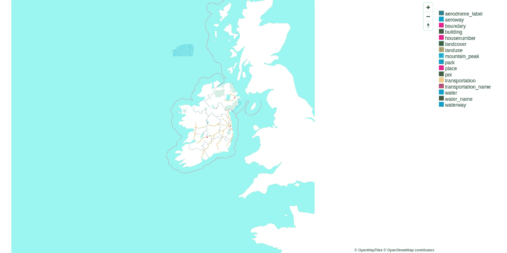

使用 Tileserver GL 查看未样式化的矢量切片集

尽管我们仅使用了爱尔兰和北爱尔兰的数据来生成地图，但大不列颠的轮廓仍然可见。这是因为 Planetiler 生成了填充水域的海洋多边形，使得陆地部分为空。我们看到的是大不列颠岛应在的位置的海洋空洞——如果你点击岛屿，你会发现没有特征，连陆地都没有。

我们该如何处理切割海洋效果？我们无法填补空洞，但对我们来说重要的是，我们可以对背景和陆地边界进行样式设置。通常这会通过给陆地周围的海洋设置样式来完成，以使背景填充陆地。我们需要反过来做，为爱尔兰岛包括一个陆地多边形，以对背景进行样式设置和对比。

在创建样式文件之前，需要做一些更改。首先，我们需要用额外的特征来补充数据——爱尔兰的陆地面积。

切片集还有一个稍微不那么明显的问题，但在放大时会看到。

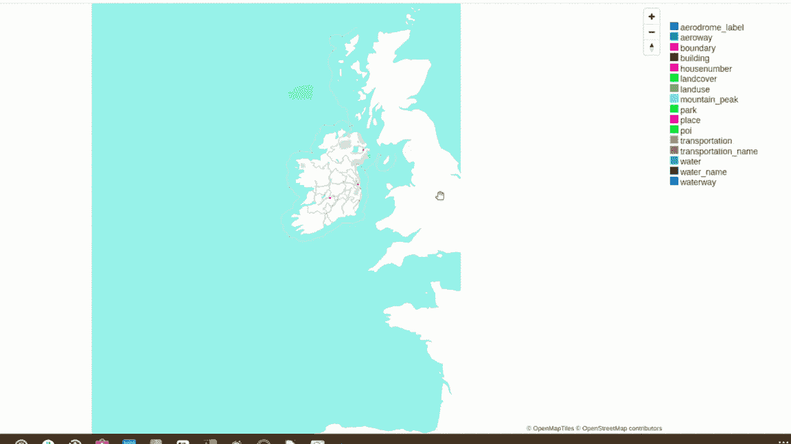

注意到县界（粉色）在缩放级别 4 之后消失。在缩放级别 1-4 之间，Planetiler OpenMapTiles 模式使用 Natural Earth 的数据而非 OSM 来生成地球的低分辨率地图。缩放级别 4 之后，使用的是 OpenStreetMap 的数据。由于我们从缩放级别 4 开始生成切片，这一点很明显。

由于 Planetiler OpenMapTiles 模式适用于整个星球，不可避免地在国家之间存在一些不一致性。爱尔兰县界被从 OSM 数据中过滤掉就是这些不一致性之一。我们的地图特别是关于爱尔兰的，因此我们希望把它做对。

除了不一致性外，县界在爱尔兰地图上是一个重要特征，我们希望在所有缩放级别中都包括它。

简单的解决方案是从缩放级别 4 开始，将 Natural Earth 的县界添加回切片集中。

## 修改切片集

[**Tippecanoe**](https://github.com/felt/tippecanoe) 是一个非常有用的工具，用于处理 MBTiles 切片集。它允许我们从 GeoJSON 数据创建 mbtiles，并将 MBtiles 文件合并在一起。我们只需要所需的额外数据（GeoJSON 格式），就可以将所需的特征合并到切片集中。

[](https://github.com/felt/tippecanoe?source=post_page-----4069c01e26ac--------------------------------) [## GitHub - felt/tippecanoe: 从大型 GeoJSON 特征集合中构建矢量切片集。

### 从大型 GeoJSON 特征集合中构建矢量切片集。- GitHub - felt/tippecanoe: 从大型 GeoJSON 特征集合中构建矢量切片集…

[**GitHub - felt/tippecanoe**](https://github.com/felt/tippecanoe?source=post_page-----4069c01e26ac--------------------------------)

为了获取表示爱尔兰的多边形——或更可能是多多边形，感谢其岛屿——我转向 OpenStreetMap，特别是[Overpass Turbo](https://overpass-turbo.eu/)。不立即清楚我们需要哪个特征（爱尔兰岛？爱尔兰和北爱尔兰？），因此需要一些探索。

通过在[openstreetmap.org](https://www.openstreetmap.org/)上使用‘查询特征’工具，我能够找到两个关系，当它们结合时，结果正是我所需要的特征。通过检查标签，我可以创建一个查询以供 Overpass 使用。

使用**Overpass Turbo**获取两个特征如下所示：

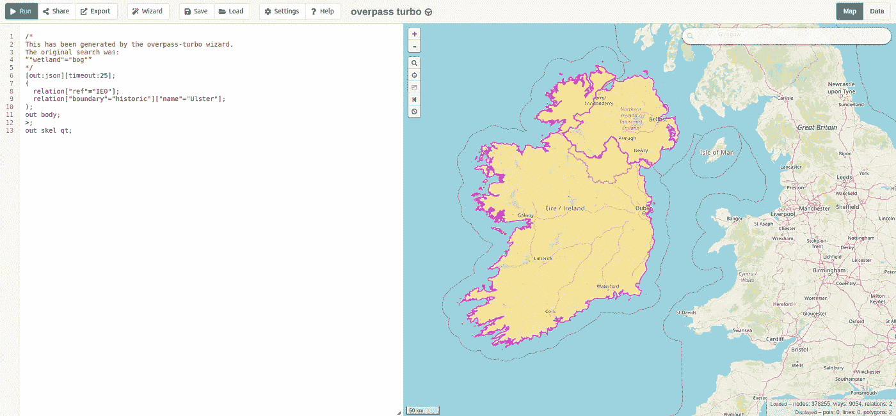

Overpass Turbo 的截图，显示了爱尔兰和阿尔斯特的关系

查询：

```py
[out:json][timeout:25];
(
  relation["ref"="IE0"];
  relation["boundary"="historic"]["name"="Ulster"];
);
out body;
>;
out skel qt;
```

导出按钮允许我们将结果保存为 GeoJSON 文件。剩下的就是合并这两个特征，以便得到一个 MultiPolygon。

县界线可以从[Natural Earth 网站](https://www.naturalearthdata.com/downloads/10m-cultural-vectors/)下载。实际上，Planetiler 已经为你下载了 Natural Earth 数据的副本，但由于我们只需要国家边界，单独下载此提取文件会更简单。文件名为*Admin 1 — States, Provinces*，下载链接如下：

[`www.naturalearthdata.com/http//www.naturalearthdata.com/download/10m/cultural/ne_10m_admin_1_states_provinces.zip`](https://www.naturalearthdata.com/http//www.naturalearthdata.com/download/10m/cultural/ne_10m_admin_1_states_provinces.zip)

你可以在这个项目的[GeoJSON 文件示例笔记本](https://github.com/mmc1718/webmap-ireland/blob/main/notebooks/ireland_outline_counties.ipynb)中找到准备两个 GeoJSON 文件的例子。

一旦 GeoJSON 文件准备好后，你可以从 GitHub 克隆[Tippecanoe repo](https://github.com/felt/tippecanoe)，并使用 Docker 构建镜像或从源代码安装（请参阅 README 获取说明）。我用于将数据合并到我的 tileset 中的命令如下：

```py
# convert the files to mbtiles
tippecanoe -o ireland_outline.mbtiles -f ireland.geojson
tippecanoe -o ireland_counties.mbtiles -f counties.geojson

# merge the mbtiles into the main tileset
tile-join -o "ireland_1.mbtiles" --name="OpenMapTiles" -pk -f ireland_and_northern_ireland.mbtiles ireland_outline.mbtiles
tile-join -o "ireland_final.mbtiles" --name="OpenMapTiles" -pk -f ireland_1.mbtiles ireland_counties.mbtiles
```

使用 Tileserver 预览合并新数据后的新图块时，我们注意到了一些变化。

提示：运行 Tileserver 时，请确保使用的是正确的 mbtiles 文件，即你使用 Tippecanoe 创建的文件。运行 Tileserver 时使用参数`--mbtiles`来指定文件。

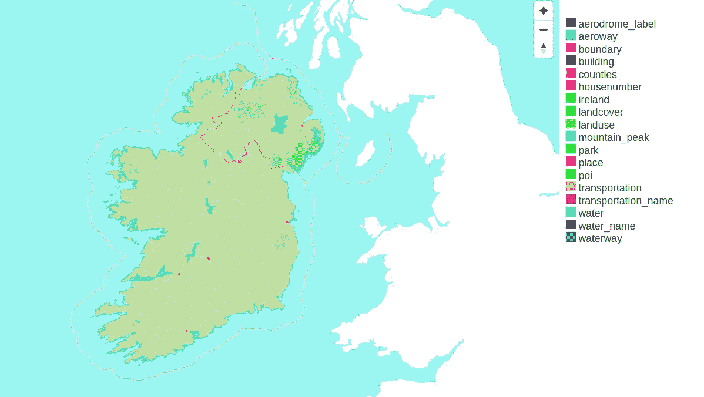

未样式化的矢量数据视图，包括爱尔兰和县界层

图例提供了一种快速验证我们新图层是否存在的方法。我们可以在这里看到两个新图层；‘ireland’和‘counties*’*。

# 样式化基础地图

## 创建 JSON 样式文件

现在我们已经准备好基础 tileset，准备开始样式化。当制作样式时，我选择突出自然特征如山脉，减少对如高速公路等人造基础设施的关注，以保持沼泽主题。

如果你对地图样式不熟悉，它们是包含有关如何样式化切片集中矢量数据的信息的 JSON 文档。 [**Maputnik**](https://maputnik.github.io/) 是一个样式编辑器，我们可以用来创建和编辑样式，它允许我们在工作时预览样式和原始数据。它是 Mapbox 样式编辑器的一个开源替代品，可以使用公开的 Docker 镜像运行。

[](https://github.com/maputnik/editor?source=post_page-----4069c01e26ac--------------------------------) [## GitHub - maputnik/editor: 一个开源的视觉编辑器，用于'Mapbox Style Specification'

### 一个开源的视觉编辑器，用于'Mapbox Style Specification' - GitHub - maputnik/editor: 一个开源的视觉…

github.com](https://github.com/maputnik/editor?source=post_page-----4069c01e26ac--------------------------------)

一旦 Maputnik 打开，打开一个空白样式。

首先，我们需要将其连接到我们的切片集。这是通过‘数据源’选项卡完成的。你需要复制你的 TileJSON 文件的链接 —— 使用 Tileserver 可以查看 —— 并将其粘贴到 `#OpenMapTiles` 活跃的数据源中。TileJSON 文件是一个包含有关你的切片集信息的 JSON 元数据文件，包括源 URL。

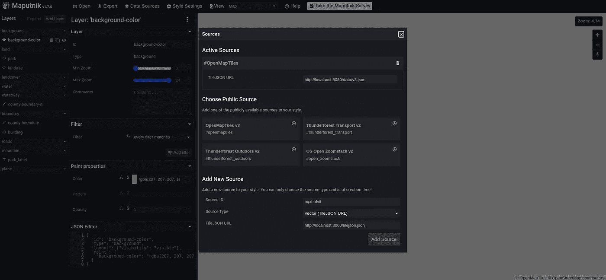

Maputnik 截图，显示了 Sources 窗口

如果一切正常，你应该能够将视图从‘地图’切换到‘检查’，并在屏幕上看到你的数据。数据将类似于使用 Tileserver 查看的原始数据。在你创建了一些样式图层之前，你的‘地图’视图将只显示一个空白屏幕。


在 Maputnik 中切换地图和检查视图

指定特征样式的方式是通过样式图层完成的。这些图层可以在 Maputnik 的侧边面板中编辑，并将被转换为我们最终样式 JSON 文件中的‘layers’字段中的 JSON 对象。点击‘添加图层’按钮开始操作。

第一个创建的图层通常是背景。之后，根据需要添加图层以定位不同的特征。注意图层的顺序会有所不同 —— 特征将根据样式顺序显示在彼此的上方或下方。

样式图层影响哪些特征取决于其源（特征所在的数据层，例如运输或土地使用）以及我们设置的过滤器。你可以在创建图层时指定这一点。

例如，我们可以过滤边界样式图层，以仅影响边界源图层中的陆地边界，通过使用 maritime 标签忽略海洋边界：

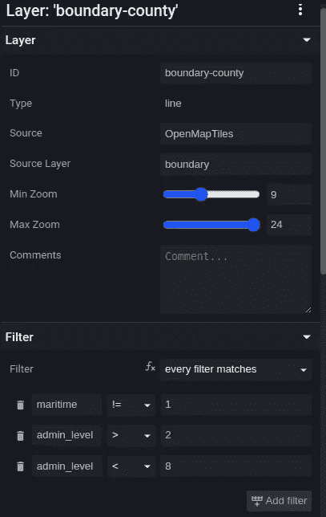

在 Maputnik 中查看的县界样式选项

在 JSON 中，这个字段最终变成如下：

```py
 "filter": [
    "all",
    ["!=", "maritime", 1],
    [">", "admin_level", 2],
    ["<", "admin_level", 8]
  ],
```

在底部的侧边面板中，你可以看到原始 JSON 的样子。

请注意，多个样式表可以影响相同的特征。这使得能够渲染相同特征的不同版本，例如一个点特征可以同时显示为标签和图像。

使用 Maputnik 创建的样式遵循 Mapbox 样式规范，因此如果有疑问，你可以 [查看文档](https://docs.mapbox.com/mapbox-gl-js/style-spec/)。

你可以在 [这里](https://github.com/mmc1718/webmap-ireland/blob/main/tileserver/styles/ireland.json) 查看我最终的样式。

在线有大量关于制图的提示信息。Esri 发布了 [一份在线资源列表](https://www.esri.com/arcgis-blog/products/product/mapping/favorite-tools-and-resources-for-cartographers/)，这是一个很好的起点。

请注意，我为样式添加了一个额外的远程字体和精灵（徽标或图像）源。这可以在 Maputnik 的源窗口中完成，我们在这里添加了我们的图块源。我使用的源是 `https://orangemug.github.io/font-glyphs/glyphs/{fontstack}/{range}.pbf` 用于字体和 `https://openmaptiles.github.io/osm-bright-gl-style/sprite` 用于精灵。（查看 Orange Mug 的自定义字体库 [`github.com/orangemug/font-glyphs`](https://github.com/orangemug/font-glyphs)）

## 提供样式地图图块

一旦你的样式准备好，从 Maputnik 下载它并保存在与你的 MBTiles 图块集相同的目录中。我们需要为 Tileserver 创建一个配置文件，以便在提供图块时它可以找到你的自定义样式。

创建一个名为 config.json 的新文件，并确保其包含如下内容。

```py
{
    "options": {
      "paths": {
        "root": "",
        "fonts": "/usr/src/app/node_modules/tileserver-gl-styles/fonts",
        "styles": "styles",
        "mbtiles": ""
      }
    },
    "styles": {
      "natural": {
        "style": "ireland.json",
        "tilejson": {
          "bounds": [
            -16.325684,
            47.960502,
            -5.053711,
            56.872996
          ]
        }
      }
    },
    "data": {
      "v3": {
        "mbtiles": "ireland.mbtiles"
      }
    }
  }
```

这个配置文件将加载一个名为 ireland.mbtiles 的 mbtiles 文件（使用在选项 -> 路径 -> mbtiles 下定义的路径）。Tileserver 将查找在样式目录（选项 -> 路径 -> styles）中名为 ireland.json 的样式文件来提供服务。请注意，字体、样式和 mbtiles 的路径假定是相对于根目录的。

在包含新配置文件的目录中重新启动 Tileserver 将使我们新的样式在 localhost:8080 上可供查看。

提示：如果你希望你的图块在 localhost 之外的地方可用，你需要在配置文件中包含‘domains’。详细信息请参见 [Tileserver 文档](https://tileserver.readthedocs.io/en/latest/config.html)。

# 创建 Web 地图

## 加载基础地图

我们已经有了基础地图和样式。现在剩下的就是将数据叠加到地图上。我有两个关于爱尔兰沼泽的数据文件。我准备数据的步骤可以在 [GitHub](https://github.com/mmc1718/webmap-ireland/tree/main/notebooks) 上查看。

我使用 [Maplibre](https://maplibre.org/) 来创建我的地图。Maplibre 是 Mapbox GL JS 的开源替代品，非常相似。我们可以直接在 HTML 文件中添加 JavaScript 脚本，或者使用 JavaScript 文件并导入它。

按照[Maplibre 文档](https://maplibre.org/maplibre-gl-js/docs/)中的示例，首先创建一个 HTML 文件。包含一个`<script>`标签，标签内的代码将使用新创建的自定义底图创建地图实例。

```py
 <div id="map"></div>
<script>

const map = new maplibregl.Map({
    container: "map",
    // stylesheet location
    style: "http://localhost:8080/styles/natural/style.json",
    center: [-8, 53], // starting position [lng, lat]
    zoom: 7, // starting zoom
    minZoom: 6,
    maxBounds: [
        [-17.7, 46.6],
        [2.7, 58.6],
    ],
});

</script>
```

注意，我在‘style’字段中包含了由 Tileserver 提供的样式文件链接。

设置边界意味着用户将无法将地图平移到定义的边界框坐标之外，这很有用，因为我们的数据仅限于地图上的一个小区域。默认情况下，可以平移整个世界，这在我们的情况下并不是我们想要的。可以使用这个方便的工具找到自定义边界：[`norbertrenner.de/osm/bbox.html`](https://norbertrenner.de/osm/bbox.html)。

要查看我们的页面，我们需要一个 Web 服务器。我使用[VSCode 的 Live Server](https://marketplace.visualstudio.com/items?itemName=ritwickdey.LiveServer) 扩展来快速查看开发中的网页。它可以免费安装，并且意味着你只需点击一下按钮即可提供 Web 应用。加载页面将显示我们的底图：

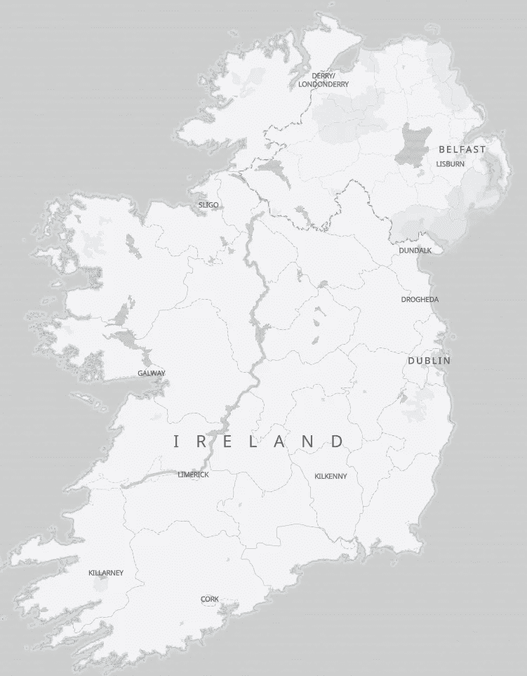

作者样式的爱尔兰底图

## 在地图上叠加数据

接下来，我们将数据图层添加到地图中。同样，Maplibre 网站提供了许多示例，涵盖了创建地图时可能遇到的各种场景。

要加载 GeoJSON 文件，我们首先需要将文件路径添加为源。定义文件源后，我们可以将具有样式选项的图层添加到地图上。这一切都在一个函数中完成，该函数在地图的“加载”事件触发时运行（这就是`map.on(“load" …)`的意思）。我将新函数命名为`setUpMap`并将其作为第二个参数传递给`map.on(“load")`。

```py
function setUpMap() {
  map.addSource("peat_bogs", {
      type: "geojson",
      data: "data/ireland_peat_bogs_2012.geojson",
  });
  map.addSource("lost_bogs", {
      type: "geojson",
      data: "data/peat_bog_loss.geojson",
      // required for smooth rendering while zooming
      tolerance: 0,
  });

  map.addLayer({
      id: "peat_bogs",
      type: "fill",
      source: "peat_bogs",
      paint: {
          "fill-color": "#92a94a",
          "fill-opacity": 0.4,
      },
  });

  map.addLayer({
      id: "lost_bogs",
      type: "fill",
      source: "lost_bogs",
      paint: {
          "fill-color": "#744333",
          "fill-opacity": 0.4,
      },
  })
};

map.on("load", setUpMap);
```

每个图层使用不同的颜色进行样式设置，并且稍微透明，以便基础地图中的地点标签和细节能够显示出来。我使用了[这个方便的工具](https://www.colorhexa.com/647433)来选择和比较颜色。

我还使用了一个名为 maplibre-gl-legend 的插件，插件可以在这里找到：[`github.com/watergis/maplibre-gl-legend`](https://github.com/watergis/maplibre-gl-legend)。以下代码定义了图例：

```py
 const legendInfo = {
      lost_bogs: "Lost Peat Bog (Derived from Corine Land Cover (CLC) 2000, Version 2020_20u1)",
      peat_bogs: "Peat Bog (Corine Land Cover (CLC) 2012, Version 2020_20u1)",
  };
  map.addControl(
      new MaplibreLegendControl.MaplibreLegendControl(legendInfo, {
          showDefault: true,
          showCheckbox: true,
          onlyRendered: false,
          reverseOrder: true,
          title: "Peat Bog loss in Ireland Between 2000 and 2012",
      }),
      "top-right"
  );j
```

图例还提供了一种方式，使我能够为数据源包含署名，而无需在其他地方添加这一内容。

查看最终结果，我们可以看到一个完整的沼泽地地图，附带互动图例：

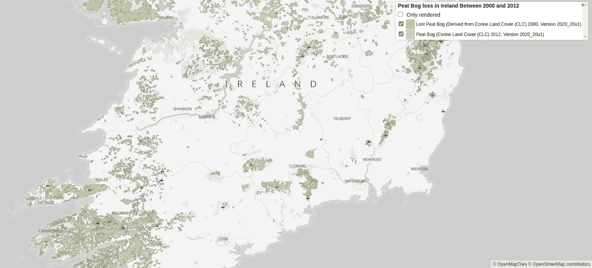

爱尔兰 2000–2012 年间泥炭沼泽损失的地图，附带图例

*感谢阅读！如果你觉得这篇文章有用，可以考虑点赞、关注作者或在 GitHub 上给项目加星👏*
