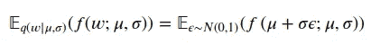

# 贝叶斯深度学习入门

> 原文：[`towardsdatascience.com/primer-on-bayesian-deep-learning-d06e0601c2ae`](https://towardsdatascience.com/primer-on-bayesian-deep-learning-d06e0601c2ae)

## 概率深度学习

 [Luís Roque](https://medium.com/@luisroque?source=post_page-----d06e0601c2ae--------------------------------)

·发表于 [Towards Data Science](https://towardsdatascience.com/?source=post_page-----d06e0601c2ae--------------------------------) ·阅读时间 8 分钟·2023 年 2 月 1 日

--

# 介绍

本文属于“概率深度学习”系列。该系列每周涵盖概率方法在深度学习中的应用。主要目标是扩展深度学习模型以量化不确定性，即了解它们不知道什么。

贝叶斯深度学习是一个新兴领域，它将深度学习的表达能力和表征能力与贝叶斯方法的不确定性建模能力相结合。这两种范式的整合提供了一个原则性框架，用于解决深度学习中的各种挑战，如过拟合、权重不确定性和模型比较。

在本文中，我们提供了对贝叶斯深度学习的全面介绍，涵盖其基础、方法论和最新进展。我们的目标是以清晰易懂的方式展示基本概念和思想，使其成为研究人员和实践者的理想资源，特别是那些对该领域较新的人员。

迄今为止已发布的文章：

1.  [TensorFlow 概率的温和介绍：分布对象](https://medium.com/towards-data-science/gentle-introduction-to-tensorflow-probability-distribution-objects-1bb6165abee1)

1.  [TensorFlow 概率的温和介绍：可训练参数](https://medium.com/towards-data-science/gentle-introduction-to-tensorflow-probability-trainable-parameters-5098ea4fed15)

1.  从头开始在 TensorFlow Probability 中进行最大似然估计

1.  从头开始在 TensorFlow 中进行概率线性回归

1.  [Tensorflow 中的概率回归与确定性回归](https://medium.com/towards-data-science/probabilistic-vs-deterministic-regression-with-tensorflow-85ef791beeef)

1.  [使用 Tensorflow 的频率主义与贝叶斯统计](https://medium.com/towards-data-science/frequentist-vs-bayesian-statistics-with-tensorflow-fbba2c6c9ae5)

1.  确定性与概率深度学习

1.  从头开始使用 TensorFlow 实现朴素贝叶斯

1.  [使用 TensorFlow 的概率逻辑回归](https://medium.com/towards-data-science/probabilistic-logistic-regression-with-tensorflow-73e18f0ddc48)

1.  贝叶斯深度学习

图 1：今日格言：层层深入 ([source](https://unsplash.com/photos/1fzR7q6GB6A))

# 确定性、概率性和贝叶斯深度学习

深度学习在计算机视觉、自然语言处理和游戏等多个应用领域取得了显著成功。尽管如此，传统的深度学习模型本质上是确定性的，并且在其预测中提供了有限的不确定性量化能力。为了解决这个问题，贝叶斯深度学习和概率深度学习作为重要范式出现，允许将不确定性融入深度学习模型中。

贝叶斯深度学习和概率深度学习代表了将不确定性融入深度学习模型的重要范式。这些方法相比传统的确定性深度学习具有若干优势，包括能够提供不确定性估计以及在存在数据分布外数据时进行稳健推理的能力。

在贝叶斯深度学习中，模型参数被视为随机变量，并对其施加先验分布。这个先验代表了关于模型参数的先验知识，例如它们的期望值或分布形状。然后，通过贝叶斯推理更新参数的后验分布，使用数据形成一个后验分布，这代表了我们在数据给定下对参数的更新信念。这将导致模型参数的分布以及模型预测中的不确定性度量。

概率深度学习则将数据生成过程建模为概率函数。给定一个输入，模型预测一个输出分布，从而允许量化预测中的不确定性。这种方法在输出空间复杂的问题中尤为有用，例如图像生成或语音合成。在这些情况下，将数据生成过程建模为概率函数可以捕捉数据中的复杂模式，并生成高质量的输出。

贝叶斯深度学习和概率深度学习都是重要且活跃的研究领域，最近在贝叶斯神经网络、变分推断和深度生成模型等技术方面取得了进展。尽管这些方法具有潜在的好处，但由于高维模型和深度学习中通常使用的大量数据所带来的计算和统计困难，这些方法仍然具有挑战性。尽管如此，近年来该领域已经取得了显著进展，贝叶斯深度学习和概率深度学习的未来研究充满了兴奋和潜力。

# 贝叶斯学习：概述

在这篇文章中，我们考虑了用于统计推断的贝叶斯框架，其中我们用符号𝑃表示概率密度。

贝叶斯方法提供了一种统一的统计推断方法，我们的目标是计算给定一些观察数据的模型参数分布。在神经网络的背景下，这对于估计权重参数的不确定性尤为有用，因为我们可以计算给定训练数据的这些参数的后验分布。这是通过应用贝叶斯定理实现的，该定理指出：

其中：

+   𝐷：观察数据，以𝑥和𝑦值对表示，例如 𝐷={(𝑥1,𝑦1),…,(𝑥𝑛,𝑦𝑛)}

+   𝑤：模型权重的值

+   𝑃(𝑤)：先验密度，表示在观察到数据之前对模型权重分布的初始信念

+   𝑃(𝐷|𝑤)：给定权重𝑤时观察到数据的似然

+   𝑃(𝑤|𝐷)：模型权重的后验密度，通过贝叶斯定理将观察到的数据和先验信念结合计算得出。

归一化项 ∫𝑃(𝐷|𝑤′)𝑃(𝑤′)d𝑤′=𝑃(𝐷) 是与𝑤无关的，用于归一化后验密度。

贝叶斯定理使我们能够将观察到的数据与我们的先验信念结合，以获得模型参数的后验分布，提供它们不确定性的概率表示。在神经网络背景下实施贝叶斯学习可能很具挑战性，因为计算归一化常数的复杂性。为了克服这一点，使用了各种近似方法，例如变分贝叶斯。这些方法旨在有效地估计神经网络权重的后验分布。

# 变分贝叶斯推断

在变分贝叶斯方法中，我们使用第二个函数来近似后验分布，这个函数称为变分后验。这个函数由一组参数来表征，记作𝜃，可以通过优化来学习。关键思想是选择一个变分后验的函数形式，使其能够有效地优化，以尽可能接近真实的后验分布。

一种常见的评估近似质量的方法是使用变分后验和真实后验之间的 Kullback-Leibler (KL) 散度。KL 散度是衡量两个概率分布之间差异的指标，当两个分布相等时，其值为 0。

给定观察数据 𝐷，变分后验 𝑞(𝑤|𝜃) 和真实后验 𝑃(𝑤|𝐷) 之间的 KL 散度定义为

当将观察数据视为常量时，我们可以将这个表达式简化为仅依赖于 𝜃 和 𝐷 的函数：

第一项测量变分分布和先验分布之间的差异，第二项是变分后验下的期望负对数似然。

这个函数，称为变分下界，可以针对 𝜃 进行优化，以获得对真实后验的最佳近似。优化可以使用基于梯度的方法进行，使变分贝叶斯能够扩展到大型复杂模型。

# 贝叶斯神经网络的反向传播方案

在这一部分，我们描述了一种用于贝叶斯神经网络的反向传播算法，允许我们将权重不确定性纳入模型。我们的方法涉及引入一个密度为 𝑞(𝑤|𝜃) 的变分后验，其中 𝑤 是网络中的一个权重，𝜃 是一组可训练的参数。这个后验表示了我们对真实权重后验的近似，真实权重后验由观察数据和我们对权重的先验信念（通过先验密度 𝑃(𝑤) 编码）决定。

我们的目标是更新变分后验，使其准确地逼近真实的权重后验，这一目标通过证据下界（ELBO）来量化。为此，我们最小化变分后验和先验之间的 ELBO，公式如下：

其中 𝐷 是训练数据。然而，这个表达式涉及对权重 𝑤 的积分，这可能在计算上不可行。为了解决这个难题，我们将 ELBO 重写为期望：

为了进行反向传播，我们需要对 *𝐿*(*𝜃*|*𝐷*) 关于 *𝜃* 进行求导。然而，这很具有挑战性，因为期望的底层分布依赖于 *𝜃*。我们通过重参数化技巧克服了这个问题，这使得我们能够通过期望进行求导。

# 重参数化技巧：贝叶斯神经网络中随机梯度优化的关键技术

重新参数化技巧是一种数学技术，用于优化具有随机参数的模型。其目标是将依赖变量𝑤转换为具有固定分布且与模型参数𝜃无关的随机变量𝜖。这种转换使得可以独立于𝜃计算𝑓(𝑤;𝜇,𝜎)对𝑞(𝑤|𝜇,𝜎)的期望，从而实现模型的高效优化。

例如，考虑一个高斯分布𝑞(𝑤|𝜇,𝜎)，其中𝜃=(𝜇,𝜎)。通过变量变换𝑤=𝜇+𝜎𝜖，其中𝜖∼𝑁(0,1)，我们得到

然后可以轻松计算关于𝜇和𝜎的导数，并通过蒙特卡罗采样来估计期望。

重新参数化技巧是贝叶斯神经网络中高效优化的关键工具，并且在现代深度学习研究中得到了广泛应用。它使得可以对具有随机参数的模型进行基于梯度的优化，从而实现高效的训练和推断。

# 最终连接

贝叶斯深度学习提供了一种将不确定性融入深度学习模型的框架。通过将神经网络权重视为随机变量，我们可以捕捉到内在不确定性和认识不确定性，从而提供更稳健和可靠的预测。变分贝叶斯推断提供了一种学习网络权重后验分布参数的方法，这些参数可以通过反向传播方案进行优化。

重新参数化技巧（reparameterization trick），这是贝叶斯神经网络中用于随机梯度优化的关键技术，使我们能够通过将随机变量转换为可微分的形式来有效地估计梯度。这一技巧使得可以使用标准的基于梯度的优化算法来学习网络权重后验分布的参数。

需要注意的是，尽管内在不确定性（aleatoric uncertainty）考虑了数据中的固有噪声，但认识不确定性（epistemic uncertainty）则捕捉了我们对基础模型知识的不了解。在贝叶斯深度学习中，认识不确定性通过对网络权重施加先验分布并通过变分推断过程用观察数据更新它来建模。这导致了一个更灵活和信息量更大的模型，因为网络可以适应新数据并融入有关基础关系的额外信息。

# 结论

总之，贝叶斯深度学习提供了一种将不确定性融入深度神经网络预测的框架。通过将网络权重视为随机变量并建模其后验分布，我们可以获得比传统确定性深度学习方法更稳健和信息量更大的模型。

重参数化技巧与基于梯度的优化算法相结合，使得深度模型中的可扩展贝叶斯推断成为可能。因此，贝叶斯深度学习受到越来越多的关注，并在包括主动学习、分布外检测和不确定性感知强化学习等各种应用中取得了成功。这个领域仍然相对较新，仍有很大的探索和创新空间。

在未来，我们期望贝叶斯深度学习在人工智能和机器学习的发展中扮演越来越重要的角色。

# 关于我

连续创业者和 AI 领域的领导者。我为企业开发 AI 产品，并投资于专注于 AI 的初创公司。

[创始人 @ ZAAI](http://zaai.ai) | [LinkedIn](https://www.linkedin.com/in/luisbrasroque/) | [X/Twitter](https://x.com/luisbrasroque)

# 参考资料

[1] — [Coursera: Deep Learning Specialization](https://www.coursera.org/specializations/deep-learning)

[2] — [Coursera: TensorFlow 2 for Deep Learning](https://www.coursera.org/specializations/tensorflow2-deeplearning) 专业化课程
