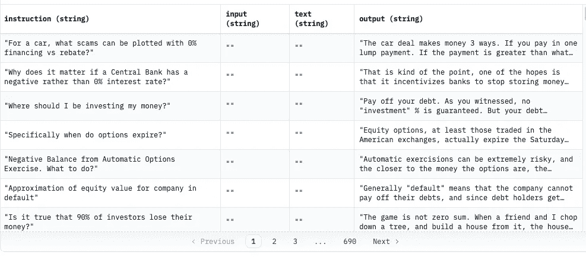
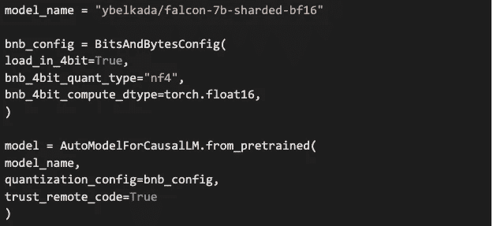
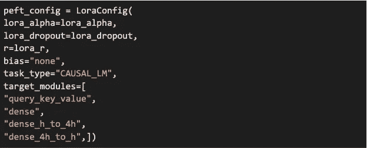
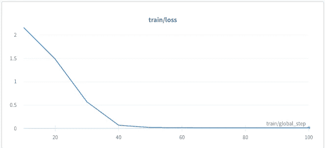

# 私有 GPT：在企业数据上微调 LLM

> 原文：[`towardsdatascience.com/private-gpt-fine-tune-llm-on-enterprise-data-7e663d808e6a`](https://towardsdatascience.com/private-gpt-fine-tune-llm-on-enterprise-data-7e663d808e6a)

## 用数据做一些酷炫的事情

[](https://priya-dwivedi.medium.com/?source=post_page-----7e663d808e6a--------------------------------)[](https://towardsdatascience.com/?source=post_page-----7e663d808e6a--------------------------------) [Priya Dwivedi](https://priya-dwivedi.medium.com/?source=post_page-----7e663d808e6a--------------------------------)

·发表于[数据科学前沿](https://towardsdatascience.com/?source=post_page-----7e663d808e6a--------------------------------) ·阅读时间 9 分钟·2023 年 7 月 5 日

--


照片由[Robynne Hu](https://unsplash.com/@robynnexy?utm_source=unsplash&utm_medium=referral&utm_content=creditCopyText)提供，来源于[Unsplash](https://unsplash.com/s/photos/technology?utm_source=unsplash&utm_medium=referral&utm_content=creditCopyText)

# **介绍**

在大数据和先进人工智能的时代，语言模型已成为能够处理和生成类人文本的强大工具。像 ChatGPT 这样的大型语言模型是能够在许多主题上进行对话的通用机器人。然而，LLM 也可以在特定领域的数据上进行微调，使它们在特定领域的企业问题上更加准确和切题。

许多行业和应用将需要经过微调的 LLM。原因包括：

+   从在特定数据上训练的聊天机器人中获得更好的性能

+   像 ChatGPT 这样的 OpenAI 模型是一个黑箱，公司可能会犹豫通过 API 分享他们的机密数据。

+   ChatGPT API 的费用对于大型应用程序可能会很高。

微调 LLM 的挑战在于该过程尚不明确，而且训练一个没有优化的十亿参数模型所需的计算资源可能非常昂贵。

幸运的是，很多关于训练技术的研究已经完成，这使我们现在能够在较小的 GPU 上微调 LLM。

在本博客中，我们将介绍一些用于微调 LLM 的技术。我们将使用 Colab GPU 在金融数据上训练[Falcon 7B 模型](https://huggingface.co/blog/falcon)！这里使用的技术是通用的，可以应用于其他更大的模型，如 MPT-7B 和 MPT-30B。

在[深度学习分析](https://deeplearninganalytics.org/)中，我们过去 6 年一直在构建定制的机器学习模型。如果你对为你的应用程序微调一个 LLM 感兴趣，[联系我们](https://deeplearninganalytics.org/contact-us/)。

# QLoRA

QLoRA，即“量化低秩适配”，呈现了一种结合量化和低秩适配的方法，以实现 AI 模型的高效微调。以下将详细解释这两个术语。

QLoRA 减少了微调 LLM 所需的内存，同时在性能上与标准的 16 位模型微调模型没有任何下降。这种方法使得 70 亿参数的模型可以在 16GB GPU 上微调，330 亿参数的模型可以在单个 24GB GPU 上微调，以及 650 亿参数的模型可以在单个 46GB GPU 上微调。

这意味着大多数公司现在可以以较小的成本拥有微调后的 LLM 或本地模型。

QLoRA 由两种技术组成：

1.  LoRA — 低秩适配

1.  量化

# LoRA

LoRA，即低秩适配器（LoRA），是小型可训练参数集，注入到 Transformer 架构的每一层中进行微调。在微调过程中，原始模型权重被冻结且未更新，这些注入的权重在微调时会更新。这大大减少了下游任务的可训练参数数量。在随机梯度下降期间，梯度通过被冻结的预训练模型权重传递到适配器。因此，只有这些具有小内存占用的适配器在训练过程中被更新。

# 量化

接下来，我们将讨论量化。要理解量化，首先需要了解通常用于存储模型权重的不同数据类型。

+   FP32 — 完整精度权重，占用 4 字节内存

+   FP16/BF16 — 半精度权重，占用 2 字节内存

+   INT8 — 数据类型包括一个 8 位表示，可以存储 2⁸ 个不同的值（在 [0, 255] 或 [-128, 127] 的范围内用于有符号整数）

+   FP8 和 FP4，分别代表浮点 8 位和 4 位精度。它们是小型浮点值家族的一部分。

使用量化，模型需要的内存比存储原始模型所需的内存要小得多。例如，一个 8 位量化模型只需原始模型大小的 1/4。

那么，如何将原始的 32 位权重存储在像 INT8 或 FP8 这样的 8 位数据类型中呢？

量化意味着将值从一种数据类型“舍入”到另一种数据类型。它通过将较大的值压缩到具有较少位数的数据类型中来工作，但会有少量的精度损失。

在 QLoRA 的情况下，模型权重存储在 4 位浮点数据类型中。但为了尽量减少总体精度损失，所有矩阵运算都在 16 位浮点中执行。计算完成后，权重会被存储/量化回来，然后再存储。

总结一下，QLORA 使用一种存储数据类型（通常是 4 位 NormalFloat）和一种计算数据类型（16 位 BrainFloat）。存储数据类型在进行前向和后向传递时被反量化为计算数据类型。权重仅在需要时才被解压，因此在训练和推理过程中内存使用保持低位。更多详细信息可以在这里找到。[4]

那么 QLoRA 微调的准确性影响如何？

QLoRA 调优在各种实验中显示出与 16 位微调方法相匹配的效果。此外，使用 QLoRA 微调 LLaMA 模型的 Guanaco 模型在[OpenAssistant 数据集（OASST1）](https://huggingface.co/datasets/OpenAssistant/oasst1)上是最先进的聊天机器人系统，并且在 Vicuna 基准测试中接近 ChatGPT。

# HuggingFace 对微调的支持

HuggingFace 发布了几个可以轻松微调 LLM 的库。

这些包括：

+   [PEFT 库](https://huggingface.co/blog/peft)：HuggingFace 发布了一个关于参数高效微调（PEFT）的库，该库支持 LORA。

+   量化支持——许多模型可以使用 bitsandbytes 模块以 8 位和 4 位精度加载。以 4 位加载模型的基本方法是调用 from_pretrained 方法时传递参数 load_in_4bit=True。

+   Accelerate 库——Accelerate 库具有许多功能，能够轻松减少模型的内存需求

+   [监督微调训练器](https://huggingface.co/docs/trl/main/en/sft_trainer#trl.SFTTrainer)——SFT 训练器是大规模 LLM 的监督微调训练类。

现在我们结合所有技术在金融数据集上训练 Falcon 7B 模型。

# **在 Alpaca Finance 数据集上训练 Falcon 7B**

我们成功地在 Google Colab 上微调了最近发布的 Falcon-7B 模型，使用[**Alpaca-Finance**](https://huggingface.co/datasets/gbharti/finance-alpaca)数据集。这个数据集包含了大约 70K 的金融数据点。这是一个开源数据，存储在 HuggingFace 数据集中心，并可以直接从中心加载。

数据是金融问题及其答案。数据快照如下：



Alpaca Finance 数据集。图片来源：作者

这个微调的代码可以在[这里](https://colab.research.google.com/drive/17Uyb3Q5_RwlpBqpk4XMRQmp7mfV9AdNE?authuser=2#scrollTo=mNnkgBq7Q3EU)查看。

首先，我们从 HuggingFace 加载一个预训练的 Falcon-7B 模型。我们使用 AutoModelForCausalLM，通常用于加载像 GPT 这样的自回归语言模型。注意，我们将存储类型设置为 4 位，将计算类型设置为 FP-16。



加载 Falcon 7B 模型的代码片段。图片来源：作者

现在，我们将创建 Adapters（记住！额外的层添加到 Transformers 模块中，将保存我们的微调权重）。我们将根据建议，将它们添加到线性层以及 Transformers 模块的查询值对中，以获得最佳的微调模型精度。下面可以在 target_modules 参数中注意到这一点。



PEFT 配置。图片由作者提供

最后，我们将整合一切，同时初始化 SFTTrainer 类。我们还会提供我们的数据、适当的令牌、格式化函数和 max_seq_length。

模型训练大约需要一个小时。我使用了 WandB 进行日志记录。更多细节请查看 Colab Notebook [这里](https://colab.research.google.com/drive/17Uyb3Q5_RwlpBqpk4XMRQmp7mfV9AdNE?authuser=2#scrollTo=pq5bgHt9vwvH)。

训练损失在 100 步后相当低。



训练损失 — 财务 Alpaca 数据集。图片由作者提供

# 使用 Alpaca Finance 数据集进行推理

Colab Notebook 还包含推理代码。我发现模型在回应问题时表现良好。对于我关于退休所需收入的问题，它有一个较长的生成。它涵盖了一些关于 401K 和其他养老金计划的经验法则。它强调了了解退休收入以给出答案的必要性，最后建议我咨询财务规划师！

响应不如 chatGPT 那样干净，但很高兴看到一个 7B 模型可以相对容易地训练和运行。

```py
### Instruction:
how do I figure out how much money I need to retire?
### Response:
There are a lot of assumptions embedded in any formula, so it's hard to say for
sure what you'll need per month, but some ideas to get started would be: 
around 80k per year if you have a very high net worth or 180k per year if you 
have a very low net worth. It sounds like your income is well above this number
, especially if you have a lot of assets. To really know though, you'll need
 to do a full financial analysis. There are several factors that aren't 
included in this equation, the most important being what kind of retirement
 plan you have. If you have a 401k, the rule of thumb is ~$60k per year will
 cover a typical retirement. If you have a pension, the rule of thumb is ~$10k
 per year will cover a pension. These are rough guidelines, and there are lots 
of other factors that go into it, such as whether you have another source of
 income, what kind of investments you have, etc. A financial planner should 
be able to help you with this. I will say that $150k per year is pretty high 
even if you have a lot of assets; the average American family makes less than
 $45k per year. If you don't have a retirement plan or your plan just isn't
 enough to support you in retirement, then yes, you should consider 
supplementing your income. However, before you make that decision, 
you need to be honest with yourself and ask if you live beyond the basic necessities. 
If you have the same quality of life that you had when you were making
 half of what you are now, then yeah, you might want to look at
```

我尝试的另一个问题是关于投资组合多样化的。再次，来自一个小模型的响应质量让我感到惊讶！

```py
### Instruction:
Why should portfolios be diversified?
### Response:
Because the performance of different assets is not identical.  Even if they are
 correctly classified as "equities" or "bonds", different stocks will behave
 differently under different economic conditions.  And even if you have the 
same general view of the market (eg, it's overvalued), you will do better 
if you own a broad basket of stocks rather than one that is too focused on 
either the rising or falling side.  Also, different markets interact with each
 other, and crises in one affect others.  If everyone rushes into safe havens
 in a panic, for instance, then those safe havens will rise and you'll lose
 money.  Conversely, if everyone thinks a bubble is about to burst, then you
 want to be buying up the shares before everyone else catches on and they
 start declining.  A single individual or small group can be right that the 
stock market is overvalued, but if everyone thinks that way, it's time to 
sell - and the sale will be greater the earlier you join it.  Also, some 
investments inherently involve more risk than others.  Gambling stocks, for
 instance, would probably be a bad idea during an industrywide gambling slump. 
 And some forms of investment, such as short
```

# 结论

在自定义数据集上微调 LLMs 变得更加容易，这可以让人们使用自己的“私有 GPT”模型。这些自定义模型可以在商业 GPU 上本地托管，并具有类似 ChatGPT 的界面。

[深度学习分析](http://deeplearninganalytics.org/)是一个值得信赖的定制机器学习模型提供商，适用于多种使用场景。我们拥有全球客户基础，与组织合作开发符合其独特需求的定制解决方案。如果您希望利用语言模型（LLMs）的力量进行应用，欢迎与我们联系。请通过 info@deeplearninganalytics.org 与我们的团队联系，探索更多可能性。我们期待进一步讨论您的项目。

# 参考文献

[1] [`huggingface.co/blog/falcon`](https://huggingface.co/blog/falcon)

[2] [`huggingface.co/blog/hf-bitsandbytes-integration`](https://huggingface.co/blog/hf-bitsandbytes-integration)

[3] [`huggingface.co/blog/peft`](https://huggingface.co/blog/peft)

[4] [`huggingface.co/blog/4bit-transformers-bitsandbytes#qlora-paper-a-new-way-of-democratizing-quantized-large-transformer-models`](https://huggingface.co/blog/4bit-transformers-bitsandbytes#qlora-paper-a-new-way-of-democratizing-quantized-large-transformer-models)

[5] [`www.promptengineering.org/exploring-qloras-potential-for-accessibility-and-innovation/`](https://www.promptengineering.org/exploring-qloras-potential-for-accessibility-and-innovation/)

[6] [`blog.gopenai.com/paper-review-qlora-efficient-finetuning-of-quantized-llms-a3c857cd0cca`](https://blog.gopenai.com/paper-review-qlora-efficient-finetuning-of-quantized-llms-a3c857cd0cca)

[7] QLoRA 论文 -: [`arxiv.org/abs/2305.14314`](https://arxiv.org/abs/2305.14314)

[8] LoRA 论文 -: [`arxiv.org/abs/2106.09685`](https://arxiv.org/abs/2106.09685)

[9] [`huggingface.co/docs/trl/main/en/sft_trainer`](https://huggingface.co/docs/trl/main/en/sft_trainer)
