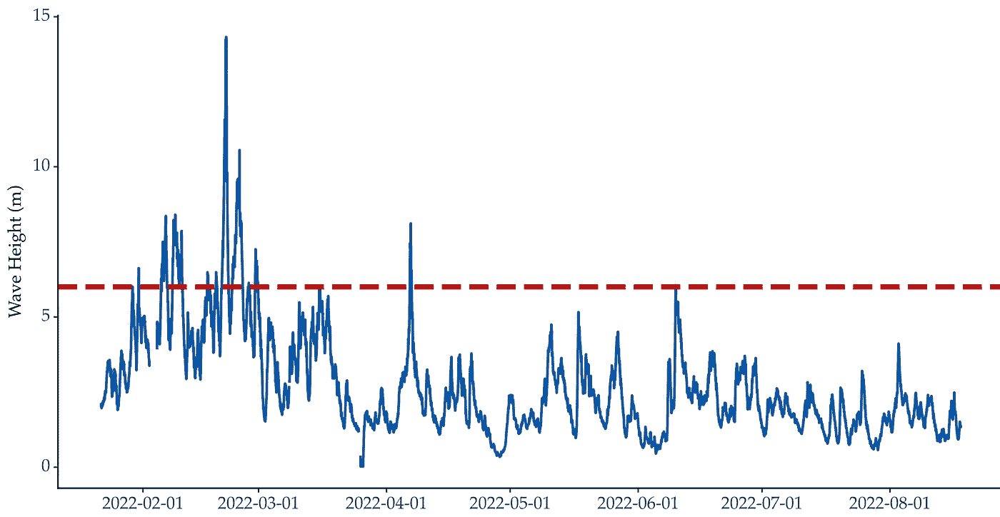
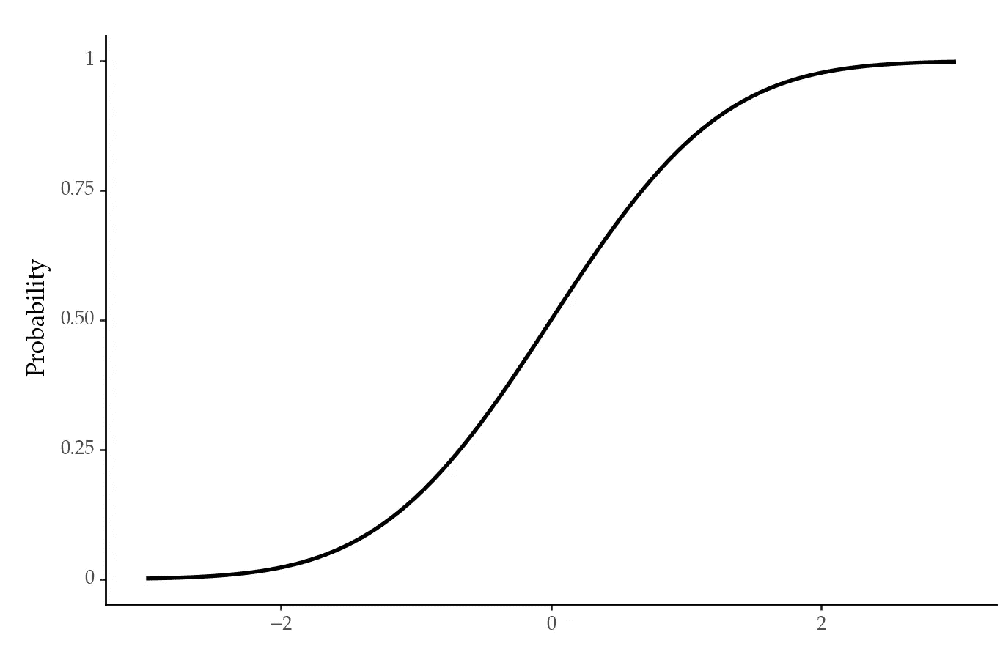
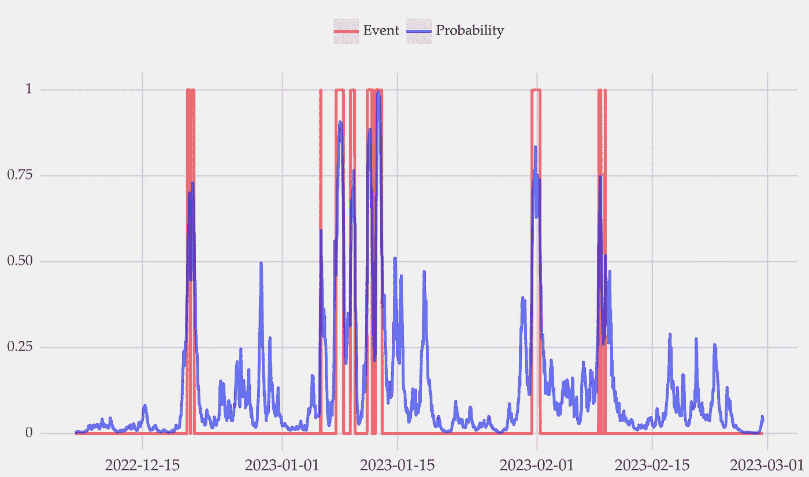

# 使用回归进行二元事件的概率预测

> 原文：[`towardsdatascience.com/probabilistic-forecasting-of-binary-events-using-regression-4f8a8022ec37`](https://towardsdatascience.com/probabilistic-forecasting-of-binary-events-using-regression-4f8a8022ec37)

## 使用累积分布函数预测极端值的概率

[](https://vcerq.medium.com/?source=post_page-----4f8a8022ec37--------------------------------)[](https://towardsdatascience.com/?source=post_page-----4f8a8022ec37--------------------------------) [Vitor Cerqueira](https://vcerq.medium.com/?source=post_page-----4f8a8022ec37--------------------------------)

·发布于[Towards Data Science](https://towardsdatascience.com/?source=post_page-----4f8a8022ec37--------------------------------) ·阅读时间 5 分钟·2023 年 3 月 8 日

--


图片由[Silas Baisch](https://unsplash.com/@silasbaisch?utm_source=medium&utm_medium=referral)提供，[Unsplash](https://unsplash.com/?utm_source=medium&utm_medium=referral)上的照片

在本文中，我们将探讨时间序列中二元事件的概率预测。目标是预测时间序列超过临界阈值的概率。

你将学习如何（以及为什么）使用回归模型来计算二元概率。

# 介绍

首先，为什么你会使用回归来计算二元概率而不是分类器？

二元事件的概率预测通常被视为分类问题。但回归方法可能更为合适，原因有两个：

1.  对点预测和事件概率的兴趣；

1.  超过阈值的变动。

## 对点预测和事件概率的兴趣

有时你可能想要预测未来观测值的数值以及相关事件的概率。

例如，在预测海洋波高的情况下。海洋波是一个有前景的清洁能源来源。短期点预测对于估算从这一来源可以生产多少能源非常重要。

但是，大浪可能会损坏波能转换器——这些设备将波能转换为电力。因此，预测波高超过临界阈值的概率也很重要。

因此，在预测海洋波高的情况下，最好使用一个模型来计算两种类型的预测。

## 超过阈值的变动

时间序列中的二元事件通常由[超越——当时间序列超过预定义阈值](https://medium.com/towards-data-science/an-introduction-to-exceedance-probability-forecasting-4c96c0e7772c)来定义。

在某些情况下，最合适的阈值可能会根据不同的因素或风险情况而改变。因此，用户可能会对估计不同阈值的超越概率感兴趣。

分类模型在训练过程中固定了阈值，在推断过程中不能更改。而回归模型则独立于阈值构建。因此，在推断过程中，你可以同时计算多个阈值的事件概率。

# 如何从预测中计算二元概率


照片由[Jamie O’Sullivan](https://unsplash.com/@imjamie?utm_source=medium&utm_medium=referral)拍摄，来源于[Unsplash](https://unsplash.com/?utm_source=medium&utm_medium=referral)

那么，你如何使用回归模型来估计二元事件的概率呢？

让我们继续讨论关于预测海洋波浪高度的示例。

## 数据集

我们将使用从爱尔兰海岸上的一个智能浮标收集的时间序列[1]。

```py
import pandas as pd

START_DATE = '2022-01-01'
URL = f'https://erddap.marine.ie/erddap/tabledap/IWaveBNetwork.csv?time%2CSignificantWaveHeight&time%3E={START_DATE}T00%3A00%3A00Z&station_id=%22AMETS%20Berth%20B%20Wave%20Buoy%22'

# reading data directly from erdap
data = pd.read_csv(URL, skiprows=[1], parse_dates=['time'])

# setting time to index and getting the target series
series = data.set_index('time')['SignificantWaveHeight']

# transforming data to hourly and from centimeters to meters
series_hourly = series.resample('H').mean() / 100
```



海洋波浪平均高度的每小时时间序列。水平虚线表示一个关键安全阈值。图像由作者提供。

## 超越概率预测

我们的目标是预测一个大波的概率，我们将其定义为超过 6 米的波浪。这个问题是超越概率预测的一个特定实例。

在[上一篇文章](https://medium.com/towards-data-science/an-introduction-to-exceedance-probability-forecasting-4c96c0e7772c)中，我们探讨了超越概率预测背后的主要挑战。通常，这个问题通过两种方法之一来解决：

1.  一个概率二元分类器；

1.  一个预测集成。概率是根据预测超过阈值的模型比例计算的。

在这里，你将了解第三种方法。这种方法基于一个预测模型，但不一定是一个集成模型。像 ARIMA 这样的模型也可以。

## 使用累积分布函数

假设预测模型做出了一个“*y*”的预测。然后，假设这个预测遵循均值为“*y*”的正态分布。当然，分布的选择取决于输入数据。在这里，我们为了简化，选择正态分布。在平稳性条件下，标准差（“*s*”）可以使用训练数据来估计。

在我们的示例中，“*y*”是模型预测的波浪高度。“*s*”是训练数据中波浪高度的标准差。

我们通过累积分布函数（CDF）得到二元概率预测。

什么是累积分布函数（CDF）？

当在值 *x* 上进行评估时，CDF 表示随机变量取小于或等于 *x* 的值的概率。我们可以取补充概率（1 减去该概率）来获得随机变量超越 *x* 的概率。



标准正态分布的累积分布函数。图片由作者提供。

在我们的案例中，*x* 是表示超越的感兴趣的阈值。

这里是如何使用 Python 进行这项操作的一个片段：

```py
import numpy as np
from scipy.stats import norm

# a random series from the uniform dist.
z = np.random.standard_normal(1000)
# estimating the standard dev.
s = z.std()

# fixing the exceedance threshold
# this is a domain dependent parameter
threshold = 1
# prediction for a given instant
yhat = 0.8

# probability that the actual value exceeds threshold
exceedance_prob = 1 - norm.cdf(threshold, loc=yhat, scale=s)
```

## 预测大波浪

让我们看看如何使用 CDF 来估计大波浪的概率。

首先，我们使用[自回归](https://medium.com/towards-data-science/machine-learning-for-forecasting-transformations-and-feature-extraction-bbbea9de0ac2)构建预测模型。

```py
# using past 24 lags to forecast the next value
N_LAGS, HORIZON = 24, 1
# the threshold for large waves is 6 meters
THRESHOLD = 6

# train test split
train, test = train_test_split(series_hourly, test_size=0.2, shuffle=False)

# transforming the time series into a tabular format
X_train, Y_train = time_delay_embedding(train, n_lags=N_LAGS, horizon=HORIZON, return_Xy=True)
X_test, Y_test = time_delay_embedding(test, n_lags=N_LAGS, horizon=HORIZON, return_Xy=True)

# training a random forest
regression = RandomForestRegressor()
regression.fit(X_train, Y_train)

# getting point forecasts
point_forecasts = regression.predict(X_test)
```

然后，我们可以使用 CDF 将点预测转化为超越概率。

```py
import numpy as np
from scipy.stats import norm

std = Y_train.std()

exceedance_prob = np.asarray([1 - norm.cdf(THRESHOLD, loc=x_, scale=std)
                              for x_ in point_forecasts])
```

该模型能够有效地检测到大波浪的发生：



在最近的一篇论文中，我将这种方法与分类器和集成方法进行了比较。基于 CDF 的方法带来了更好的预测。你可以在参考文献[2]中查看详细信息。实验的代码也可以在[Github](https://github.com/vcerqueira/exceedance_wave)上找到。

# 关键要点

+   从预测模型中获取二值概率是理想的，尤其是在点预测也有用或超越阈值发生变化的问题中；

+   你可以使用预测模型通过 CDF 获得二值超越概率；

+   使用 CDF 是一种与使用分类器或回归集成相竞争的替代方案。

感谢阅读，下次故事见！

## 相关文章

+   [超越概率预测简介](https://medium.com/towards-data-science/an-introduction-to-exceedance-probability-forecasting-4c96c0e7772c)

## 参考文献

[1] [爱尔兰波浪浮标](https://erddap.marine.ie/erddap/tabledap/IWaveBNetwork.html) (许可证：知识共享署名 4.0)

[2] Vitor Cerqueira 和 Luis Torgo。“通过回归预测显著波高的超越概率。” arXiv 预印本 arXiv:2206.09821 (2022)。
