# 使用 TensorFlow 进行概率逻辑回归

> 原文：[`towardsdatascience.com/probabilistic-logistic-regression-with-tensorflow-73e18f0ddc48`](https://towardsdatascience.com/probabilistic-logistic-regression-with-tensorflow-73e18f0ddc48)

## 概率深度学习

[](https://medium.com/@luisroque?source=post_page-----73e18f0ddc48--------------------------------)[](https://towardsdatascience.com/?source=post_page-----73e18f0ddc48--------------------------------) [Luís Roque](https://medium.com/@luisroque?source=post_page-----73e18f0ddc48--------------------------------)

·发表于 [数据科学前沿](https://towardsdatascience.com/?source=post_page-----73e18f0ddc48--------------------------------) ·阅读时间 9 分钟·2023 年 1 月 25 日

--

# 介绍

本文属于“概率深度学习”系列。该系列每周介绍深度学习中的概率方法。主要目标是扩展深度学习模型以量化不确定性，即了解它们不知道的内容。

在这篇文章中，我们将介绍概率逻辑回归的概念，这是一种强大的技术，允许在预测过程中纳入不确定性。我们将探讨这种方法如何在数据噪声大或模型过拟合的情况下提供更稳健和准确的预测。此外，通过在模型参数上引入先验分布，我们可以对模型进行正则化，防止过拟合。这种方法是进入贝叶斯深度学习激动人心的世界的绝佳起点。

已发布的文章：

1.  [TensorFlow Probability 轻松入门：分布对象](https://medium.com/towards-data-science/gentle-introduction-to-tensorflow-probability-distribution-objects-1bb6165abee1)

1.  [TensorFlow Probability 轻松入门：可训练参数](https://medium.com/towards-data-science/gentle-introduction-to-tensorflow-probability-trainable-parameters-5098ea4fed15)

1.  从零开始的最大似然估计在 TensorFlow Probability 中

1.  从零开始的 TensorFlow 概率线性回归

1.  [Tensorflow 中的概率回归与确定性回归](https://medium.com/towards-data-science/probabilistic-vs-deterministic-regression-with-tensorflow-85ef791beeef)

1.  [频率学派与贝叶斯统计学在 Tensorflow 中的对比](https://medium.com/towards-data-science/frequentist-vs-bayesian-statistics-with-tensorflow-fbba2c6c9ae5)

1.  确定性与概率深度学习

1.  从头开始使用 TensorFlow 实现朴素贝叶斯

1.  使用 TensorFlow 进行**概率逻辑回归**


图 1：今天的座右铭：直线可以分隔更多的事物，比我们想象的要多 ([source](https://unsplash.com/photos/lIdS6_XiAR0))

与往常一样，代码可以在我的 [GitHub](https://github.com/luisroque/probabilistic_deep_learning_with_TFP) 上找到。

# 初步工作

在我们系列文章的前一篇中，我们从头开始构建了朴素贝叶斯算法，并使用它根据选择的特征对葡萄酒样本进行分类。这一次，我们将使用**概率逻辑回归**方法。由于我们已经采用了端到端的方法，我将跳过大部分探索性数据分析部分和类先验分布定义。

唯一需要注意的是我们为此模型选择的特征有所不同。

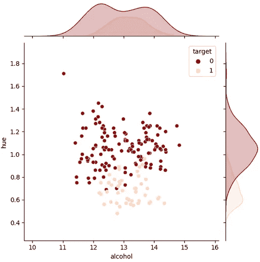

图 2：根据酒精和色调的目标样本分布。

我们将使用色调和类黄酮作为自变量。注意这些特征在分隔目标变量方面比酒精和色调更有效。

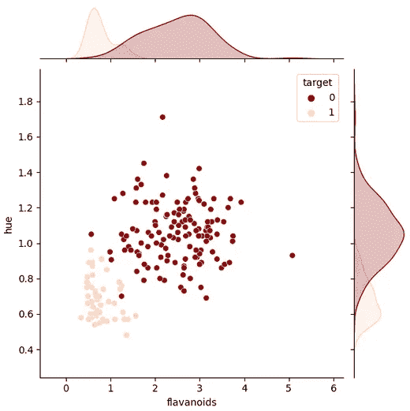

图 3：根据类黄酮和色调的目标样本分布。

# **概率逻辑回归**

逻辑回归是一种广泛使用的二元分类统计方法，用于建模二元响应变量与一个或多个预测变量之间的关系。逻辑回归可以用来建模二元结果的概率作为预测变量的函数。传统的逻辑回归模型是一个确定性模型，假设预测变量与响应变量之间的关系是固定且已知的。然而，在许多实际应用中，预测变量与响应变量之间的真实关系是不确定的，因此使用**概率方法**更为合适。

**概率逻辑回归**模型通过概率框架建模预测变量与二元响应变量之间的关系，并能够考虑数据和模型参数的不确定性。这是通过对模型参数施加概率分布来实现的，而不是假设固定值。通过这种方式，与传统逻辑回归模型相比，**概率逻辑回归**模型可以提供更准确的预测和更好的不确定性量化。

最流行的逻辑回归概率模型之一是贝叶斯逻辑回归模型。这些模型基于贝叶斯定理，该定理指出，给定数据的模型参数的后验概率与数据给定参数的似然和参数的先验概率的乘积成正比。通常，贝叶斯逻辑回归模型使用共轭先验分布来对模型参数进行建模，这允许对后验分布进行封闭形式的解法。这使得计算响应变量给定预测变量的概率成为可能，这被称为后验预测分布。

# 似然

在本节中，我们介绍了一种在逻辑回归的概率方法中计算类别条件密度的方法。我们的方法基于均值的最大似然估计，其由以下公式给出

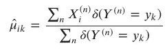

其中 𝑋(𝑛)𝑖 是第 n 个样本的第 i 个特征，𝑌(𝑛) 是第 n 个样本的目标标签，𝑘 是类别标签，𝛿(𝑌(𝑛)=𝑦𝑘) 是一个指示函数，如果 𝑌(𝑛)=𝑦𝑘 则等于 1，否则为 0。

为了估计标准差 𝜎𝑖，我们将通过从数据中学习这些参数来实现，而不是使用封闭形式的解法。我们通过实现自定义训练循环来实现这一点，该循环通过最小化数据的平均每个示例负对数似然来优化标准差的值。

我们的函数根据上述方程计算类别条件高斯分布的均值 𝜇𝑖𝑘。然后，它使用 MultivariateNormalDiag 创建一个多变量高斯分布对象，将均值设置为 𝜇𝑖𝑘，将尺度设置为 TensorFlow 变量。

该函数运行一个自定义训练循环，循环次数为指定的纪元，其中计算平均每个示例的负对数似然。接下来，梯度被传播，尺度变量相应地更新。在每次迭代中，尺度变量的值和损失都会被保存。

它返回一个包含三个对象的元组：损失值、每次迭代的尺度变量和最终学习到的批量 MultivariateNormalDiag 分布对象。

```py
def train(x, y, scales, optimiser, epochs):
    estimated_scales = []
    n_classes = np.unique(y).shape[0]
    n_features = x.shape[1]
    counts = np.zeros(n_classes)
    mean_cond_class = []
    std_feature_given_class = []
    for c_k in range(n_classes):
        mean_cond_class.append(np.mean(x[np.squeeze(y==c_k)], axis=0))
    mean_cond_class = np.asarray(mean_cond_class, dtype=np.float32)
    x_c = np.concatenate((x,y.reshape(-1,1)), axis=1)

    mv_normal_diag = tfd.MultivariateNormalDiag(loc=mean_cond_class,scale_diag=scales)

    x = np.expand_dims(x , 1).astype('float32')

    for i in range(epochs):
        with tf.GradientTape() as tape:
            tape.watch(mv_normal_diag.trainable_variables)
            predictions = - mv_normal_diag.log_prob(x)
            p1 = tf.reduce_sum(predictions[np.squeeze(y==0)][:,0])
            p2 = tf.reduce_sum(predictions[np.squeeze(y==1)][:,1])
            loss = p1 + p2
            grads = tape.gradient(loss, mv_normal_diag.trainable_variables)

        opt.apply_gradients(zip(grads, mv_normal_diag.trainable_variables))
        estimated_scales.append(mv_normal_diag.trainable_variables[0].numpy())
        print('Step {:03d}: Loss: {:.3f}: Scale1: {:.3f}: Scale2: {:.3f}'.format(i, loss, mv_normal_diag.trainable_variables[0].numpy()[0], mv_normal_diag.trainable_variables[0].numpy()[1]))
    estimated_scales = np.asarray(estimated_scales)
    return estimated_scales, mv_normal_diag
```

让我们创建要训练的变量。

```py
scales = tf.Variable([1., 1.], name='scales')
opt = tf.keras.optimizers.Adam(learning_rate=0.01)
epochs = 100
```

我们现在准备开始训练过程。

```py
scales_arr, class_conditionals_binary = train(x_train, y_train, scales, opt, epochs)

-----
Step 000: Loss: 290.708: Scale1: 0.990: Scale2: 0.990
Step 001: Loss: 288.457: Scale1: 0.980: Scale2: 0.980
Step 002: Loss: 286.196: Scale1: 0.970: Scale2: 0.970
Step 003: Loss: 283.924: Scale1: 0.960: Scale2: 0.960
Step 004: Loss: 281.641: Scale1: 0.950: Scale2: 0.950
Step 005: Loss: 279.348: Scale1: 0.940: Scale2: 0.940
[...]
```

最后，我们可以检查模型如何区分我们的葡萄酒类别。

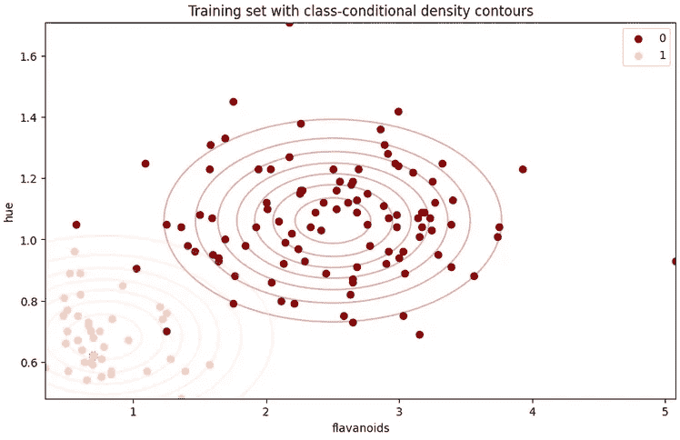

图 4：类别条件密度轮廓。

使用我们在前一篇文章中定义的函数，我们可以为测试集生成预测。在上面的图中，我们可以看到类别被很好地分开，因此我们从模型中获得了良好的准确率。

```py
predictions = predict(prior_binary, class_conditionals_binary, x_test)

accuracy = accuracy_score(y_test, predictions)
print("Test accuracy: {:.4f}".format(accuracy))

---------
Test accuracy: 0.92
```

为了定量评估我们的概率逻辑回归模型的性能，我们绘制了决策区域。这些区域由分隔两个类别的边界定义，为模型区分类别的能力提供了见解。我们的分析表明，模型能够有效地分隔数据集中的两个类别，这从视觉上明显的区域可以看出。然而，需要注意的是，决策边界被限制为线性，这是逻辑回归模型的假设。

```py
plt.figure(figsize=(9, 5))
plot_data(x_train, y_train)
x0_min, x_0_max = x_train[:, 0].min()-0.5, x_train[:, 0].max()+0.5
x1_min, x_1_max = x_train[:, 1].min()-0.5, x_train[:, 1].max()+0.5
contour_plot((x0_min, x0_max), (x1_min, x1_max), 
             lambda x: predict(prior_binary, class_conditionals_binary, x), 
             1, label_colors, levels=[-0.5, 0.5, 1.5],
             num_points=200)
plt.title("Training set with decision regions")
plt.show()
```

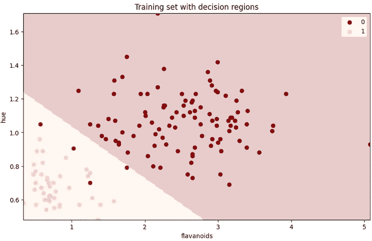

图 5：类别条件决策区域。

# 逻辑回归中的缺失链接

在本节中，我们将上述类别条件密度的定义与逻辑回归联系起来。我们展示了预测分布 𝑃(𝑌=𝑦0|𝑋) 可以写作

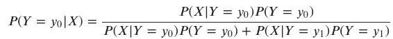

其中 𝑃(𝑋|𝑌=𝑦0) 和 𝑃(𝑋|𝑌=𝑦1) 是类别条件密度，𝑃(𝑌=𝑦0) 和 𝑃(𝑌=𝑦1) 是类别先验。

这个方程可以重新排列为 𝑃(𝑌=𝑦0|𝑋)=𝜎(𝑎)，其中

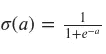

是 sigmoid 函数，以及

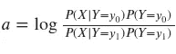

是对数赔率。

通过我们额外的建模假设，即共享协方差矩阵 Σ，可以使用高斯概率密度函数显示 𝑎 实际上是 𝑋 的线性函数，

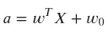

其中

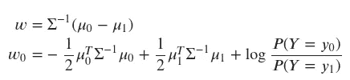

这个线性函数 𝑎=𝑤𝑇𝑋+𝑤0 解释了逻辑回归的决策边界为何是线性的。可以看出，参数 𝑤 和 𝑤0 是类别条件密度 𝑃(𝑋|𝑌=𝑦0) 和 𝑃(𝑋|𝑌=𝑦1) 以及类别先验 𝑃(𝑌=𝑦0) 和 𝑃(𝑌=𝑦1) 的函数。这些参数通常通过最大似然估计，如我们在前面章节中所做的那样。

# 生成逻辑回归模型

在本节中，我们使用前面章节中推导出的方程来直接参数化生成逻辑回归模型的输出伯努利分布。具体来说，我们使用先验分布和类别条件分布来计算权重和偏置项 𝑤 和 𝑤0。

为了实现这一点，我们编写了一个新函数，该函数以先验分布和类别条件分布作为输入。该函数使用这些分布的参数来计算权重和偏置项，根据前面章节中推导出的方程。

函数的输入是对两个类别的先验分布和类别条件分布。

然后，函数使用这些输入来计算权重和偏置项，如下所示


该函数返回𝑤和𝑤0，这可以用来直接参数化生成逻辑回归模型的输出伯努利分布。这允许对模型参数及其与先验和类条件分布的关系有更直接和透明的理解。

```py
def get_logistic_regression_params(prior, class_conditionals):
    cov = class_conditionals.covariance()[0]
    cov_inv = tf.linalg.inv(cov)
    mu0 = class_conditionals.parameters['loc'][0]
    mu1 = class_conditionals.parameters['loc'][1]
    w = np.matmul(cov_inv,(mu0-mu1))
    w0 = - 0.5 * (np.matmul(tf.transpose(mu0), np.matmul(cov_inv, mu0)))\
         + 0.5 * (np.matmul(tf.transpose(mu1), np.matmul(cov_inv, mu1)))\
         + np.log(prior.parameters['probs'][0] / prior.parameters['probs'][1])
    return w, w0

w, w0 = get_logistic_regression_params(prior_binary, class_conditionals_binary)
```

我们现在可以使用这些参数制作轮廓图，以显示我们逻辑回归模型的预测分布。

```py
fig, ax = plt.subplots(1, 1, figsize=(9, 5))
plot_data(x_train, y_train, alpha=0.35)
x0_min, x0_max = x_train[:, 0].min()-0.5, x_train[:, 0].max()+0.5
x1_min, x1_max = x_train[:, 1].min()-0.5, x_train[:, 1].max()+0.5
X0, X1 = get_meshgrid((x0_min, x0_max), (x1_min, x1_max))

logits = np.dot(np.array([X0.ravel(), X1.ravel()]).T, w) + w0
Z = tf.math.sigmoid(logits)
lr_contour = ax.contour(X0, X1, np.array(Z).T.reshape(*X0.shape), levels=10)
ax.clabel(lr_contour, inline=True, fontsize=10)
contour_plot((x0_min, x0_max), (x1_min, x1_max), 
             lambda x: predict(prior_binary, class_conditionals_binary, x), 
             1, label_colors, levels=[-0.5, 0.5, 1.5],
             num_points=200)
plt.title("Training set with prediction contours")
plt.show()
```

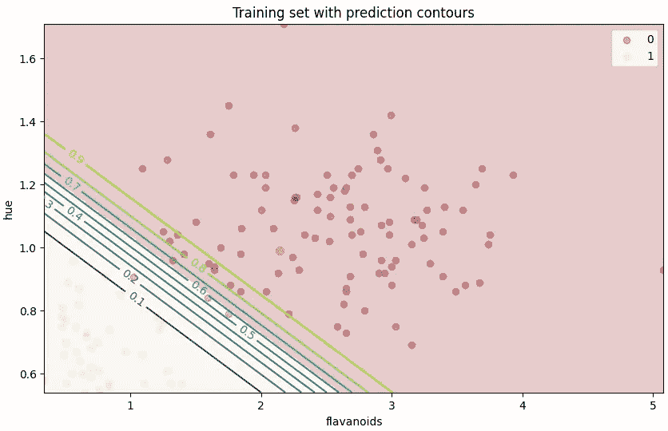

图 6: 我们逻辑回归模型预测分布的密度轮廓。

# 我们的方法是否完全是贝叶斯的？

上述方法可以被视为一种贝叶斯推断形式，因为它涉及通过先验分布引入关于模型参数的先验知识，并通过类条件分布使用观测数据更新这些知识。这是贝叶斯推断的一个关键方面，旨在将关于模型参数的先验知识和不确定性融入推断过程。

在贝叶斯推断中，目标是计算给定观测数据下模型参数的后验分布。上述方法可以看作是一种近似贝叶斯推断，因为它涉及使用类条件密度和先验分布的最大似然估计来计算模型的权重和偏置。同时，该方法通过共享协方差矩阵来引入不确定性，这作为正则化项。

值得注意的是，上述方法并非完全贝叶斯，因为它没有提供模型参数的后验分布的封闭形式。相反，它使用基于最大似然估计的近似。

# 结论

在这篇文章中，我们提出了一种概率方法来处理预测过程中的内在不确定性。通过在模型参数上引入先验分布，我们的方法对模型进行正则化，防止过拟合。我们展示了如何使用 TensorFlow Probability 实现该方法以及如何分析其结果。

值得注意的是，尽管我们的方法包含了贝叶斯原则，但它并不是完全贝叶斯的方法，因为我们没有模型参数的完整后验分布。然而，考虑到预测过程中的内在不确定性，已经使我们对预测过程更有信心。

保持联系: [LinkedIn](https://www.linkedin.com/in/luisbrasroque/)

# 参考文献和材料

[1] — [葡萄酒数据集](https://scikit-learn.org/stable/modules/generated/sklearn.datasets.load_wine.html#sklearn.datasets.load_wine)

[2] — [Coursera: 深度学习专项课程](https://www.coursera.org/specializations/deep-learning)

[3] — [Coursera: TensorFlow 2 深度学习专项课程](https://www.coursera.org/specializations/tensorflow2-deeplearning)

[4] — [TensorFlow 概率指南和教程](https://www.tensorflow.org/probability/overview)

[5] — [TensorFlow 博客中的 TensorFlow 概率帖子](https://blog.tensorflow.org/search?label=TensorFlow+Probability&max-results=20)
