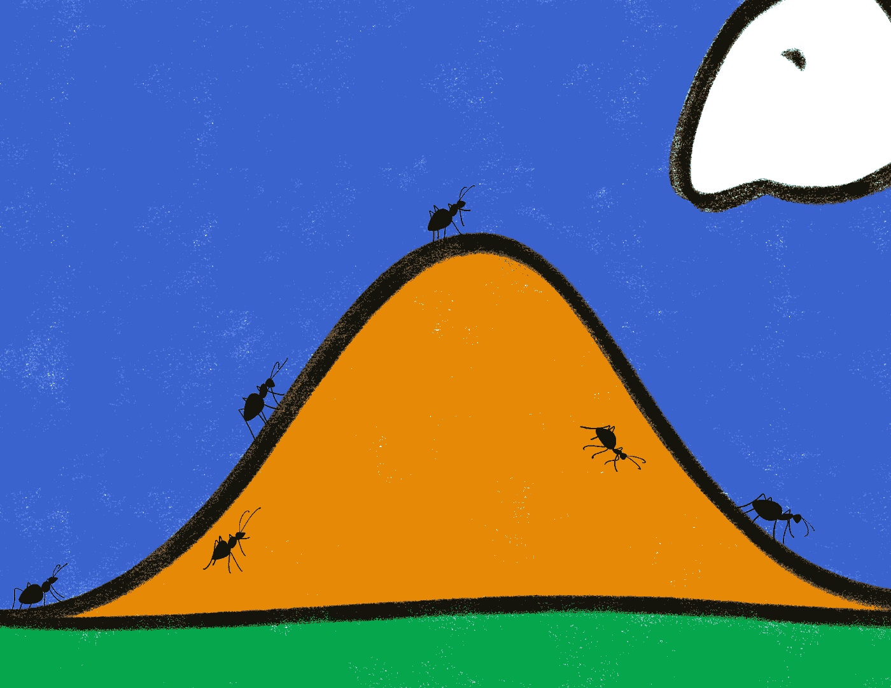

# 带有分位数匹配的概率机器学习：Python 示例

> 原文：[`towardsdatascience.com/probabilistic-ml-with-quantile-matching-an-example-with-python-c367eee85f18?source=collection_archive---------4-----------------------#2023-09-04`](https://towardsdatascience.com/probabilistic-ml-with-quantile-matching-an-example-with-python-c367eee85f18?source=collection_archive---------4-----------------------#2023-09-04)

## 一种鲜为人知的技术，用于将分位数回归预测转化为概率分布。

 [Davide Burba](https://medium.com/@davide.burba?source=post_page-----c367eee85f18--------------------------------)

·

[关注](https://medium.com/m/signin?actionUrl=https%3A%2F%2Fmedium.com%2F_%2Fsubscribe%2Fuser%2F9f58aaaeaed7&operation=register&redirect=https%3A%2F%2Ftowardsdatascience.com%2Fprobabilistic-ml-with-quantile-matching-an-example-with-python-c367eee85f18&user=Davide+Burba&userId=9f58aaaeaed7&source=post_page-9f58aaaeaed7----c367eee85f18---------------------post_header-----------) 发布于 [Towards Data Science](https://towardsdatascience.com/?source=post_page-----c367eee85f18--------------------------------) · 8 分钟阅读 · 2023 年 9 月 4 日

--

“分位数匹配”，由[Giulia Roggia](https://www.instagram.com/giulia_roggia__/)。经许可使用。

+   分位数回归

+   分位数匹配

+   Python 示例：预测糖尿病进展

+   结论

当我们训练回归模型时，我们会得到点预测。然而，在实际应用中，我们通常希望估计与每个预测相关的不确定性。为此，我们假设我们尝试预测的值是一个随机变量，目标是估计其分布。

有许多方法可以用来估计预测的不确定性，例如 [方差估计](https://en.wikipedia.org/wiki/Prediction_interval)、[贝叶斯方法](https://www.probabilitycourse.com/chapter9/9_1_9_bayesian_interval_estimation.php)、[符合预测](https://arxiv.org/abs/2107.07511) 等。分位数回归是这些著名方法之一。

# 分位数回归

分位数回归的核心是为每一个感兴趣的分位数估计一个模型。这可以通过使用一种称为 [pinball loss](https://www.lokad.com/pinball-loss-function-definition/) 的非对称损失函数来实现。分位数回归简单易懂，并且在高性能库如 [LightGBM](https://lightgbm.readthedocs.io/en/latest/Parameters.html) 中随手可得。然而，分位数回归也存在一些问题：
