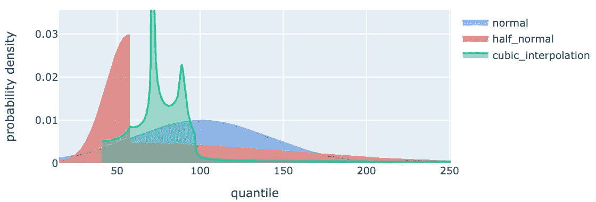

# 概率机器学习与分位数匹配：一个 Python 示例

> 原文：[`towardsdatascience.com/probabilistic-ml-with-quantile-matching-an-example-with-python-c367eee85f18`](https://towardsdatascience.com/probabilistic-ml-with-quantile-matching-an-example-with-python-c367eee85f18)

## 一种将分位数回归预测转化为概率分布的鲜为人知的技术。

[](https://medium.com/@davide.burba?source=post_page-----c367eee85f18--------------------------------)[](https://towardsdatascience.com/?source=post_page-----c367eee85f18--------------------------------) [Davide Burba](https://medium.com/@davide.burba?source=post_page-----c367eee85f18--------------------------------)

·发表于 [Towards Data Science](https://towardsdatascience.com/?source=post_page-----c367eee85f18--------------------------------) ·阅读时长 8 分钟·2023 年 9 月 4 日

--


“分位数匹配”，由[Giulia Roggia](https://www.instagram.com/giulia_roggia__/)。已获许可使用。

+   分位数回归

+   分位数匹配

+   Python 示例：预测糖尿病进展

+   结论

当我们训练回归模型时，我们获得的是点预测。然而，在实际应用中，我们通常对估计每个预测值的不确定性感兴趣。为实现这一目标，我们假设我们试图预测的值是一个随机变量，目标是估计其分布。

目前有许多方法可以估计预测的不确定性，如[方差估计](https://en.wikipedia.org/wiki/Prediction_interval)、[贝叶斯方法](https://www.probabilitycourse.com/chapter9/9_1_9_bayesian_interval_estimation.php)、[保形预测](https://arxiv.org/abs/2107.07511)等。分位数回归是这些著名方法之一。

# 分位数回归

分位数回归包括为每个感兴趣的分位数估计一个模型。这可以通过使用一种不对称的损失函数来实现，这种损失函数称为[pinball 损失](https://www.lokad.com/pinball-loss-function-definition/)。分位数回归简单易懂，并且在高效的库中如[LightGBM](https://lightgbm.readthedocs.io/en/latest/Parameters.html)中很容易获得。然而，分位数回归也存在一些问题：

+   没有保证分位数的顺序是正确的。例如，你对 50%分位数的预测可能会比 60%分位数的预测要大，这显然是不合理的。

+   为了获得整个分布的估计，你需要训练许多模型。例如，如果你需要每个百分位点的估计，你必须训练 99 个模型。

这就是[分位数匹配](https://stats.lse.ac.uk/q.yao/qyao.links/paper/mqe.pdf)如何提供帮助的。

# 分位数匹配

分位数匹配的目标是给定一组分位数估计来拟合分布函数。我们可以将此视为回归问题，因此曲线不必完全符合分位数。相反，它应该“尽可能接近”，同时保持使其成为分布函数的特性。

具体来说，我们感兴趣的是估计逆累积分布函数：给定一个概率*alpha*，我们想知道*P(X<v)=alpha*的值是什么，其中*P*代表概率，*X*是我们尝试预测的随机变量。

在以下示例中，我们提供了 3 种适配这种分布的替代方案。

# Python 示例：预测糖尿病进展


图片由[Towfiqu barbhuiya](https://unsplash.com/@towfiqu999999?utm_source=medium&utm_medium=referral)提供，来源于[Unsplash](https://unsplash.com/?utm_source=medium&utm_medium=referral)

在本节中，我们展示了一个应用于糖尿病数据集的分位数匹配示例，该数据集可在[Sklearn](https://scikit-learn.org/stable/datasets/toy_dataset.html#diabetes-dataset)中获得：

> 对每个 n = 442 糖尿病患者，获得了十个基线变量，包括年龄、性别、体重指数、平均血压和六项血清测量值，以及感兴趣的响应，即基线后一年病情进展的定量测量。

让我们首先导入所需的库：

```py
from abc import ABC, abstractmethod

import numpy as np
import pandas as pd
import plotly.graph_objects as go
from lightgbm import LGBMRegressor
from scipy import optimize, stats
from scipy.interpolate import PchipInterpolator
from sklearn.datasets import load_diabetes
```

## 分位数匹配方法

我们定义了三种替代方案来从一组分位数中估计逆累积分布函数：

1.  拟合正态分布

1.  拟合“半正态”分布：由两个不同标准差的正态分布组成的分布，一个在中位数以下，一个在中位数以上（与半正态分布的绝对值不同，后者也被称为半正态）。

1.  三次插值：使用三次样条来估计平滑的递增曲线。

注意这三种方法逐渐更灵活。第一种方法将输出限制为遵循正态分布。第二种方法允许存在不对称性，这在实际世界的例子中很常见，例如预测价格回报。第三种方法对基础分布没有任何假设，例如，它允许多模态。

为了实现这些方法，我们使用了一个易于扩展的设计模式：

+   一个定义匹配器类接口的基础抽象类

+   一组实现不同算法的具体类

+   一个返回所需方法类的工厂

首先，我们定义基类和工厂。为了简单起见，我们建立一个接口来一次拟合和预测一个样本：

```py
class QuantileMatcherBase(ABC):
    @abstractmethod
    def fit_one(self, alphas, quant_values):
        pass

    @abstractmethod
    def predict_one(self, alphas):
        pass

def quantile_matcher_factory(match, **kwargs) -> QuantileMatcherBase:
    matcher_map = {
        "normal": QuantileMatcherNormCurvFit,
        "half_normal": QuantileMatcherHalfNormCurvFit,
        "cubic_interpolation": QuantileMatcherCubicInterpolation,
    }
    if match not in matcher_map:
        raise ValueError(f"Unknown matcher {match}")

    return matcher_mapmatch
```

然后，我们可以继续进行具体的实现。首先是常规分布：我们将问题框定为一个非线性优化问题，其中我们需要估计参数以最小化拟合曲线与观察值之间的平方差。

```py
class QuantileMatcherNormCurvFit(QuantileMatcherBase):
    """Normal distribution quantile matcher."""

    def __init__(self):
        self.params = None

    def fit_one(self, alphas, quant_values):
        self.params, _ = optimize.curve_fit(
            lambda x, mu, sigma: stats.norm.isf(x, mu, sigma),
            alphas,
            1 - quant_values,
        )

    def predict_one(self, alphas):
        return 1 - stats.norm.isf(alphas, *self.params) 
```

对于半常规分布，我们重复使用上面定义的类：一次用于中位数以下的值，一次用于中位数以上的值。

```py
class QuantileMatcherHalfNormCurvFit(QuantileMatcherBase):
    """Half-Normal distribution quantile matcher."""

    def __init__(self):
        self.below = QuantileMatcherNormCurvFit()
        self.above = QuantileMatcherNormCurvFit()

    def fit_one(self, alphas, quant_values):
        self.below.fit_one(alphas[alphas<=0.5],quant_values[alphas<=0.5])
        self.above.fit_one(alphas[alphas>=0.5],quant_values[alphas>=0.5])
        # trick to ensure same median
        mu = (self.below.params[0] + self.above.params[0]) / 2
        self.below.params[0] = mu
        self.above.params[0] = mu

    def predict_one(self, alphas):
        pred = self.above.predict_one(alphas)
        pred_below = self.below.predict_one(alphas)
        pred[alphas<0.5] = pred_below[alphas<0.5]
        return pred
```

请注意，在 *fit_one* 方法中，我们应用了一个小技巧，以确保两个分布具有相同的中位数。

三次插值的实现很简单：

```py
class QuantileMatcherCubicInterpolation(QuantileMatcherBase):
    """Increasing cubic interpolation quantile matcher."""
    def __init__(self):
        self.params = None

    def fit_one(self, alphas, quant_values):
        self.interp = PchipInterpolator(alphas, quant_values)

    def predict_one(self, alphas):
        return self.interp(alphas) 
```

## 量化回归包装器

我们定义一个类，用于拟合一些 Lightgbm 模型，并进行量化回归，以适应预定义的量化集合。我们实现了一个方法 *predict_raw* 来获取每个模型的原始预测，以及一个方法 *predict_cdf* 来使用之前定义的 *QuantileMatcher* 类在量化网格上获取（反向）累积分布函数。

```py
class ProbLGBMRegressor:
    _forbidden_keys = (
        "objective",
        "objective_type",
        "app",
        "application",
        "loss",
        "alpha",
    )

    def __init__(
        self, 
        alphas=np.array([0.01, 0.1, 0.25, 0.5, 0.75, 0.9, 0.99]), 
        **lgbm_args
    ):
        self.alphas = alphas

        for key in self._forbidden_keys:
            if key in lgbm_args:
                raise ValueError(f"{key} parameter is not allowed.")

        self._models = {}
        for alpha in self.alphas:
            self._models[alpha] = LGBMRegressor(
                objective="quantile", alpha=alpha, **lgbm_args
            )

    def fit(self, x, y):
        for alpha in self.alphas:
            self._models[alpha].fit(x, y)

    def predict_raw(self, x):
        return pd.DataFrame(
            {alpha: model.predict(x) for alpha, model in self._models.items()}
        )

    def predict_cdf(
        self,
        x,
        inference_alphas=np.linspace(0.001, 0.999, 999),
        match="normal_curve_fit",
        **matcher_params,
    ):
        # Compute predictions for the limited set of quantiles.
        raw_preds = self.predict_raw(x)

        # Estimate the cumulative distribution for each sample.
        matcher = quantile_matcher_factory(match, **matcher_params)
        predictions = []
        for _, row in raw_preds.iterrows():
            matcher.fit_one(self.alphas, row.values)
            preds = matcher.predict_one(inference_alphas)
            predictions.append(preds)

        return pd.DataFrame(predictions, columns=inference_alphas)
```

## 糖尿病数据集：拟合和预测

现在我们可以加载糖尿病数据集，并使用上面定义的类来训练模型并预测目标值的分布。

```py
x,y = load_diabetes(return_X_y=True, as_frame=True)

# Fit a regressor
prob_lgbm = ProbLGBMRegressor()
prob_lgbm.fit(x,y)

# Predict the distributions with all methods
predicted_cdf = {}
for match in ["normal","half_normal","cubic_interpolation"]:
    predicted_cdf[match] = prob_lgbm.predict_cdf(x, match=match)

# For visualization purposes, we predict also the "raw" values
predicted_raw = prob_lgbm.predict_raw(x)
```

## 预测的图形分析

为了了解我们的模型是什么样的，我们可以绘制几个样本的预测分布。让我们定义一个帮助函数来绘制预测的累积分布函数。

```py
def get_fig_cumulative_distribution_function(predicted_cdf, predicted_raw, idx):
    # Small artifact to ensure same range in figures
    max_limit = max([pred.iloc[idx, -1] for pred in predicted_cdf.values()]) + 5
    min_limit = max([pred.iloc[idx, 0] for pred in predicted_cdf.values()]) - 5

    # Create traces for each distribution.
    trace = []
    for match, pred_cdf in predicted_cdf.items():
        x = [min_limit] + list(pred_cdf.iloc[idx].values) + [max_limit]
        y = [0] + list(pred_cdf.columns) + [1]
        trace.append(go.Scatter(x=x, y=y, mode="lines", name=match.title()))

    # Add trace for raw quantile predictions.
    trace.append(
        go.Scatter(
            x=predicted_raw.iloc[idx],
            y=predicted_raw.columns,
            mode="markers",
            name="Raw Predictions",
            marker={"size": 10},
        )
    )

    # Create the figure
    fig = go.Figure(trace)
    fig.update_layout(
        title="Cumulative Distribution Functions",
        yaxis_title="alpha",
        xaxis_title="quantile",
    )
    # Set x-axis limits
    fig.update_xaxes(range=(min_limit, max_limit))
    return fig
```

这里是通过预测数据集中第一个样本获得的图表：


索引 0 的预测累积分布。图片由作者提供。

我们可以看到三种方法产生了不同的曲线。虽然常规分布和半常规分布非常接近且平滑，但三次插值则较为不规则，完美拟合了所有“原始”预测。

虽然评估其量化值很方便，但从累积分布的角度分析分布的全球行为可能比较困难。为了获得更好的视图，我们可以通过使用 [有限差分法](https://en.wikipedia.org/wiki/Finite_difference_method) 来估计相应的概率分布。让我们定义一个帮助函数来完成这项工作：

```py
def get_fig_probability_distribution_function(predicted_cdf, idx):
    trace = []

    for match, pred_cdf in predicted_cdf.items():
        quantiles = pred_cdf.iloc[idx].values
        icdf_values = pred_cdf.columns.values

        # Estimate the PDF using finite differences
        diff_icdf = np.diff(icdf_values)
        diff_quantiles = np.diff(quantiles)
        pdf_est = diff_icdf / diff_quantiles

        # Create a Plotly figure for the estimated PDF
        trace.append(
            go.Scatter(
                x=quantiles[:-1],
                y=pdf_est,
                mode="lines",
                fill="tozeroy",
                name=match,
            )
        )

    fig = go.Figure(data=trace)

    # Add labels and title
    fig.update_layout(
        xaxis_title="Quantiles",
        yaxis_title="Estimated PDF",
        title="Estimated Probability Density Function",
    )
    return fig
```

通过对数据集中第一个样本应用上述函数，我们得到以下图表：


索引 0 的预测概率分布。图片由作者提供。

让我们再看几个样本的累积分布和概率分布。

这些是我们对第二个样本得到的结果：


索引 1 的预测累积分布。图片由作者提供。



索引 1 的预测概率分布。图片由作者提供。

这些是我们对第三个样本得到的结果：


索引 2 的预测累计分布。图像由作者提供。


索引 2 的预测累计分布。图像由作者提供。

我们可以看到，正常分布和半正态分布并不一致，这表明真实的潜在分布存在不对称性。

我们还注意到，三次插值给出了多模态且常常极端的结果。这是因为插值不受特定形式的约束，并且在拟合接近的点时往往具有高导数。这些结果可能不切实际，平滑技术可能有助于缓解这个问题。

# 结论

从初步来看，半正态分布似乎是最佳选择，因为它提供了现实的分布，同时能够建模不对称行为。然而，选择匹配算法的最佳方式是交叉验证预测并评估相关指标，例如预测区间的宽度及其准确性（90%的区间应在大约 90%的时间内包含目标）。

如开头所述，这种技术并不很受欢迎，我还没有机会在实际场景中使用它。因此，如果你在项目中使用了它，请告诉我！

*本示例中使用的完整代码可在* [*此处*](https://github.com/davide-burba/code-collection/) *获取*。

*喜欢这篇文章？* [*查看我的其他文章*](https://medium.com/@davide.burba) *并关注我以获取更多内容！* [*点击这里*](https://medium.com/@davide.burba/membership) *阅读无限制文章并在不增加你额外成本的情况下支持我* ❤️
