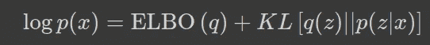
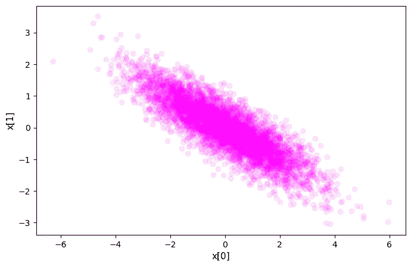

# 主成分分析的概率视角

> 原文：[`towardsdatascience.com/probabilistic-view-of-principal-component-analysis-9c1bbb3f167`](https://towardsdatascience.com/probabilistic-view-of-principal-component-analysis-9c1bbb3f167)

## 潜在变量、期望最大化与变分推断

 [Saptashwa Bhattacharyya](https://saptashwa.medium.com/?source=post_page-----9c1bbb3f167--------------------------------)

·发表于 [Towards Data Science](https://towardsdatascience.com/?source=post_page-----9c1bbb3f167--------------------------------) ·9 分钟阅读·2023 年 7 月 12 日

--

寻找隐藏变量（图片来源：[作者](https://flickr.com/photos/suvob/52911155451/)）

在数据科学和机器学习中，主要使用的降维技术之一是主成分分析（PCA）。之前，我们已经讨论过将 PCA 应用于 管道与 支持向量机 的一些例子，在这里我们将从概率的角度来看 PCA，以提供对数据结构的更全面和稳健的理解。*概率 PCA（PPCA）的一个最大优点是它能够处理数据集中缺失的值，这是经典 PCA 无法做到的。* 由于我们将讨论潜在变量模型和期望最大化算法，你还可以查看 这篇详细的文章。

你可以从这篇文章中学到什么？

1.  PCA 简短介绍。

1.  PPCA 的数学构建块。

1.  期望最大化（EM）算法或变分推断？用于参数估计时应该使用哪一个？

1.  使用 TensorFlow Probability 在玩具数据集上实现 PPCA。

让我们深入探讨一下吧！

## 1\. 奇异值分解（SVD）和 PCA：

线性代数中一个重要的概念是**SVD**，它是一种对实数或复数矩阵进行分解的技术，例如，一个矩阵（假设为*A*）可以被分解为：

方程 1：矩阵 A 的 SVD。

其中 *U*,*Vᵀ* 是正交矩阵（转置等于逆），而 Σ 将是一个对角矩阵。*A* 不需要是方阵，例如它是一个 *N*×*D* 矩阵，因此我们可以将其视为我们的数据矩阵，其中 *N* 个实例和 *D* 个特征。*U*,*V* 分别是方阵 (*N*×*N*) 和 (*D*×*D*)，Σ 将是一个 *N*×*D* 矩阵，其中 *D*×*D* 的子集是对角的，其余条目为零。

我们也知道特征值分解。给定一个可以对角化的方阵 (*B*) 可以分解为：

方程 2：矩阵的特征值分解

其中 *Q* 是一个方形的 *N*×*N* 矩阵，其第 *i* 列是 *B* 的特征向量 *q_i*，而 Λ 是对角矩阵，其对角元素是对应的特征值。

让我们尝试通过乘以*Aᵀ*来修改方程 (1)。

方程 3：乘以 A 的转置。

在这里，*AᵀA* 将是一个方阵，即使 *A* 起初不需要是（可以是 *m*×*n*）。Σ Σ*ᵀ* 是一个对角矩阵，而 *V* 是一个正交矩阵。现在，这基本上是矩阵 *AᵀA* 的特征分解。这里的特征值是方程 (1) 中 *A* 的奇异值的平方。

对于正半定矩阵，SVD 和特征分解是等效的。PCA 最终归结为协方差矩阵的特征分解。找到最大特征值和相应的特征向量基本上可以视为找到最大方差的方向。

给定 *D* 维数据（特征），完全的特征分解将是昂贵的 ∼O(*D³*)，但现在如果我们选择一些潜在空间维度 *M*（<*D*），则计算会便宜 ∼O(*MD²*)。

## 2\. PPCA 的构建块：

## 2.1\. 假设：

PPCA 是一个潜在变量模型 (LVM)，我们之前在 详细讨论过 包括期望最大化 (EM) 算法。LVM 提供了数据的低维表示。假设我们的数据 (*x*) 是 *N*×*D* 维的，具有 *D* 个特征；那么 PCA 的 LVM 寻求一个 *M* 维的潜在变量向量 *z*，它可以用来生成观察变量 *(x)*，并且它们通过线性关系相互关联：

方程 2.1：PPCA 的生成过程；*x* 条件于潜在变量 *z*。

上述方程中的噪声 *ϵ* 是一个 *D* 维向量，具有零均值高斯分布和 *σ²I* 的协方差；

方程 2\. 2：噪声被建模为具有零均值和协方差 *σ²* 的正态分布。

由于我们知道潜在空间是 *M* 维的，这使得我们的 *W* 向量是 *D*×*M* 维的。假设潜在变量 *z* 具有零均值、单位协方差的高斯分布：

Eq. 2.3：潜在变量的先验是均值为零、协方差为单位的正态分布。

上述两个方程导致条件分布 *x* 在 *z* 下的如下：

Eq. 2.4：根据前两个方程，我们得到条件分布 *x*。

这是另一个均值为 *Wz*（我们可以设定 *μ* = 0）和协方差为 *σ²* 的正态分布。

上述方程应让我们想起正态分布的一个基本属性：即，如果 *x* 服从多元正态分布 *x*∼N(*μ*, Σ)，则 *x* 的任何线性变换也是多元正态分布 *y* = *Ax* + *b* ∼ N(*Aμ*+*b*, *A*Σ*Aᵀ*)。

给定联合分布，边际分布也将是高斯分布：

Eq. 2.5：数据分布也服从正态分布。

由于我们希望确定参数 *W*、*μ*、*σ*，我们可以通过 MLE 或 EM 算法来解决这个问题。这里我们将关注 EM 方法，然后是变分推断。两种方法在 Bishop 的书中都有详细描述。Bishop 认为，随着数据维度的增加，通过迭代的 EM 步骤，我们可能在计算上比 MLE 获得优势。这主要涉及协方差矩阵的计算成本，其中 *D* 维数据协方差矩阵的评估需要 O(*ND²*)，*N*是数据点的数量。

## 2.2. PPCA 的 EM 步骤：

在讨论了[EM 算法](https://medium.com/towards-data-science/latent-variables-expectation-maximization-algorithm-fb15c4e0f32c) 参考于高斯混合模型之后，这里我将其参考于 PPCA 进行描述。EM 算法的步骤如下：

+   在期望步骤中，我们计算完整数据对数似然相对于潜在变量的后验分布 (*p(z|x)*) 的期望，使用的是“旧”参数。

+   最大化该数据对数似然函数将得到“新”的参数，这些参数将被插入到第 1 步中。

由于数据点是独立的，完全数据似然将是：

Eq. 2.6：包括观察变量和潜在变量在内的完全数据似然。

E 步的主要目标是计算上述表达式的期望。在这里，我们需要使用方程 3 和 4 中 *p*(*x*|*z*) 和 *p*(*z*)。推导在 Bishop 的书中给出，但重要的是推导需要计算 E[*z_n*]、E[*z_n zᵀ_n*]，这些可以通过后验分布 *p*(*z*|*x*) 推导得出。

一旦 E 步完成，M 步则涉及最大化相对于参数 *W*、*σ²* 的期望对数似然。

## 变分推断、EM 和 ELBO：

上述 EM 步骤依赖于一个关键假设，即后验分布*p(z|x)*是可处理的（这是方程 2.6 中的 E 步所必需的）。*如果不是这样呢？* 如果后验没有任何解析表达式？这就是变分推断的基础。

我们现在借助变分方法。主要思想是我们尝试找到一个分布*q(z)*，使其尽可能接近后验分布*p(z|x)*。这个近似分布可以有自己的变分参数：*q(z|θ)*，我们尝试找到使*q*接近感兴趣后验的参数设置。*q(z)*应该相对简单，更易于推断。为了衡量两个分布*q*(z)和*p*(z|x)*的接近程度，常用的度量是 Kullback-Leibler (KL) 散度。变分推断中的 KL 散度自然引入了证据下界（ELBO）：

方程 2.7：*q(z)*和后验*p(z|x)*的接近程度，ELBO 加在一起给我们数据的可能性。

其中 ELBO *(q)* 被定义为：

方程 2.8：ELBO 的定义

对于推导，你可以查看参考中的笔记本或其他可用的讲义。

由于 KL 散度是非负的，log *p*(x)* ≥ ELBO(*q*)。所以我们在变分推断（VI）中所做的就是最大化 ELBO。

我们还可以很容易地看到 VI 和传统 EM 算法之间的联系；当*q*(x)==*p*(z|x)*时，KL 散度项消失。

由于我们现在已经完成了 PPCA 的概述，我们将使用 TensorFlow Probability 来实现这一点，并使用 ELBO 的定义尝试最大化它，这反过来等同于最大化数据的可能性 log *p(x)*。

## 使用 TensorFlow Probability 实现 PPCA：

为了通过变分推断实现一个简单的 PPCA 示例，我将遵循 TensorFlow Probability 应用中的[原始示例](https://www.tensorflow.org/probability/examples/Probabilistic_PCA)。

实现这一点时，我们将假设我们知道噪声的标准差（*σ*，我选择了 3.0），如方程（2.2）所定义，并且我们对*w*进行先验设定，并尝试通过变分推断来估计。让我们定义联合分布：

在这里我们使用了`JointDistributionCoroutineAutoBatched`，这是`JointDistributionCoroutine`的“自动批处理”版本。它根据输入参数的形状自动应用批处理语义，从而允许更灵活地处理批处理维度。我们可以将批处理或非批处理参数传递给联合分布，它会自动处理批处理语义。我们从这个联合分布中采样后，使用`tf_model.sample()`在第 51 行中，我们绘制观察数据（*x*）的分布（2D）：

图 1：数据的观测分布，给定上述代码定义的联合分布。

顺便提一下，由于这些数据点是在你运行代码时随机采样的，你可能不会得到完全相似的点。

我们尝试认为后验*p(W, Z|X)*可以用一个由*θ*参数化的更简单的分布*q(W, Z)*来近似。在 VI 中，我们的目标是最小化*q(W, Z)*和*p(W, Z|X)*之间的 KL 散度，这从方程（2.8）来看，则是最大化证据下界（ELBO）。

在这种情况下的 ELBO：

我们通过 VI 尝试最小化的 ELBO。

为了最小化 ELBO，我们将首先定义类似于定义联合分布的方式的替代分布，并使用`tfp.vi`方法将替代后验拟合到目标（未归一化）对数密度。

在获得替代分布后，我们可以使用它来采样新的数据点，结果如下图所示：

图 2：采样的分布与原始分布非常相似。

## 结论：

我们已经探讨了 PPCA 背后的数学原理，并使用 TensorFlow 通过一个简单的玩具数据集测试了我们的理解。通过使用替代后验生成新样本的可能性，使我们能够在数据中填补缺失值、生成新样本等，这在标准 PCA 中是不可能的。许多实际数据集展示了复杂的关系、噪声污染和不完整的观测，这使得经典 PCA 的效果不佳。通过考虑不确定性、处理缺失数据，并提供概率建模框架，PPCA 为数据分析、模式识别和机器学习开辟了新的途径。如果下次你打算使用 PCA 来处理你的数据集，但你知道观测可能会有噪声且存在缺失数据，为什么不尝试 PPCA 呢？

概率 PCA 还与因子分析（FA）密切相关，后者是一种线性高斯潜变量模型。FA 与 PPCA 之间的主要区别在于，在方程 2.2 中描述噪声分布时，PPCA 假设协方差是各向同性的，而 FA 中它是对角矩阵。我会在下面留下更多参考文献，以便你可以根据这篇文章进行进一步探索。

## 参考文献：

[1]《概率主成分分析》；M. Tipping, C. Bishop；J.R. Statist. Soc. B (1999)。

[2]《模式识别与机器学习》；C. Bishop；第十二章：连续潜变量。

[3]《连续潜变量模型》；多伦多大学；[讲义](https://www.cs.toronto.edu/~hinton/csc2515/notes/lec7middle.pdf)。

[4] [概率 PCA：TensorFlow 概率示例](https://www.tensorflow.org/probability/examples/Probabilistic_PCA)；

[5] 我的笔记本链接。[GitHub](https://github.com/suvoooo/Learn-TensorFlow/blob/master/TF-Proba/PCA_ProbabilisticApproach.ipynb)
