# 使用广义加性模型（GAMs）生成见解

> 原文：[`towardsdatascience.com/producing-insights-with-generalized-additive-models-gams-cf2b68b1b847?source=collection_archive---------4-----------------------#2023-01-30`](https://towardsdatascience.com/producing-insights-with-generalized-additive-models-gams-cf2b68b1b847?source=collection_archive---------4-----------------------#2023-01-30)

## 学习如何解释广义加性模型（GAMs）并从数据中提取有用的见解

[](https://medium.com/@alvarofps?source=post_page-----cf2b68b1b847--------------------------------)[](https://towardsdatascience.com/?source=post_page-----cf2b68b1b847--------------------------------) [Alvaro Peña](https://medium.com/@alvarofps?source=post_page-----cf2b68b1b847--------------------------------)

·

[关注](https://medium.com/m/signin?actionUrl=https%3A%2F%2Fmedium.com%2F_%2Fsubscribe%2Fuser%2F3884c9f0acaf&operation=register&redirect=https%3A%2F%2Ftowardsdatascience.com%2Fproducing-insights-with-generalized-additive-models-gams-cf2b68b1b847&user=Alvaro+Pe%C3%B1a&userId=3884c9f0acaf&source=post_page-3884c9f0acaf----cf2b68b1b847---------------------post_header-----------) 发表在 [Towards Data Science](https://towardsdatascience.com/?source=post_page-----cf2b68b1b847--------------------------------) ·10 分钟阅读·2023 年 1 月 30 日[](https://medium.com/m/signin?actionUrl=https%3A%2F%2Fmedium.com%2F_%2Fvote%2Ftowards-data-science%2Fcf2b68b1b847&operation=register&redirect=https%3A%2F%2Ftowardsdatascience.com%2Fproducing-insights-with-generalized-additive-models-gams-cf2b68b1b847&user=Alvaro+Pe%C3%B1a&userId=3884c9f0acaf&source=-----cf2b68b1b847---------------------clap_footer-----------)

--

[](https://medium.com/m/signin?actionUrl=https%3A%2F%2Fmedium.com%2F_%2Fbookmark%2Fp%2Fcf2b68b1b847&operation=register&redirect=https%3A%2F%2Ftowardsdatascience.com%2Fproducing-insights-with-generalized-additive-models-gams-cf2b68b1b847&source=-----cf2b68b1b847---------------------bookmark_footer-----------)

照片由 [A. L.](https://unsplash.com/@overdriv3?utm_source=medium&utm_medium=referral) 在 [Unsplash](https://unsplash.com/?utm_source=medium&utm_medium=referral) 提供

今天我们将学习如何使用广义加性模型来预测 2011 年至 2012 年间华盛顿特区的自行车租赁数量。该数据集由共享单车公司 Capital Bikeshare 提供。共享单车系统是一种新一代服务，允许用户在方便的位置取车和还车，从而促进零排放的交通，具有对交通、环境和健康问题的积极影响。

# GAMs 是什么？

> “广义加性模型是一个广义线性模型，其线性预测变量涉及协变量平滑函数的总和”（Wood, 2017）。

GAMs（广义加性模型）通过添加协变量的估计权重来与线性回归相同。最大的区别在于，这些权重代表的是灵活的关系，而不仅仅是线性的关系，我们使用链接函数来建模目标变量。

我们可以将这种模型用于不同的应用：使用泊松分布建模疾病的传播，基于数值/分类变量使用二项分布（逻辑回归）预测患者是否有某种疾病，使用纬度和经度数据研究物种在某区域的空间行为。GAMs 是一个多功能的框架，可以应用于几乎任何领域。

在我们的背景下，我们可以创建一个模型来解释由于时间、湿度和温度的变化，租赁自行车的数量是如何变化的。此外，租赁自行车的数量表现得像一个正态分布。

我们可以正式写出我们的模型：

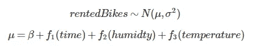

示例 GAM 的数学表达式

函数 f1、f2 和 f3 允许我们建模目标变量与解释变量之间的灵活关系。最终，这些关系的估计权重之和就是预测/估计的租赁自行车数量。在训练模型之前，我们将描述数据集，并开始进行一些探索性数据分析，以决定使用哪些解释变量。

## 加载库

```py
# Basic wrangling functions
library("dplyr")
# Beautiful plots and data exploration
library("ggplot2")
# Comparing variables and data exploration
library("GGally")
# Library to fit gams
library("mgcv")
# Modern library for visualizing and assessing gams
library("gratia")
```

## 数据集

我们从 Interpretable Machine Learning 书籍的 GitHub 仓库下载数据集，这些数据已被预处理，并且准备好供我们使用。让我们解释一下每个变量：

+   **season:** 年中的季节。

+   **holiday:** 那天是否为假日。

+   **workingday:** 这一天是否为工作日，本质上是周末与否。

+   **weathersit:** 那天的天气情况，有三种类别。

+   **temp:** 温度，以摄氏度计。

+   **hum:** 相对湿度百分比。

+   **windspeed:** 风速，以 km/h 计。

+   **days_since_2011:** 一个时间步长变量，用于考虑时间的流逝。

+   **cnt:** 租赁的自行车数量。

+   **weekday:** 一周中的天

我们将使用下面的函数并总结感兴趣的变量。

```py
get.bike.data = function(){
  url =  "https://raw.githubusercontent.com/christophM/interpretable-ml-book/master/data/bike.csv"
  # Download file and save it as bikes.csv in our current folder
  file = download.file(url, "bikes.csv")

  # Read the file and return it as a data frame
  bike = read.csv('bikes.csv', stringsAsFactors = T) %>% data.frame()
}

# Relevant variables
variables.of.interest = c('season','holiday', 'workingday', 'weathersit', 'temp', 'hum', 'windspeed', 'days_since_2011', "cnt", "weekday")

# Read data and extract variables of interest
bikes = get.bike.data() %>% dplyr::select(variables.of.interest)

# Summarise data
summary(bikes)
```

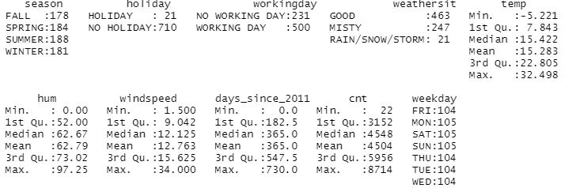

summary 函数的输出

我们巧妙地用一个函数总结了我们的数据，我们拥有每天的分类和数值数据。我们的数据集包含 730 条记录，大约是两年的数据。

## 数据探索

让我们开始分析数值变量，以检查它们是否对租赁自行车数量有影响。

```py
# Compare each variable against the other
ggpairs(bikes %>% select(c(temp, hum, windspeed, cnt))) +
  labs(subtitle = "Numeric variable exploration") +
  my_theme()
```

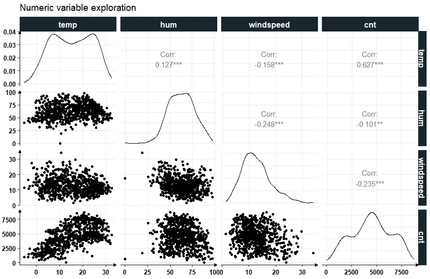

图 1\. 检查变量相关性

我们使用了*ggpairs*函数来创建这个图形，在这里我们可以可视化变量之间的相互影响并发现模式。总体而言，我们可以看到温度对自行车租赁数量有正面影响（见左下角的图）。让我们进一步探讨温度对其他解释天气情况和日期的分类变量的影响。

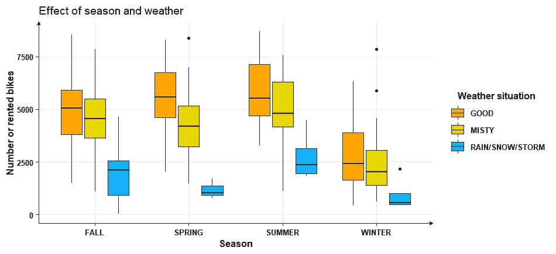

图 2\. 按季节划分的天气情况及其对租赁自行车数量的影响

无论季节如何，只要天气好，租赁自行车的数量就会比天气差时高。例如，在冬季有三种天气情况，但总体而言，当天气不好时，租赁自行车的数量较低。此外，与冬季相比，夏季的租赁自行车数量显著较高。也许我们应该考虑天气情况对模型的影响。

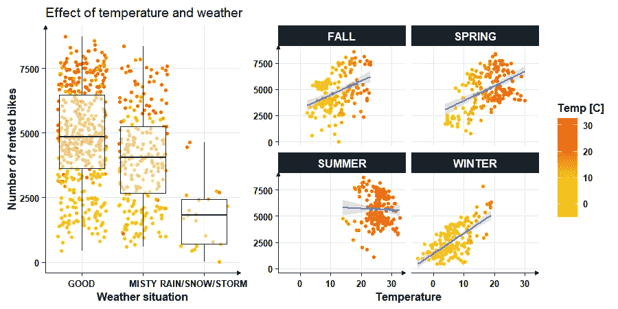

图 3\. 温度在不同季节和天气情况中的影响

左图确认了我们的发现，表明良好的天气显著有助于增加租赁自行车的数量。另一方面，右图显示温度对较冷的季节如秋冬有正面影响。有趣的是，当温度接近 30 摄氏度时，夏季出现了轻微的负面趋势，表明一些骑行者不愿意在高温下骑行。

## 训练广义加法模型（GAM）？

在 R 中训练/拟合广义加法模型（GAM），我们将使用*mgcv*库。它是一个功能强大且维护良好的库。

```py
M = gam(cnt ~ season + weathersit  + s(days_since_2011, bs ="cr", k = 70) +
          s(temp, bs = "cr", by = season, k = 15), data = bikes, )
```

我们的模型将预测租赁自行车数量，并考虑以下因素：

+   ***weathersit:*** 每种天气情况将估算一个不同的截距。什么是截距？截距是指在其他所有变量设为零的情况下，基于给定天气情况的平均租赁自行车数量。

+   ***s(days_since_2011, bs = “cr”, k = 70)****:* 这个术语表示我们将使用三次回归样条（平滑函数）来估算租赁自行车数量随时间变化的情况。***k***值是函数的阶数，决定了它的灵活性。稍后会变得清晰。

+   ***s(temp, by = season, k = 15)****:* 这个术语估算了在不同季节中温度对租赁自行车数量的影响。由于 k 值较小，它不如上述术语灵活。

+   ***season:*** 每个季节都有不同的截距，因为我们使用了一个估算季节温度的术语。

所有这些项的总和将导致我们模型的预测结果。

## 总结和检查我们的模型

```py
# Summarize model
summary(M)
```

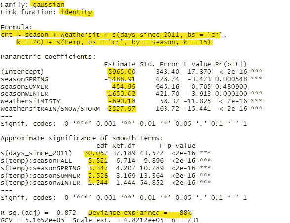

图 4\. 模型摘要

首先，图 4\. 的模型摘要告诉我们目标变量的分布和链接函数。在我们的案例中：高斯（正态）和恒等函数（变量未改变）。我们有参数系数或截距，为每个季节和每种天气情况计算了一个截距（也称为参数效应）。在下一部分中，展示了我们平滑函数的有效自由度。这些值告诉我们关系的灵活性（本质上是它们与线性关系的差异，线性关系的 edf=1）。最后，我们有解释的偏差，在我们的案例中是 88%。我们的模型解释了 88%的数据。

```py
# Checking k-value and edf
k.check(M)
```

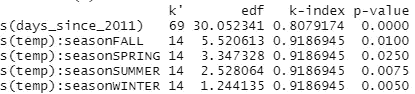

图 5\. 检查模型的灵活性

图 5\. 中的下一个模型检查与平滑函数的秩有关。例如，第一个解释自行车数量与时间关系的平滑函数被赋予了 70 的秩。其中一个秩用于计算截距，其余的用于建模关系。edf 告诉我们所使用函数使用了多少可用的灵活性（69 个秩）。作为一个好的经验法则，我们希望 k 大于 edf，k-index 大于 1。我们还希望 p 值较大，而不是较小，这通常是情况。在我们的案例中，我们未能获得后两者，但我们已给函数足够的灵活性，如 edf 所示。

## 解释平滑效应

本节将展示平滑函数如何建模解释变量与租赁自行车数量之间的复杂关系。以下图形可以使用以下函数创建：

```py
# Plot smooth and parametric effects
draw(M, parametric = TRUE)
```

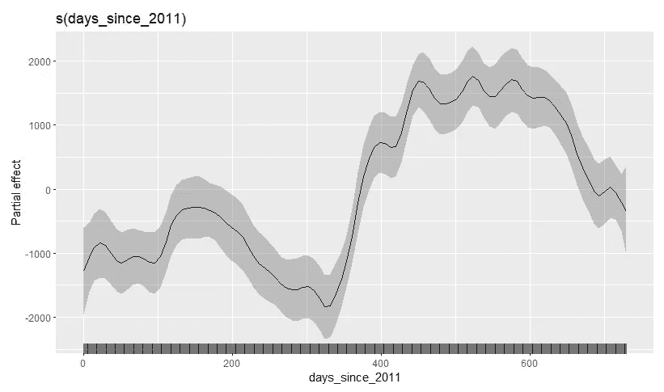

图 6\. 时间与租赁自行车之间的非线性关系

需要注意的一点是，所有的部分效应图都以均值为中心，阴影区域表示 95%的置信区间。这意味着 y 轴上显示的增减反映了租赁自行车的平均预测值。例如，可以通过陈述在前半段时间内自行车数量低于平均值来解释图 6\.。我们还可以看到，由于所使用函数的 30 个有效自由度，关系是相当灵活的。

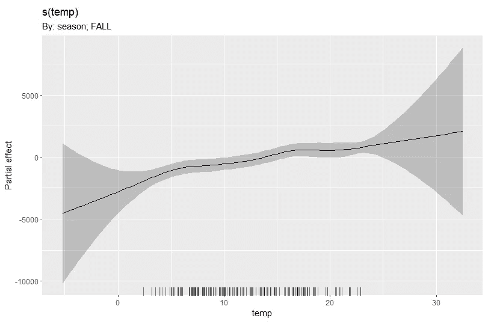

图 7\. 温度对秋季租赁自行车的影响

图 7 中温度的影响没有很大的灵活性，但我们可以清晰地看到一些*“波动”。* 一个重要方面是 x 轴上的 rug 图，它显示了数据点的数量。当没有数据点时，置信区间会显著增大，因为我们不确定关系。我们可以通过说在秋季，温度的升高会增加租赁自行车的数量来解释此图。更准确地说，当温度约为 5 摄氏度时，预测的自行车数量比平均值低——1200（低 1200）。

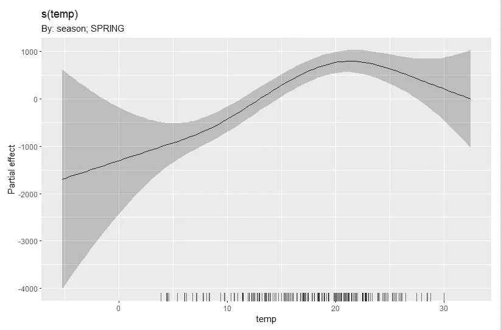

图 8. 春季温度对租赁自行车的影响

在春季，温度的变化方式不同，预测的自行车数量在温度从 4 摄氏度升高到 20 摄氏度时急剧上升，但之后预测的自行车数量开始下降。我们需要仔细考虑较高温度值的的不确定性，rug 图表明数据点不多。如果有更多数据，这部分图表可能会显示平滑曲线？

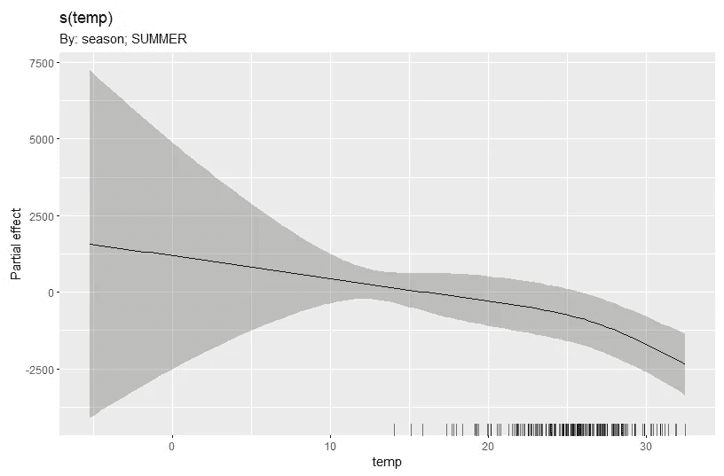

图 9. 夏季温度对租赁自行车的影响

夏季非常有趣，因为我们看到在温暖的日子里数量下降。在图 9 中，我们可以看到温度超过 30 摄氏度对预测的租赁自行车数量有负面影响，低于预测平均值约——2500。这可能是因为骑行者不愿意在非常热的日子里骑车。

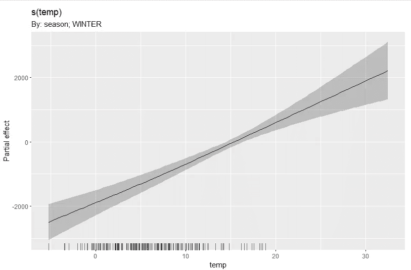

图 10. 冬季温度对租赁自行车的影响

最后，在冬季，随着温度的升高，预测的租赁自行车数量增加。注意图 10 显示了一个几乎线性的关系，与模型总结中的 1.24 edf 相符。虽然它的灵活性不如其他平滑函数，但按季节建模温度似乎是合适的。我们可以通过说在冬季 15 摄氏度时，预测的自行车数量大致与平均值相同来解释此图。

接下来我们将解释估计的截距或参数效应。

## 解释参数效应

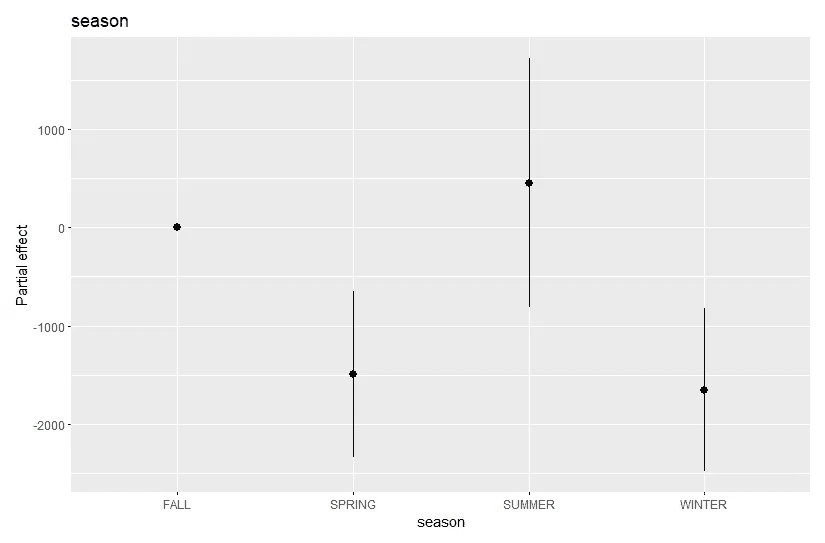

图 11. 一年四季对租赁自行车的影响

图 11\. 显示了带有 95% 置信区间的估计参数效应。我们可以通过陈述春季预测的自行车数量比秋季低 1489 辆来解读此图。我们对这一陈述充满信心，因为置信区间不包括零（我们的比较点）。如果预测也包括秋季的预测数据，春季的效应将不会显著，对吗？我们可以对冬季对预测自行车数量的影响做出相同的陈述。另一方面，夏季的效应不显著，因为其置信区间相当大并且包括零。这表明，在夏季，我们的模型预测的租用自行车数量也可以在秋季预测。我们可以从中提取一个见解：租用自行车数量的增加不是因为夏季，而是因为温度逐渐变暖。

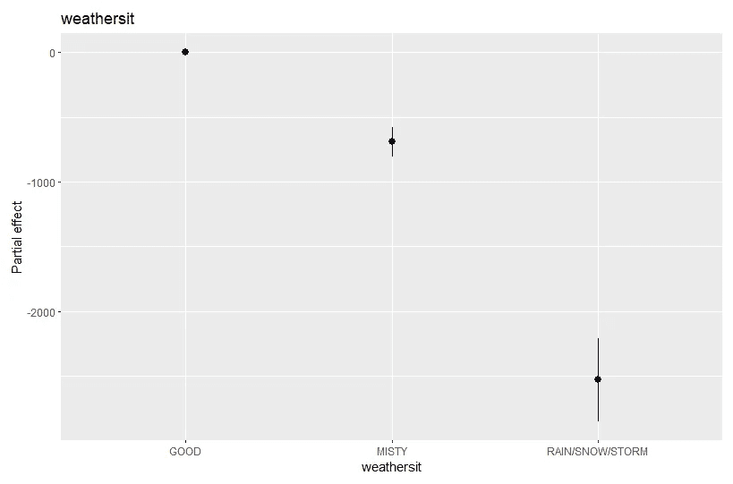

图 12\. 天气情况对租用自行车的影响

最后，图 12\. 告诉我们，当天气雾霾或下雨/下雪/暴风雨时，预测自行车数量的变化是显著的（因为置信区间不包括零）。在这种情况下，效应是负面的，因为我们可以说，在雾霾天气的日子里，预测的租用自行车数量比良好天气的日子少 690 辆。

## 结论

我们训练了一个广义加性模型，以预测华盛顿特区的租用自行车数量，基于时间变化、季节中的温度变化和整体天气情况。我们学习了如何读取模型摘要并检查有效自由度以获得正确的拟合。最后，我们解释了模型的平滑效应和参数效应，以理解是什么驱动了租用自行车的数量，并获得了以下见解：

+   骑自行车的人在夏季气温过高时（高于约 25 摄氏度）通常会避免租用自行车。

+   租车数量的上升发生在天气温和、气温开始变暖的季节（秋季和冬季）。

+   我们对雨雪是负面影响租用自行车数量的显著因素充满信心。

总之，广义加性模型是一种强大的机器学习框架，具有很好的解释性，可以用于从数据中提取见解。将噪声转化为句子。

*除非另有说明，所有图片均由作者提供。*

## 参考文献

Wood, S.N., 2017\. *广义加性模型：R 语言入门*. 第二版。Chapman and hall/CRC.

## 代码

可以在我的 GitHub 仓库中找到：

[`github.com/alvarofps/Producing-Insights-with-GAMs`](https://github.com/alvarofps/Producing-Insights-with-GAMs)
