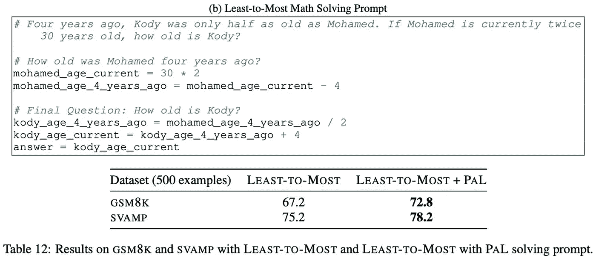

# 程序辅助语言模型

> 原文：[`towardsdatascience.com/program-aided-language-models-93d226c7d9a0`](https://towardsdatascience.com/program-aided-language-models-93d226c7d9a0)

## 大型语言模型（LLMs）可以编写代码，但如果它们能执行程序呢？

 [Cameron R. Wolfe, Ph.D.](https://wolfecameron.medium.com/?source=post_page-----93d226c7d9a0--------------------------------)

·发表于 [Towards Data Science](https://towardsdatascience.com/?source=post_page-----93d226c7d9a0--------------------------------) ·18 分钟阅读·2023 年 8 月 22 日

--

(照片由 [Florian Olivo](https://unsplash.com/@florianolv?utm_source=unsplash&utm_medium=referral&utm_content=creditCopyText) 提供于 [Unsplash](https://unsplash.com/photos/4hbJ-eymZ1o?utm_source=unsplash&utm_medium=referral&utm_content=creditCopyText))

尽管大型语言模型（LLMs）被用于多种应用，但它们通常在解决基于推理的任务时遇到困难。随着[链式思维](https://cameronrwolfe.substack.com/p/chain-of-thought-prompting-for-llms)和[从少到多提示](https://cameronrwolfe.substack.com/i/116166267/variants-of-cot-prompting)等提示技术的出现，这一问题显著减轻了。从高层次来看，这些技术通过在模型的提示中提供问题解决的例子来鼓励 LLMs 进行推理行为。然后，模型可以学会输出这些推理过程，并逐步解决潜在的问题。值得注意的是，这是一种仅依赖提示的方法，无需微调，显示了 LLMs 在给定足够上下文的提示时具备推理能力。

尽管链式思维提示等技术效果显著，但 LLM 预计需要生成问题解决的思维链和最终答案。有趣的是，这种方法可能导致一些特殊的失败情况，其中 LLM 可能生成准确的解决问题的推理，但仍会给出错误的答案。通常，这些错误是由于简单的错误（例如，计算错误）造成的。为了解决这个问题，最近的研究探讨了一种程序化的方法，鼓励 LLM 生成包含自然语言和代码组件的思维链。然后，LLM 可以通过外部解释器运行这些代码，以获得所需的输出。

为了理解这种方法为什么有用，我们应该注意到许多 LLM 难以解决的问题（例如，算术错误、无法评估复杂表达式等）可以在程序内部轻松表达和解决。因此，使用链式思维风格的提示在具有编码能力的 LLM（例如，Codex）上，可以将 LLM 的优势与任意 Python 程序的计算能力相结合！更具体地说，LLM 可以被鼓励生成包含自然语言和代码组件的问题解决理由，生成一个可以由外部解释器运行的脚本，以计算问题的最终输出。我们将在本概述中探讨这种方法，这对 LLM 在解决推理任务中的准确性和可靠性大有裨益。

（来自 [1, 2]）

# 背景信息

预训练一个大语言模型（LLM）

尽管现代大语言模型具有令人难以置信的能力，但这些模型都基于一个简单的预训练程序，该程序对大量未标记的文本数据执行[下一个词预测](https://cameronrwolfe.substack.com/i/85568430/language-modeling)。虽然我们可以调整这个过程的细节（例如，[数据的类型](https://arxiv.org/abs/2211.09085)或[混合](https://arxiv.org/abs/2305.10429)），但大多数 LLM 的基本预训练方法保持不变。我们只需* i)* 从预训练语料库中采样一些文本，* ii)* 教会模型准确预测语料库中的下一个词/标记。*就是这样！* 这个简单而深刻的方法为现代语言建模奠定了基础。

但……还有一些从多年的研究中学到的技巧和经验，使我们能够让语言模型变得像[ChatGPT](https://openai.com/blog/chatgpt)或[GPT-4](https://openai.com/research/gpt-4)一样强大。大多数模型使用相同的[仅解码器架构](https://twitter.com/cwolferesearch/status/1649476511248818182?s=20)，但仅仅通过预训练无法创建高性能的语言模型。我们需要：

+   足够的规模（即，大模型和预训练数据集）。

+   通过[监督微调（SFT）](https://cameronrwolfe.substack.com/i/93578656/lamda-language-modeling-for-dialog-applications)和[来自人类反馈的强化学习（RLHF）](https://cameronrwolfe.substack.com/i/93578656/training-language-models-to-follow-instructions-with-human-feedback)进行行为调整[11, 12]。

+   *[可选]* 领域专业化（即，[在特定类型的数据上微调模型](https://cameronrwolfe.substack.com/i/93578656/refining-llm-behavior)，例如代码或对话）。

如果我们正确执行所有这些步骤，我们可以创建一个强大的[基础模型](https://crfm.stanford.edu/)，它能够通过文本提示解决各种任务。值得注意的是，大多数语言模型的知识和信息都是通过预训练获得的（见“训练过程”部分 [这里](https://openai.com/research/gpt-4)），但在预训练之后进行的这些额外的精细化步骤使 LLMs 变得更具[可引导性](https://www.marktechpost.com/2023/04/14/how-does-gpt-4s-steerable-nature-set-it-apart-from-the-previous-large-language-models-llms/)和更有趣；见下文。

(来自 [11])

**LLMs 在什么方面表现不佳？** 语言模型在各种不同的应用中取得了令人印象深刻的表现，但它们并不完美。这些模型有已知的局限性，例如：

+   添加大数的困难

+   无法评估/解决复杂方程

+   对迭代过程的推理困难

例如，如果我们给大型语言模型（LLM）提供一个关于[Fibonacci 数列](https://www.mathsisfun.com/numbers/fibonacci-sequence.html)的描述，然后要求它计算第 100 个数字，那么它很可能会失败！*为什么会这样？* 好吧，我们知道 LLMs 在进行算术运算时表现不佳，而解决 Fibonacci 数列（除非模型使用暴力记忆）需要在两个数字之间进行多次迭代加法。如果模型在每次迭代中有 95%的概率正确执行加法，那么第 100 个 Fibonacci 数正确的概率不到 1%！

**快速免责声明。** 最近发布的 GPT-4 使得关于 LLM 局限性的声明变得更加困难。例如，GPT-4 完全能够解决第 100 个 Fibonacci 数，甚至可以在最小提示努力下评估一些（相对）复杂的方程；见下文。

(来自 ChatGPT Plus)

鉴于此，对 LLM 能力的任何声明都需要保持一定的怀疑态度。这个领域迅速发展，模型每天都变得越来越强大和令人印象深刻（字面意义上）。

## 教授 LLMs 如何编码

如上所述，创建高性能 LLM 的一个（可选）部分是[领域专业化](https://cameronrwolfe.substack.com/p/specialized-llms-chatgpt-lamda-galactica)。在预训练之后，LLMs 相当通用，仅能完成单一任务——*下一个标记预测*。如果我们想要一个在某个特定领域专业化或擅长执行特定任务（例如，[信息检索对话](https://www.deepmind.com/blog/building-safer-dialogue-agents)或[编写剧本](https://deepmind.github.io/dramatron/)）的 LLM，我们需要在大量展示该任务正确行为的数据上进行微调。这个技术的一个最成功的应用，特别是与此概述相关，是创建可以编写代码的语言模型。

(来自 [4])

类似于如何从互联网下载大量文本数据用于预训练语言模型，我们可以从公共来源（例如 GitHub）下载大量代码用于训练 LLMs，这使得编码成为专门化 LLMs 的一个特别完美的应用。例如，[Codex](https://cameronrwolfe.substack.com/i/93578656/evaluating-large-language-models-trained-on-code) [4]就是一个显著的模型，它使用从互联网下载的未标记文本数据和代码的组合进行训练。给定一个 Python 文档字符串，Codex 的任务是生成一个有效的 Python 函数，以执行文档字符串中概述的任务；见上文。

(来自 [4])

Codex 在人工策划的编码任务上表现极佳（见上文），甚至被用来驱动[GitHub Copilot](https://github.com/features/copilot)编码助手，揭示了 LLMs 不仅仅可以应用于自然语言！*我们也可以将它们应用于许多其他具有类似结构的问题*。在这种情况下，我们使用进一步的语言模型预训练来适应预训练 LLM 到新领域。值得注意的是，Codex 能够生成代码和自然语言输出，使其成为一个特别多用途且有用的 LLM。而且，创建这种领域特定的模型相对简单——*我们只需要大量的代码进行训练。*

## 思维链 (CoT) 提示

超越之前概述的限制，LLMs 最初因无法解决推理任务而受到批评。然而，该领域的研究带来了突破性的技术，如[CoT 提示](https://cameronrwolfe.substack.com/p/chain-of-thought-prompting-for-llms) [3]，使 LLMs 能够相当准确地解决基于推理的任务。CoT 提示的理念很简单。我们只需使用[少量样本学习](https://cameronrwolfe.substack.com/i/117151147/few-shot-learning)来教 LLM 如何输出详细解释其答案的解决方案——适用于任何推理任务；见下文。这种方法极其实用，因为我们只需要生成少量解决方案示例来包含在提示中，而之前的工作则编纂了整个数据集用于[微调](https://cameronrwolfe.substack.com/i/116166267/can-we-solve-reasoning-with-scale)。

(来自 [3])

与教 LLM 如何编码不同，我们通过 CoT 提示发现，这些模型能够在无需任何微调的情况下解决推理任务！相反，我们只需采用一种更好的提示方法来“解锁”LLM 解决复杂推理任务的能力。

> “大型预训练语言模型具备内置的推理能力，但它们需要特定的提示才能释放其威力。” *— 来自 [13]*

鉴于我们在之前的概述中已经了解了很多关于 CoT 提示及其[许多变体](https://cameronrwolfe.substack.com/i/116166267/variants-of-cot-prompting)，我不会在这里深入探讨这个概念。然而，有一个显著的方面我们应该注意——语言模型被期望同时*i)* 生成思维链和*ii)* 从这个思维链中提取最终答案。尽管 CoT 提示是有效的，但我们可能会开始怀疑：*依赖语言模型准确解决这两个步骤是否真的是一个好主意？*

# 在语言模型中解耦推理和计算

我们知道，语言模型（在正确的提示方法下）能够提供准确的问题解决理由或详细的输出解释。然而，生成正确的理由并不意味着语言模型会正确解决问题！*如果语言模型在给出最终答案时出现一个小的算术错误怎么办？* 由于语言模型的基本局限性，像 CoT 提示这样的技术通常会遇到令人沮丧的失败案例，其中模型生成了准确的理由，但输出了错误的最终答案。这类错误通常被称为语言模型的组合性差距。

> “我们衡量模型可以正确回答所有子问题但未能生成整体解决方案的频率，这一比率称为组合性差距。” *—— 引自 [16]*

在本节中，我们将探讨最近的研究，这些研究尝试通过利用已在代码上进行训练的语言模型的独特技能（例如，[Codex](https://cameronrwolfe.substack.com/i/93578656/evaluating-large-language-models-trained-on-code) [4]）来编写连贯且功能性强的程序来解决这个问题。我们可以依靠语言模型生成问题解决的理由。但是，我们不是要求语言模型给出实际的答案，而是提示模型生成一个与理由相关的程序，这个程序在使用单独的代码解释器执行时，可以生成最终答案。因此，我们的理由变成了代码和语言的混合体——*基本上是一个带有说明性评论的 Python 脚本*！

## 程序辅助语言模型（PaL）

（来自 [1]）

在 [1] 中，作者提出了一种受 CoT 启发的技术，称为程序辅助语言模型（PaL），该技术使用语言模型将基于推理的问题分解为逐步的问题解决理由。然而，这种理由包含了自然语言和（基于 Python 的）编程组件。生成这种混合理由后，我们可以通过 Python 解释器执行程序化部分来解决问题。这种方法的目标是消除语言模型生成正确推理链但仍产生错误最终答案的情况。

> “这弥合了链式思维方法中的一个重要差距，即推理链可能是正确的，但产生了错误的答案。” *—— 引自 [1]*

使用 PaL，我们可以利用 LLM 生成解决问题的推理，但计算最终解决方案的过程（即，模型通常在这一部分挣扎的地方！）被委托给代码解释器，从而消除了算术或逻辑错误的潜在可能性。因此，LLM 只需学习如何生成解决问题的推理——*解决方案是程序化得出的*。我们可以通过少量学习教导 LLM 生成这种混合推理。然而，为了实现这一点，我们需要一个在自然语言和代码上都经过预训练的 LLM（例如，[Codex](https://cameronrwolfe.substack.com/i/93578656/evaluating-large-language-models-trained-on-code) [4]）。

**理解 PaL。** 从高层次来看，PaL 采用的方法与 CoT 提示非常相似。我们使用一种少量提示的方法，提供几个将问题分解为相关推理的示例。CoT 和 PaL 之间的主要区别在于，PaL 使用的推理是由交错的自然语言和程序语句组成的；见下文。

（来自 [1]）

PaL 中的每一步推理过程都附加了程序语句。然后，当这些程序语句被综合时，它们可以通过单独的 Python 解释器执行，以生成最终答案（即，通过单次、事后的执行完成）。PaL 正在通过少量学习教导 LLM 生成一个逐步解决所需问题的程序。有趣的是，[1]中的作者鼓励 LLM 通过利用 Python 注释语法（即 `#` 字符）生成基于自然语言的中间步骤，这使得语言组件能够插入到生成的程序中。换句话说，我们正在教导 LLM 通过逐步的程序和信息性注释来解决推理任务！

（来自 [1]）

与 CoT 提示不同，PaL 使用的少量示例不包含最终解决方案。相反，示例仅仅是交错了自然语言语句的程序（没有其他东西！）。最终解决方案的生成委托给 Python 解释器，因此 LLM 不需要学习如何执行这一步骤；见上文。

更进一步，[1]中的作者观察到，为程序中使用的变量提供有意义的名称是有益的。这一发现表明，PaL 提出的推理过程是一种真正的混合方法，它融合了语言和程序组件。在编程和语言模式之间形成符号链接是重要的；见下文。

（来自 [1]）

**这效果好吗？** PaL 在各种符号、数学和算法推理任务中进行了评估，结果显示它能够减轻许多与 CoT 提示相关的常见问题。所提出的方法与标准的 [少量学习](https://cameronrwolfe.substack.com/i/117151147/few-shot-learning)（在 [1] 中称为“直接”提示）以及 CoT 提示进行了比较。在数学推理任务中，PaL 与 [Codex](https://cameronrwolfe.substack.com/i/93578656/evaluating-large-language-models-trained-on-code) [4] 相结合，轻松超越了之前的提示方法，适用于各种不同的模型。值得注意的是，PaL 甚至超越了 [Minerva](https://ai.googleblog.com/2022/06/minerva-solving-quantitative-reasoning.html) [5]，这是一种专门针对大量定量推理数据进行微调的 LLM；见下文。

（来自 [1]）

从上表中，我们还应注意到，使用 Codex 的 PaL 在 GSM8K 上达到了最先进的性能，超越了 [PaLM-540B](https://cameronrwolfe.substack.com/p/palm-efficiently-training-massive)（即更大的模型！）的 CoT 性能 15% 的绝对 top-1 准确率。有趣的是，[1] 中的作者指出，`GSM8K` 主要集中在较小数字的数学词题上（即，50% 的数字在 0-8 之间），并提出了 `GSM-Hard`——这是一个包含更大数字的数据集版本。在更困难的数据集上，PaL 相较于 PaLM 的 CoT 提示在绝对 top-1 准确率上提高了近 40%，揭示了程序辅助提示对于需要复杂算术运算的大数字问题更具优势。

（来自 [1]）

在符号和算法推理任务中，PaL 再次提供了显著的好处；见上文。实际上，PaL 在这个类别中的五个数据集中接近完全解决四个，达到了 >90% 的准确率。此外，PaL 似乎随着问题复杂性的增加而保持一致的表现；见下文。在这里，我们可以看到，大量数字或推理任务中的更多对象所带来的复杂性在程序处理上很简单，尽管直接用 LLM 处理这样的复杂性可能会引发问题。

（来自 [1]）

## 思维程序（PoT）提示

如前所述，CoT 提示的推理过程有两个不同的步骤：

1.  生成基于语言（或程序）的解决方案 rationale

1.  根据这一 rationale 计算最终答案

LLM 擅长执行上述第一步，但可能在计算最终答案时遇到困难。通常，这个问题是由于算术错误或无法评估复杂表达式所致。简单来说，*LLM 在处理复杂的数字任务时会遇到困难*。在 [2] 中，作者旨在利用一种称为思维程序（PoT）提示的代码增强提示方法来缓解这个问题，并使 LLM 能够准确地解决复杂的数字任务。

> “在 PoT 中，计算可以委托给程序解释器，该解释器用于执行生成的程序，从而将复杂的计算与推理和语言理解解耦。” *— 摘自 [2]*

正如我们所猜测的那样，PoT 提示与 PaL 非常相似。这两种技术都使用代码增强的提示技术来解决复杂的推理任务，并将推理过程的必要部分委托给代码解释器。更具体地说，PoT 提示利用基于代码的 LLM 的少量学习（例如，[Codex](https://cameronrwolfe.substack.com/i/93578656/evaluating-large-language-models-trained-on-code) [4]）生成包含自然语言声明和代码（用 Python 编写）的混合推理。然后，将输出的代码部分卸载到解释器进行评估，从而将推理和计算解耦。

（摘自 [2]）

相比之下，CoT 提示直接在 LLM 上进行推理和计算。这是一个问题，因为 LLM 在以下方面存在困难：

1.  执行基本的算术运算（特别是大数运算）

1.  评估复杂的数学表达式（例如，多项式或微分方程）

1.  解决需要迭代的问题

这些问题通过上图展示，其中一个使用 CoT 提示的 LLM 无法评估一个简单的立方方程或在斐波那契序列的迭代计算中进行推理。幸运的是，我们可以用程序轻松解决这些问题！例如，我们可以使用 for 循环计算斐波那契序列，而立方方程可以轻松地用 Python 语法表示。然后，我们可以运行这个程序来生成正确的输出，从而消除对 LLM 的不必要依赖。

（摘自 [2]）

**PoT 的详细信息。** 类似于 PaL，PoT 提示生成的解决问题的推理包含语言和代码组件。LLM 通过一系列包含问题对及相关“思维程序”（即包含解释计算的多步骤程序和自然语言声明）的少量示例来学习生成这种推理；见上文。

使用 SymPy 的符号数学编程示例

与 PaL 不同，PoT 编写的代码依赖于一个名为[SymPy](https://github.com/sympy/sympy)的符号数学库。这个包允许用户定义数学“符号”，然后将它们组合在一起形成复杂的表达式。为了评估这些表达式，我们可以将它们传递到 SymPy 的`solve`函数中；见上文。更多细节，请查看[这里](https://docs.sympy.org/latest/tutorials/intro-tutorial/intro.html#what-is-symbolic-computation)的教程。尽管使用了符号数学，PoT 提示与尝试直接生成数学方程的 LLM 不同，之前的工作表明这非常困难[3]。这是因为 PoT 提示：

1.  通过一个多步骤、基于理由的过程生成符号方程。

1.  将符号变量与语义上有意义的名称关联起来。

与 PaL 类似，[2]中的作者指出，为程序中的变量分配有意义的名称确实对 LLM 的性能产生了可测量的影响。

**结果。** PoT 提示在多个数学文字问题和金融问答数据集（例如，FinQA [8]和 ConvFinQA [9]）上使用 Codex [4]和 GPT-3 [7]进行了评估。使用少量学习和 CoT 提示（包括一个可以访问外部计算器的 CoT 提示变体）的多个不同 LLM 被用作基准。如下表所示，PoT 提示在所有情况下都显著优于基准，*这强调了将推理与计算分离的价值*。

（来自[2]）

有趣的是，[2]中的作者还发现零-shot PoT 提示（即类似于[零-shot CoT 提示](https://cameronrwolfe.substack.com/i/116166267/variants-of-cot-prompting) [10]）效果非常好。即使没有为 LLM 策划几个程序融入的理由，我们也可以通过 PoT 提示在数值任务中实现合理的性能。此外，作者对使用 PoT 提示提出了一个有趣的实际注意事项。为了避免生成完全基于语言的理由（即一个带有所有注释的程序），他们不得不手动抑制`#`符号的概率。虽然这是一个小细节，但值得记住——*我们不希望生成的程序仅仅是注释*！此外，这也表明，使这种技术在实践中有效往往是脆弱和困难的。

## 我们能做得更好吗？

（来自[14]）

PaL 和 PoT 在大多数实验中采用了[贪婪解码](https://twitter.com/cwolferesearch/status/1659608476455256078?s=20)策略，这意味着 LLM 会通过迭代选择下一个概率最高的 token 来生成输出序列。然而，我们可以使用各种更好的解码策略！一个值得注意的（且超级简单的）策略是自一致性[14]。该技术使用相同的 LLM 和提示来为一个问题生成多个不同的输出。然后，通过对生成的所有输出进行多数投票来得出最终答案；见上文。

(来自 [2])

当将自一致性应用于 PoT 提示时，我们会看到立即且显著的好处！如上所示，带有自一致性的 PoT 在几乎所有考虑的数据集中都达到了新的最先进性能。同样，PaL [1] 也受益于自一致性的使用，甚至用于探索更复杂的解码/提示策略，如[最少到最多提示](https://learnprompting.org/docs/intermediate/least_to_most) [15]（即 CoT 提示的一种变体，显式地逐步解决推理任务）。与这种更复杂的提示风格结合时，PaL 变得更加有效；见下文。

(来自 [1])

尽管 PaL 和 PoT 表现得相当好，我们可以通过对其提示技术进行一些易于实现的补充来使其更上一层楼。这些发现激发了进一步的实验。也许我们可以通过利用其他有用的技术，如[提示集成](https://cameronrwolfe.substack.com/p/prompt-ensembles-make-llms-more-reliable)，来获得额外的性能提升。

# 主要结论

尽管 LLM 本身非常有用，但在本综述中我们看到，当 LLM 能够访问有用的工具时，它们可以变得更加出色。特别是，我们了解到将 LLM 连接到外部代码解释器对于推理任务的性能极其有利。然而，为了使其效果良好，我们需要访问能够编写代码的 LLM。以下是一些主要结论。

**为什么会有效？** PaL 和 PoT 的有效性源于 LLM 能够生成准确的解决问题的理由，但往往在简单任务如算术和迭代中遇到困难。幸运的是，这些概念可以轻松地在程序中建模，使得将 LLM 连接到外部代码解释器成为一种直观且强大的解决推理问题的技术。简而言之，我们通过依赖 LLM 擅长的领域，并将剩余的解决问题的组件委托给能够更可靠地生成解决方案的代码解释器，获得了很多收益。

**我们应该如何解决 LLM 的弱点？** 正如这篇文章简要提到的那样，许多已知的 LLM 缺点正随着更强大的模型（如 GPT-4）的发布而得到解决。然而，我们在这份概述中看到，解决这些问题的替代方法可能更加可靠。特别是，依靠外部代码解释器可以解决由于 LLM 在解决基于推理的任务时所遇到的局限性问题。赋予模型执行代码的能力无疑扩大了其能力范围，这激发我们思考其他可能对 LLM 有用的 [工具](https://arxiv.org/abs/2302.04761)。

**将思想表达为程序。** 这项工作真正突显了程序可以被解释为表达个人思想的结构化语言这一事实。与自然语言相比，编程语言的约束更多，这使得它们能够轻松表达迭代、建模复杂方程等。然而，程序的形式化性质也限制了表达能力——*用自然语言写诗要比在 Python 脚本中写诗容易得多（假设没有调用 GPT-4 API）！* 在我看来，考虑自然语言和代码之间的差异是相当有趣的。我们在这里看到，将它们结合在一起可以发挥两者的优势。

## 结束语

非常感谢你阅读这篇文章。我是 [Cameron R. Wolfe](https://cameronrwolfe.me/)，[Rebuy](https://www.rebuyengine.com/) 的人工智能总监。我研究深度学习的实证和理论基础。你还可以查看我在 medium 上的 [其他写作](https://medium.com/@wolfecameron)！如果你喜欢这篇文章，请在 [twitter](https://twitter.com/cwolferesearch) 上关注我，或者订阅我的 [Deep (Learning) Focus newsletter](https://cameronrwolfe.substack.com/)，在这里我通过对流行论文的易懂概述帮助读者建立对人工智能研究主题的更深入理解。

## 参考文献

[1] Gao, Luyu 等. “PAL：程序辅助语言模型。” *arXiv 预印本 arXiv:2211.10435* (2022)。

[2] Chen, Wenhu 等. “思维程序提示：将计算与推理解耦以进行数值推理任务。” *arXiv 预印本 arXiv:2211.12588* (2022)。

[3] Wei, Jason 等. “思维链提示引发大语言模型的推理。” *arXiv 预印本 arXiv:2201.11903* (2022)。

[4] Chen, Mark 等. “评估训练有素的代码大型语言模型。” *arXiv 预印本 arXiv:2107.03374* (2021)。

[5] Lewkowycz, Aitor 等. “用语言模型解决定量推理问题。” *arXiv 预印本 arXiv:2206.14858* (2022)。

[6] Chen, Wenhu. “大型语言模型是少量（1）次表格推理者。” *arXiv 预印本 arXiv:2210.06710* (2022)。

[7] Brown, Tom 等. “语言模型是少量学习者。” *神经信息处理系统进展* 33 (2020): 1877–1901。

[8] 陈志宇 等. “Finqa：一个关于金融数据的数字推理数据集。” *arXiv 预印本 arXiv:2109.00122* (2021)。

[9] 陈志宇 等. “Convfinqa：探索对话金融问答中的数字推理链。” *arXiv 预印本 arXiv:2210.03849* (2022)。

[10] 小岛武志 等. “大型语言模型是零-shot 推理器。” *arXiv 预印本 arXiv:2205.11916* (2022)。

[11] 欧阳龙 等. “通过人工反馈训练语言模型以遵循指令。” *神经信息处理系统进展* 35 (2022): 27730–27744。

[12] 托皮兰·罗马尔 等. “Lamda：用于对话应用的语言模型。” *arXiv 预印本 arXiv:2201.08239* (2022)。

[13] 李一飞 等. “关于提升语言模型推理能力的进展。” *arXiv 预印本 arXiv:2206.02336* (2022)。

[14] 王学智 等. “自我一致性提高语言模型中的思维链推理。” *arXiv 预印本 arXiv:2203.11171* (2022)。

[15] 周登嵘 等. “从最少到最多的提示使大型语言模型能够进行复杂推理。” *arXiv 预印本 arXiv:2205.10625* (2022)。

[16] 普雷斯·奥菲尔 等. “测量并缩小语言模型中的组合性差距。” *arXiv 预印本 arXiv:2210.03350* (2022)。
