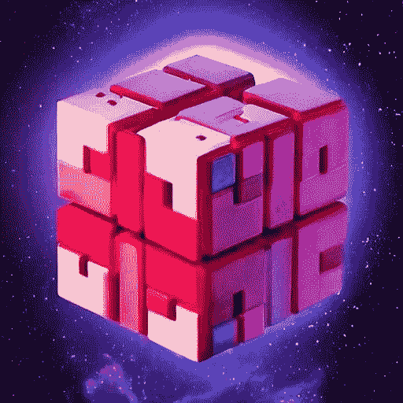

# 在 3D 编程：我迈向量子计算的第一步

> 原文：[`towardsdatascience.com/programming-in-3d-my-first-steps-into-quantum-computing-566b9b93929d?source=collection_archive---------6-----------------------#2023-02-22`](https://towardsdatascience.com/programming-in-3d-my-first-steps-into-quantum-computing-566b9b93929d?source=collection_archive---------6-----------------------#2023-02-22)

## 教程

## 多维度计算的世界

 [Kory Becker](https://medium.com/@KoryBecker?source=post_page-----566b9b93929d--------------------------------)

·

[关注](https://medium.com/m/signin?actionUrl=https%3A%2F%2Fmedium.com%2F_%2Fsubscribe%2Fuser%2F9f206469e308&operation=register&redirect=https%3A%2F%2Ftowardsdatascience.com%2Fprogramming-in-3d-my-first-steps-into-quantum-computing-566b9b93929d&user=Kory+Becker&userId=9f206469e308&source=post_page-9f206469e308----566b9b93929d---------------------post_header-----------) 发表在 [Towards Data Science](https://towardsdatascience.com/?source=post_page-----566b9b93929d--------------------------------) ·9 分钟阅读·2023 年 2 月 22 日

--

来源：[Stable Diffusion](https://stablediffusionweb.com/)。

# 我记得我的第一次量子体验

我在 2018 年的 Grace Hopper ([GHC18](https://ghc.anitab.org/2018-attend/)) 大会上发言。我刚刚参观了人满为患、令人不知所措的供应商展览，并正在寻找一个可以坐几分钟的地方。

结果是，我坐下来观看了 IBM Quantum 关于使用 [Qiskit](https://qiskit.org/) 的介绍演讲，Qiskit 是一个开源的量子计算框架。

# 透过镜子窥视

演示基本介绍了量子位的概念以及[叠加态](https://medium.com/towards-data-science/the-magic-of-quantum-computing-a-beginners-guide-to-writing-a-magic-number-guessing-game-c1cdb384f457)。

我当时对叠加态一无所知，但我发现这个演示非常迷人。

想象一下，计算机中的一个比特能够同时表示值 0 和 1 的概念。

*这怎么可能呢？*

尽管这**最终**开启了我对[量子计算](https://medium.com/towards-data-science/the-magic-of-quantum-computing-a-beginners-guide-to-writing-a-magic-number-guessing-game-c1cdb384f457)的基础了解，但它也让我对编程的全新层次有了新的认识。

这感觉就像是在进行 3D 编程。

# 量子世界中的编程
