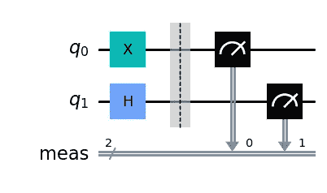
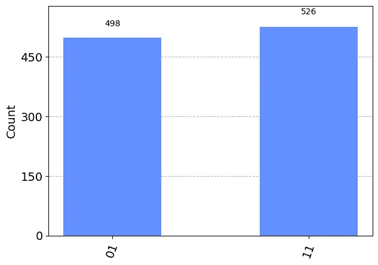

# 在三维中编程：我迈出的量子计算第一步

> 原文：[`towardsdatascience.com/programming-in-3d-my-first-steps-into-quantum-computing-566b9b93929d`](https://towardsdatascience.com/programming-in-3d-my-first-steps-into-quantum-computing-566b9b93929d)

## 教程

## 多维计算的世界

[](https://medium.com/@KoryBecker?source=post_page-----566b9b93929d--------------------------------)[](https://towardsdatascience.com/?source=post_page-----566b9b93929d--------------------------------) [Kory Becker](https://medium.com/@KoryBecker?source=post_page-----566b9b93929d--------------------------------)

·发表于[Towards Data Science](https://towardsdatascience.com/?source=post_page-----566b9b93929d--------------------------------) ·9 分钟阅读·2023 年 2 月 22 日

--


来源：[Stable Diffusion](https://stablediffusionweb.com/)。

# 我记得我的第一次量子体验

我在 2018 年格雷斯·霍珀（[GHC18](https://ghc.anitab.org/2018-attend/)）大会上发言。我刚刚参观了人满为患、令人应接不暇的展位博览会，并且正在寻找一个可以坐一会儿的地方。

结果证明，我坐下来参加了 IBM Quantum 关于使用[Qiskit](https://qiskit.org/)的入门演讲，这是一种开源量子计算框架。

# 透过镜子观察

这个演讲是对量子比特和[叠加态](https://medium.com/towards-data-science/the-magic-of-quantum-computing-a-beginners-guide-to-writing-a-magic-number-guessing-game-c1cdb384f457)概念的基本介绍。

我对什么是叠加态毫无头绪，但我发现这次演讲绝对引人入胜。

想象一下，计算机上的比特能够同时表示 0 和 1 这两个值的想法。

*这怎么可能呢？*

尽管这最初让我对量子计算建立了[基础](https://medium.com/towards-data-science/the-magic-of-quantum-computing-a-beginners-guide-to-writing-a-magic-number-guessing-game-c1cdb384f457)，但它也让我对在完全不同的层次上编程的想法开了眼界。

这感觉就像在三维空间中编程。

# 在量子世界中编程

在经典计算机上，比特以 0 或 1 的值表示。这是一种排他条件。

一个比特可以持有 0 或 1 的值。

然而，它不可能同时是 0 和 1。

另一方面，量子计算机上的量子比特可以同时持有 0 和 1 的值（或介于两者之间的浮动值）。

# *想一想这个问题*

如果我们在经典计算机上有两个比特，我们可以在一个 CPU 周期内表示以下一个值：00、01、10、11。

然而，量子计算机上的两个量子位可以同时表示这些相同的值。这意味着你可以以二次或指数级的速度处理计算！

类似于两个量子位可以同时表示四种不同的值，三个量子位可以表示八个值。同样，四个量子位可以表示十六个值。

虽然经典计算机可以处理每 n 位的 n 个计算，但量子计算机可以处理惊人的 2^n 个计算每 n 个量子位！

只需 50 个量子位，你就可以在一个 CPU 周期内处理 2⁵⁰个计算。

这相当于在程序的单次运行中处理超过 140,000 GB 的数据。

# 在更高维度中思考

由于量子计算可以同时处理每个量子位的多个状态，因此编写程序时你开始以完全不同的方式思考。

与其编写一个使用单一比特的程序并期望它在特定计算中得到 0 或 1 的结果，你必须开始考虑一系列的百分比。

所以，一个量子位可能在一半时间里为 0，另一半时间里为 1。

这听起来很混乱，我最初也感到困惑——*实际上，到现在仍然感到困惑！*

然而，让我们考虑一个有趣的示例来理解编写经典程序与编写量子计算机程序之间的核心区别。

# 我说你好，你说再见

假设我们想编写一个程序，根据传入的参数值为 1 或 3，输出“你好”或“再见”。

如果函数接收到输入 1，我们输出单词“你好”。

如果函数接收到输入 3，我们输出单词“再见”。

这两个值在二进制中相差仅一位（1 = 01，3 = 11）。我们将第一个、最低有效位固定为 1。这两个值作为量子计算机的一个方便示例。

让我们看看如何用它来编写一个普通的经典程序。

```py
def greeting(input):
  if input == 1:
    print('Hello')
  elif input == 3:
    print('Goodbye')

greeting(1)
greeting(3)
```

> 你好
> 
> 再见

这就是在二维层面上编程。

我们有一个可以理解的函数，它接受一个数字输入。我们使用条件语句来检查值是否为 1 或 3。然后相应地输出消息。

每次执行此函数时，我们都知道根据输入输出的结果是什么。

让我们看看在量子计算机上这是什么样子的。

# 在 3D 中编程

我们可以使用量子计算框架 Qiskit 来创建我们的程序，如下例所示。

```py
# Create a quantum circuit with 2 qubits.
qc = QuantumCircuit(2)

# Initialize the simulator.
simulator = Aer.get_backend('aer_simulator')

# Invert the first qubit (q0) to a value of 1.
qc.x(0)

# Place the second qubit (q1) into superposition for a value of 0 AND 1.
qc.h(1)

# Measure the result.
qc.measure_all()
```



生成 2 比特数字 01（1）或 11（3）的量子计算程序。第一个量子位（q0）设置为 1。第二个量子位（q1）处于 0 和 1 的叠加态。来源：作者，由 Qiskit 生成。

上面的程序使用了两个量子比特。就像我们的经典程序使用输入 1 或 3 来输出消息一样，我们可以通过使用两个量子比特在量子计算机上表示相同的两个值。

由于二进制中两个值 01 (1) 和 11 (3) 都需要最不重要的位为 1，我们通过反转第一个量子比特（使用 X-gate）来使其持有值 1。

# *现在，这里来到了惊人的部分*

我们的量子程序可以同时持有两个不同的值！

当最不重要的量子比特 (q0) 固定为 1 时，最重要的量子比特 (q1) 将同时持有 0 和 1 的值，从而有效地表示整数 1 或 3。如果这个量子比特最终测量为 0，则结果二进制为 01，从而得到整数 1。如果量子比特测量为 1，则结果二进制为 11，得到整数 3。

**两个量子比特几乎可以同时表示数字 1 和 3！**

让我们运行程序，看看输出结果。

```py
# Execute the circuit.
job = execute(qc, simulator)
result = job.result()
counts = result.get_counts()
```

> {‘11’: 526, ‘01’: 498}

量子计算机输出两个量子比特测量为 11 或 01 的次数。在这两种情况下，请注意只有最重要的量子比特（即左侧的那个）在变化。

这是我们放置于叠加态的量子比特 (q1) —— 这就是感觉像在 3D 中编程的地方！

我们不再考虑单一值。而是，我们现在必须考虑 *多个* 值。具体来说，我们必须同时考虑 1 和 3 作为输入到我们的问候程序中。



量子计算机上 1 或 3 的结果分布。来源：作者。

一半时间我们会收到 1 作为函数输入，而另一半时间我们会收到 3。

我们的函数输出的消息直接与第二个量子比特 (q1) 处于 0 或 1 状态的机会相关。

# 运行量子版本

理解量子程序会返回多个值的想法需要大量思考。

由于我们将返回多个值，我们需要更改问候程序以考虑这两种情况。

```py
def qgreeting(counts):
  if counts['01'] > 0:
    print('Hello')
  if counts['11'] > 0:
    print('Goodbye')

qgreeting(counts)
```

> 你好
> 
> 再见

上面的程序略微修改了我们原来的经典实现，即我们现在检查量子电路测量结果中是否有任何计数大于零。如果有，我们输出结果。

请注意，经典版和量子版问候函数之间的重要区别：

+   经典版需要调用 *greeting()* 函数两次以输出两条消息。

+   量子版本只需要调用一次 *qgreeting()* 即可输出相同的消息。

# 叠加问候

到目前为止，我们已经修改了问候程序以检查量子比特测量的计数。这使我们能够从一次调用中输出两个消息，这有助于我们理解程序中多个结果的量子性质。

然而，由于量子比特确实同时表示多个值，与其展示两个单独的问候语，也许我们可以将两个问候语叠加在一起！

```py
def qgreeting(counts):
    message = ''

    # Define our messages.
    hello = 'Hello'
    goodbye = 'Goodbye'

    # Get the total number of measurements counts.
    total = counts['01'] + counts['11']

    # Calculate the percentage from the counts for "hello" and "goodbye".
    percent_hello = counts['01'] / total
    percent_goodbye = counts['11'] / total

    # Calculate the number of letters to use from "hello" and "goodbye".
    hello_chars = math.ceil(len(hello) * percent_hello)
    goodbye_chars = math.ceil(len(goodbye) * percent_goodbye)

    # Combine the two greetings into a single message.
    for i in range(hello_chars):
        message += hello[i]
    for i in range(goodbye_chars):
        message += goodbye[i]

    # The result is magic!
    print(message)

qgreeting(counts)
```

> HelGood

哇——我们将两个消息（“你好”和“再见”）叠加在一起，并将它们合并为一个问候语（“HelGood”）。

从每个问候语输出的字母数量来自我们量子程序中每个结果 01（1）和 11（3）的测量计数。

由于我们的量子电路有 50/50 的机会得到任何结果，因此我们将每个问候语的前一半组合在一起也就不足为奇。

# *好吧，也许这也不完全正确*

将两个问候语合并在一起确实可以体现量子程序同时表示的多重值，但仍然有些令人困惑。

相反，让我们将多个量子态解析为一个单一的答案。

# 展平量子

正如我们所见，量子*qgreeting()* 使用量子程序测量结果中的百分比计数来输出消息。

由于我们对每个结果都有测量计数，让我们只取数量最多的计数，并将其作为输入传递给我们原始的经典问候方法。

如果量子程序的结果是 {‘11’: 529, ‘01’: 495}，我们将使用二进制结果 11，其等于 3，因为它的计数最多。

# 多数规则

让我们使用这种方法，通过选择数量最多的值并将其作为输入传递给我们的经典程序来运行我们原始的经典问候方法。

```py
for i in range(6):
  # Execute the circuit.
  job = execute(qc, simulator)
  result = job.result()
  counts = result.get_counts()

  # Find the most frequent hit count.
  key = max(counts, key=counts.get)

  # Since the quantum computer returns a binary string (one bit for each qubit), we need to convert it to an integer.
  num = int(key, 2)

  # Display "Hello" or "Goodbye".
  greeting(num)
```

> 你好
> 
> 再见
> 
> 再见
> 
> 再见
> 
> 你好
> 
> 再见

这似乎更为现实。

我们现在选择数量最多的计数，并使用该消息作为输出。这实际上被称为在[计算基](https://quantumcomputing.stackexchange.com/questions/1410/what-is-meant-by-the-term-computational-basis)态下测量。

注意，每次执行量子电路时输出的消息都不同。这是由于我们放置在叠加态中的单个量子比特（在最重要的量子比特上）。

我们不再拥有一个完全确定的程序，可以对输出结果有确定性。相反，我们的程序运行在量子宇宙中！

# 量子计算能力和复杂性

我们可以在量子计算程序中几乎同时表示多个值，这真是令人着迷。

然而，当我们开始考虑程序中的 3、4、10、20 或 100 个量子比特时，很容易看到这变得多么复杂。

如果只有一个量子比特被置于叠加态（即有 50/50 的随机概率结果为 0 或 1），理解起来可能不会太困难。毕竟，其他量子比特将保持最初分配的固定值。只有处于叠加态的量子比特会拥有多个可能值。然而，当一个或多个量子比特处于叠加态时，情况变得越来越复杂——但同时也变得越来越强大！

实际上，与经典计算机相比，叠加态是量子程序在性能上获得二次方和指数级提升的核心。由于量子比特可以在单个 CPU 周期内表示多个状态，因此它们能够处理比经典计算机更多的比特排列。

现在，我希望你能逐渐明白，编程量子计算机就像在编程 3D 一样。简单来说，这与经典编程是完全不同的层次！

# 这听起来有趣吗？

我希望这次对量子计算的初步探索能像激发了我的兴趣一样，激发你的兴趣。

我确实相信，正是这种高维思维使量子计算如此引人入胜，特别是对于那些希望在全新层次上提升技能的程序员来说。

你可以在[这里](https://gist.github.com/primaryobjects/07db824f3b1b06cf4dbace6f2725052f)下载问候程序的完整代码示例。

# 关于作者

如果你喜欢这篇文章，请考虑在[Medium](https://medium.com/@KoryBecker)、[Twitter](https://twitter.com/PrimaryObjects)以及我的[网站](https://primaryobjects.com/)上关注我，以便获取我未来的帖子和研究成果的通知。
