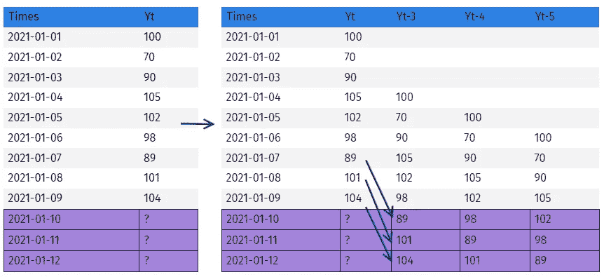

# 促销预测：零售巨头的案例研究

> 原文：[`towardsdatascience.com/promotion-forecasting-case-study-with-a-retail-giant-4d8dcbae6b5c`](https://towardsdatascience.com/promotion-forecasting-case-study-with-a-retail-giant-4d8dcbae6b5c)

## 了解一个使用机器学习、NLP 和领域专长的需求预测算法如何在短短一年内在国家范围内实现令人印象深刻的 18%缺货和短缺减少。

 [Alexandre Warembourg](https://medium.com/@AlexandreWarembourg?source=post_page-----4d8dcbae6b5c--------------------------------)

·发表于 [Towards Data Science](https://towardsdatascience.com/?source=post_page-----4d8dcbae6b5c--------------------------------) ·阅读时间 7 分钟·2023 年 12 月 30 日

--

来源：图像由 Dall-E 根据作者的提示创建。

# 引言：面临的挑战

在零售领域，全球领先的奥尚面临着一个关键挑战：掌握促销预测的艺术。这个故事讲述了我们如何利用机器学习、自然语言处理（NLP）和深厚的领域知识取得突破——在短短一年内将缺货和库存过剩减少了 18%。

# 场景设定

在促销活动进行的每个商店中，准确预测这些促销商品的需求是一个关键挑战。目标是明确但复杂的：准确对齐供应与不断变化的客户需求，以避免库存过剩并确保客户满意度。

在奥尚零售国际的数据预测团队中，我开始了一个使命。我们的目标是制定一个在不同国家之间适应性强的预测模型，尽可能减少更改。这个为奥尚乌克兰开发的模型后来也应用于罗马尼亚和法国，成为他们促销战略的重要组成部分。

# 预测挑战

我需要为奥尚乌克兰的 22 家超市提供每日的预测。这些预测分为常规商品和生鲜商品，并延伸至 55 天。目标是预测整个促销活动中店铺和 SKU 级别的需求。

## 数据和粒度

在商店中预测促销期间的销售量可能非常具有挑战性，尤其是当涉及到各种产品和不可预测的销售模式时。这种方法测试了我们的极限。

我们的策略围绕现有的促销定价、展示和日期展开，因为大约三分之一的产品缺乏历史促销数据。我们的建模工作集中于利用在售产品和促销产品的销售数据。我们专门为促销设计了特征，确保每一个方面都被捕捉到。

## 关于特征工程

两个模型都受益于各种特征，包括常见的时间特征，如星期几、周、月等。结合销售汇总、产品和商店属性以及促销中的复杂目标编码。

最重要的特征当然是我们包括的促销内容：促销属性如机制、促销折扣率、促销期间的产品展示、上次促销前的周数、折扣金额、促销持续时间，在日常层面上最重要的特征之一是促销动量，这表明第 4 天对于 7 天促销特别突出。

当然，我们还包括了大量的历史促销汇总，一些动量，静态和动态汇总。这些特征使我们能够有效地捕捉零售需求的复杂动态。

# 双模型策略

我选择使用机器学习算法而不是统计模型，甚至传统线性模型，是因为可以一次性建模和预测广泛范围的产品，并且机器学习特别擅长利用促销、事件、价格等外部因素。

选择 LightGBM 至关重要，因为它的效率和管理非线性复杂特征的能力。直接预测方法以及全特征方法，加上量身定制的交叉验证策略，帮助我们管理不稳定的促销模式并保持稳定性。

这些交叉验证策略截然不同：

+   第一个模型受益于减少窗口方法，以减轻旧促销的历史效应，因为消费者的促销行为变化迅速。

+   第二个模型使用了扩展窗口方法

## 第一个模型：我们的强大基线

我基于广泛的探索性数据分析（EDA）和观察到的过去促销的平均值是一个强有力的估算器，构建了一个特征丰富的树模型算法。该算法完全由促销销售和属性（以及用于表征产品、商店、促销、事件等的分类特征）驱动。

为了更好地理解模型的结构，可以将其视为‘特征全面预测模型’，这一术语在[我的文章（它是**最近聚合方法部分**的衍生）](https://medium.com/towards-artificial-intelligence/the-endless-possibilities-of-forecasting-in-data-science-a52237b26243)**中详细解释**。

该模型旨在根据过去的促销销售数据和属性预测特定商店和 SKU 的未来促销总销售额。我们使用了基于树的算法，根据过去的促销销售、价格和属性数据以及未来促销属性数据来预测未来。

为了改进我们的第一个模型，我们使用了‘镜像 SKU’方法。这涉及到使用现有数据创建每个新产品的镜像，并重建所有必要的特征以进行准确的预测。

## 第二种模型：处理极端情况

来源：作者提供的图片

第二种模型使用‘直接模型预测’的方法，更具动态性。每天，产品和商店都有其自身的特征，算法会根据产品是否会促销或在后备架上来预测次日的销售情况。

预测基于多个因素，包括倒数第 n 天的销售情况、倒数第 n 天的促销平均值，以及最近四个星期三促销的均值等。特征经过调整，以利用低粒度来捕捉更准确的预测，包括季节性、事件、趋势、促销动量或价格动量等。此模型适用于有足够销售历史的 SKU。

## 选择正确的指标

我们与需求规划师合作，定义了评估的范围。这包括整个操作在 SKU 和 STORE 级别的聚合需求，排除了在整个 14 天内没有销售的操作。

我们使用了如 WMAPE（加权平均百分比误差）、偏差和在特定阈值下的准确操作数量等指标，结合了总过剩库存和与规划师预测相比的总缺货数量等业务指标。这些指标通过对整年数据的详细回测计算得出，以验证我们的算法在任何时间框架内的稳健性，并考虑了趋势和季节性。

# 数据预处理

促销对所有利益相关者来说是一个复杂的数据处理过程，因此数据准备至关重要。这包括：从促销目录数据集中重建促销，利用 EDA 确定实际的促销开始日期，并填补有促销但没有销售的数据空白。我们还优化了促销机制，并解决了如促销价格高于最新货架价格等定价异常问题，从而提高了模型的准确性。我通过纠正促销日期的不准确性和解决数据预处理中通过 EDA 揭示的各种短缺来“微调”数据。此步骤对于使我们的预测与实际销售对齐至关重要。

一个显著的发现是促销开始时的实际短缺，没有销售。我们假设这是一个配送问题，销售加速后的缺货是由于规划者对单位的指挥不足。要找到这些短缺，简单的方法是追踪高轮换产品的无销售情况，观察它们的最新销售，验证同一天、同品牌和同系列内是否有促销活动对需求造成了侵蚀，如果这些条件都满足，那么产品因指挥不足而缺货的可能性很高。

另一个有意义的短缺是促销结束时的缺货，对于中高轮换产品，存在累计无销售的模式，或者促销势头中断并下降直到无销售，当我们发现这些情况时，可以对缺货潜力进行假设。如何轻松找到这种情况？反向操作，找到促销中的最后一天无销售或急剧下降的日期，并回顾尝试找到势头变化，与另一家商店的相同产品促销进行比较以确认你的偏见。

## 解决有限历史数据的问题

对于具有稀疏促销历史的新产品，我开发了“镜像 SKU”方法，显著提高了预测准确性。该方法量体裁衣，旨在透明，并遵循了这一启发式规则：

对于每个没有历史销售记录的 SKU（我们的目标）……

1.  根据产品销售属性生成高质量的 SKU 候选，选择最优子集作为 Brand X 子系列。

1.  计算候选与目标之间的产品描述距离（使用 NLP 算法如 TFIDF 和余弦距离）。

1.  计算目标和候选之间的促销价格距离作为绝对差异

1.  通过最小化两个指标对 2.和 3.的推荐进行排名。

1.  提取 3 个镜像 SKU。

将该方法与我们上面定义的第一个模型的交叉学习相结合，导致新产品预测的指标提高了 25/30%。

# 超越实施

在模型部署后，我们提供了详细的销售分析和置信区间。这些见解赋予了需求规划师更多的数据驱动决策能力。

与利益相关者密切合作对于将模型适应零售复杂性和定制化至具体需求至关重要。他们的见解对于改进算法以实际应用于零售环境中极为宝贵。

## 影响

我们的模型不仅超越了传统的预测方法，还在需求规划师的预测上提高了 15%。这使得每年为规划师节省了超过 30,000 小时，并且在全国范围内减少了 Auchan 乌克兰的 18%库存过剩和短缺，从而带来了 100,000 美元的利润。

# 结论

这段旅程突显了数据科学在零售预测中的变革力量。这证明了有针对性、数据驱动的策略如何带来实质性的运营改进和效率。
