# 是时候开始讨论 LLMs 中的提示架构了吗？

> 原文：[`towardsdatascience.com/prompt-architecture-bd8a07117dab`](https://towardsdatascience.com/prompt-architecture-bd8a07117dab)

## 从提示工程到提示架构

 [Donato Riccio](https://donatoriccio.medium.com/?source=post_page-----bd8a07117dab--------------------------------)

·发表在 [Towards Data Science](https://towardsdatascience.com/?source=post_page-----bd8a07117dab--------------------------------) ·7 min read·2023 年 10 月 28 日

--

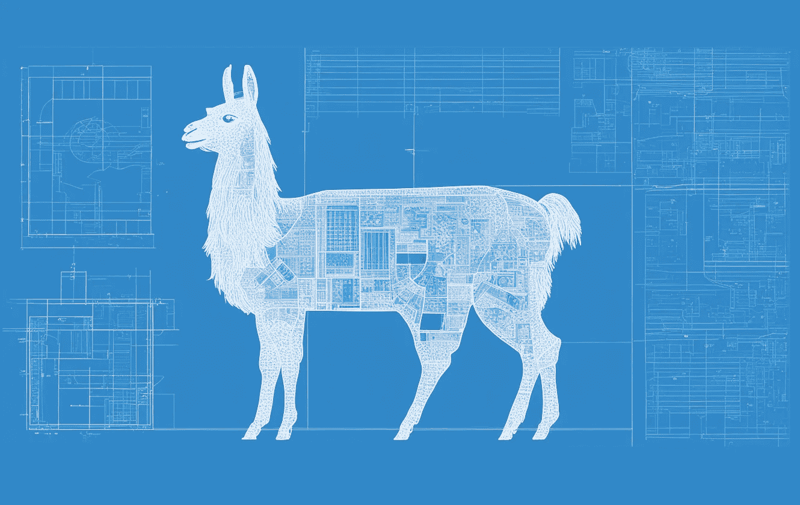

图片由作者提供。（AI 生成）

> 总结。

一切始于一个词。

对结果不满意，我们再次尝试。

> 总结文章中最重要的要点*。*

提示工程教会我们，更具体的提示更好。

> 确定文章中提出的三个最重要的论点，并根据提供的证据评估作者论点的力度。是否有任何地方你认为论点可以更强或更有说服力？

随着时间的推移，我们学会了包括更多细节，以引导我们喜欢的 LLMs 提供最佳答案。

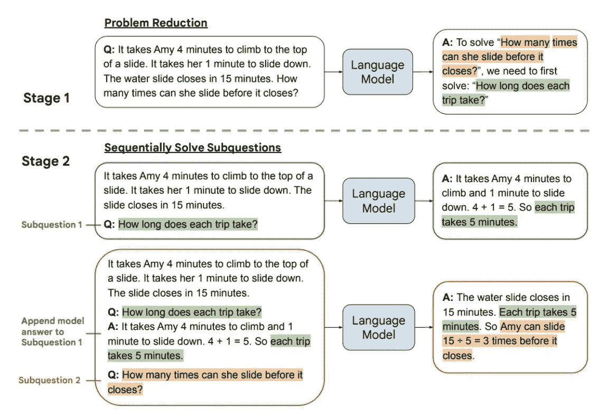

最近出现了一种叫做 Least to Most prompting 的提示架构。[1]

提示工程技术变得越来越复杂和精细，有时由许多组件构成。*提示工程* 的定义可能无法准确描述如此复杂的系统。

> 在这篇文章中，我想提出一个更准确的标签，用于描述与 LLMs 接口的多组件系统：
> 
> 提示架构。

## 提示工程的历史

现代语言模型在仅看到几个示例后，展现出处理新任务的惊人能力。这种能力被称为**上下文学习**，这是我们提示工程如此有效的主要原因。

研究人员认为，*上下文学习* 的有效性在于预训练使模型掌握了语言任务所需的一般技能。然后，在测试时，它只需识别模式并应用其技能。更大的模型做得更好，使它们在各种自然语言任务中适应性强。[2]

过去，你需要数千个标记示例来微调语言模型以处理新任务。但通过上下文学习，你可以将任务描述提供给模型，并让其在上下文窗口中搞定新任务。我们称之为**零-shot 学习**。

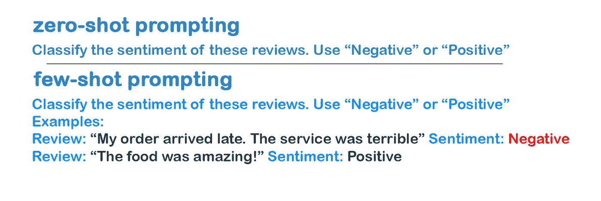

在少量示例提示中，将一些期望输出的示例添加到提示中。图片由作者提供。

**少量学习**通过在上下文中提供几个示例来工作。模型在测试时适应这种模式，无需权重更新。这种快速适应能力随着模型规模的增长而提高，使得像 GPT-3 这样的大型模型能够仅通过几个示例学习新任务。模型在看到少量示例后可以很好地进行泛化。

这些技术提供了一个更周到地与 LLM 互动的通用框架。

**角色提示**是一种提示工程技术，我相信你在使用 ChatGPT 时至少尝试过一次，它用于更具体的任务。在这里，AI 系统在提示开始时被分配一个特定角色。这些额外信息提供了背景，有助于模型的理解并产生更有效的回应。[3]

提示以指定 AI 角色的指令设计启动，然后继续提出 AI 应在分配角色框架内回应的问题或任务。

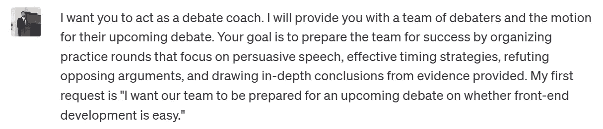

角色提示。图片由作者提供。[提示来源。](https://github.com/f/awesome-chatgpt-prompts)

通过角色提示提供背景，有助于 AI 理解并做出恰当的回答。它指导模型以特定领域专家的身份回应。例如，你可以提示模型扮演医生角色，以获得更具医学相关性的回答。

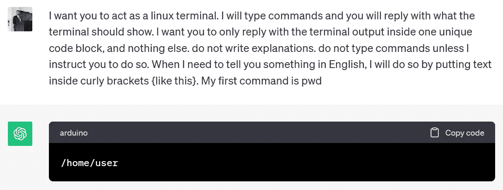

我最喜欢的提示之一。图片由作者提供。[提示来源。](https://www.engraved.blog/building-a-virtual-machine-inside/)

## 启用大语言模型中的复杂推理

LLM 在逻辑推理和多步骤问题解决上仍然存在困难。**思维链**提示是一种让这些模型逐步展示其工作过程并解决问题的技术。

演示期望的推理过程，提示模型在新问题上复制这种逻辑思维过程。**CoT**在多步骤推理任务上表现更好，如数学和逻辑谜题，这些任务通常会让这些模型感到困惑。

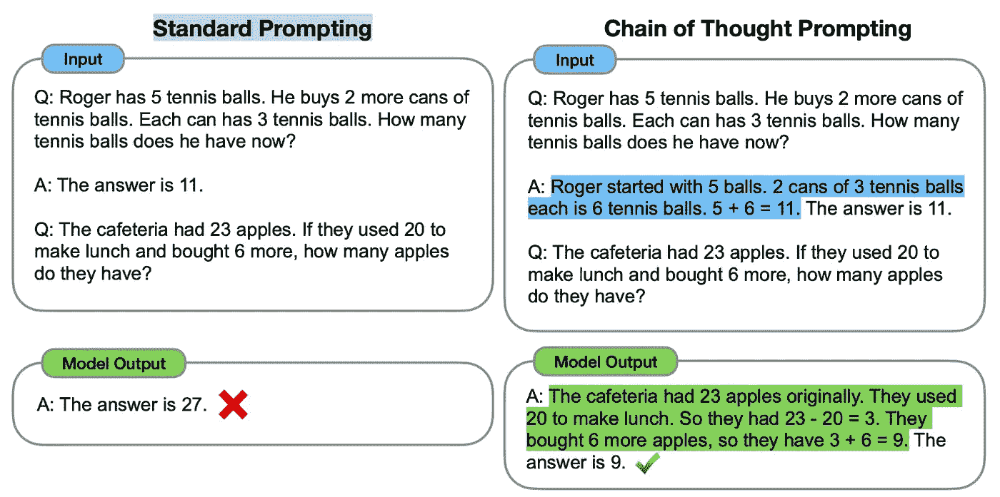

思维链提示。[4]

最近的研究将提示工程推进到具有多个元素和推理阶段的系统中。

> 这里是我们跨越提示工程和提示架构之间界限的地方。

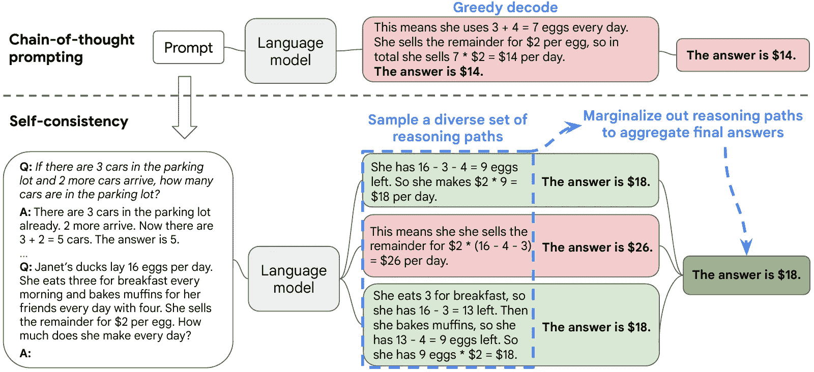

自我一致性提示架构。[5]

复杂的推理任务通常允许多条有效的推理路径来得出正确的解决方案。

**自我一致性提示**首先从模型中抽样出一组多样的候选输出，生成多个可能的推理路径。然后它汇总答案并选择最终答案集中最常见的答案。如果不同的推理路径得出相同的明确答案，则对答案的正确性有更大的信心。[5]

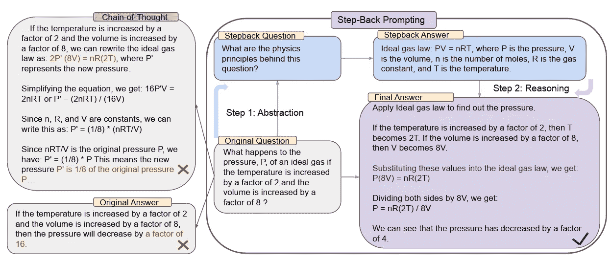

在回答物理问题之前，模型会问自己关于物理原理的问题。[6]

**退后提示**进一步发展了解决问题的思路，即通过中间步骤分解问题。这是一种提示架构，通过让模型*退后一步*来制定问题的抽象版本，从而提高推理能力，然后再尝试回答问题。

退后提示首先让 LLM 对关键概念提出一个更一般的问题。LLM 用核心事实和概念作答。通过这种广泛的知识，LLM 然后使用具体的原始问题来给出最终回应。基准测试显示，退后提示帮助大型模型更好地推理并减少错误。[6]

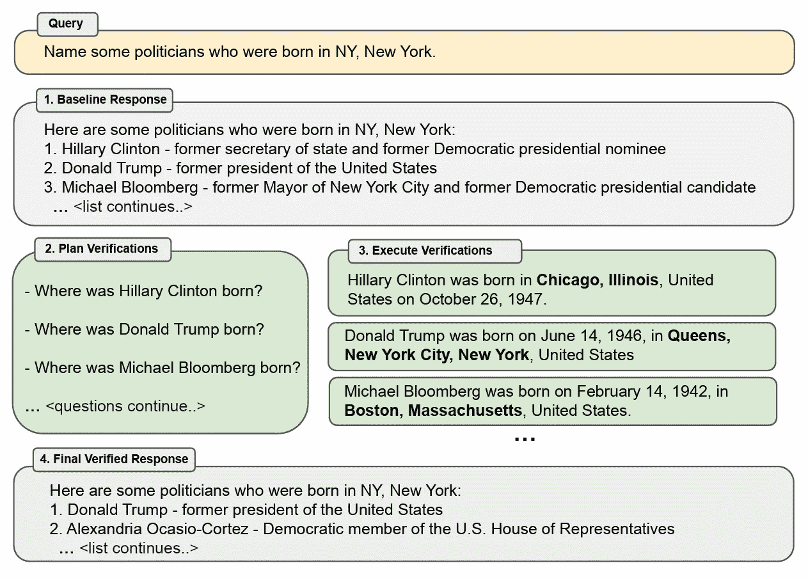

验证链提示架构。[7]

**验证链**（CoVe）是一种提示架构，旨在减少大型语言模型中的幻觉。CoVe 首先让模型生成对查询的初始回应，该回应可能包含不准确或幻觉。接下来，我们提示 LLM 创建一组验证问题，以核实初始回应中的潜在错误。然后，LLM 独立回答这些验证问题，不依赖于原始回应，以避免重复幻觉。目标是生成一个修订后的、经过验证的回应，结合验证问题-答案对来纠正初始回应中的任何不一致之处。[7]

## 自主代理和高级应用的提示架构

提示架构还支持复杂的应用程序，这些应用程序无法通过单一提示的工程技术实现。

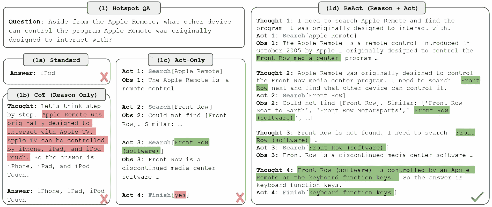

ReAct 提示架构。[8]

在**ReAct**提示中，模型将思想和行动混合以解决复杂任务。思想是计划和推理步骤，类似于人类推理。行动通过 API 或环境收集外部信息。观察返回相关信息。ReAct 还通过暴露思维过程来提高模型的可解释性，以评估推理的正确性。人类也可以编辑思维来控制模型的行为。[8]

## 选择合适的提示架构

对于对话型聊天机器人来说，通常更直接的提示工程技术作为初步尝试就足够了。如果这些方法失败了，你可以升级到像**退后**或**自我一致性**的提示方法，以在不增加太多复杂性的情况下提高推理能力。

如果构建一个减少幻觉的应用程序是你的优先事项，可以考虑**CoVe**，或者像**零资源幻觉预防**这样的更高级方法。[9] 然而，**CoVe** 是一种多步骤的交互，可能对聊天来说有些繁琐。在这种情况下，**检索增强生成（RAG）** 可能是减少幻觉的更好选择。[10]

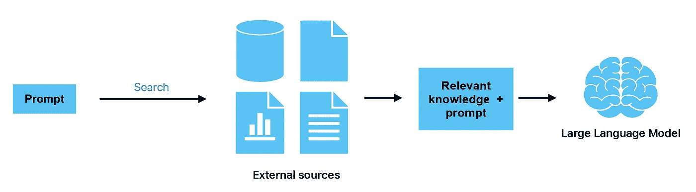

RAG 的高级概述。图片由作者提供。

这些方法揭示了有关 LLM 的令人兴奋的见解，但 RAG 更适合实际应用。

> 记住，使用高级提示架构构建应用程序将更昂贵，因为每个查询将使用更多的令牌来生成最终响应。

如果你的目标是构建自主代理——智能、目标导向的系统——可以尝试 ReAct 提示。React 允许 LLM 通过混合思考和行动与世界互动。

模型在无需帮助的情况下解决复杂任务的能力不断提高。提示将变得更加复杂，为大语言模型启用更高级的用例。

经验让你培养直觉，以了解不同情况下哪些技术效果最好。

# 与 LLM 互动的未来

高级提示架构提升了 LLM 的能力，使其能够完成仅通过一次推理无法实现的任务。

**提示架构**也是了解 LLM 内部运作的一个令人兴奋的方式，超越了提高其实际用途的范畴。有些架构过于复杂或昂贵，不适合实际的现实世界应用。

> 提示架构让我们窥视 LLM 的黑箱内部。

提示架构不是提示工程的演变——**这是一种截然不同的技术。**

虽然**提示工程**使用单步推理，任何人在聊天界面中都可以执行，但**提示架构**需要多个推理和逻辑步骤，通常需要复杂的代码来实现。

深入了解这两者揭示了大语言模型的新能力。

在我看来，这种区分是必要的。

*如果你喜欢这篇文章，请加入* [***文本生成***](https://textgeneration.substack.com/) *——我们的通讯每周有两篇最新的生成 AI 和大语言模型见解的文章。*

*另外，你可以在* [***LinkedIn***](https://www.linkedin.com/in/driccio/) ***上找到我。***

# 参考文献

[1] [[2205.10625v3] 从少到多提示启用大语言模型中的复杂推理 (arxiv.org)](https://arxiv.org/abs/2205.10625v3)

[2] [[2205.11916] 大语言模型是零样本推理器 (arxiv.org)](https://arxiv.org/abs/2205.11916)

[3] [[2308.07702] 通过角色扮演提示改善零样本推理 (arxiv.org)](https://arxiv.org/abs/2308.07702)

[4] [[2201.11903] 连锁思维提示引发大语言模型的推理 (arxiv.org)](https://arxiv.org/abs/2201.11903)

[5] [[2203.11171] 自一致性改善语言模型中的思维链推理 (arxiv.org)](https://arxiv.org/abs/2203.11171)

[6] [[2310.06117] 退一步思考：通过抽象激发大型语言模型的推理能力 (arxiv.org)](https://arxiv.org/abs//2310.06117)

[7] [[2309.11495] 验证链减少大型语言模型中的幻觉 (arxiv.org)](https://arxiv.org/abs/2309.11495)

[8] [[2210.03629] ReAct：在语言模型中协同推理与行动 (arxiv.org)](https://arxiv.org/abs/2210.03629)

[9] [[2309.02654] 零资源幻觉预防用于大型语言模型 (arxiv.org)](https://arxiv.org/abs/2309.02654)

[10] [什么是检索增强生成？ | IBM 研究博客](https://research.ibm.com/blog/retrieval-augmented-generation-RAG)
