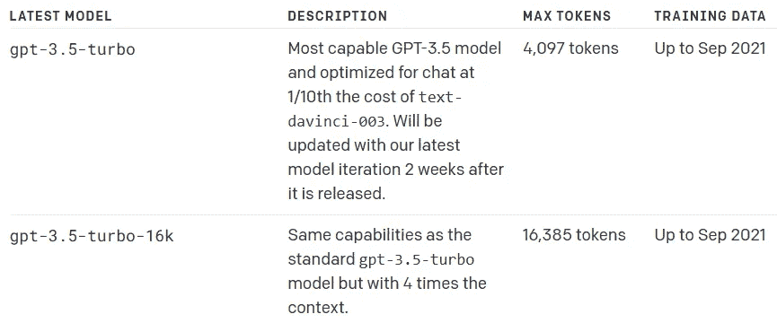

# 提示工程 101：零样本、单样本和少样本提示

> 原文：[`towardsdatascience.com/prompt-engineering-101-zero-one-and-few-shot-prompting-1e8ced03d434`](https://towardsdatascience.com/prompt-engineering-101-zero-one-and-few-shot-prompting-1e8ced03d434)

## 基本提示工程策略的介绍

 [Aashish Nair](https://medium.com/@aashishnair?source=post_page-----1e8ced03d434--------------------------------)

·发表于 [Towards Data Science](https://towardsdatascience.com/?source=post_page-----1e8ced03d434--------------------------------) ·5 分钟阅读·2023 年 9 月 19 日

--

图片来源：[Alexandra_Koch](https://pixabay.com/users/alexandra_koch-621802/?utm_source=link-attribution&utm_medium=referral&utm_campaign=image&utm_content=7720802)来自[Pixabay](https://pixabay.com//?utm_source=link-attribution&utm_medium=referral&utm_campaign=image&utm_content=7720802)

## 介绍

尽管大型语言模型看似拥有超自然的能力，但它们最终还是预测模型，基于提供的上下文来预测下一个词。

因此，它们的表现不仅依赖于训练数据的庞大体量，还高度依赖于用户输入中提供的上下文。

频繁使用 LLM 驱动聊天机器人的用户意识到上下文的重要性。如果没有足够的上下文，聊天机器人，无论是公共服务（例如 ChatGPT）还是定制的 LLM 产品，都将难以执行更复杂的指令。

在这里，我们探讨了一种基本的策略，用于指导大型语言模型（LLMs）正确回答提示：在用户提示中提供上下文。这通常通过三种不同的方法进行：零样本提示、单样本提示和少样本提示。

## 零样本提示

如果你以前与一个由 LLM 驱动的聊天机器人互动过，你可能已经无意中使用了零样本提示。零样本提示意味着完全依赖 LLM 的预训练信息来回答给定的用户提示。

比如，假设我们使用 ChatGPT 作为情感分类器。一个零样本提示的输入可能如下所示：

> **用户提示：** “确定这个句子的情感。”
> 
> 句子：“这个篮球很重。”
> 
> **ChatGPT：** “句子‘这个篮球很重’的情感是中立的。它没有传达出正面或负面的情感，而是提供了关于篮球重量的实际信息。”

当查询被提供时，LLM 在没有额外背景的情况下将此句子评估为中立。

虽然这种方法通常能产生令人满意的回应，但当问题的复杂性较高或答案的标准与常规不同的时候，它可能会不够充分。

对于这种情况，用户可以考虑在提示中提供额外的背景信息。

## 一次性提示

一次性提示涉及在用户提示中提供一个示例，以引导 LLM 生成所需的响应。

在之前的示例中，ChatGPT 认为句子“这个篮球很重”是中立的。

然而，某些用户（例如销售篮球的零售商）可能会认为重的篮球是有缺陷的产品。因此，他们需要确保他们的 LLM 将“重”赋予负面的含义。

一种简单的方法是直接在查询中提供一个示例。

> **提示：**
> 
> “句子：‘这个篮球容易携带’。”
> 
> 答案：“这个句子的情感是积极的。”
> 
> 确定句子的情感。
> 
> 句子：“这个篮球很重”
> 
> 答案：
> 
> **ChatGPT：** “句子‘这个篮球很重’的情感是负面的。它表达了篮球很重，这通常被视为负面特征，尤其是在易用性或游戏性方面。”

这次，ChatGPT 认为同一句子是负面的，因为它使用了提供的示例作为参考。

## 少量示例提示

用户并不总是能提供 LLM 正常工作所需的所有背景信息，仅凭一个示例是无法做到的。

对于这种情况，他们可以通过少量示例提示提供更多背景信息，这包括在用户提示中提供多个示例。

在之前的示例中，我们探讨了使用 ChatGPT 将句子情感分类为“积极”和“消极”。

不过，如果我们想要更广泛的情感标签范围怎么办？例如，我们可以使用“极其积极”、“积极”、“有些积极”、“中立”、“有些负面”、“负面”和“极其负面”这些标签。

为了使 ChatGPT（或其他 LLM 产品）能够结合特定的评分标准，少量示例提示可以是一种有效的策略。

> **用户提示：**
> 
> “句子：这个篮球能放进我的包里。”
> 
> 情感：有些积极。
> 
> 句子：这个篮球在玩了一场比赛后就漏气了！
> 
> 情感：极其负面。
> 
> 句子：这个篮球是橙色的。
> 
> 情感：中立。
> 
> 句子：这个篮球的手感比我习惯的要好一点。
> 
> 情感：
> 
> **ChatGPT：** “有些积极”

通过向 ChatGPT 介绍新的情感标签范围，可以“教会”ChatGPT 使用这些相同的标签来分类句子。

## 为什么我们不能使用无限示例

此时，很容易考虑在用户提示中包含尽可能多的示例以确保成功结果。

毕竟，更多的上下文，效果会更好，对吧？

虽然这可能是这样，但 LLM 受到可用令牌数量的限制。每个 LLM 都有一个**上下文窗口**，即模型可以作为输入的最大令牌数量。

用户可用的令牌数量取决于底层模型本身。通常，具体的数字可以在文档中找到。

例如，OpenAI 的 GPT-3.5 模型的令牌限制在 OpenAI API 文档中有详细说明。

GPT-3.5 模型的令牌限制（来源：[Models — OpenAI API](https://platform.openai.com/docs/models/gpt-3-5)）

用户在编写用户提示时会消耗令牌，因此没有足够的带宽向 LLM 提供大量示例。

相反，他们必须弄清楚 LLM 完成特定任务所需的上下文量，然后确定如何在尽可能少的令牌中提供这些上下文。

## 关键要点

摄影师：[Prateek Katyal](https://unsplash.com/@prateekkatyal?utm_source=medium&utm_medium=referral) 在 [Unsplash](https://unsplash.com/?utm_source=medium&utm_medium=referral)上的照片

总的来说，用户可以从他们的 LLM 中获得令人满意的结果，而*不需要*在提示中提供额外的上下文，因为这些模型已经用大量数据进行了训练。

然而，对于提示复杂或响应需满足特定标准的情况，用户可以通过在提示中包含一个或多个示例（即单样本提示、少样本提示）来受益，前提是他们在分配的令牌数量范围内这样做。

无论你是使用现成的聊天机器人，还是构建自己的定制化大型语言模型（LLM）产品，使用零样本、单样本和少样本提示是一种简单而有效的获取足够结果的方法。

感谢阅读！
