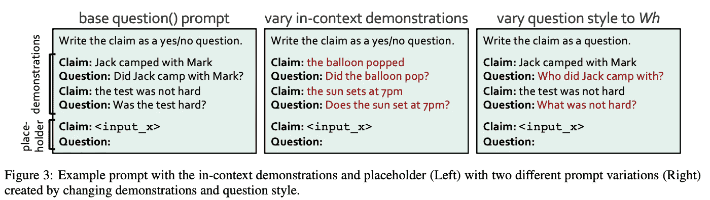

# 提示集使 LLMs 更可靠

> 原文：[`towardsdatascience.com/prompt-ensembles-make-llms-more-reliable-ae57ec35b5f7`](https://towardsdatascience.com/prompt-ensembles-make-llms-more-reliable-ae57ec35b5f7)

## 提高任何语言模型使用效果的简单策略……

 [Cameron R. Wolfe, Ph.D.](https://wolfecameron.medium.com/?source=post_page-----ae57ec35b5f7--------------------------------)

·发表于[Towards Data Science](https://towardsdatascience.com/?source=post_page-----ae57ec35b5f7--------------------------------) ·18 分钟阅读·2023 年 8 月 14 日

--

（照片由[Manuel Nägeli](https://unsplash.com/@gwundrig?utm_source=unsplash&utm_medium=referral&utm_content=creditCopyText)提供，来源于[Unsplash](https://unsplash.com/photos/7CcPLtywRso?utm_source=unsplash&utm_medium=referral&utm_content=creditCopyText)）

任何使用过大型语言模型（LLMs）的人都知道，提示工程是一个非正式且困难的过程。对提示进行微小的更改可能会导致模型输出发生巨大变化，因此很难（有时甚至是不可能）预测更改提示会产生的影响，而且提示行为高度依赖于所使用的模型类型。提示工程的脆弱性是我们在考虑使用 LLMs 创建应用程序时的严酷现实。如果我们无法预测模型的行为，*我们如何围绕这个模型构建一个可靠的系统？* 尽管 LLMs 具有极强的能力，但这个问题使得它们在许多实际场景中的使用变得复杂。

> “提示是一个脆弱的过程，微小的修改可能导致模型预测的大幅变化，因此在为任务设计一个完美的提示时需要付出大量努力。” *— 引自[2]*

鉴于 LLM 的脆弱性，寻找使这些模型更准确和可靠的技术最近已成为一个热门研究话题。在本概述中，我们将特别关注一种技术——*提示集合。* 简单来说，提示集合就是一组多样的提示，旨在解决同一个问题。为了提高 LLM 的可靠性，我们可以通过向 LLM 提出多个不同的输入提示并考虑每个模型的响应来生成问题的答案。正如我们将看到的，关于这一主题的一些研究相当技术性。然而，这些技术背后的基本理念很简单，并且可以显著提高 LLM 的性能，使提示集合成为提升 LLM 可靠性的首选方法。

(来自 [1, 2])

# 背景

在了解关于提示集合和 LLM 可靠性的最新研究之前，让我们先看看与 LLM 相关的一些核心概念和背景信息，这将帮助使本概述更加完整和易于理解。

## 一些前提条件…

(来自 [11, 12, 13, 14])

本文的大部分内容将重点关注提示工程和提示集合。因此，我们不会深入讲解现代大语言模型（LLMs）的背景材料及其创建过程。幸运的是，我写了很多关于这个主题的概述，可以快速获得对这些系统如何运作的基本了解。为了开始，我建议以下资源：

+   LLMs 的历史 [[link](https://twitter.com/cwolferesearch/status/1639378997627826176?s=20)]

+   LLMs 的构建模块 [[link](https://twitter.com/cwolferesearch/status/1635693551584522256?s=20)]

+   语言模型预训练 [[link](https://cameronrwolfe.substack.com/i/85568430/language-modeling)]

+   仅解码器变压器 [[link](https://twitter.com/cwolferesearch/status/1640446111348555776?s=20)]

除了大语言模型之外，我们还应了解提示工程的概念。在与语言模型互动时，我们提供文本输入（即提示），语言模型提供文本完成。这个文本到文本的格式非常灵活，允许通过从 LLM 的输出中提取正确答案来解决各种不同的问题。然而，这种灵活性也可能成为负担，因为在尝试解决问题时，LLM 的输入可以用许多不同的方式进行措辞或表达。提示工程是一门经验科学，研究这个问题并试图找到能最大化 LLM 性能的输入提示。要了解更多内容，请查看以下概述：

+   实用提示工程 [[link](https://cameronrwolfe.substack.com/p/practical-prompt-engineering-part)]

+   高级提示工程 [[link](https://cameronrwolfe.substack.com/p/advanced-prompt-engineering)]

## 可靠性是什么？

在研究可靠性时，提供该概念的精确定义是有用的。如前所述，LLM 可能会相当脆弱。如果我们稍微改变输入，可能会得到截然不同的输出。LLM 的输出往往不可预测且不准确。这些问题在最近的[Chip Huyen](https://huyenchip.com/)的[博客文章](https://huyenchip.com/2023/04/11/llm-engineering.html)中进行了广泛讨论。以下引用概述了使用 LLM 构建应用程序相比于传统编程任务的困难。

> “编程语言大多是精确的……在提示工程中，指令是用自然语言编写的，比编程语言灵活得多……LLM 生成的回应中的歧义可能会成为决定性因素。”

**可靠性是解决方案。** 从高层次看，可靠性指的是系统在处理噪音和抽象或避免 LLM 的不一致行为方面的能力。这可能意味着从提高 LLM 的准确性到改善模型行为的一致性或可预测性。如果我们想最大化 LLM 的效用，就必须找到使其行为更可靠的方法，以便可以围绕 LLM 构建应用程序，而不会出现打破系统的意外“惊喜”。实际上，这意味着我们必须：

+   采取更严格/系统的方法来进行提示工程。

+   寻找使 LLM 更具预测性和准确性的技术。

+   在 LLM 未能匹配我们期望的格式时，实施保护措施/边界。

上述每一点都是提高 LLM 可靠性的步骤。简单来说，我们只希望找到方法，使我们的 LLM 在应用程序中表现得更加一致，从而减少终端用户的困惑，提升体验。如果我们承诺采取更严格的方法来处理 LLM，*完全有可能最小化提示工程的脆弱性，并减少 LLM 的整体歧义*。在这次概述中，我们将主要关注上述第二点——使 LLM 更具预测性和准确性的技术。

## 使用 LLM 解决棘手问题

（来源于[3, 4, 16, 17]）

尽管 LLM 可以通过如 [少样本学习](https://cameronrwolfe.substack.com/i/117151147/few-shot-learning) 等技术解决许多任务，但它们在解决多步骤问题或需要推理的任务时往往会遇到困难[15]。为此，最近的研究探索了如 [思维链（CoT）提示](https://cameronrwolfe.substack.com/p/chain-of-thought-prompting-for-llms) [3] 等技术，包括一些显著的 [扩展](https://twitter.com/cwolferesearch/status/1657122778984660993?s=20) 如 [自洽性](https://cameronrwolfe.substack.com/i/116166267/variants-of-cot-prompting) [4]，以提高 LLM 的推理能力。从这项工作中，我们了解到语言模型已经具备解决困难（基于推理的）问题的能力——我们只需使用正确的提示方法！

> “大型预训练语言模型内建了推理能力，但它们需要特定的提示来释放它们的潜力。” *— 来源于 [1]*

**自洽性**。在使用 CoT 提示方法的情况下，自洽性[4]可以通过*i)* 从同一个模型生成多个不同的输出，以及 *ii)* 使用每个输出答案的多数票作为最终答案来提高 LLM 的准确性；见下文。这种技术通过对一组多样的输出结果进行汇总来提高 LLM 的准确性。自洽性既简单又有效，表明提高 LLM 可靠性的实用技术可能离我们并不遥远。因此，我们可能会想知道：*我们如何进一步利用这种方法？是否还有其他更简单的技术效果更佳？*

(来源于 [1])

**提示集**。自洽性的有效性源于在形成最终答案时考虑的生成输出的多样性。然而，这种技术有一个关键细节需要注意——*所有输出都是用相同的提示生成的*。为了增加生成输出的多样性，我们可以考虑一组多样的提示来解决同一个问题。

> “人们的思维方式不同，[但] 不同的思维往往会得到相同的正确答案。” *— 来源于 [1]*

这种方法，被称为提示集，可以用来生成比自洽性方法更为多样化的模型输出，从而进一步提高 LLM 应用的可靠性。此外，提示集易于理解且可以自动构建，无需大量实施工作。在本文中，我们将探讨关于提示集的最新研究，重点关注使 LLM 更有效的实用工具。

## 其他重要概念

除了迄今为止涉及的观点外，概述中还提到了一些可能对理解有用的小概念和术语。

**自举。** 这是一个在更广泛的计算机科学社区中常用的通用术语。它指的是利用现有资源来做一些新的或有用的事情。在本概述中，我们使用自举来描述在一个系统中利用现有的、预训练的 LLMs 作为组件，生成新的提示以用于集合中。

**弱监督。** 有[许多不同的方法](https://www.geeksforgeeks.org/supervised-unsupervised-learning/)来训练机器学习模型。弱监督是一种介于[监督学习和无监督学习](https://www.geeksforgeeks.org/supervised-unsupervised-learning/)之间的技术。它不像监督学习那样完全依赖于标记数据，但它确实使用某种形式的“标签”作为训练信号。例如，我们可能使用某些启发式方法生成“伪标签”，或在训练过程中使用标记和未标记的数据的组合。有关更多细节，请查看[Snorkel AI](https://snorkel.ai/)的精彩概述，链接[在此](https://snorkel.ai/weak-supervision/)。

**Jaccard 指数。** Jaccard 指数，通常在机器学习社区中称为交集与并集（IoU），用于计算两个有限集合之间的相似性。要计算 Jaccard 指数的值，我们首先找到两个集合之间的交集元素数量，然后将这个数字除以两个集合的并集大小。例如，如果我们有两个集合 `{a, b, c}` 和 `{b, c, d}`，Jaccard 指数将是 0.5（即，两个元素相交，两个集合之间共有四个唯一元素）。

# 提示集合的研究

先前关于 CoT 提示和自洽的研究已经向我们展示了聪明的提示策略可以极大地提高 LLM 可靠解决困难问题的能力。现在我们将超越这些简单的基线，深入研究最近的研究，研究使用 LLM 的提示集合。这类工作提供了大量关于最佳实践的实用知识，我们可以采用这些知识来提高 LLM 的可靠性。

## 逻辑推理步骤中的多样性验证器（DiVeRSE） [1]

> “人们的思维方式各异，[但]不同的思维常常能得出相同的、正确的答案。” *— 引自 [1]*

[1] 的作者探讨了对 CoT 和自洽提示技术 [3, 4] 的扩展，这些技术提高了在复杂的多步骤推理任务中的表现。这个被称为 DiVeRSE 的技术，利用提示集合（即，旨在解决同一问题的不同提示的集合）来增强生成的[推理路径](https://cameronrwolfe.substack.com/i/116166267/chain-of-thought-prompting)的多样性，然后训练一个验证模块以推断每个输出的正确性；见下文。

(引自 [1])

自我一致性和 DiVeRSE 都生成多个推理路径，这些路径被结合形成最终答案。然而，自我一致性从使用相同提示的 LLM 中抽取多个推理路径，而 DiVeRSE 为解决同一问题构造多样的提示集合，并从每个提示中抽取多个推理路径。此外，自我一致性仅对推理路径进行多数投票以形成最终答案。DiVeRSE 采用更复杂的方法：

1.  训练一个验证器/分类器以预测每个推理路径的正确性。

1.  根据正确性对推理路径进行加权平均。

简而言之，DiVeRSE 通过 *i)* 增强生成推理路径的多样性和 *ii)* 在构造最终答案时对可能正确的推理路径分配更多权重，从而提高 LLM 推理能力。

构造提示集合（摘自 [3]）

**构造提示集合。** DiVeRSE 的主要好处之一是使用提示集合来最大化生成输出的多样性。但是，*生成这些提示集合是否昂贵？我们可以自动构造提示集合吗？* 特别是考虑到 CoT 提示，我们可以通过两种主要方式生成提示集合（见上图）：

1.  *重采样：* 给定一个包含问题、答案和 `K` 个推理依据的 CoT 提示，我们可以通过从完整的推理依据集中随机抽取 `R < K` 个示例来生成独特的提示。

1.  *引导自举：* 如果我们的 CoT 提示中没有足够的少样本示例来进行重采样，我们可以简单地提示一个独立的 LLM 生成伪推理路径，以便在执行重采样时包含这些路径。

利用这些技术，我们可以自动生成 DiVeRSE 的提示集合，而无需大量的手动人工努力。

> “因果语言模型没有机制来纠正早期步骤中的前期错误，这很快会导致结果偏离。” *— 摘自 [1]*

**验证模块。** 为了形成最终答案，DiVeRSE 使用验证模块预测每个生成的推理路径的正确性，然后根据这些预测进行加权平均。验证器是一个 [二分类器](https://en.wikipedia.org/wiki/Binary_classification)（例如，基于 [BERT](https://cameronrwolfe.substack.com/p/language-understanding-with-bert) [5] 或 DeBERTa [6]） ，它在由底层 LLM 生成的正确和不正确的推理路径数据集上进行训练。值得注意的是，需要标注数据来生成这个验证器的数据集，因为标签用于确定任何推理路径的最终答案是否实际正确。

在测试时，使用这个验证器为 DiVeRSE 生成的每条推理路径生成一个正确性分数，低正确性分数的路径在最终答案中所占的权重较小。有趣的是，我们在[1]中看到，进行步骤级验证（即训练验证器预测每个单独推理步骤的正确性，而不是整体路径）特别可以大幅提升推理性能；见下文。

步骤级验证与响应级验证（来自 [3]）

**它的表现如何？** DiVeRSE 与基线技术如[贪婪解码](https://lilianweng.github.io/posts/2021-01-02-controllable-text-generation/#common-decoding-methods)和自一致性进行了比较，使用了多种不同的 LLMs，如 davinci (GPT-3)、text-davinci-002 (GPT-3.5)和来自[OpenAI API](https://platform.openai.com/docs/models)的 code-davinci-002。在执行算术、常识和归纳推理的八种不同推理任务中，DiVeRSE 在自一致性基础上取得了一致性改进；见下文。特别值得注意的是，DiVeRSE 与 code-davinci-002 在六个基准测试中达到了最先进的性能，甚至超越了强大的、5400 亿参数的[PaLM 模型](https://cameronrwolfe.substack.com/p/palm-efficiently-training-massive) [7]。

（来自 [1]）

更进一步，作者在[1]中进行分析，展示了* i)* 提示集对推理性能的好处，*ii)* 推理性能在包含一定数量的提示后会达到饱和，并且 iii) 使用验证器（尤其是步骤级验证器）比多数投票表现更好（尽管多数投票简单得多！）；见下文。

（来自 [1]）

## 问我任何事 (AMA) [2]

（来自 [2]）

作者在[2]中探讨了有效构建和使用提示集的实用技术。从高层次来看，提出的技术称为“问我任何事”（AMA），其动机在于消除构建“完美”提示的需求。相反，我们可以通过生成一组不完美（但仍然有效）的提示并汇总其结果，设计一种有效且可靠的提示策略。但，我们需要聪明地汇总这些提示的结果（即多数投票效果不佳！）。此外，我们不能随便使用任何一组提示！特别是，我们在[2]中看到，最有效的提示集利用了鼓励开放式生成的提示。

尽管这听起来很不错，我们可能还有一些问题。*这对所有任务都有效吗？收集提示是否昂贵？我们应如何汇总结果？* [2]中提出的方法旨在既具有可扩展性又通用，意味着它可以用于提高任何模型或任务的性能。这种效率和效果来源于三个主要思想：

1.  *提示结构：* AMA 强调使用开放性提示，而不是那些限制输出令牌的提示。

1.  *可扩展的提示生成：* AMA 不是依靠人工手动编写开放性提示集合，而是使用 LLMs 生成和回答提示，从而减少了对人力的需求。

1.  *弱监督：* 由于多数投票效果不佳，AMA 使用弱监督来学习提示之间的依赖关系，并将 LLM 输出汇总为一个准确的最终答案。

**为什么多数投票效果不好？** 除了提高集合中提示的质量和结构，[2]中的工作受到以下事实的启发：通过对提示集合的 LLM 输出进行多数投票（例如，如自一致性[4]所示）生成最终答案效果不好。但是，*为什么会这样？* 有趣的是，[2]中的作者提供了一个相当清晰且直观的答案。

> “我们观察到准确性平均变化为 9.5%，Jaccard 指数相比于提示错误为 i.i.d.的情况高出 69%。多数投票（MV）是先前工作的主要无监督汇总策略，但它没有考虑到这些属性，使其不可靠。”*— 来源于 [2]*

换句话说，*LLMs 所犯的错误并非随机分布*! 实际上，LLM 在多个不同提示下的输出可能会集中在一个错误答案上。这对多数投票是个巨大问题，因为错误的答案可能实际上是我们的多数投票！为了解决这个问题，我们需要一个更复杂的策略来通过建模集合中提示输出的准确性和依赖关系来检测和处理这种情况。

**构建一个出色的提示集合。** 作为第一步，[2]中的作者研究了构成最有效集合的提示类型。考虑了三种不同的提示技术类别，如下图所示。

不同的 LLM 提示策略（由作者创建）

当这些提示策略进行比较时，我们发现开放式提示格式（即，[Cloze](https://cameronrwolfe.substack.com/i/76273144/training-bert) 和自由格式）优于要求 LLM 输出特定令牌集的限制性提示格式。进一步说，使自由格式提示中的问题更[精准或具体](https://cameronrwolfe.substack.com/i/117151147/what-is-prompt-engineering)也能显著提高准确性。*为什么自由格式提示效果更好？* 答案尚不完全清楚，但自由格式生成更接近于大多数 LLMs 预训练时使用的[下一个令牌预测任务](https://cameronrwolfe.substack.com/i/85568430/language-modeling)，这直观上意味着这些模型可能更擅长处理这种格式的任务。

生成可以提供更多上下文的问答集（由作者创建）

受到开放式提示有效性的启发，AMA 通过生成有关给定输入的一组问题来形成提示集；见上文。这些问题遵循自由格式，并强调输入的不同方面，可能提供有用的互补信息。然而，*手动生成这些问题可能非常昂贵*! 为了避免这一点，我们可以使用 LLMs！在 [2] 中，我们看到 LLMs 可以通过少量示例学习生成有关所需主题的有用问题；见下文。

（出自 [2]）

通过改变使用的上下文示例和采用一组经过实证确定表现良好的提示模板，[2]的作者完全自动化了 AMA 中提示集的构建！

> “为了可靠地汇总提示预测，我们使用弱监督的方法，这是一种从较弱信号源而非标注数据中学习高质量模型的强大方法。” *— 出自 [2]*

**汇总结果。** 我们可以构建提示集，但还有一个问题待解：*我们如何汇总每个提示的 LLM 输出？* 尤其是对于自由格式提示，从 LLM 输出中提取正确答案可能非常困难。 [2]中的汇总方法借鉴了弱监督和图模型的先前工作 [8, 9, 10]。高层次的想法是利用弱监督学习并预测不同提示之间的依赖关系和每个提示的准确性。我们可以使用这些信息来汇总提示并推断最可能的最终答案。与 DiVeRSE 不同，这种方法不需要标注数据，并解决了多数投票的常见失败案例（例如，LLMs 在不同提示上产生相同的错误）。

**AMA 表现如何？** AMA 方法在 20 个不同的基准测试上测试，使用了各种 LLM（即四种不同的模型系列，包括 [BLOOM](https://bigscience.huggingface.co/blog/bloom)、 [OPT](https://cameronrwolfe.substack.com/p/understanding-the-open-pre-trained-transformers-opt-library-193a29c14a15)、 [EleutherAI](https://www.eleuther.ai/language-modeling) 和 [T0](https://github.com/bigscience-workshop/t-zero)），其规模从 1.25 亿到 1750 亿参数不等。[2]中分析的目标是确定 AMA 是否是一种可以在多种不同设置下有效的通用方法。这项分析的结果相当积极。使用 AMA，我们看到小型开源模型（特别是 [GPT-J-6B](https://huggingface.co/EleutherAI/gpt-j-6b)）能够超越像 [GPT-3](https://cameronrwolfe.substack.com/i/88082618/language-models-are-few-shot-learners) 这样的大型模型；见下文。

（来源于 [2]）

当所有不同的模型经过测试后，我们发现中等规模的模型（即 6–20 亿参数）从 AMA 中获得的收益最大；见下文。与基线相比，少量提示技术，AMA 在所有模型和任务中的表现提高了约 10%。因此，它是一种通用方法，可以可靠地提升几乎任何 LLM 的性能。

（来源于 [2]）

AMA 提供了一种构建提示集的深刻方法。该出版物充满了关于如何引导预训练 LLM 编写有效提示的实用建议。在[2]中我们看到，汇总 LLM 对提示集的响应的 методология是极其重要的——多数投票是不够的！[2]中提出的汇总方法在技术上复杂，可能需要实现的努力，但表现良好且不需要监督标签。通过采用如 AMA 这样的方式，我们可以通过使任何 LLM 更准确和一致，从而提高 LLM 的可靠性。

> “我们希望 AMA 和未来的工作能通过提高处理不完美提示的能力和使用小型、私人及开源 LLM 的能力，来解决使用 LLM 的痛点。” *— 来源于 [2]*

# 收获

我们现在应该能够理解，提示集易于使用，并且具有巨大的潜力。要利用这种技术，我们只需 *i)* 构建一组旨在解决相同问题的多样化提示， *ii)* 使用这些提示生成多个 LLM 输出，以及 *iii)* 汇总这些输出以形成最终答案。如我们所见，汇总过程可能有些复杂（即，简单的多数投票通常是不够的）。然而，构建和使用提示集很简单，这使得它们成为提高 LLM 可靠性的强大工具。下面概述了一些主要收获。

**可靠性很重要。** 要在现实世界中使用 LLMs，我们需要围绕它们构建软件系统。但是，为了围绕 LLMs 构建软件系统，我们需要缓解这些模型的不确定性/模糊性。提示集合提供了一种相当直接的方法来使 LLMs 更加准确和可靠。通过鼓励 LLM 为解决特定问题产生多样化的输出，我们可以研究这些响应之间的关系，并开发自动化技术以产生更高质量的最终结果。

**LLMs 的泛化。** 通常，提示工程策略是脆弱的。如果我们调整提示，可能会得到截然不同的结果。如果我们保持提示不变但更换模型，同样的情况也会发生。如果我们构建一个基于 LLM 的应用程序，后来决定更换所使用的底层模型，我们可能还需要更改大部分提示。然而，通过像 AMA [2]这样的技术，我们看到提示集合可以缓解这个问题，因为它们在各种不同模型中提供了一致的性能提升。因此，提示集合通过对底层模型的不敏感性提高了可靠性。

**聚合很困难。** 在阅读了关于自一致性的内容后，我曾对 LLMs 能够通过简单的提示技术显著提高可靠性感到乐观。然而，正如我们在这次概述中看到的，这并不总是正确的。我们可以轻松生成多样化的输出，但聚合这些响应的方式至关重要。不幸的是，DiVeRSE 和 AMA 提出的方法相当复杂，可能需要大量的实施工作。不过，我们明显看到，单纯的多数投票无法达到更复杂技术的性能。希望能尽快提出更简单的聚合技术。

**局限性。** 尽管提示集合非常出色，但它们并不完美。像 DiVeRSE 和 AMA 这样的技术依赖于为每个回答的问题生成大量的 LLM 输出。我们使用多个提示，甚至可能为每个提示生成多个响应——*这需要大量的 LLM 推理*！因此，提示集合在经济和延迟方面都可能非常昂贵。如果我们希望在实际应用中利用提示集合，我们必须非常小心其应用方式，因为这可能会极大地改变应用的成本和效率。

## 结束语

非常感谢阅读这篇文章。我是 [Cameron R. Wolfe](https://cameronrwolfe.me/)，[Rebuy](https://www.rebuyengine.com/) 的人工智能总监。我研究深度学习的实证和理论基础。你还可以查看我在 medium 上的 [其他文章](https://medium.com/@wolfecameron)！如果你喜欢，请在 [twitter](https://twitter.com/cwolferesearch) 上关注我，或者订阅我的 [Deep (Learning) Focus 新闻通讯](https://cameronrwolfe.substack.com/)，在这里我通过对热门论文的易懂概述，帮助读者深入理解人工智能研究中的话题。

## 参考文献

[1] Li, Yifei, 等. “使语言模型成为更好的推理器的进展。” *arXiv 预印本 arXiv:2206.02336* (2022)。

[2] Arora, Simran, 等. “问我任何事: 语言模型的简单提示策略。” *arXiv 预印本 arXiv:2210.02441* (2022)。

[3] Wei, Jason, 等. “思维链提示在大型语言模型中引发推理。” *arXiv 预印本 arXiv:2201.11903* (2022)。

[4] Wang, Xuezhi, 等. “自洽性改善语言模型中的思维链推理。” *arXiv 预印本 arXiv:2203.11171* (2022)。

[5] Devlin, Jacob, 等. “Bert: 语言理解的深度双向变换器预训练。” *arXiv 预印本 arXiv:1810.04805* (2018)。

[6] He, Pengcheng, 等. “Deberta: 解码增强的 bert 结合解耦注意力。” *arXiv 预印本 arXiv:2006.03654* (2020)。

[7] Chowdhery, Aakanksha, 等. “Palm: 通过路径扩展语言建模。” *arXiv 预印本 arXiv:2204.02311* (2022)。

[8] Ratner, Alexander, 等. “Snorkel: 使用弱监督快速创建训练数据。” *VLDB 会议论文集. 国际大型数据会议*. 第 11 卷，第 3 期，NIH 公共访问，2017。

[9] Varma, Paroma, 等. “为弱监督模型学习依赖结构。” *国际机器学习会议*. PMLR，2019。

[10] Ratner, Alexander, 等. “用多任务弱监督训练复杂模型。” *AAAI 人工智能会议论文集*. 第 33 卷，第 01 期，2019。

[11] Taylor, Ross, 等. “Galactica: 用于科学的大型语言模型。” *arXiv 预印本 arXiv:2211.09085* (2022)。

[12] Thoppilan, Romal, 等. “Lamda: 对话应用的语言模型。” *arXiv 预印本 arXiv:2201.08239* (2022)。

[13] Glaese, Amelia, 等. “通过有针对性的人类判断改善对话代理的对齐。” *arXiv 预印本 arXiv:2209.14375* (2022)。

[14] Chowdhery, Aakanksha, 等. “Palm: 通过路径扩展语言建模。” *arXiv 预印本 arXiv:2204.02311* (2022)。

[15] Cobbe, Karl, 等. “训练验证器解决数学问题。” *arXiv 预印本 arXiv:2110.14168* (2021)。

[16] Kojima, Takeshi, 等. “大型语言模型是零-shot 推理器。” *arXiv 预印本 arXiv:2205.11916* (2022)。

[17] Zhou, Denny, 等. “最少到最多提示使大型语言模型能够进行复杂推理。” *arXiv 预印本 arXiv:2205.10625* (2022)。
