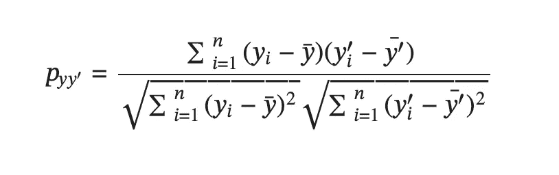

# 医学自然语言处理的公共基准

> 原文：[`towardsdatascience.com/public-benchmarks-for-medical-natural-language-processing-c7c794ab4d9`](https://towardsdatascience.com/public-benchmarks-for-medical-natural-language-processing-c7c794ab4d9)

## 对于测量医学自然语言处理的标准任务和相应数据集的一般介绍

[](https://eileen-code4fun.medium.com/?source=post_page-----c7c794ab4d9--------------------------------)[](https://towardsdatascience.com/?source=post_page-----c7c794ab4d9--------------------------------) [Eileen Pangu](https://eileen-code4fun.medium.com/?source=post_page-----c7c794ab4d9--------------------------------)

·发表于 [Towards Data Science](https://towardsdatascience.com/?source=post_page-----c7c794ab4d9--------------------------------) ·阅读时间 6 分钟·2023 年 3 月 29 日

--


来源：[`unsplash.com/`](https://unsplash.com/)

自然语言处理（NLP）领域近年来发展迅猛。变换器、BERT、GPT 等突破性技术相继出现。各行各业的从业者都在探索如何在其特定业务领域和工作流中利用 NLP 的激动人心的发展[1]。医疗行业就是一个从 NLP 进步中受益匪浅的行业。大量的自由文本医学笔记包含了难以置信的数据见解，这些见解可以帮助提供更好的护理、优化成本和推动医疗创新。为了衡量将 NLP 应用于医疗领域的效果，我们需要良好的基准。本文列出了医学自然语言处理常见任务的标准公共基准。目标是为医疗机器学习从业者提供一个起点，以衡量他们的 NLP 工作。

> **实体/关系识别**

实体/关系识别的任务是检测和分类自由文本中的医学概念及其关系。这是从临床笔记和报告中获取可操作见解的关键步骤。这个任务的标准数据集是生物学与临床实践整合信息数据集（i2b2）[2]。该数据集包含来自几个合作医疗组织的去标识化患者报告，共有 394 份训练报告和 477 份测试报告。标记的医学概念包括`问题`、`治疗`和`测试`。标记的关系包括`治疗改善问题`、`测试揭示问题`、`问题指示另一个问题`等。

这是一个具体的例子：

```py
1 The patient is a 63-year-old female with a 3-year history of bilateral
  hand numbness
2 She had a workup by her neurologist and an MRI revealed a C5-6 disc
  herniation with cord compression

—----------
# Lines are numbered. Words are indexed starting from 0.
—-----------
# Entity || type
bilateral hand numbness 1:11-13 || problem
a workup 2:2-3 || test
an MRI 2:8-9 || test
a c5-6 disc herniation 2:11-14 || problem
cord compression 2:16-17 || problem
—-----------
# Entity || relation || entity
an MRI 2:8-9 || test reveals problem || ac5-6 disc herniation 2:11-14
an MRI 2:8-9 || test reveals problem || cord compression 2:16-17
a c5-6 disc herniation 2:11-14 || problem indicates another problem || cord compression 2:16-17
```

只有完全正确的识别才被认为是正确的。这意味着对于一个实体，实体的开始和结束词索引都需要准确；对于一个关系，左实体、右实体和关系都需要准确。最终评估指标基于精确度、召回率和 F1 分数。

> **语义相似性**

语义相似性评估两段医疗文本之间的语义等价性。临床语义文本相似性 (ClinicalSTS) [3] 是此任务的标准数据集。它包含 1642 个训练句子对和 412 个测试句子对。等价性通过 0 到 5 的有序尺度来衡量，0 表示完全不相似，5 表示完全语义等价。最终表现通过预测相似性分数 `Y’` 和人工判断 `Y` 之间的 Pearson 相关性来衡量，计算公式如下（结果越高越好）：



Pearson 相关公式

这里有两个具体的例子：

```py
# sentence1
# sentence2
# similarity score

minocycline 100 mg capsule 1 capsule by mouth one time daily
oxycodone 5 mg tablet 1-2 tablets by mouth every 4 hours as needed
3

oxycodone 5 mg tablet 0.5-1 tablets by mouth every 4 hours as needed
pantoprazole [PROTONIX] 40 mg tablet enteric coated 1 tablet by mouth Bid before meals
1
```

> **自然语言推断**

自然语言推断评估医疗假设如何从医疗前提中推导出来。MedNLI [4] 是这样一个数据集。它包含来自一组已故患者的去标识化医疗历史记录。这些记录被分割成片段，要求专家根据每个片段编写 3 个假设。这 3 个假设是

1.  一个明显正确的描述

1.  一个明显错误的描述和

1.  一个描述可能是真的或假的，

代表前提-假设的 3 种关系：`entailment`、`contradiction` 和 `neural`。数据集包含 11232 个训练对，1395 个开发对和 1422 个测试对。

这里是一个具体的例子：

```py
# sentence1
# sentence2
# relation
Labs were notable for Cr 1.7 (baseline 0.5 per old records) and lactate 2.4
Patient has elevated Cr
entailment
```

最终的表现可以通过给定前提-假设对的关系分类准确率来衡量。

> **医疗问题选择回答**

医疗问题选择回答模拟了选择题形式的医疗考试。MedQA [5] 是这个目的的标准数据集。其问题来自于美国和中国的医学考试，通过选择正确答案来评估医生。数据集中包含 61097 个问题。

这里是一个具体的例子：

```py
A 57-year-old man presents to his primary care physician with a 2-month
history of right upper and lower extremity weakness. He noticed the weakness
when he started falling far more frequently while running errands. Since then,
he has had increasing difficulty with walking and lifting objects. His past
medical history is significant only for well-controlled hypertension, but he
says that some members of his family have had musculoskeletal problems. His
right upper extremity shows forearm atrophy and depressed reflexes while his
right lower extremity is hypertonic with a positive Babinski sign. Which of
the following is most likely associated with the cause of this patient’s
symptoms?

A: HLA-B8 haplotype
B: HLA-DR2 haplotype
C: Mutation in SOD1 [correct]
D: Mutation in SMN1
E: Viral infection
```

从机制上讲，这个任务可以被视为一个评分系统，其中输入是 `question+answer_i`，输出是一个数值分数。得分最高的 `answer_i` 将是最终答案。性能可以通过对数据集的 80/10/10 划分的准确性来衡量。这为模型和人工专家的表现提供了一个可比的基准。

> **医疗问题回答**

医学问答是最复杂的医学 NLP 任务。它要求模型为给定的医学问题生成长篇自由文本答案。emrQA [6] 是这个目的的典型数据集。它有 40 万对问答对。仅依靠人工专家的手工工作来获取这样一个数据集会非常昂贵。因此，emrQA 实际上是半自动生成的

+   首先对医学专家进行关于常见问题的调查，

+   然后用占位符替换这些问题中的医学概念，从而创建问题的模板，

+   最终使用标注的实体-关系（如 i2b2）数据集来建立临床背景、填写问题并生成答案。

这是一个具体的例子：

```py
Context: 08/31/96 ascending aortic root replacement with homograft with
omentopexy. The patient continued to be hemodynamically stable making good
progress. Physical examination: BMI: 33.4 Obese, high risk. Pulse: 60\. resp.
rate: 18

Question: Has the patient ever had an abnormal BMI?
Answer: BMI: 33.4 Obese, high risk
Question: When did the patient last receive a homograft replacement?
Answer: 08/31/96 ascending aortic root replacement with homograft with omentopexy.
```

从机械的角度来看，这项任务可以视为一种语言生成任务，其中输入是 `context+question`，输出是 `answer`。最终的表现通常可以通过数据集的 80/20 拆分来衡量，并通过准确匹配和 F1 分数来评估。准确匹配测量与准确真实值匹配的预测百分比。F1 分数测量预测与真实值之间的“重叠”。在这种设置下，预测和真实值都被视为一个令牌包，其中可以计算真正的/假阳性/假阴性。

> **结论**

研究人员和从业者继续在医学领域积极应用自然语言处理（NLP）。虽然看到这种热情令人兴奋，但拥有公开且可重复的基准来衡量这些应用的表现非常重要。这篇博客文章列出了典型任务、相应的公开数据集以及适用的度量标准，这些可以用来量化新医学 NLP 应用的潜在改进。

> **参考文献**

[1] 如何在自己的领域中使用大型语言模型（LLM） `towardsdatascience.com/how-to-use-large-language-models-llm-in-your-own-domains-b4dff2d08464`

[2] 2010 i2b2/VA 挑战：临床文本中的概念、断言和关系 [`www.ncbi.nlm.nih.gov/pmc/articles/PMC3168320/`](https://www.ncbi.nlm.nih.gov/pmc/articles/PMC3168320/)

[3] 2019 n2c2/OHNLP 临床语义文本相似性追踪：概述 [`www.ncbi.nlm.nih.gov/pmc/articles/PMC7732706/`](https://www.ncbi.nlm.nih.gov/pmc/articles/PMC7732706/)

[4] MedNLI — 临床领域的自然语言推断数据集 [`physionet.org/content/mednli/1.0.0/`](https://physionet.org/content/mednli/1.0.0/)

[5] 这个病人得了什么病？来自医学考试的大规模开放域问答数据集 [`arxiv.org/abs/2009.13081`](https://arxiv.org/abs/2009.13081)

[6] emrQA：用于电子病历问答的大型语料库 [`arxiv.org/abs/1809.00732`](https://arxiv.org/abs/1809.00732)
