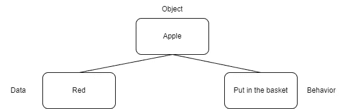
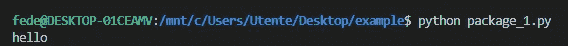
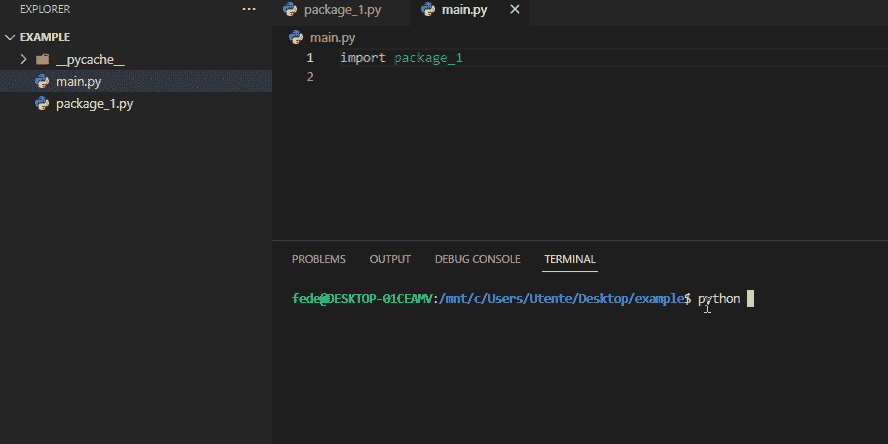
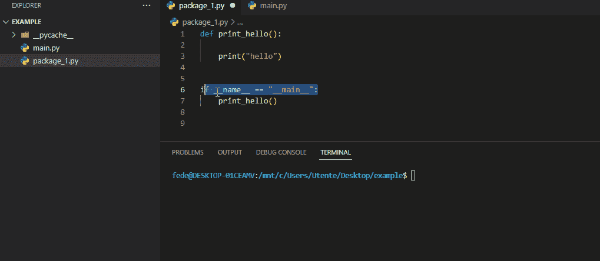

# 《Python 类简易入门：面向对象编程的权威指南》

> 原文：[`towardsdatascience.com/python-classes-made-easy-the-definitive-guide-to-object-oriented-programming-881ed609fb6`](https://towardsdatascience.com/python-classes-made-easy-the-definitive-guide-to-object-oriented-programming-881ed609fb6)

## 通过这本全面的类参考书提升你的 Python 技能

[](https://federicotrotta.medium.com/?source=post_page-----881ed609fb6--------------------------------)[](https://towardsdatascience.com/?source=post_page-----881ed609fb6--------------------------------) [Federico Trotta](https://federicotrotta.medium.com/?source=post_page-----881ed609fb6--------------------------------)

·发布于 [Towards Data Science](https://towardsdatascience.com/?source=post_page-----881ed609fb6--------------------------------) ·阅读时间 18 分钟·2023 年 3 月 13 日

--


图片由 [Lukas Bieri](https://pixabay.com/it/users/lukasbieri-4664461/?utm_source=link-attribution&utm_medium=referral&utm_campaign=image&utm_content=2838945) 提供，来源于 [Pixabay](https://pixabay.com/it//?utm_source=link-attribution&utm_medium=referral&utm_campaign=image&utm_content=2838945)

当涉及到类时，许多 Python 开发者会遇到困难，原因有很多。首先——在我看来——因为面向对象编程的概念并不总是清晰。其次，因为类和面向对象编程（OOP）背后的想法有很多，我们可能在网上找到的解释（主要是在线的）可能是肤浅的。

在这篇文章中，我想讨论 Python 类背后的最重要概念，以及如何使用它们（附带编码示例）。

首先，我们将通过讨论面向对象编程来开始这篇文章。

```py
**Table of Contents**

Object Oriented Programming
Classes in Python
  The "self" Parameter
  The "__init__" Method
  if __name__ == "__main__"
Type Hints
Docstrings (and how to invoke them)
Inheritance
Pro tip on how to use Python classes
```

# 面向对象编程

引用和改写参考文献 [1]，我们可以说，作为人类，我们完全知道对象是什么：它们是所有可以用我们的感官感受到并且可以被操控的实物。在我们的成长过程中，我们学习了抽象的力量，对象变成了模型。换句话说，我们利用在多年的经验中培养出的想象力，通过简单的概念来简化复杂的问题：这就是使用模型进行抽象的过程。

比如，我们可以将地球建模为一个球体（即使它不是一个球体！）以进行一些计算（例如，确定它的轨道）。

这与我们在软件开发中所做的并没有太大不同。实际上，对我们开发者来说，对象并不是我们可以触摸或感受到的东西，而是执行一些软件任务的模型。

更准确地说，我们可以说“**对象是具有相关行为的数据集合**”。[1]

让我们举一个例子来澄清这个概念（我们将参考文献[1]进行改述）。

我们想创建一个名为“Apple”的对象。在这种情况下，与之相关的数据可以是颜色（例如，红色）。与之相关的行为可以是我们想把苹果放进篮子里。



软件开发中的一个对象。图片由作者提供。

现在，如果我们遇到一个绿色的苹果怎么办？它仍然是苹果，只是颜色不同：我们可以使用这个概念吗？这就是类发挥作用的地方！

类是定义对象结构的“模板”。这意味着对象有自己特定的一组属性，涉及某个类。

以苹果为例，我们可以说类 Apple 可以包含：

+   数据 → 颜色

+   行为 → 苹果放置的位置

使用这个模板，我们可以创建任意多个对象。例如，我们可以创建对象`Apple_green`，它使用了带有`color=green`的数据的类 apple，并把苹果放到桌上的篮子里。

我们还可以有一个名为`Apple_red`的对象，它使用了带有`color=red`的数据的类 apple，并把苹果放回到货架上。


对象与类之间的区别。图片由作者提供。

所以，正如我们通过苹果的例子所理解的那样，我们可以说数据代表了某个对象的特定特征。

行为则代表动作；这些动作在 Python 中作为类的方法表达。正如我们稍后会看到的，类的方法的定义方式与定义函数的方式相同。

那么：什么是面向对象编程？

OOP 是“将代码编写为建模对象的实践” [1]。

换句话说，这意味着通过数据和行为创建一系列交互的对象。

这并不意味着在 Python 编程时我们总是需要创建类。这里我们需要理解一个简单的概念：Python 的强大之处在于**一切**在这个编程语言中**都是对象**。实际上，即使我们看不到，我们在 Python 中实际上是在处理对象和类。

例如，假设我们定义一个变量`a = 3`。如果我们想查看它的类型，可以写以下代码：

```py
a = 3

type(a)

>>>

  int
```

我们使用了内置函数`type()`来确定变量`a`的属性，它告诉我们这是一个`int`（也就是整数）。但`int`是 Python 内置类；这意味着在 Python 中，我们可以定义一个整数变量，如上所示，而无需创建实际的类，因为 Python 为我们做了这件事（在其他编程语言中，我们实际上需要为如此简单的示例创建一个类）。

所以，让我们记住：无论何时编程 Python，我们总是必须处理对象和类，即使我们没有显式声明它们，因为 Python 在后台会完成调用内置类的工作。

# Python 中的类

在 Python 中，类必须以大写字母定义。下面是如何定义一个简单类的示例：

```py
class MyFirstClass:
  a = 15 # this is the data of the class
  pass
```

我们创建了一个简单的类，它设置了`a=15`。

现在，让我们通过添加一个方法来创建一个实际做些有用工作的类（注：本文中使用的`Point`类取自参考文献[1]，并根据我的口味和需求进行了修改）：

```py
class Point:

  def origin(self): # this is a method 
    self.x = 0
    self.y = 0
```

所以，我们创建了一个名为`Point`的类，并有一个名为`origin`的方法，它做了一件简单的事情：将二维坐标点设为`x=0`和`y=0`（原点）。

现在，正如我们所见，该方法传递了一个名为`self`的参数。我们可以按需调用它，但作为标准，Python 开发者社区称之为`self`：我们稍后会更详细地解释它是如何工作的。

现在，如果我们想调用类，我们可以定义一个点`p`并执行以下操作：

```py
# Invoke the class
p = Point()
```

现在，我们可以通过编写以下内容来访问类中定义的方法：

```py
# Access the method
p.origin()
```

所以，现在我们的点已经到了原点。为了确保，我们可以做以下操作：

```py
# Print the coordinates
print(p.x, p.y)

>>>

  0 0
```

## “self”参数

现在，让我们解释一下之前介绍的`self`参数是什么，以及如何使用它。

`self`参数用于调用方法。这就是为什么我们将其称为`self`作为标准的原因：因为我们在调用方法。这就像我们在告诉 Python：“嘿！这个方法是自我调用的”。

当我们需要将多个参数传递给方法时，`self`必须是第一个参数：否则，另一个参数将调用该方法（正如我们所说，不需要将其命名为`self`：这个名字只是开发者之间的惯例）。

让我们看看一个使用`self`的示例，并与另一个不使用它的示例进行比较。

```py
class Test:

  def printing(self):
    print("this is a test")
```

所以，我们创建了一个简单的类，当我们调用`printing`方法时，它会打印“this is a test”：

```py
# Invoke the class
test = Test()

# Call the method
test.printing()

>>>

  this is a test
```

现在，让我们看看没有`self`的示例：

```py
class Test2:

  def printing2():
    print("this is a test")
```

```py
# Invoke the class
test2 = Test2()

# Call the method
test2.printing2()

>>>

  Type Error: printing2() takes 0 positional arguments but 1 was given
```

所以，在这种情况下，Python 返回一个错误，告诉我们一个简单的事情：方法不能被调用，因为它没有参数。

这就是我们需要`self`的原因。

现在，让我们创建一个具有多个参数的函数：

```py
class Point:

  def move(self, x, y):
    self.x = x
    self.y = y

  def origin(self):
    self.move(0,0)
    return(self.x, self.y)
```

我们创建了一个类，该类：

1.  移动两个坐标（`x`和`y`）。正如我们所见，`self`调用了该方法。

1.  将坐标移到原点。当我们调用`origin`方法时，它实际上会将两个坐标（它唯一的参数是`self`）移动到原点（`self.move(0, 0)`），并返回坐标。

所以，我们可以调用类并将坐标移动到原点：

```py
#Invoke the class
p = Point

# Call the method
p.origin()

>>>

  0, 0
```

而且坐标已经移到了原点。

现在，让我们回顾一下之前的几行：我们说`move`方法移动了坐标，但这并不准确。实际的移动是由`origin`方法完成的。

实际上，`move` 方法只做了一件简单的事情：它调用了所需的值。这就是为什么一个类的第一个方法有特殊命名规则的原因。

## “__init__”方法

到目前为止，我们创建了一个将点的坐标（`x`和`y`）移动到原点的类。但如果我们想将点移动到任何特定位置怎么办？

为此，我们需要创建另一个类。第一次尝试时，让我们用之前使用的相同逻辑创建它。可以是这样的：

```py
class Point:

    def move(self, x, y):
        self.x = x
        self.y = y

    def position(self):
        print(self.x, self.y)
```

现在，让我们调用类和方法：

```py
# Invoke the class
p = Point() 

# Get to position
p.position(5,6)

>>>

  TypeError: Point() takes no arguments
```

然后……我们遇到一个错误！它告诉我们`Point`类不接受任何参数。这怎么可能？我们已经指定了传递`self`、`x`和`y`；所以，除了`self`调用方法之外，类应该接受两个值！

错误在于第一个方法。正如我们在上一段中所说，第一个方法只做一件事：它调用所需的值。它不会将点移动到特定位置。

这就是为什么一个类的第一个方法必须是一个叫做`__init__`的特殊方法的原因。因此，为了正确调用所需的值，我们必须按如下方式创建`Point`类：

```py
class Point2:

    def __init__(self, x, y):
        self.x = x
        self.y = y

    def position2(self):
        print(self.x, self.y)
```

现在，让我们调用它：

```py
# Invoke the class
p = Point2(5,6) 

# Get to position
p.position2()

>>>

  5 6
```

就这样！

```py
**NOTE:**

there is even the possibility to create classes that do not uses the
__init__ method. In these cases, the variables can be invoked in 
other ways.

Anyway: we won't talk about that case here because we believe this is
not a Pythonic way to develop Python software (also, the code becomes
a little bit longer and less redeable).
```

## 如果 __name__ == ”__main__”

现在，在某些类的末尾，我们可能会看到`if __name__ == "__main__"`。如果你不知道这是什么，这里有一个详细的解释。

引用并改述自[2]：

> `__name__`是一个特殊的内置变量，我们在创建可交互模块时必须使用它，因为它允许我们区分我们导入的模块和我们没有导入的模块。
> 
> 在 Python 中，模块指的是包和库，甚至是任何可以与其他代码分离并独立运行的代码片段。鉴于类（甚至函数，或任何 Python 文件）可以独立运行，它们可以被认为是模块。
> 
> `__main__`另一方面是一个特殊的模块，表示脚本或程序中的顶级代码的名称。
> 
> 基本上，如果我们执行`if __name__ = "__main__"`，我们是在检查我们执行的代码是否是顶级代码。

那么，什么是顶级代码？

我们从[这个线程](https://stackoverflow.com/questions/18138166/what-is-a-top-level-statement-in-python)中取一个非常说明性的例子：

```py
import sys         # top-level

3 + 4              # top-level

x = 0              # top-level

def f():           # top-level
    import os      # not top-level!
    return 3       # not top-level

if x:              # top-level
    print 3        # not top-level
else:
    print 4        # not top-level, but executes as part of an if statement
                   # that is top-level

class TopLevel(object): # top-level
    x = 3          # not top-level, but executes as part of the class statement
    def foo(self): # not top-level, but executes as part of the class statement
        print 5    # not top-level
```

好的，正如我们所看到的，问题与 Python 解释器有关。

让我解释一下。

如果一个模块是独立执行的，那么没有问题。当一个模块被导入到另一个 Python 文件中时，问题就会出现。假设上述脚本被导入到另一个文件中：当我们导入它时，它会立即执行所有顶级代码以及属于`if`或类声明的代码，正如上述代码片段中的注释所述。

让我们更详细地查看它，举个例子。

让我们创建一个名为`package_1.py`的 Python 文件，如下所示：

```py
# Define a function to print "Hello"
def print_hello():

    print("hello")

#Invoke the function
print_hello()
```

如果我们通过终端执行它，我们得到：



执行`package_1.py`文件。图片由作者提供。

所以，它完全有效。

现在，让我们创建一个名为`main.py`的 Python 文件，并将`package_1.py`文件导入其中，然后运行`main.py`：



main.py 文件的执行。图像来源：作者。

如我们所见，当 `main.py` 运行时，模块 `package_1.py` 会立即执行！这是我们不希望发生的情况，原因很简单：我们希望在实际调用代码时使用从模块中导入的代码。换句话说，如果整个模块在导入后立即执行代码，那就完全没有用。

为了避免这种情况，我们在 `package_1.py` 中使用了 `if __name__ = "__main__"`，并在其后调用 `print_hello()` 函数：



使用‘if __name__ == “__main__”’执行 main.py 文件。图像来源：作者。

如 [2] 所述：

> `if __name__ = "__main__"` 防止了在模块执行时顶层代码的自动执行。

此外，之前我们在 `package_1.py` 文件中调用了 `print_hello()` 函数，因为我们希望函数在程序独立运行时能够实际工作。现在，在 `if __name__ = "__main__"` 后调用 `print_hello()` 将在 `package_1.py` 独立运行时调用该函数。

所以，为了回顾和澄清这个例子，如果我们在 `package_1.py` 中的 `if __name__ = "__main__"` 后调用 `print_hello()`：

+   当 `package_1.py` 独立运行（即，通过终端）时，`print_hello()` 将被执行。

+   当我们运行 `main.py` 时，`print_hello()` 将不会被执行。

```py
**NOTE**

We understand that we've used simple examples, but a general
case is that we create modules based on classes:
this is why we have covered this topic in this article.
```

# 类型提示

从 Python 3 开始，“[PEP 484 — 类型提示](https://peps.python.org/pep-0484/)” 引入了 Python 中的类型提示。

类型提示是建议传递给函数（或在类的情况下传递给方法）的类型。我们都知道注释和文档字符串必须发挥作用，但类型提示确实有助于我们理解函数的预期。

```py
**NOTE:** 
here we'll talk about functions and not classes, just for the sake
of simplicity.
As we have seen, in fact, a method of a class is defined exactly as
a function: so what we'll see in this paragraph is generalizable
to classes.
```

让我们做一个简单的例子。创建一个返回值的函数：

```py
def any_call(variable: any) -> any:
    return variable
```

因此，我们创建了一个接受一个参数（称为 `variable`）的函数，类型提示告诉我们：

+   `variable` 的类型可以是任何类型，例如字符串、整数等……

+   函数返回任何类型（实际上，它返回 `variable`）

你觉得这有用吗？好吧，我几周前发现了这个功能，觉得非常惊艳！特别是，当示例更复杂时，这就变得非常有趣。

例如，假设我们需要一个函数，该函数接收一个列表作为参数，并返回列表中元素的数量。该函数可以如下所示：

```py
def count_values(element: list[any]) -> int:
    return sum(1 for elements in element if elements)

-----------------------

count_values([1,2,3,4])

 >>>

     4

----------------------

count_values(["hello", "stranger", "who", "are", "you", "?"])

>>>

   6
```

因此，我们的函数仅接受 `element` 作为参数，并且由于类型提示，我们知道它必须是任何类型的列表。然后，函数返回一个整数类型；实际上，它计算列表中元素的数量。

所以，我们认为这个观点很清楚。这是一个非常好的实现，能够提高我们代码的可读性。

# 文档字符串（以及如何调用它们）

文档是每个软件项目中最重要的部分，原因很简单：在接下来的两个月里，我们几乎不会记得我们做了什么以及为什么做。

因此，编写代码的注释和解释是非常重要的。不幸的是，注释是不够的，因为它们必须非常简短（但要有解释性）。

所以，我们可以做的是使用 docstrings。 [PEP 257](https://peps.python.org/pep-0257/) 规定：

> docstring 是在模块、函数、类或方法定义中的第一个语句出现的字符串文字。这样的 docstring 成为该对象的 `__doc__` 特殊属性。
> 
> 所有模块通常都应该有 docstrings，而模块导出的所有函数和类也应有 docstrings。公共方法（包括 `__init__` 构造函数）也应有 docstrings。一个包的文档可以在包目录中的 `__init__.py` 文件的模块 docstring 中进行记录。

换句话说，在软件开发中，docstring 是一种在代码中用于记录代码本身的字符串类型。正如参考文献 [1] 所述，“与注释不同，docstrings 在运行时可用，简化了代码检查，并在执行过程中提供帮助或元数据”。

让我们看看如何在 Python 类中使用 docstrings：

```py
class Point:
    """
    this class moves a point in 2D, passing its coordinates
    as argument of the method 'position'
    """
    def __init__(self, x: int, y: int) -> None: 
        self.x = x
        self.y = y

    def position(self) -> int: 
        print(self.x, self.y)
```

要访问文档（即 docstrings），我们输入以下内容：

```py
Point.__doc__

>>>

    " this class moves a point in 2D, passing its coordinates as
    argument of the function 'position' "
```

所以，这就是我们如何访问与类相关的 docstrings。如果我们想访问类中特定方法的 docstring 呢？

让我们看看：

```py
class Point:
    """ this class moves a point in 2D, passing its coordinates
    as argument of the function 'position'
    """
    def __init__(self, x: int, y: int) -> None: 
        self.x = x
        self.y = y

    def position(self) -> int: 
        """ this actually moves the point"""
        print(self.x, self.y)
```

要访问 `position` 方法的文档：

```py
Point.position.__doc__

>>>
    'this actually moves the point'
```

我们到了。

但我们实际上可以（并且应该！）做得更好。例如：

```py
class Point:
    """ this class moves a point in 2D, passing its coordinates
    as argument of the function 'position'

    Args:
        param 1 (int): the coordinate x of the point in 2D
        param 2 (int): the coordinate y of the point in 2D
    """
    def __init__(self, x: int, y: int) -> None: 
        self.x = x
        self.y = y

     def position(self) -> int: 
        """ This method actually moves the point.

      Returns:
        int: prints the integers that represent the coordinates x and y
        of the point in 2D
      """
        print(self.x, self.y)
```

这可能看起来有些冗余，因为我们已经使用了类型提示，但实际上并不是因为：

1.  我们可能需要在第一次尝试中，仅调用我们类的文档（也许因为我们在另一个文件中将其作为模块导入）。

1.  我们可以使用工具（例如 [Sphinx](https://www.sphinx-doc.org/en/master/)）来创建 HTML 格式的文档；这些工具直接使用 docstrings。

这就是为什么使用非常解释性的 docstrings 是非常重要的。

# 继承

在这里，我们想讨论 Python 的一个魔法：**继承**。

正如我们之前所说，面向对象编程（OOP）是用对象之间相互作用的方法来开发代码。这意味着当我们在 Python 中创建类时，我们经常需要让它们相互作用。

在交互时，类会继承其他类的属性和功能。

是的：就像你的老姑姑决定把她的 210 亿美元留给你一样（谁没有这样的姑姑？！）。

首先，我们必须说明，我们创建的每个类都使用了继承。这是因为，正如我们之前所说，Python 使用内置类。所以，当我们调用内置类时，我们的代码会继承调用的内置类或对象的属性。

现在，让我们看看继承在实际中的应用（注意：我从参考文献 [1] 中取出了以下类，并根据我的口味和需求进行了修改）。

我们想创建一个存储一些联系人的名字和姓氏的类，填充一个空列表。我们可以创建类似这样的东西：

```py
class Contact:
    """
    This class saves the name and the surnames
    of some contacts in a list
    """

    # Create empty list
    all_contacts = [] 

    def __init__(self, name: str, surname: str) -> None:
        """ This method initializes the arguments and appends
        the arguments (name and surname)into the empty list.

        Returns:
            nothing.
        """
        self.name = name
        self.surname = surname
        Contact.all_contacts.append(self) # Append to list

    def __repr__(self) -> str:
        """
        The built-in __repr__ method provides a string representation
        of an object.

        Returns:
            the compiled list with name and surname of the contacts
        """
        return (
            f"{self.__class__.__name__}("
        f"{self.name!r}, {self.surname!r}"
            f")"
         )
```

现在，让我们尝试一下：

```py
# Define a contact
contact_1 = Contact("Federico", "Trotta")

# Show the contacts in the list
Contact.all_contacts

>>>

  [Contact('Federico', 'Trotta')]
```

现在，假设我们想收集联系人的电子邮件，但由于某种原因，我们想创建一个单独的类。我们可以创建一个如下的类：

```py
 class Email(Contact): # Email is inerithing from Contact

    def get_mail(self, mail:"mail") -> None:
        return mail
```

现在，让我们添加一个如下的电子邮件：

```py
Email("federico trotta", "federico@example.com")
```

现在，如果我们调用 `Contact.all_contacts`，我们会得到：

```py
[Email('federico trotta', 'federico@example.com'),
 Contact('Federico', 'Trotta')]
```

所以，由于我们的 `Email` 类将 `Contact` 类作为参数，**它继承了其属性**。例如，传递给 `Email` 类的参数会附加到 `Contact` 类中的列表。

同时，这个类继承了 `__init()__` 方法需要两个参数的事实。实际上，这就是我们只用一个参数所得到的：

```py
mail_2 = Email("Jhon@example.com")

>>>

  TypeError: __init__() missing 1 required positional argument: 'surname'
```

但是，等一下！！！我们在 `Email` 类中没有使用 `__init()__` 方法，那发生了什么？

结果是 `Email` 类继承了 `__init()__` 方法，所以不需要再次使用它！

如果我们想在子类中使用另一个 `__init()__` 方法（`Email` 是一个子类），我们必须做出一些调整，例如以下几点：

```py
class General(Contact):

    def __init__(self, name: str, email: str) -> None:
        super().__init__(name, email)
        self.email = email
```

它的工作方式与之前的完全相同：

```py
# Create a contact
general_contact = General("Federico Trotta", "federico@example.com")

# Write the contact into the list
Contact.all_contacts

>>>

  General('Federico Trotta', 'federico@example.com')
```

因此，`Email` 类和 `General` 类的工作方式完全相同，结果也完全相同，但继承的强大之处在于，没有像我们在 `Email` 中使用 `__init()__` 方法一样，代码会更简洁。

同时，正如我们所见，在 `General` 类的情况下，我们使用了 `super.__init()__` 方法：在子类中我们必须使用它，因为它初始化了父类（`Contact`）的继承属性。

# 关于如何使用 Python 类的专业提示

如果你发现这篇文章是因为你在理解类时遇到困难，那么你可能不清楚为什么应该使用它们。如果是这样，欢迎加入俱乐部：我曾经也有同样的困惑。

我的意思是：我明白类（当然，还有函数）帮助我们自动化代码，但必须调用它们给我带来了一些困难。

这发生在我身上，因为我开始学习 Python 用于数据科学（这是我如何正确做这件事的提示），说实话，在许多情况下，当我们用 Python 做数据科学时，使用类并没有理由。

所以，我的建议是，正确理解使用类的必要性是将它们视为模块。这意味着，当你想开始一个新的 Python 项目时，一个很好的建议是创建一个 `main.py` 文件，在其中调用所有你需要的类；无论如何，这些类不应该在 `main.py` 中创建：它们应该在单独的 Python 文件中创建（通常，我们为每个类创建一个 Python 文件）并在 `main.py` 中导入使用。

另外，到目前为止我们谈论了模块。这是我写的一篇关于这个话题的文章：

[ ## 掌握模块化编程：如何将你的 Python 技能提升到下一个层次

### 编写模块化 Python 代码的最佳实践

towardsdatascience.com

# 结论

在这篇文章中，我们看到了一个关于类的综合指南，希望它能阐明相关的主要主题。

你现在唯一需要做的就是多加练习，希望这个指南在你需要时能帮助到你。

**免费 Python 电子书：**

开始学习 Python 数据科学但遇到困难？ [***订阅我的通讯，获取我的免费电子书：这将为你提供正确的学习路径，以便通过动手实践学习 Python 数据科学。***](https://federico-trotta.ck.page/a3970f33f4)

喜欢这个故事吗？通过我的推荐链接成为 Medium 会员，每月 5 美元 [点击这里](https://medium.com/@federicotrotta/membership)：我将获得一小笔佣金，对你没有额外费用：

[](https://medium.com/@federicotrotta/membership?source=post_page-----881ed609fb6--------------------------------) [## 使用我的推荐链接加入 Medium — Federico Trotta

### 阅读 Federico Trotta 的每一个故事（以及 Medium 上成千上万的其他作家的故事）。您的会员费直接支持…

medium.com](https://medium.com/@federicotrotta/membership?source=post_page-----881ed609fb6--------------------------------)

*参考文献和视频资料：*

[1] Python 面向对象编程 — S.F. Lott, D. Phillips

[2] 如果 __name__ == “__main__” 对于 Python 开发者 ([视频](https://www.youtube.com/watch?v=NB5LGzmSiCs))
