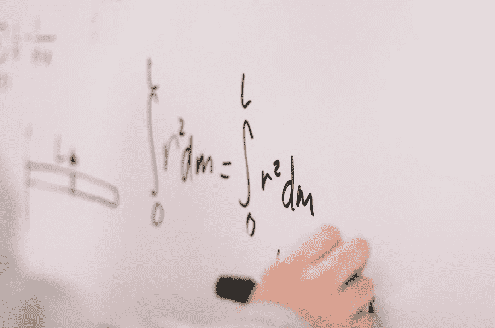

# Python：正确计算积分的方法

> 原文：[`towardsdatascience.com/python-computing-integrals-the-right-way-22e9257a5836?source=collection_archive---------5-----------------------#2023-09-03`](https://towardsdatascience.com/python-computing-integrals-the-right-way-22e9257a5836?source=collection_archive---------5-----------------------#2023-09-03)

## 使用 Python 提升你的积分计算能力

 [Yoann Mocquin](https://mocquin.medium.com/?source=post_page-----22e9257a5836--------------------------------)

·

[关注](https://medium.com/m/signin?actionUrl=https%3A%2F%2Fmedium.com%2F_%2Fsubscribe%2Fuser%2F173731d06320&operation=register&redirect=https%3A%2F%2Ftowardsdatascience.com%2Fpython-computing-integrals-the-right-way-22e9257a5836&user=Yoann+Mocquin&userId=173731d06320&source=post_page-173731d06320----22e9257a5836---------------------post_header-----------) 发表在 [Towards Data Science](https://towardsdatascience.com/?source=post_page-----22e9257a5836--------------------------------) · 7 分钟阅读 · 2023 年 9 月 3 日

--

在处理科学计算或物理问题时，计算某些函数的积分是非常常见的。

图片来源：[Jeswin Thomas](https://unsplash.com/@jeswinthomas?utm_source=medium&utm_medium=referral) 于 [Unsplash](https://unsplash.com/?utm_source=medium&utm_medium=referral)

在这篇简短的文章中，我想展示你可以用 Python 计算一维函数积分的三种方法。我们将把这些方法分为两种情况：

+   **第一个案例：计算采样函数的积分**

+   **第二个案例：计算通用函数的积分**

**在第一种情况下**，我们想要积分的函数已经在一些采样点上进行了采样，并且我们无法访问底层的“真实”函数。例如，我们不知道该函数的“公式”，也无法对该函数进行其他点的采样。换句话说，我们只有 x 和相应 y 值的数组。

**在第二种情况下**，我们将考虑我们拥有一个函数对象，我们可以传递一个采样点，它会返回该点处的函数值。这是理想的方法，因为我们可以访问函数的所有信息。

请注意，我们总是可以使用采样方法：如果我们仍然可以访问该函数，我们可以选择采样点并使用它们来采样函数，然后使用第一种方法。**但正如我们将**…
