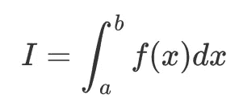
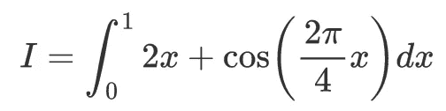
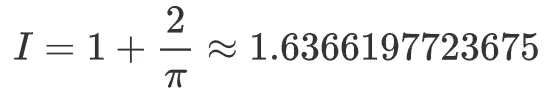
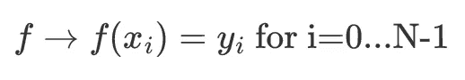
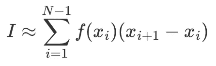
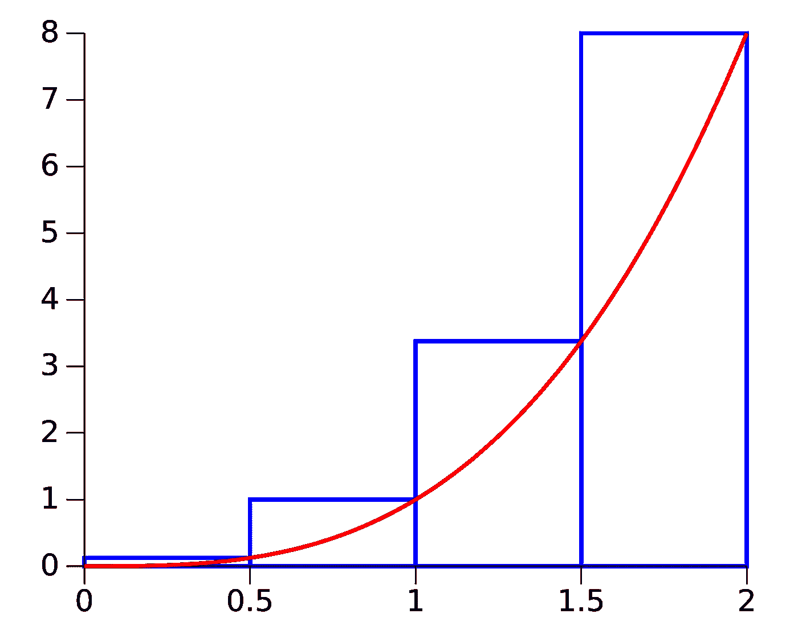
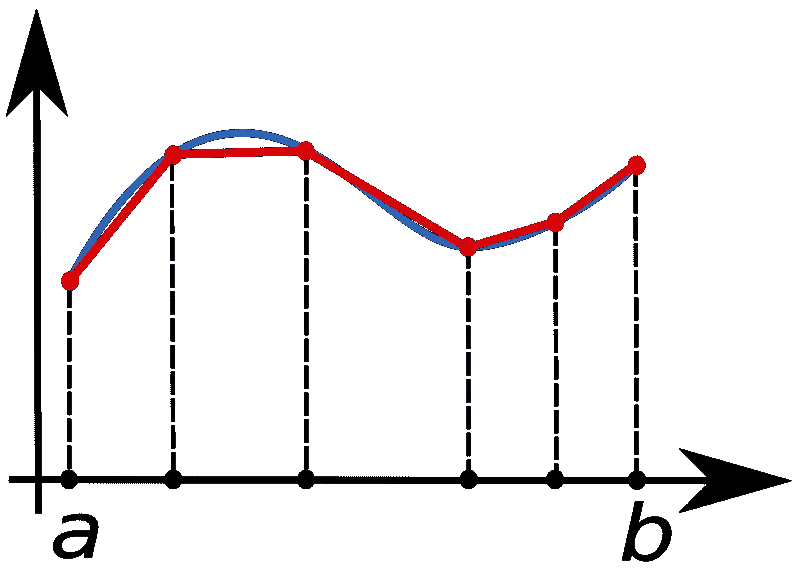

# Python：正确计算积分

> 原文：[`towardsdatascience.com/python-computing-integrals-the-right-way-22e9257a5836`](https://towardsdatascience.com/python-computing-integrals-the-right-way-22e9257a5836)

## 用 Python 提升你的积分能力

[](https://mocquin.medium.com/?source=post_page-----22e9257a5836--------------------------------)[](https://towardsdatascience.com/?source=post_page-----22e9257a5836--------------------------------) [Yoann Mocquin](https://mocquin.medium.com/?source=post_page-----22e9257a5836--------------------------------)

·发表于 [Towards Data Science](https://towardsdatascience.com/?source=post_page-----22e9257a5836--------------------------------) ·7 分钟阅读·2023 年 9 月 3 日

--

在处理科学计算或物理问题时，计算一些函数的积分是非常常见的。


图片由 [Jeswin Thomas](https://unsplash.com/@jeswinthomas?utm_source=medium&utm_medium=referral) 提供，来自 [Unsplash](https://unsplash.com/?utm_source=medium&utm_medium=referral)

在这篇简短的文章中，我想展示三种在 Python 中计算一维函数积分的方法。我们将把这些方法分为两种情况：

+   **第一种情况：计算采样函数的积分**

+   **第二种情况：计算通用函数的积分**

**在第一种情况**下，我们想要积分的函数已经被采样到一些样本点上，我们无法访问底层的“真实”函数。例如，我们不知道该函数的“公式”，也不能再对该函数采样其他点。换句话说，我们只有 x 数组和相应的 y 值。

**在第二种情况**下，我们考虑有一个函数对象，我们可以传递一个样本点，它会返回该点的函数值。这是理想的方法，因为我们可以访问函数的所有信息。

请注意，我们始终可以使用采样方法：如果我们仍然可以访问函数，我们可以选择样本点并使用它们对函数进行采样，并使用第一种方法。**但正如我们将看到的，选择这些样本点正是计算干净积分的重要部分。**

# 积分定义

在这篇文章中，我们将重点讨论一个返回单一值的单变量函数。我们想要计算的积分是标准定义：



现在我们的目标是尽可能准确地计算 I —— 在我们所知道的“f”的范围内。作为例子，我们将尝试计算以下积分：



使用基本数学，可以显示该积分的值为



在这篇文章中，我们将探讨不同的积分计算方法，并看看我们离真实值有多近。

# **第一种方法：对采样函数进行积分**

假设我们从一个采样函数中提取数据，形式为 X 数组及相应的 Y 数组。你将如何计算 (X,Y) 曲线下的积分？

由于函数已经被采样，我们处理的不是连续信号，而是离散信号。换句话说，我们不知道“f”，只知道 f 的一系列值：



因此，将积分公式转化为离散符号形式似乎是合理的，其中积分符号变成离散符号，而 ‘dx’ 变成每个 x 样本之间的距离：



看起来很合理，对吗？让我们看看在我们的例子中效果如何。为了计算 xs 的差值，我们将使用 numpy 的 ***diff*** 函数。为简化起见，我们将使用 numpy 的 ***linspace*** 函数生成等间隔的 xs：

```py
import numpy as np

def f(x):
    return 2*x + np.cos(2*np.pi/4*x)

expected_value = 1 + 2/np.pi

N = 101
xs = np.linspace(0, 1, N)
ys = f(xs)
I = np.sum(np.diff(xs) * ys[1:])
print(f"Integral estimated to: {I}")
print(f"Error: {I/expected_value-1:.4%}") 
```

```py
Integral estimated to: 1.641606682344361
Error: 0.3047%
```

所以仅有 0.3% 的误差已经相当不错，我们应该能通过更多点来改进积分，对吗？

```py
N = 1000
xs = np.linspace(0, 1, N)
ys = f(xs)
I = np.sum(np.diff(xs) * ys[1:])
print(f"Integral estimated to: {I}")
print(f"Error: {I/expected_value-1:.4%}")
```

```py
Integral estimated to: 1.6371201417061898
Error: 0.0306%
```

更好，但仍不完美。

误差源于边界效应：注意我们没有使用 y 的第一个值（y_0），每个 x 之间的距离（x_i+1 — x_i）与 x_i 的 f 值相乘。[这种方法被称为“矩形”法则或“黎曼和”](https://en.wikipedia.org/wiki/Riemann_sum)，对应于以下几何形状：



（右侧）矩形法则，[来自公共领域的图片托管在维基百科](https://en.wikipedia.org/wiki/Riemann_sum#/media/File:RightRiemann2.svg)

这基本上是从采样值估计积分的最简单——也是最差——的方法。

为了改进我们的方法，一个好步骤是使用 numpy 的 [***trapz***](https://numpy.org/doc/stable/reference/generated/numpy.trapz.html)，它专门针对这个问题设计：它使用 [梯形法则](https://en.wikipedia.org/wiki/Trapezoidal_rule) 从 X 向量和 Y 向量计算积分。基本上，它使用以下几何形状计算积分：



[来自公共领域的图片，托管在维基百科](https://en.wikipedia.org/wiki/File:Composite_trapezoidal_rule_illustration.png)

让我们看看它的表现：

```py
I = np.trapz(ys, x=xs)
print(f"Integral estimated to: {I}")
print(f"Error: {I/expected_value-1:.8%}")
```

```py
Integral estimated to: 1.6366196412056895
Error: -0.00079982% # compared to 0.3047% for the rectangle rul
```

因此误差约为 1e-3%！与矩形法则的 0.3% 相比，已经相当不错了。

使用更多点（假设我们可以有更多点，这并不总是可能的），我们得到：

```py
# for N = 1000
Integral estimated to: 1.6366196412056895
Error: -0.00000801%
```

误差约为 1e-5%，开始变得相当不错。

要进一步改进，可以采取以下措施：

+   **增加采样点数量**（如果可能）：作为一般规则，增加点的数量通常会减少误差，但减少的程度各不相同。换句话说，增加样本数量可以将误差减少到一定程度——它变得越来越低效。请注意，这需要仍然“访问”函数——如果可以的话，你最好使用第二种方法。此外，计算 f 的值有时会耗时。

+   **做出假设**：在使用矩形或梯形规则时，我们做出一个基本假设，即函数在每个 x 采样点之间是“常数”的。如果我们“允许”这样做，我们可以做出其他假设，例如函数表现得像某个阶数的多项式，并利用这些信息来计算积分。鉴于我们使用的是“采样方法”，通常我们无法获得有关真实函数的更多信息，因此做出不同的假设（常数、多项式）并没有比其他方法更好，只是不同而已。

最终，这两种方法都需要对真实函数有访问和/或更多的了解。这就是为什么我们要转向第二种方法！

# 第二种方法：对连续函数进行积分

在这种情况下，我们仍然可以访问函数 f。

对于这种情况，有很多[计算积分的可能性](https://en.wikipedia.org/wiki/Numerical_integration)。尝试理解这些方法，它们的工作原理、优缺点，是掌握这些问题复杂性的良好起点。

这就是[***scipy.integrate***](https://docs.scipy.org/doc/scipy/tutorial/integrate.html)发挥作用的地方：这个模块提供了很多积分方案，默认设置大多数情况下已经足够。

在我们的例子中，我们将使用[***quad***](https://docs.scipy.org/doc/scipy/reference/generated/scipy.integrate.quad.html#scipy.integrate.quad)函数，它是用于一维函数的通用积分函数。

我们来看看它对我们的问题的表现：

```py
from scipy.integrate import quad
I = quad(f, 0, 1)[0] # integrate f between 0 and 1
print("Best integral value", I)
print(f"Error {I/expected_value-1:.16%}")
```

```py
Best integral value 1.6366197723675815
Error 0.0000000000000000%
```

啦啦！数值精度积分，直接开箱即用。所以记住，与其自己对函数 f 进行采样，并使用梯形法计算积分，不如让 scipy 做繁重的工作！

*Scipy 确实充满了许多非常有用的工具，适用于许多应用。偶尔查看一下其文档。*

# **总结**

所以记住：

+   **如果你只有从未知函数 f 中采样的 X 和 Y 向量，请使用 numpy 的 *trapz*** 以梯形法快速且安全地计算其积分。这可能是复杂性和准确性之间最好的折中选择。

+   **如果你可以访问 f，请使用 scipy 的 *quad* 函数来计算积分：** 它可能会直接给你惊人的结果，如果需要，你还可以进一步自定义积分方案的参数。

在下一篇文章中，我会展示如何计算复值函数的积分，敬请期待！

**如果你考虑加入 Medium，请使用这个链接快速订阅并成为我的推荐会员**：

[](https://medium.com/@mocquin/membership?source=post_page-----22e9257a5836--------------------------------) [## 使用我的推荐链接加入 Medium - Yoann Mocquin

### 作为 Medium 会员，你的部分会员费将用于你阅读的作者，同时你可以全面访问每个故事…

[medium.com](https://medium.com/@mocquin/membership?source=post_page-----22e9257a5836--------------------------------)

**并订阅以便在我发布新文章时获得通知：**

[](https://mocquin.medium.com/subscribe?source=post_page-----22e9257a5836--------------------------------) [## 每次发布时都通过邮件通知我！

### 每次发布时都通过邮件通知我！新发布的内容将包括数据变换、先进的绘图和模拟…

[mocquin.medium.com](https://mocquin.medium.com/subscribe?source=post_page-----22e9257a5836--------------------------------)

最后，你可以查看我的其他一些文章，关于傅里叶变换或数据科学的线性代数技术：

[](/fourier-transform-for-time-series-detrending-f0f470f4bf14?source=post_page-----22e9257a5836--------------------------------) ## 时间序列的傅里叶变换：去趋势处理

### 对你的时间序列进行去趋势处理可能会改变游戏规则。

[towardsdatascience.com [](/pca-lda-ica-a-components-analysis-algorithms-comparison-c5762c4148ff?source=post_page-----22e9257a5836--------------------------------) ## PCA/LDA/ICA：成分分析算法比较

### 复习这些著名算法的概念和差异。

[towardsdatascience.com [](/pca-whitening-vs-zca-whitening-a-numpy-2d-visual-518b32033edf?source=post_page-----22e9257a5836--------------------------------) ## PCA 白化与 ZCA 白化：numpy 2D 可视化

### 数据白化过程包括一种变换，使得变换后的数据具有单位矩阵作为…

[towardsdatascience.com [](/300-times-faster-resolution-of-finite-difference-method-using-numpy-de28cdade4e1?source=post_page-----22e9257a5836--------------------------------) ## 使用 numpy 的有限差分法解决方案提高了 300 倍

### 有限差分法是一种强大的技术来解决复杂问题，而 numpy 使其变得更快！

[towardsdatascience.com
