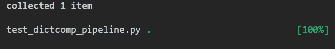

# Python dictcomp 管道示例

> 原文：[`towardsdatascience.com/python-dictcomp-pipelines-in-examples-4c4ec4e66f3`](https://towardsdatascience.com/python-dictcomp-pipelines-in-examples-4c4ec4e66f3)

## PYTHON 编程

## 见识 dictcomp 管道的威力

  [Marcin Kozak](https://medium.com/@nyggus?source=post_page-----4c4ec4e66f3--------------------------------)

·发表于[Towards Data Science](https://towardsdatascience.com/?source=post_page-----4c4ec4e66f3--------------------------------) ·11 分钟阅读·2023 年 4 月 20 日

--


管道一个接一个地处理任务。图片来源于[Daniel Schludi](https://unsplash.com/fr/@schluditsch?utm_source=medium&utm_medium=referral)在[Unsplash](https://unsplash.com/?utm_source=medium&utm_medium=referral)

这篇文章的灵感来源于几年前我在一个实际项目中参与的任务。在提出理解管道的概念后，我注意到这个解决方案可以通过使用`OptionalBool`数据结构，并结合 dictcomp 管道来很好地实现，`OptionalBool`是我在[另一篇文章](https://medium.com/pythoniq/an-optionalbool-type-for-python-none-false-or-true-7667e9cc6dd8)中提出的。

这篇文章旨在展示我们如何实现这样的管道。我将详细讲解一些细节，以便代码变得清晰且令人信服。你可以将其视为一个案例研究，展示 dictcomp 管道的实现。

我们已经讨论了 Python 中生成器管道的威力：

[## 在 Python 中构建生成器管道](https://towardsdatascience.com/building-generator-pipelines-in-python-8931535792ff?source=post_page-----4c4ec4e66f3--------------------------------)

### 这篇文章提出了一种优雅的方式来构建生成器管道

towardsdatascience.com

后来，我提出了一个 Python 特有的理解管道概念：

[## 在 Python 中构建理解管道](https://towardsdatascience.com/building-comprehension-pipelines-in-python-ec68dce53d03?source=post_page-----4c4ec4e66f3--------------------------------)

### 理解管道是一个 Python 特有的构建管道的概念

towardsdatascience.com

理解式管道构成了生成器管道的泛化。它们类似于生成器管道，但前者创建一个带有结果的生成器，而后者则以任何类型的理解式形式输出结果：

+   一个生成器，来自一个生成器管道

+   一个列表，来自一个列表推导式管道

+   一个字典，来自一个字典推导式管道

+   一个集合，来自一个集合推导式管道

在上述文章中，我专注于展示这种管道的工作原理以及如何构造它们。在此过程中，我使用了一些比较简单的示例。在这里，我们将使用一个更复杂的示例，其中我们将使用一个字典推导式管道。

# 任务：文档过滤

想象一下你的公司有大量的[标准操作程序](https://en.wikipedia.org/wiki/Standard_operating_procedure)（SOP）。它们混乱不堪，使用了一个过时的系统进行组织。你需要使用特定的键来过滤它们。例如，你需要找出哪些包含“Python”一词。

当然，这种过滤可以复杂得多，因此你需要编写一个程序，以便将来能够更改过滤逻辑。此外，目前标准以本地文件的形式存储在你从本地计算机可以访问的共享驱动器中。然而，这种情况应该很快会改变，因此你还需要使读取逻辑易于更改。

如上所述，我们的过滤任务也很简单。然而，下一任务可能需要更高级的解析逻辑，例如特定字段或表格等。再次强调，整体机制将类似，我们只需重写解析器。在实现时，你应该考虑到这一点。

# 实现

我们可以将该任务的算法描述如下：

+   我们有一个`documents`的列表（或其他序列）；`documents`中的每个`document`可以被读取为一个字符串（这取决于文档的类型）。在我们的第一个例子中，这将是文件路径的列表。但文档也可以通过其他方式访问，例如从数据库中。

+   在读取一个`document`后，解析文本并应用过滤逻辑。在我们的例子中，这归结为检查文本是否包含“Python”一词。如果包含，返回`True`；否则，返回`False`。

+   对`documents`中的所有文档执行上述步骤。

+   作为输出，返回一个字典，其中文档的字符串表示作为键（在我们的示例中为字符串形式的路径），这些布尔值作为对应的值。

下面的代码块展示了`dictcomp_pipeline`模块的内容。它以通用方式实现了上述逻辑。

```py
# dictcomp_pipeline.py

from pathlib import Path
from collections.abc import Sequence

from typing import Any, Optional

# Type aliases
Paths = Sequence[Path]
KeywordArgs = Optional[dict[str, Any]]

def read_text(path: Path) -> str:
    """Read text from path and return a string."""
    return path.read_text()

def parse_text(text: str, word: str) -> bool:
    """Parse text from string and return a bool value."""
    return word.lower() in text.lower()

def run_dictcomp_pipeline(
    documents: Any,
    read_text_kwargs: KeywordArgs = None,
    parse_text_kwargs: KeywordArgs = None) -> dict[str, bool]:
    read_text_kwargs = read_text_kwargs or {}
    parse_text_kwargs = parse_text_kwargs or {}

    texts = {
        doc: read_text(doc, **read_text_kwargs)
        for doc in documents
    }
    return {
        str(doc): parse_text(text, **parse_text_kwargs)
        for doc, text in texts.items()
    }
```

在附录 1 中，你会发现这个代码包含了扩展版的文档字符串，它们解释了一些关键细节，我们也将在下文中涵盖这些细节。

泛化体现在两个方面：数据读取器的实现方式和数据解析器的实现方式。我们将在下一节中讨论这些方面，并逐一讨论这三个函数。

# 函数

## 读取数据

这个特定的实现接受一个参数`path`，它是一个`pathlib.Path`实例。尽管我们以特定方式实现了`read_text()`函数，但管道函数（`get_dictcomp_pipeline()`）并未固定在这个实现上。你可以重新实现`read_text()`以满足你的需求；例如，它可以从 PDF 文件、网页或数据库中读取文档。

你可以自由更改函数，但必须保持以下几点不变：

+   函数必须将`get_dictcomp_pipeline()`中的一个`documents`元素作为第一个参数。它作为位置参数传递，因此你可以根据函数要完成的任务为其命名。在这个特定实现中，它是`path`。

+   如果函数接受更多参数，它们必须作为关键字参数，并且在所有`read_text()`的调用中都应相同。

+   函数应返回一个字符串形式的文本。

## 解析数据

尽管在我们的任务中，我们在文档中查找“Python”这个词，管道使得用户能够查找任何单词，这要归功于`parse_data()`函数的签名。它接受两个参数，`text`和`word`，都是字符串。如果在`text`中找到`word`，函数返回`True`；否则返回`False`。

这个解析逻辑忽略了单词的大小写，通过对文本和搜索的单词都使用`.lower()`字符串方法来简单实现。

与`read_data()`的情况类似，你可以更改函数的逻辑以及其签名，但需记住以下条件：

+   第一个参数，作为位置参数使用，是`read_text()`返回的文本，类型为`str`。

+   如果函数接受更多参数，它们在所有`parse_text()`的调用中都应相同。这些额外的参数必须作为关键字参数。

+   函数返回一个布尔值。

## 管道

`run_dictcomp_pipeline()`函数的实现方式使得上述两个函数可以有不同的实现，取决于数据源和解析逻辑。这是通过将这些函数作为关键字参数传递，从而解包相应的字典来完成的。

正如上述两个小节提到的一个限制，任何额外的参数必须对所有文档具有相同的值。如果你觉得这过于限制，你需要重新实现`run_dictcomp_pipeline()`函数，代价是增加额外的复杂性。

# 单元测试：管道在行动中

为了检查管道是否有效，让我们使用`pytest`实现一些单元测试。我将在这里跳过`read_text()`和`parse_text()`函数的单元测试，但可以随意将它们作为练习添加。

在这里，我们有一个测试来检查应用程序是否按预期工作。

```py
# test_dictcomp_pipeline.py

import pathlib
import pytest

from dictcomp_pipeline import get_dictcomp_pipeline

@pytest.fixture
def files():
    n_files = 11
    paths = [pathlib.Path(".") / f"txt_file_{i}.txt"
             for i in range(n_files)]
    for i, path in enumerate(paths):
        text = "Shout Bamalama!\nI'm an elephant, and so what?\n\n"
        if i % 2 == 0:
            text = f"{text}Python"
        path.write_text(text)
    yield paths
    for path in paths:
        path.unlink()

def test_get_dictcomp_pipeline(files):
    isPython = get_dictcomp_pipeline(
        files,
        parse_text_kwargs={"word": "Python"}
    )
    assert isPython == {
        'txt_file_0.txt': True,
        'txt_file_1.txt': False,
        'txt_file_2.txt': True,
        'txt_file_3.txt': False,
        'txt_file_4.txt': True,
        'txt_file_5.txt': False,
        'txt_file_6.txt': True,
        'txt_file_7.txt': False,
        'txt_file_8.txt': True,
        'txt_file_9.txt': False,
        'txt_file_10.txt': True
        }
```

让我们看看测试是如何工作的。`files`固定装置创建了 11 个文本文件，其中六个文件的内容包含了“Python”这个词。这些文件在调用`test_get_dictcomp_pipeline()`时创建。然后测试运行管道函数并断言输出是否符合预期。最后，测试文本文件被删除，你将在固定装置代码的最后两行看到这些操作。

运行测试后，你应该会看到来自`pytest`的点赞：



一个管道将多个功能整合为一个，因此上面对我们管道函数的测试可以被视为，至少在某种程度上，是一个集成测试。

即使有非常多的文档，字典也应能很好地保存输出，因为它的类型是`dict[str, bool]`，这样的字典不会占用太多内存。当然，你可能还是希望将其处理为生成器；在这种情况下，你应该将管道函数修订为生成器管道。一个解决方案是使生成器生成`tuple[str, bool]`类型的值。这样，它将是一个包含表示文档的字符串和布尔值的元组，布尔值表示解析函数是否找到了所搜索的词。

# 扩展示例

在上面的示例中，我们使用了一个`bool`值，但在某些任务中，这可能过于限制。例如，你可能需要考虑并非所有文档都是 SOP。换句话说，你有一些文档，其中有些是 SOP，有些不是；任务是检查文档是否为 SOP，如果是，则检查是否包含特定的词、短语或多个词/短语。在这种情况下，你可以使用更复杂的数据结构，如本文中提出的`OptionalBool`数据结构和类型：

[## An OptionalBool Type for Python: None, False or True](https://medium.com/pythoniq/an-optionalbool-type-for-python-none-false-or-true-7667e9cc6dd8?source=post_page-----4c4ec4e66f3--------------------------------)

### 使用`OptionalBool`而不是`Optional[bool]`。

[medium.com](https://medium.com/pythoniq/an-optionalbool-type-for-python-none-false-or-true-7667e9cc6dd8?source=post_page-----4c4ec4e66f3--------------------------------)

在我们的任务中，`OptionalBool`值为`None`意味着相应的文档不是 SOP；`False`，表示它是 SOP 但不包含所搜索的短语；而`True`，表示它是 SOP 并且包含了所搜索的短语。

本文的动机来自一个真实的例子，当时我遇到了类似的情况。那时，我完全不同地实现了解决方案，但今天我肯定会考虑使用`OptionalBool`和字典推导管道。为了使用`OptionalBool`，`run_dictcomp_pipeline()`的签名需要稍作修改，因为我们将用`OptionalBool`替代`bool`。

你可以在附录 2 中找到修订后的代码版本，包括测试文件。

# 结论

我们讨论了使用 dictcomp 流水线的实际例子。虽然我们实现的任务相当简单，但解决方案更为通用，使得用户可以重新实现创建流水线的两个函数——而不需要更改流水线函数本身。

你可能已经注意到，我们实现的 dictcomp 流水线看起来只是一个字典推导式。因为它确实*就是*一个字典推导式。就像生成器流水线是一个生成器一样。流水线隐藏在正在进行的操作中：输入 → 函数 → 函数 → … → 函数 → 输出。在我们的例子中，流水线非常简短，但在许多其他场景中，它可以包含更多步骤。

我想向你展示在什么样的场景下这样的推导式流水线可以发挥作用。然而，这个特定的任务可以以多种方式实现。选择哪种方式应主要取决于你希望生成什么样的代码。如果你只是需要实现一个特定的任务，那么没有必要像我们这样对函数进行泛化。如果你打算编写一个供他人使用的框架，你可能会更进一步地泛化它。

# 附录 1

第一个示例中 `run_dictcomp_pipeline()` 的代码，带有完整的文档字符串：

```py
# dictcomp_pipeline.py

from pathlib import Path
from collections.abc import Sequence

from typing import Any, Optional

# Type aliases
Paths = Sequence[Path]
KeywordArgs = Optional[dict[str, Any]]

def read_text(path: Path) -> str:
    """Read text from path and return a string.

    You can rewrite this function to read from another source.
    The function must return a string, but it can take any
    number of keyword arguments. The first argument must
    work as positional, and it must represent a document
    from the `documents` sequences from `run_dictcomp_pipeline()`.
    """
    return path.read_text()

def parse_text(text: str, word: str) -> bool:
    """Parse text from string and return a bool value.

    You can rewrite this function to use different
    parsing logic. The function must return a bool,
    but it can take any number of keyword arguments.
    The first argument must remain unchanged, and must
    work as a positional argument.
    """
    return word.lower() in text.lower()

def run_dictcomp_pipeline(
    documents: Any,
    read_text_kwargs: KeywordArgs = None,
    parse_text_kwargs: KeywordArgs = None) -> dict[str, bool]:
    """Run dictcomp pipeline.

    The function does not handle exceptions: if anything goes
    wrong, the pipeline breaks and the corresponding exception
    is raised.

    Args:
        paths (Paths): sequence with paths to files with
            documents to read
        word (str): word to look for in documents
        read_text_kwargs (KeywordArgs, optional): dictionary with
            keyword arguments to be used in a call to `read_text()`,
            if needed. Defaults to None, meaning that no arguments
            are passed.
        parse_text_kwargs (KeywordArgs, optional): dictionary with
            keyword arguments to be used in a call to `parse_text()`,
            if needed. Defaults to None, meaning that no arguments
            are passed.

    Returns:
        dict[Path, bool]: dictionary with the output of
            the pipeline; its result represent the parsing logic
            used in the documents
    """
    read_text_kwargs = read_text_kwargs or {}
    parse_text_kwargs = parse_text_kwargs or {}

    texts = {
        doc: read_text(doc, **read_text_kwargs)
        for doc in documents
    }
    return {
        str(doc): parse_text(text, **parse_text_kwargs)
        for doc, text in texts.items()
    }
```

# 附录 2

在本附录中，你将找到处理`OptionalBool`值的解决方案的扩展代码。你还需要 `optionalbool` 模块中的 `OptionalBool` 类的代码，你可以从以下文章中复制粘贴：

[](https://medium.com/pythoniq/an-optionalbool-type-for-python-none-false-or-true-7667e9cc6dd8?source=post_page-----4c4ec4e66f3--------------------------------) [## 一个可选布尔类型（OptionalBool）：None、False 或 True]

### 使用 OptionalBool 替代 Optional[bool]。

medium.com](https://medium.com/pythoniq/an-optionalbool-type-for-python-none-false-or-true-7667e9cc6dd8?source=post_page-----4c4ec4e66f3--------------------------------)

这里是代码：

```py
# optionalbool_dictcomp_pipeline.py

from pathlib import Path
from collections.abc import Sequence

from typing import Any, Optional

from optionalbool import OptionalBool

# Type aliases
Paths = Sequence[Path]
KeywordArgs = Optional[dict[str, Any]]

def read_text(path: Path) -> str:
    """Read text from path and return a string."""
    return path.read_text()

def parse_text(text: str,
               word: str,
               standards_phrases: Sequence[str]
               ) -> OptionalBool:
    """Parse text from string and return a bool value."""
    if not any(phrase.lower() in text.lower() for phrase in standards_phrases):
        return OptionalBool(None)
    return OptionalBool(word.lower() in text.lower())

def run_dictcomp_pipeline(
    documents: Any,
    read_text_kwargs: KeywordArgs = None,
    parse_text_kwargs: KeywordArgs = None
    ) -> dict[str, OptionalBool]:
    read_text_kwargs = read_text_kwargs or {}
    parse_text_kwargs = parse_text_kwargs or {}

    texts = {
        doc: read_text(doc, **read_text_kwargs)
        for doc in documents
    }
    return {
        str(doc): parse_text(text, **parse_text_kwargs)
        for doc, text in texts.items()
    }
```

以及测试文件：

```py
# test_optionalbool_dictcomp_pipeline.py

import pathlib
import pytest

from optionalbool_dictcomp_pipeline import run_dictcomp_pipeline

from optionalbool import OptionalBool

@pytest.fixture
def files():
    n_files = 11
    paths = [pathlib.Path(".") / f"doc_file_{i}.txt"
             for i in range(n_files)]
    for i, path in enumerate(paths):
        text = "Shout Bamalama!\nI'm an elephant, and so what?\n\n"
        if i % 2 == 0:
            text = f"{text}Python"
        if i % 3 != 0:
            text = (
                "This is a Standard Operating Procedure\n"
                f"{text}"
            )
        path.write_text(text)
    yield paths
    for path in paths:
        path.unlink()

def test_get_dictcomp_pipeline(files):
    standards_phrases = ["Standard Operating Procedure", "SOP",]
    isPython = run_dictcomp_pipeline(
        files,
        parse_text_kwargs={"word": "Python",
                           "standards_phrases": standards_phrases}
    )
    for v in isPython.values():
        assert isinstance(v, OptionalBool)
    assert isPython == {
        'doc_file_0.txt': None,
        'doc_file_1.txt': False,
        'doc_file_2.txt': True,
        'doc_file_3.txt': None,
        'doc_file_4.txt': True,
        'doc_file_5.txt': False,
        'doc_file_6.txt': None,
        'doc_file_7.txt': False,
        'doc_file_8.txt': True,
        'doc_file_9.txt': None,
        'doc_file_10.txt': True
    }
```

感谢阅读。如果你喜欢这篇文章，你可能也会喜欢我写的其他文章；你可以在[这里](https://medium.com/@nyggus)查看。如果你想加入 Medium，请使用下面的推荐链接：

[](https://medium.com/@nyggus/membership?source=post_page-----4c4ec4e66f3--------------------------------) [## 使用我的推荐链接加入 Medium - Marcin Kozak]

### 阅读 Marcin Kozak 的每一个故事（以及 Medium 上其他成千上万的作者的故事）。你的会员费用将直接支持…

medium.com](https://medium.com/@nyggus/membership?source=post_page-----4c4ec4e66f3--------------------------------)
