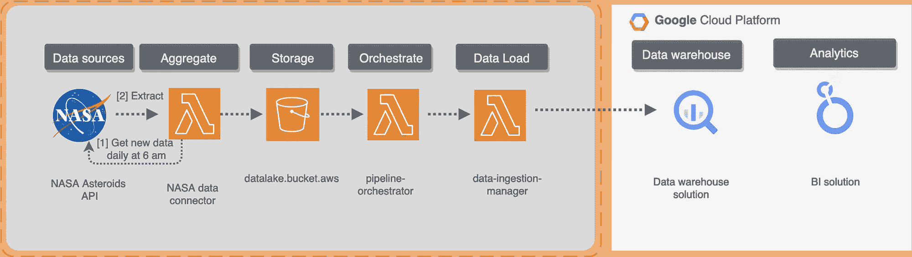

# Python 数据工程师

> 原文：[`towardsdatascience.com/python-for-data-engineers-f3d5db59b6dd`](https://towardsdatascience.com/python-for-data-engineers-f3d5db59b6dd)

## 初学者的高级 ETL 技巧

[](https://mshakhomirov.medium.com/?source=post_page-----f3d5db59b6dd--------------------------------)[](https://towardsdatascience.com/?source=post_page-----f3d5db59b6dd--------------------------------) [💡Mike Shakhomirov](https://mshakhomirov.medium.com/?source=post_page-----f3d5db59b6dd--------------------------------)

·发布于 [Towards Data Science](https://towardsdatascience.com/?source=post_page-----f3d5db59b6dd--------------------------------) ·阅读时间 17 分钟·2023 年 10 月 21 日

--


图片由 [Boitumelo](https://unsplash.com/@writecodenow?utm_source=medium&utm_medium=referral) 提供，来自 [Unsplash](https://unsplash.com/?utm_source=medium&utm_medium=referral)

在这个故事中，我将讲述 Python 中的高级数据工程技术。毫无疑问，Python 是最受欢迎的数据编程语言。在我近十二年的数据工程职业生涯中，我遇到过各种代码问题。这个故事简要总结了我如何解决这些问题并学会写出更好的代码。我将展示一些使我们的 ETL 更快并有助于提高代码性能的技术。

## 列表推导式

想象一下你正在遍历一个表的列表。通常，我们会这样做：

```py
data_pipelines = ['p1','p2','p3']
processed_tables = []
for table in data_pipelines:
    processed_tables.append(table)
```

但我们可以使用列表推导式。它们不仅更快，还减少了代码，使其更简洁：

```py
processed_tables = [table for table in data_pipelines]
```

例如，循环处理一个超大的文件以转换（ETL）每一行，从未如此简单：

```py
def etl(item):
    # Do some data transformation here
    return json.dumps(item)

data = u"\n".join(etl(item) for item in json_data)
```

列表推导式对于 ETL 处理大数据文件非常有用。假设我们有一个需要转换为换行符分隔格式的数据文件。在你的 Python 环境中尝试运行这个示例：

```py
 import io
import json

def etl(item):
    return json.dumps(item)

# Text file loaded as a blob
blob = """
        [
{"id":"1","first_name":"John"},
{"id":"2","first_name":"Mary"}
]
"""
json_data = json.loads(blob)
data_str = u"\n".join(etl(item) for item in json_data)

print(data_str)
data_file = io.BytesIO(data_str.encode())

# This data file is ready for BigQuery as Newline delimited JSON
print(data_file)
```

输出将是**换行符分隔的 JSON**。这是 BigQuery 数据仓库中的一种标准格式，准备好加载到表中了：

```py
{"id": "1", "first_name": "John"}
{"id": "2", "first_name": "Mary"}
<_io.BytesIO object at 0x10c732430>
```

## 生成器

如果我们处理的是**逐行存储**的 CSV 和 DAT 文件，那么我们的文件对象已经是一个**生成器**，我们可以使用列表推导式来处理数据，**不会消耗太多内存**：

```py
for line in open('very_big_file.csv'):
    validate_schema(line)

# or the same using list comprehension:
data_errors = [validate_schema(line) for line in open('very_big_file.csv')]
```

在我们实际将记录插入数据仓库表之前验证记录，对于批量数据处理管道可能是有用的。

> 我们经常需要在将数据文件加载到数据仓库之前验证它们。如果一个记录失败，那么整个批次都会失败。

我们可以用它来创建接近实时的分析管道。这也是一种非常经济高效的方式来处理数据，相比于流数据管道设计模式。我之前在这里写过：

[](/data-pipeline-design-patterns-100afa4b93e3?source=post_page-----f3d5db59b6dd--------------------------------) ## 数据管道设计模式

### 选择合适的架构和示例

[towardsdatascience.com

或者，在处理大数据时，如果我们的文件不是换行符分隔的文本，我们可以使用`yield`。这始终是一个好习惯，因为我们希望以内存高效的方式处理数据文件。例如：

```py
# Create a file first: ./very_big_file.csv as:
# transaction_id,user_id,total_cost,dt
# 1,John,10.99,2023-04-15
# 2,Mary, 4.99,2023-04-12

# Example.py
def etl(item):
    # Do some etl here
    return item.replace("John", '****') 

# Create a generator 
def batch_read_file(file_object, batch_size=19):
    """Lazy function (generator) can read a file in chunks.
    Default chunk: 1024 bytes."""
    while True:
        data = file_object.read(batch_size)
        if not data:
            break
        yield data
# and read in chunks
with open('very_big_file.csv') as f:
    for batch in batch_read_file(f):
        print(etl(batch))

# In command line run
# Python example.py 
```

这将读取一个本地文件并以 19 字节为块进行处理。输出将是：

```py
transaction_id,user
_id,total_cost,dt
1
,****,10.99,2023-04
-15
2,Mary, 4.99,20
23-04-12
```

这只是处理**二进制**数据的一个示例。在现实生活中，将文件内容分割成段使用**分隔符**（即换行符`'\n’`或`'}{'`）可能会更容易，这取决于我们的数据结构。

假设文本数据来自某个**外部**位置，即**云存储**。我们也可以将其处理为**流**。我们不希望加载整个数据文件并运行`split('\n')`逐行处理，这会消耗大量内存。我们可以使用`re.finditer`，它像**生成器**一样，以块的方式读取数据文件，这样我们就可以运行所需的 ETL 而**不会**消耗太多内存。

```py
import io
import re
def etl(item):
    print(f'Transforming item: {item}')
    return item.replace("John", '****')

# Helper function to split our text file into chunks
# using separator
def splitStr(string, sep="\s+"):
    if sep=='':
        return (c for c in string)
    else:
        return (_.group(1) for _ in re.finditer(f'(?:^|{sep})((?:(?!{sep}).)*)', string))

# Text file loaded as a blob
blob = """transaction_id,user_id,total_cost,dt
1,John,10.99,2023-04-15
2,Mary, 4.99,2023-04-12
"""

# data = blob.split("\n") # We wouldn't want to do this on large datasets 
# as it would require to load big data file as a whole in the first place
# consuming lots of memory

# We would want to use our generator helper function
# and process data in chunks
data = splitStr(blob, sep='\n')
data_str = u"\n".join(etl(item) for item in data)

print('New file contents:')
print(data_str)
data_file = io.BytesIO(data_str.encode())

print('This data file is ready for BigQuery:')
print(data_file) 
```

输出：

```py
python example.py                                  ✔  48  19:52:06  dataform_env
Transforming item: transaction_id,user_id,total_cost,dt
Transforming item: 1,John,10.99,2023-04-15
Transforming item: 2,Mary, 4.99,2023-04-12
Transforming item:
New file contents:
transaction_id,user_id,total_cost,dt
1,****,10.99,2023-04-15
2,Mary, 4.99,2023-04-12

This data file is ready for BigQuery:
<_io.BytesIO object at 0x103672980>
```

## Python **数据验证属性**

我们可以使用**Python 属性** [2]来验证数据记录。如果记录不是我们定义的类的实例，则必须抛出异常。

> 我们可以将数据存储为数据类的对象。

就是这么简单。假设我们有一个**流数据管道**，我们想要验证记录中的一些字段。

> 简单来说——它们必须匹配现有的表格模式。

我们可以使用 Python 属性来实现。请看下面的示例。

```py
class ConnectionDataRecord(object):
    def __init__(self, user, ts):
        self.user = user
        self.ts = ts

    @property
    def user(self):
        return self._user

    @description.setter
    def user(self, d):
        if not d: raise Exception("user cannot be empty")
        self._user = d

    @property
    def ts(self):
        return self._ts

    @value.setter
    def ts(self, v):
        if not (v > 0): raise Exception("value must be greater than zero")
        self._ts = v
```

如果我们选择打破规则并分配一些不符合我们标准的值，则会抛出异常。例如，如果我们尝试调用`ConnectionDataRecord('', 1)`，将会抛出异常。

或者，我们可以使用一个名为`Pydantic`的库。请看下面的代码。如果我们用不符合要求的对象调用该函数，它将抛出一个错误。

```py
from pydantic import BaseModel

class ConnectionDataRecord(BaseModel):
    user: str
    ts: int

record = ConnectionDataRecord(user="user1", ts=123456789)
```

## 装饰器

装饰器的设计目的是使我们的代码看起来更简洁，并为其添加额外的功能。我们可以简单地将一个函数作为参数传递给另一个函数（装饰器），并在这个包装器内部进行一些数据转换。想象一下，我们有很多不同的 ETL 函数来处理数据，但我们只需要一个将结果上传到数据湖的函数。这就是我们如何做到的：

> 如果一些代码逻辑重复，使用**装饰器**是一个好习惯。

这有助于更容易维护代码库，并节省了我们在需要更改重复逻辑时的很多时间。

```py
def etl_decorator(func):
    def wrapper():
        result = func()
        return f'Processing {result}' 
    return wrapper

@etl_decorator
def unzip_data():
    return "unzipped data"

print(unzip_data())  # Output: Processing unzipped data
```

装饰器因其有效性被广泛使用。考虑这个 Airflow DAG 示例：

```py
@dag(default_args=default_args, tags=['etl'])
def etl_pipeline():

    @task()
    def extract():
        return json.loads(data_string)    
    @task(multiple_outputs=True)
    def transform(order_data_dict: dict):
        return {"total_count": len(order_data_dict)}    
    @task()
    def load(total_order_value: float):
        print(f"Total order value is: {total_count}")    

    extracted = extract()
    transformed = transform(extracted)
    load(transformed["total_count"])
```

## 与 API 的工作

作为数据工程师，你会经常执行 HTTP 请求，调用各种 API 端点。下面是一个 GET 请求的示例。

```py
response = requests.get('https://api.nasa.gov/neo/rest/v1/feed?start_date=2015-09-07&end_date=2015-09-08&api_key=your_api_key'))
print(response.json())
```

它从**免费**的**NASA 小行星 API**中提取一些数据，并返回所有在该日期接近地球的小行星。只需在上面的 URL 路径中替换你的 API 密钥或使用我创建的密钥。**requests**库处理所有事情，但还有更好的方法。

> 我们可以使用会话并以**流**的形式处理来自我们 API 端点的数据。

这将确保我们不会遇到任何内存问题，并以流式方式处理我们的 GET 请求[3]：

```py
import requests
session = requests.Session()

url="https://api.nasa.gov/neo/rest/v1/feed"
apiKey="your_api_key"
requestParams = {
    'api_key': apiKey,
    'start_date': '2023-04-20',
    'end_date': '2023-04-21'
}
response = session.get(url, params = requestParams, stream=True)
print(response.status_code)
```

理解 HTTP 请求的工作原理在数据工程中至关重要。

> 我每天处理各种 API 请求，不必依赖其他框架或库。

例如，就在几周前，我在**Dataform 迁移项目**上工作，意识到现有的 Google 库（`from google.cloud import dataform_v1beta1`）无法创建调度。解决方法是使用 Dataform API [4]，这就像向特定端点发出 POST 请求一样简单：

```py
from google.cloud import dataform_v1beta1
import requests
import google.auth.transport.requests
from google.oauth2 import service_account
...
# Get Dataform and BigQuery credentials from encrypted file:
print(f'Getting BigQuery credentials from encrypted file...')
credentials = service_account.Credentials.from_service_account_file(
    './../credentials.json'
    , scopes=['https://www.googleapis.com/auth/cloud-platform'])

def create_dataform_workflow_config(credentials, id, workflow_config, repository_id):
    '''
    The function will create a schedule (workflow) in Dataform configs by making a direct API call
    and using request_params with requests module
    , i.e.
    https://cloud.google.com/dataform/reference/rest/v1beta1/projects.locations.repositories.workflowConfigs/create
    https://cloud.google.com/dataform/reference/rest/v1beta1/projects.locations.repositories.workflowConfigs#WorkflowConfig
    If successful will create a workflow:
    {'name': 'projects/my-project-data-staging/locations/us-central1/repositories/dataform-poc/workflowConfigs/test_live_20230831', 'releaseConfig': 'projects/my-project-data-staging/locations/us-central1/repositories/dataform-poc/releaseConfigs/staging', 'invocationConfig': {'includedTags': ['test']}, 'cronSchedule': '40 13 * * *', 'timeZone': 'Africa/Abidjan'}

    If the workflow exists an error will be sent:
    {'error': {'code': 409, 'message': "Resource 'projects/123456789/locations/us-central1/repositories/dataform-poc/workflowConfigs/test_live_20230831' already exists", 'status': 'ALREADY_EXISTS', 'details': [{'@type': 'type.googleapis.com/google.rpc.ResourceInfo', 'resourceName': 'projects/123456789/locations/us-central1/repositories/dataform-poc/workflowConfigs/test_live_20230831'}]}}

    Accepts workflow_config as request_body, i.e.
     request_body = {
             # "name": "projects/123456789/locations/us-central1/repositories/dataform-poc/workflowConfigs/test_live_20230830",
             "releaseConfig": "projects/my-project-data-staging/locations/us-central1/repositories/dataform-poc/releaseConfigs/staging",
             "invocationConfig": {
                 "includedTags": [
                     "test"
                 ]
             },
             "cronSchedule": "40 13 * * *",
             "timeZone": "Africa/Abidjan"
     }
    '''
    request = google.auth.transport.requests.Request()
    credentials.refresh(request)

    print('Creating a workflow...')
    # Make the request
    try:
        session = requests
        url=f'https://dataform.googleapis.com/v1beta1/projects/123456789/locations/us-central1/repositories/{repository_id}/workflowConfigs/'

        headers = {
            "Authorization": "Bearer " + credentials.token,
            "Content-Type" : "application/json; charset=utf-8"

        }
        query_params = {
            "workflowConfigId": id
        }
        request_body = workflow_config

        page_result = session.post(url, params=query_params, json=request_body, headers=headers)
        print(page_result.json())
    except Exception as e:
        print(e)
```

这个请求的核心在于我们将`workflow_config`作为**json**发送，并使用来自 Google 文档[4]的知识在路径参数中添加`workflowConfigId`。

> 这将创建一个必要的调度，以在 BigQuery 的 Dataform 中运行我们的数据转换脚本。

类似地，正如我们在 GET 请求中所做的那样，我们可以使用 Python **生成器**将数据流入我们的 POST API 端点：

```py
import time
import requests

def etl_data_generator():
    yield b"Foo"
    time.sleep(3)
    yield b"Bar"

requests.post("http://some.api.endpoint", data=etl_data_generator())
```

思路很清楚。我们可以以节省内存的方式处理和发送数据。

## 处理 API 速率限制

所有 API 都有速率限制，我们在提取数据时要记住这一点。我们可以使用装饰器来处理它。简单的装饰可以像这样实现：

```py
from ratelimit import limits
import requests
CALLS = 10
TIME_PERIOD = 900   # time period in seconds

@limits(calls=CALLS, period=TIME_PERIOD)
def call_api():
    response = requests.get('https://api.example.com/data')
    if response.status_code != 200:
        raise Exception('API response: {}'.format(response.status_code))
    return response.json()
```

使用这个装饰器，我们的函数在 15 分钟内不会发起超过 10 次 API 调用。

处理这种情况的最简单方法是使用`time.sleep()`，但 Python 速率限制允许我们以这种优雅的方式做到这一点。

## Python 中的 Async 和`await`

以**异步**方式执行 ETL 是另一个极其有用的功能。我们可以使用`asyncio`库来同时运行任务。让我们考虑这个简单的同步示例，其中我们在`for`循环中处理表：

```py
import requests

def pull_data(url, requestParams):
    return requests.get(url, params = requestParams, stream=True)

for table in api_endpoints_list:
    data = pull_data(table.api_url, table.requestParams)
    etl(data)
```

运行这段代码时，我们必须等待每个表完成`pull_data()`任务，但使用`Async`，我们可以并行处理它们。

考虑使用以下代码：

```py
import asyncio
import aiohttp

async def pull_data(session, url, requestParams):
  async with session.get(url, params = requestParams, stream=True) as response:
    return await response

async def main():
    async with aiohttp.ClientSession() as session:
        tasks = [pull_data(session, url, requestParams) for table in api_endpoints_list:]
        tasks_data = await asyncio.gather(*tasks)
        for data in tasks_data:
            etl(task_data)

asyncio.run(main())
```

它将同时从报告 API 中提取数据，并显著提高我们的 ETL 性能。

> 它帮助管理 ETL 任务，同时系统资源以最佳方式分配。

例如，我们可以同时运行两个 ETL 作业，但我们可以定义执行顺序：

```py
async def etl():
    job1 = asyncio.create_task(perform_etl_script1())
    job2 = asyncio.create_task(read_s3_data())
    job3 = asyncio.create_task(upload_s3_data())

    await job2
    await job1
    await job3
```

## 使用 Map 和 Filter

映射和过滤比列表推导式的速度更快。

我们可以逐行转换数据，将`map`函数应用于数据集中的项目，将其处理为`iterable`：

```py
import math 
numbers = [10,20]
factorials = list(map(lambda i: math.factorial(int(math.sqrt(i**3))), numbers))
print(factorials)
# Output:
# [8222838654177922817725562880000000, 16507955160908461081216919262453619309839666236496541854913520707833171034378509739399912570787600662729080382999756800000000000000000000]
```

我们希望使用`filter`来提取符合特定条件的对象，即

```py
 numbers = [10,21]
even_numbers = list(filter(lambda i: i% 2 == 0, numbers))
print(even_numbers)
# Output:
# [10]
```

## 使用 Pandas 处理大型数据集

后来的 Pandas 库版本提供了一个方便的上下文管理器，可以像这样使用：

```py
batchsize = 10 ** 5
with pd.read_csv(filename, chunksize=batchsize) as reader:
    for batch in reader:
        etl(batch)
```

> 它将以批处理模式处理数据，假设我们不需要一次性将整个数据集加载到数据框中。

它有广泛的应用，从 OLAP 报告到机器学习（ML）管道。例如，我们可能想要创建一个推荐模型训练任务，并需要像这样准备数据集：

```py
batch_data=pd.read_table('recommendation_data.csv',chunksize=100000,sep=';',\
       names=['group','user','rating','date','id'],index_col='id',\
       header=None,parse_dates=['date'])

df=pd.DataFrame()
%time df=pd.concat(batch.groupby(['group','user',batch['date'].map(lambda x: x.year)])['rating'].agg(['sum']) for batch in batch_data)
```

这样，Pandas 将确保我们的应用程序始终有足够的内存来处理数据。

## 使用 joblib 进行管道处理和并行计算

`joblib.dump()`和`joblib.load()`方法允许我们高效地管道大型数据集转换。`joblib`将存储和序列化大数据，处理任意 Python 对象，如`numpy`数组。

> 你认为`scikit-learn`用什么来保存和加载机器学习模型？正确的答案是 - `joblib`。

首先，为什么要保存模型？——简单来说，因为我们可能在管道后面需要它，即使用新数据进行预测等。

> 我们不希望重新训练我们的机器学习模型，因为这是一个非常耗时的任务。

另一个原因是我们可能希望保存相同模型的不同版本，以便查看哪个版本表现更好。`joblib`有助于完成所有这些工作[5]：

```py
from joblib import dump, load
import os
import numpy as np
import joblib

filename = os.path.join(savedir, 'test.joblib')
to_persist = [('foo', [1, 2, 3]), ('bar', np.arange(5))]

# Save a model
joblib.dump(to_persist, filename)  
# ['...test.joblib']

# Load a model
joblib.load(filename)
# [('foo', [1, 2, 3]), ('bar', array([0, 1, 2, 3, 4]))]
```

这些函数明确连接了我们在磁盘上保存的文件和原始 Python 对象的执行上下文。因此，除了文件名，`joblib`还接受文件对象：

```py
 # WRITE
with open(filename, 'wb') as fo:
   joblib.dump(model, fo)

# READ
with open(filename, 'rb') as fo:  
   model = joblib.load(fo)
```

**AWS S3 模型转储/加载示例：**

```py
import tempfile
import boto3
import joblib

s3_client = boto3.client('s3')
bucket_name = "my-bucket"
key = "model.pkl"

# WRITE
with tempfile.TemporaryFile() as fp:
    joblib.dump(model, fp)
    fp.seek(0)
    s3_client.put_object(Body=fp.read(), Bucket=bucket_name, Key=key)

# READ
with tempfile.TemporaryFile() as fp:
    s3_client.download_fileobj(Fileobj=fp, Bucket=bucket_name, Key=key)
    fp.seek(0)
    model = joblib.load(fp)

# DELETE
s3_client.delete_object(Bucket=bucket_name, Key=key)
```

## 使用 joblib 进行并行计算

这非常高效，因为它依赖于多进程，并且会使用多个 Python 工作者在所有 CPU 核心上或跨多台机器并发执行任务。考虑这个例子：

```py
import time 
from joblib import Parallel,delayed 
import math 

t1 = time.time() 

# Normal 
results = [math.factorial(int(math.sqrt(i**3))) for i in range(1000,2000)] 

t2 = time.time() 

print('\nComputing time {:.2f} s'
      .format(t2 - t1))

# Using all CPU cores
t1 = time.time()
results = Parallel(n_jobs=-1)(delayed(math.factorial) (int(math.sqrt(i**3))) for i in range(1000,2000)) 

t2 = time.time()
print('\nComputing time {:.2f} s'
      .format(t2 - t1))
```

> 我们可以利用所有 CPU 核心来释放硬件的全部潜力。

在这里，我们告诉`Parallel`使用所有核心（-1），计算速度**提高了 5 倍：**

```py
# The output:
Computing time 59.67 s

Computing time 12.18 s
```

## 单元测试 ETL 管道

在我整个数据工程师职业生涯中，我学到的最重要的一点是所有东西都必须进行单元测试。这不仅包括**SQL**，还包括**ETL 作业**和与我们数据管道中使用的其他服务的**集成**。

我们可以使用`unittest` Python 库来测试我们的代码。假设我们有一个助手模块，用于检查一个数字是否是素数：

```py
# ./prime.py
import math

def is_prime(num):
    '''Check if num is prime or not.
    '''
    for i in range(2,int(math.sqrt(num))+1):
        if num%i==0:
            return False
    return True
```

> 我们如何测试这个函数内部的逻辑？

`unittest`使这一切变得非常简单：

```py
# ./test.py
import unittest
from prime import is_prime

class TestPrime(unittest.TestCase):

    def test_thirteen(self):
        self.assertTrue(is_prime(13))
```

现在如果我们在命令行中运行这个，我们将测试逻辑：

```py
python -m unittest test.py
# Output:
# .
# ----------------------------------------------------------------------
# Ran 1 test in 0.000s

# OK
```

这是正确的，因为 13 是一个素数。让我们进一步测试一下。我们知道 4 不是一个素数，因此我们希望针对这个特定函数的单元测试在断言为 False 时返回通过：

```py
# ./test.py
import unittest
from prime import is_prime

class TestPrime(unittest.TestCase):

    def test_thirteen(self):
        self.assertTrue(is_prime(13))
    def test_four(self):
        self.assertFalse(is_prime(4))
```

```py
python -m unittest test.py
# Output:
# ..
# ----------------------------------------------------------------------
# Ran 2 tests in 0.000s

# OK
```

很简单。让我们看一个更高级的示例。

> 让我们假设我们有一个 ETL 服务，从某个 API 中提取数据，这需要很多时间。然后我们的服务将转换这个数据集，我们希望测试这个 ETL 转换逻辑是否持续存在。
> 
> 我们该怎么做呢？

我们可以使用`unittest`库中的 mock 和 patch 方法。考虑这个应用程序文件`asteroids.py`

```py
# ./asteroids.py
import requests
API_KEY="fsMlsu69Y7KdMNB4P2m9sqIpw5TGuF9IuYkhURzW"
ASTEROIDS_API_URL="https://api.nasa.gov/neo/rest/v1/feed"

def get_data():
    print('Fetching data from NASA Asteroids API...')
    session = requests.Session()
    url=ASTEROIDS_API_URL
    apiKey=API_KEY
    requestParams = {
        'api_key': apiKey,
        'start_date': '2023-04-20',
        'end_date': '2023-04-21'
    }
    response = requests.get(url, params = requestParams)
    print(response.status_code)
    near_earth_objects = (response.json())['near_earth_objects']
    return near_earth_objects

def save_data():
    # Do some ETL here
    data = get_data()
    return data

print(save_data())
```

如果我们运行 app.py，输出将会是列出在特定日期接近地球的小行星：

```py
# python ./asteroids.py

Fetching data from NASA Asteroids API...
200
{'2023-04-20': [{'links': {'self': 'http://api.nasa.gov/neo/rest/v1/neo/2326291?api_key=fsMlsu69Y7KdMNB4P2m9sqIpw5TGuF9IuYkhURzW'}, 'id': '2326291', 'neo_reference_id': '2326291', 'name': '326291 (1998 HM3)', 'nasa_jpl_url': 'http://ssd.jpl.nasa.gov/sbdb.cgi?sstr=2326291', 'absolute_magnitude_h': 19.0, 'estimated_diameter': {'kilometers': {'estimated_diameter_min': 0.4212646106, 'estimated_diameter_max': 0.9419763057}, 'meters': {'estimated_diameter_min': 421.2646105562, 'estimated_diameter_max': 941.9763057186}, 'miles': {'estimated_diameter_min': 0.2617616123, 'estimated_diameter_max': 0.5853167591}, 'feet': {'estimated_diameter_min': 1382.1017848971, 'estimated_diameter_max': 3090.4735428537}}, 'is_potentially_hazardous_asteroid': False, 'close_approach_data':
....
```

从 API 中提取数据可能需要很多时间，但我们希望我们的单元测试运行得更快。我们可以**模拟**一些假的 API 响应到我们的`get_data()`函数中，然后使用它来测试 `save_data()`函数中的 ETL 逻辑：

```py
# ./test_etl.py
import unittest
from asteroids import *

import unittest.mock as mock

class TestEtl(unittest.TestCase):

    def test_asteroids_etl(self): 
        with mock.patch('asteroids.get_data') as GetDataMock:
            GetDataMock.return_value = ['asteroid_1', 'asteroid_2']
            self.assertEqual(['1', '2'], save_data())
```

输出将是：

```py
AssertionError: Lists differ: ['1', '2'] != ['asteroid_1', 'asteroid_2']

First differing element 0:
'1'
'asteroid_1'

- ['1', '2']
+ ['asteroid_1', 'asteroid_2']

----------------------------------------------------------------------
Ran 1 test in 0.001s

FAILED (failures=1)
```

在我们的单元测试中，我们替换了（使用`mock`）`asteroids.get_data`函数返回的值，并期望它们被转换为（ETL）`['asteroid_1', 'asteroid_2']`，而我们的 ETL 函数未能做到这一点。单元测试失败了。

> 单元测试是非常强大的。

它帮助我们处理在 ETL 管道中部署新功能时的人为错误。更多高级示例可以在我之前的故事中找到。我在 CI/CD 管道中非常频繁地使用它 [6]：

[](/test-data-pipelines-the-fun-and-easy-way-d0f974a93a59?source=post_page-----f3d5db59b6dd--------------------------------) ## 以有趣和简单的方式测试数据管道

### 初学者指南：为什么单元测试和集成测试对你的数据平台如此重要

[towardsdatascience.com

## 监控内存使用情况

我经常使用无服务器部署 ETL 微服务。这是一种非常整洁且具有成本效益的工具。我部署 Lambdas 和 Cloud Functions，不希望它们因内存过多而被过度配置。

我之前在这里写过：

[## 初学者的基础设施即代码](https://levelup.gitconnected.com/infrastructure-as-code-for-beginners-a4e36c805316?source=post_page-----f3d5db59b6dd--------------------------------)

### 使用这些模板像专业人士一样部署数据管道

[levelup.gitconnected.com](https://levelup.gitconnected.com/infrastructure-as-code-for-beginners-a4e36c805316?source=post_page-----f3d5db59b6dd--------------------------------)

> 确实，我们为什么要给我们的 Lambda 配置 3Gb 的内存并支付更多费用，而数据可以在 256Mb 的内存中处理？

有多种方法可以监控我们的 ETL 应用程序内存使用情况。其中一种最受欢迎的方法是`tracemalloc` [7]库。

它可以跟踪 Python 内存块，并以（<current>, <peak memory>）字节格式返回结果。考虑这个例子，从小行星 API 中提取数据到一个大块中并保存到磁盘：

```py
# asteroids.py
import requests
import json
import tracemalloc

tracemalloc.start()

API_KEY="fsMlsu69Y7KdMNB4P2m9sqIpw5TGuF9IuYkhURzW"
ASTEROIDS_API_URL="https://api.nasa.gov/neo/rest/v1/feed"

@profile
def get_data():
    print('Fetching data from NASA Asteroids API...')
    session = requests.Session()
    url=ASTEROIDS_API_URL
    apiKey=API_KEY
    requestParams = {
        'api_key': apiKey,
        'start_date': '2023-04-20',
        'end_date': '2023-04-27'
    }
    response = requests.get(url, params = requestParams).text
    with open('out.csv', 'w') as fd:
        fd.write(response)

get_data()

print(tracemalloc.get_traced_memory())

tracemalloc.stop()
```

输出将是：

```py
Fetching data from NASA Asteroids API...
(85629, 477039)
```

> **我们可以看到峰值使用量约为 540Kb。**

让我们看看如何通过使用`stream`来进行简单的优化：

```py
# asteroids_stream.py
import requests
import json
import tracemalloc

tracemalloc.start()

API_KEY="fsMlsu69Y7KdMNB4P2m9sqIpw5TGuF9IuYkhURzW"
ASTEROIDS_API_URL="https://api.nasa.gov/neo/rest/v1/feed"

def get_data():
    print('Fetching data from NASA Asteroids API...')
    session = requests.Session()
    url=ASTEROIDS_API_URL
    apiKey=API_KEY
    requestParams = {
        'api_key': apiKey,
        'start_date': '2023-04-20',
        'end_date': '2023-04-27'
    }
    response = session.get(url, params = requestParams, stream = True)
    print('Saving to disk...')
    with open('out.csv', 'wb') as fd:
        for chunk in response.iter_content(chunk_size=1024):
            fd.write(chunk)

get_data()

print(tracemalloc.get_traced_memory())

tracemalloc.stop()
```

```py
# asteroids_stream.py
Fetching data from NASA Asteroids API...
Saving to disk...
(85456, 215260)
```

**我们可以看到峰值内存使用量减少了一半。**

## 使用 SDK

作为数据工程师，我们通常需要与云服务提供商频繁合作。简而言之，SDK 是一组服务库，允许以编程方式访问云服务。我们希望学习并掌握市场领导者如 Amazon、Azure 或 Google 的一两个 SDK。

我经常以编程方式访问的服务之一是 Cloud Storage。实际上，在数据工程中，几乎每个数据管道都依赖于云中的数据存储，即 Google Cloud Storage 或 AWS S3。

最常见的数据管道设计是围绕数据存储桶创建的。我在之前的故事中描述了这一模式 [9]。

[](/data-pipeline-design-patterns-100afa4b93e3?source=post_page-----f3d5db59b6dd--------------------------------) ## 数据管道设计模式

### 选择合适的架构及示例

[towardsdatascience.com

在云存储中创建的对象可以触发其他 ETL 服务。这在使用这些事件编排数据管道时变得非常有用。

在这种情况下，我们希望能够在用作数据平台的数据湖的云存储中读取和写入数据。



典型的数据管道。作者提供的图像

在这个图示中，我们可以看到我们首先将数据提取并保存到数据湖存储桶中。然后，它将触发数据仓库的数据摄取，并将数据加载到我们的表中，以便使用商业智能（BI）工具进行 OLAP 分析。

下面的代码片段解释了如何使用 AWS SDK 以流的形式保存数据。

```py
# nasa.py
import boto3
import requests
import os
S3_DATA = os.environ['S3_DATA_BUCKET'] #"your.datalake.bucket"
API_KEY="fsMlsu69Y7KdMNB4P2m9sqIpw5TGuF9IuYkhURzW"
ASTEROIDS_API_URL="https://api.nasa.gov/neo/rest/v1/feed"

print('Fetching data from NASA Asteroids API...')
session = requests.Session()
url=ASTEROIDS_API_URL
apiKey=API_KEY
requestParams = {
    'api_key': apiKey,
    'start_date': '2023-04-20',
    'end_date': '2023-04-21'
}
response = session.get(url, params = requestParams, stream=True)
print(response.status_code)
# Perform Multi-part upload to AWS S3 datalake:
s3_bucket = S3_DATA # i.e. 'data.staging.aws'
s3_file_path = 'nasa/test_nasa_.csv' # i.e. "path_in_s3"
s3 = boto3.client('s3')
print('Saving to S3\. Run to download: aws s3 cp s3://{}/{} ./'.format(s3_bucket,s3_file_path))
with response as part:
    part.raw.decode_content = True
    conf = boto3.s3.transfer.TransferConfig(multipart_threshold=10000, max_concurrency=4)
    s3.upload_fileobj(part.raw, s3_bucket, s3_file_path, Config=conf)
```

在你的命令行中运行以下命令以从 NASA API 提取小行星数据：

```py
S3_DATA_BUCKET="your.staging.databucket" python nasa.py
# Output:
# Fetching data from NASA Asteroids API...
# 200
# Saving to S3\. Run to download: aws s3 cp s3://your.staging.databucket/nasa/test_nasa_.csv ./
```

## 结论

这个故事总结了我在 ETL 服务中几乎每天使用的 Python 代码技术。我希望你也能发现它有用。它有助于保持代码的整洁，并高效地执行数据管道转换。无服务器应用模型是一个非常具有成本效益的框架，我们可以在其中部署几乎不花费任何费用的 ETL 微服务。我们只需要优化内存使用，并以原子方式部署它们，以便它们运行得更快。它几乎可以处理我们数据平台中的任何类型的数据管道。在我之前的故事中可以找到这些架构类型和设计模式的良好总结。

[](/data-platform-architecture-types-f255ac6e0b7?source=post_page-----f3d5db59b6dd--------------------------------) ## 数据平台架构类型

### 它在多大程度上满足你的业务需求？选择的困境。

[towardsdatascience.com

理解基本的 HTTP 方法在数据工程中至关重要，它有助于为我们的数据管道创建稳健的 API 交互。使用`joblib`对我们的函数和模型进行管道化可以编写快速高效的代码。通过流的方式从 API 拉取数据，并以内存高效的方式运行 ETL 任务，可以防止资源过度分配，并确保我们的数据服务不会耗尽内存。可以使用 CI/CD 工具持续运行单元测试，这有助于在我们的代码更改达到生产环境之前，及早发现错误和人为失误。希望你喜欢阅读这篇文章。

## 推荐阅读：

[1] [`stackoverflow.com/questions/519633/lazy-method-for-reading-big-file-in-python`](https://stackoverflow.com/questions/519633/lazy-method-for-reading-big-file-in-python)

[2] [`docs.python.org/3/library/functions.html#property`](https://docs.python.org/3/library/functions.html#property)

[3] [`stackoverflow.com/questions/60343944/how-does-requests-stream-true-option-streams-data-one-block-at-a-time`](https://stackoverflow.com/questions/60343944/how-does-requests-stream-true-option-streams-data-one-block-at-a-time)

[4] [`cloud.google.com/dataform/reference/rest/v1beta1/projects.locations.repositories.workflowConfigs/create`](https://cloud.google.com/dataform/reference/rest/v1beta1/projects.locations.repositories.workflowConfigs/create)

[5] [`joblib.readthedocs.io/en/stable/persistence.html#persistence`](https://joblib.readthedocs.io/en/stable/persistence.html#persistence)

[6] [`medium.com/towards-data-science/test-data-pipelines-the-fun-and-easy-way-d0f974a93a59`](https://medium.com/towards-data-science/test-data-pipelines-the-fun-and-easy-way-d0f974a93a59)

[7] [`docs.python.org/3/library/tracemalloc.html`](https://docs.python.org/3/library/tracemalloc.html)

[8] [`levelup.gitconnected.com/infrastructure-as-code-for-beginners-a4e36c805316`](https://levelup.gitconnected.com/infrastructure-as-code-for-beginners-a4e36c805316)

[9] [`medium.com/towards-data-science/data-pipeline-design-patterns-100afa4b93e3`](https://medium.com/towards-data-science/data-pipeline-design-patterns-100afa4b93e3)
