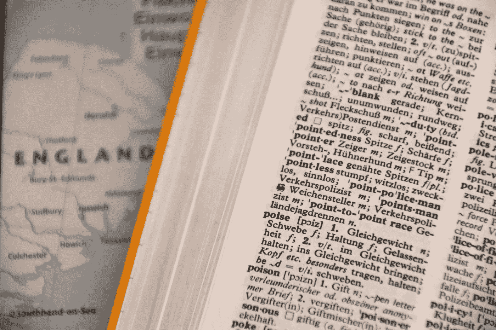

# Python 继承：你应该继承自 dict 还是 UserDict？

> 原文：[`towardsdatascience.com/python-inheritance-should-you-inherit-from-dict-or-userdict-9b4450830cbb?source=collection_archive---------10-----------------------#2023-05-10`](https://towardsdatascience.com/python-inheritance-should-you-inherit-from-dict-or-userdict-9b4450830cbb?source=collection_archive---------10-----------------------#2023-05-10)

## PYTHON 编程

## 他们说你不应该继承自 dict 而应该继承自 UserDict。这是真的吗？

[](https://medium.com/@nyggus?source=post_page-----9b4450830cbb--------------------------------)[](https://towardsdatascience.com/?source=post_page-----9b4450830cbb--------------------------------) [Marcin Kozak](https://medium.com/@nyggus?source=post_page-----9b4450830cbb--------------------------------)

·

[关注](https://medium.com/m/signin?actionUrl=https%3A%2F%2Fmedium.com%2F_%2Fsubscribe%2Fuser%2F4762f0cff9b2&operation=register&redirect=https%3A%2F%2Ftowardsdatascience.com%2Fpython-inheritance-should-you-inherit-from-dict-or-userdict-9b4450830cbb&user=Marcin+Kozak&userId=4762f0cff9b2&source=post_page-4762f0cff9b2----9b4450830cbb---------------------post_header-----------) 发布在 [Towards Data Science](https://towardsdatascience.com/?source=post_page-----9b4450830cbb--------------------------------) ·15 min 阅读·2023 年 5 月 10 日[](https://medium.com/m/signin?actionUrl=https%3A%2F%2Fmedium.com%2F_%2Fvote%2Ftowards-data-science%2F9b4450830cbb&operation=register&redirect=https%3A%2F%2Ftowardsdatascience.com%2Fpython-inheritance-should-you-inherit-from-dict-or-userdict-9b4450830cbb&user=Marcin+Kozak&userId=4762f0cff9b2&source=-----9b4450830cbb---------------------clap_footer-----------)

--

[](https://medium.com/m/signin?actionUrl=https%3A%2F%2Fmedium.com%2F_%2Fbookmark%2Fp%2F9b4450830cbb&operation=register&redirect=https%3A%2F%2Ftowardsdatascience.com%2Fpython-inheritance-should-you-inherit-from-dict-or-userdict-9b4450830cbb&source=-----9b4450830cbb---------------------bookmark_footer-----------)

字典是 Python 的基本数据类型之一。照片由[Waldemar](https://unsplash.com/@waldemarbrandt67w?utm_source=medium&utm_medium=referral)提供，发布在[Unsplash](https://unsplash.com/?utm_source=medium&utm_medium=referral)上

从`dict`继承通常不是一个好主意——不仅仅因为他们这么说，还因为重载的方法将无法正常工作。相反，你应该继承`collections.UserDict`。但如果你不想重载`dict`的方法，只是想添加新的方法呢？在这篇文章中，我们将讨论何时以及如何从`dict`和`collections.UserDict`类继承。

在他那本精彩的书籍*Fluent Python. 2nd ed.*中，Luciano Ramalho 解释了为什么你不应该创建继承自`dict`的自定义类。这个规则的背后原因乍一看可能很奇怪，但其实简单而关键：`dict`是一个高度优化的类型，由 C 语言实现，它不会调用你在`dict`子类中重载的方法。

这将是一个令人讨厌的惊喜，不是吗？让我们通过一个例子来看看这个问题。假设你想创建一个类似字典的类，其中提供的值将被转换为其字符串表示形式。让我们尝试通过子类化`dict`内建类型来实现：

```py
class StringDict(dict):
    def __setitem__(self, key, value):
        super().__setitem__(key, str(value))
```
