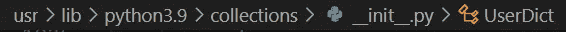

# Python 继承：你应该继承自 `dict` 还是 `UserDict`？

> 原文：[`towardsdatascience.com/python-inheritance-should-you-inherit-from-dict-or-userdict-9b4450830cbb`](https://towardsdatascience.com/python-inheritance-should-you-inherit-from-dict-or-userdict-9b4450830cbb)

## PYTHON PROGRAMMING

## 他们说你不应该继承 `dict` 而应该继承 `UserDict`。这是真的吗？

[](https://medium.com/@nyggus?source=post_page-----9b4450830cbb--------------------------------)[](https://towardsdatascience.com/?source=post_page-----9b4450830cbb--------------------------------) [Marcin Kozak](https://medium.com/@nyggus?source=post_page-----9b4450830cbb--------------------------------)

·发布于 [Towards Data Science](https://towardsdatascience.com/?source=post_page-----9b4450830cbb--------------------------------) ·15 分钟阅读·2023 年 5 月 10 日

--


字典是 Python 基本数据类型之一。照片由 [Waldemar](https://unsplash.com/@waldemarbrandt67w?utm_source=medium&utm_medium=referral) 提供，[Unsplash](https://unsplash.com/?utm_source=medium&utm_medium=referral)

继承自 `dict` 通常不是最佳选择——不仅因为他们这么说，还因为重载的方法不会工作。相反，你应该继承 `collections.UserDict`。但如果你不想重载 `dict` 方法，只是想添加新的方法呢？在本文中，我们将讨论何时以及如何继承 `dict` 和 `collections.UserDict` 类。

在他那本精彩的书籍 *Fluent Python. 2nd ed.* 中，Luciano Ramalho 解释了为什么你不应该创建继承自 `dict` 的自定义类。这条规则的理由，一开始看起来很奇怪，但其实简单而关键：`dict` 是一个高度优化的类型，由 C 实现，它不会调用你在 `dict` 子类中重载的方法。

这将是一个令人讨厌的惊喜，不是吗？让我们来看一个例子。假设你想创建一个类似字典的类，其中提供的值将被转换为它们的字符串表示。让我们尝试通过继承 `dict` 内置类型来做到这一点：

```py
class StringDict(dict):
    def __setitem__(self, key, value):
        super().__setitem__(key, str(value))
```

这看起来像是完全有效的 Python 代码。让我们看看这怎么运作：

```py
>>> class StringDict(dict):
...     def __setitem__(self, key, value):
...         super().__setitem__(key, str(value))
... 
>>> mydict = StringDict(first=1, second=2, third=3)
>>> mydict
{'first': 1, 'second': 2, 'third': 3}
```

嗯，这根本不起作用——或者说，这个`__setitem__`方法根本不起作用。我们想将值转换为字符串，但它们没有被转换。不过，我们没有看到任何错误；这个类本身以某种方式工作——实际上，它的工作方式就像一个普通的字典一样。（或者说，它提供了相同的结果但更慢；我们稍后会讨论这个问题。）

为了达到你想要的效果，你应该继承 `UserDict`：

```py
>>> from collections import UserDict
>>> class StringUserDict(UserDict):
...     def __setitem__(self, key, value):
...         super().__setitem__(key, str(value))
... 
>>> mydict = StringUserDict(first=1, second=2, third=3)
>>> mydict
{'first': '1', 'second': '2', 'third': '3'}
```

正如你所见，我们在定义中唯一改变的就是继承 `UserDict` 而不是 `dict`。

所以现在你知道了。使用 `UserDict` 就足够了。太好了。

会吗？

# 结果

等等。我们来考虑一下。在决定使用 `UserDict` 而不是 `dict` 是否如此出色之前，我们应该考虑一些事情。

首先，我们知道 Python 的内建类型是高度优化的，因为它们是用 C 实现的，而这种实现本身也经过了高度优化。

其次，我们知道我们不应该继承 `dict`，因为它的 C 实现方法不会调用用 Python 实现的重写方法。

第三，简单的一点需要检查，`collections.UserDict` 是用 Python 实现的。在 Linux 中，你可以在这里找到它的定义：



`UserDict` 定义的本地化在 Linux 中。来自 VS Code 的截图。图片由作者提供

在这种情况下，以下问题自然会出现：如果是这样，我自定义的继承 `UserDict` 的类会有良好的性能吗？

我立即猜测不会。`dict` 的优化来自 C 实现，而 `UserDict` 是用 Python 实现的。它为什么应该有所优化呢？我们将在接下来的部分中检查这一点。

# `UserDict` 与 `dict` 的基准测试

对于基准测试，我们将使用标准库中的 `timeit` 模块。你可以在这里了解更多信息：

[](/benchmarking-python-code-with-timeit-80827e131e48?source=post_page-----9b4450830cbb--------------------------------) ## 使用 timeit 进行 Python 代码基准测试

### 最流行的 Python 代码时间基准测试工具，内建的 timeit 模块提供了比大多数工具更多的功能…

[towardsdatascience.com

为了使基准测试稍微简单和结构化一点，让我们定义一个简单的函数来对两个或更多代码片段进行时间基准测试：

```py
 import rounder
import timeit
import pprint

def compare(
    __snippet1,
    __snippet2,
    *args,
    number=10_000_000,
    repeat=7,
    setup="from collections import UserDict"):
    snippets = [__snippet1, __snippet2, *args]
    results = {}
    for i, snippet in enumerate(snippets):
        name = snippet if len(snippet) < 30 else f"snippet {i + 1}"
        results[name] = min(timeit.repeat(
            snippet, number=number, repeat=repeat, setup=setup
            )) / number,
    results = rounder.signif_object(results, digits=4)
    pprint.pprint(results)
```

几件事：

+   这个函数使用了 `[rounder](https://pypi.org/project/rounder/)` 包，将字典中的所有数字四舍五入到四位有效数字；你可以在这里了解更多信息：

[](/rounder-rounding-numbers-in-complex-python-objects-e4b6f3b563f8?source=post_page-----9b4450830cbb--------------------------------) ## rounder：在复杂的 Python 对象中四舍五入数字

### `rounder` 包允许你通过一个命令将任何对象中的所有数字进行四舍五入。

[towardsdatascience.com

+   `__snippet1` 和 `__snippet2` 是仅限位置的参数，因此你不能通过名称调用它们。这要归功于双下划线前缀。

+   多亏了两个片段参数后的 `*args`，你可以提供更多的片段，也可以作为位置关键字；你可以根据需要使用任意多个。

+   所有剩余的参数都是仅限关键字的。在这里，这是通过将它们放在 `*args` 之后实现的。¹

+   这个函数报告的结果是七次运行中最快的一次的平均值。因此，所有结果都是直接可比的，即使`timeit.repeat()`函数使用了不同的`number`值。

+   这个函数隐式返回`None`并打印基准测试的简短报告，使用标准库`pprint`模块中的`pprint()`函数。通常，避免将返回语句替换为打印²，除非你的函数/方法是一个*打印*的函数。

好的，我们马上会看到这个函数的实际效果。首先，让我们比较一下`dict()`和`UserDict()`创建实例的速度。然而，我们可以通过两种方法实例化一个常规字典，即`dict()`和（显著更快的）`{}`，所以我们会同时考虑这两者：

```py
>>> compare("UserDict()", "dict()", "{}")
{'UserDict()': (1.278e-07,), 'dict()': (3.826e-08,), '{}': (1.518e-08,)}
```

在本文的所有基准测试中，我使用了 Python 3.11，在 Windows 10 机器上，WSL 1 环境中，32 GB 内存和四个物理（八个逻辑）核心。基准测试显示，创建一个新实例时，`UserDict`的速度是`dict`的两倍慢。

如上所述，我们在结果字典中看到的值代表了创建*一个*`UserDict`或常规`dict`（通过两种方法创建）的时间。显然，创建一个`UserDict`实例需要更多时间，大约`1.3e-07`秒——而`{}`需要大约`1.5e-08`秒。差异不大？注意当你需要创建一个单一实例时，但想象一下创建数百万个字典。因此，创建一个常规字典所需的时间大约是创建`UserDict`的*3–8 倍*，具体取决于实例化方法。

让我们看看较大字典的情况。我们将通过字典推导式创建一个简单的数值字典。由于`UserDict`不允许使用 dictcomp 语法（另一个缺点），我们唯一能做的就是先使用 dictcomp 语法创建一个常规字典，然后将其转换为`UserDict`实例：

```py
>>> compare(
    "UserDict({i: i**2 for i in range(1000)})",
    "{i: i**2 for i in range(1000)}",
    number=100_000)
{'snippet 1': (0.0001316,), 'snippet 2': (5.027e-05,)}
```

一个常规字典快了大约 2.5 倍。考虑到创建一个空字典的速度甚至更快，这似乎相当惊人。我们必须记住，这些基准测试的结果可能会有所不同。但我们也必须记住，当我们使用许多重复测试（这里是十万次——我们可以使用更多）时，结果的差异应该相对较小。

当我们比较查找时间时，大小会影响结果吗？基本上，键查找与字典大小无关，因此，字典大小的不同应该不会影响结果。

首先，一个小字典：

```py
>>> setup = """from collections import UserDict
... d = {'x': 1, 'y': 2, 'z': 3}
... ud = UserDict(d)
... """
>>> compare("ud['x']", "d['x']", setup=setup)
{"ud['x']": (4.754e-08,), "d['x']": (1.381e-08,)}
```

好的，所以慢了大约 3.5 倍。现在，对于一个更大的`10_000`键值对的字典：

```py
>>> setup = """from collections import UserDict
... d = {str(i): i for i in range(10_000)}
... ud = UserDict(d)
... """
>>> compare("ud['9999']", "d['9999']", setup=setup, number=1_000_000)
{"ud['9999']": (7.785e-08,), "d['9999']": (2.787e-08,)}
```

对于 1000 万个元素的情况：

```py
>>> compare("ud['9999']", "d['9999']", setup=setup, number=100_000)
{"ud['9999']": (6.662e-08,), "d['9999']": (2.499e-08,)}
```

因此，大小确实不重要，每次`dict`都快了大约 3–3.5 倍。让我们看看，这次仅针对中等大小的字典，如何处理不存在的键：

```py
>>> compare(
...     "ud.get('a', None)",
...     "d.get('a', None)",
...     setup=setup,
...     number=1_000_000)
{"d.get('a', None)": (4.318e-08,), "ud.get('a', None)": (4.525e-07,)}
```

这次差距更大，`dict`的速度超过了`10`倍。

检查一个键是否在字典中呢？

```py
>>> compare("'a' in ud", "'a' in d", setup=setup, number=1_000_000)
{"'a' in d": (1.465e-08,), "'a' in ud": (4.562e-08,)}
```

所以，再次是 3–3.5 倍快。

现在，让我们基准测试一个频繁操作，即遍历字典；再次检查不同大小的字典：

```py
>>> setup = """from collections import UserDict
... d = {str(i): i for i in range(10)}
... ud = UserDict(d)
... """
>>> compare(
...     "for i, v in ud.items(): pass",
...     "for i, v in d.items(): pass",
...     setup=setup,
...     number=1_000_000
... )
{'for i, v in d.items(): pass': (1.726e-07,),
 'for i, v in ud.items(): pass': (1.235e-06,)}

>>> setup = """from collections import UserDict
... d = {str(i): i for i in range(10_000)}
... ud = UserDict(d)
... """
>>> compare(
...     "for i, v in ud.items(): pass",
...     "for i, v in d.items(): pass",
...     setup=setup,
...     number=10_000
... )
{'for i, v in d.items(): pass': (0.0001255,),
 'for i, v in ud.items(): pass': (0.00112,)}

>>> setup = """from collections import UserDict
... d = {str(i): i for i in range(100_000)}
... ud = UserDict(d)
... """
>>> compare(
...     "for i, v in ud.items(): pass",
...     "for i, v in d.items(): pass",
...     setup=setup,
...     number=10_000
... )
{'for i, v in d.items(): pass': (0.001772,),
 'for i, v in ud.items(): pass': (0.01718,)}
```

好的，对于小型字典来说，`dict`在遍历其键值对（通过`.items()`方法提供）时大约快 7 倍。对于中型字典（在我们的实验中有 1 万元素），快约 9 倍。对于更大的字典（有`100_000`个元素），结果类似，因此一旦开始循环，循环本身似乎并不依赖于字典的类型。

由于这只是一个相当小的基准测试，我们可以得出结论：常规字典在遍历其项目时应该比`UserDict`快约 5–10 倍。

## 结论基准测试

也许我们在这里停下来吧。我们可以进行更多基准测试，但这不是重点。我不想进行`dict`和`UserDict`在执行时间上的全面比较；如果你感兴趣，可以尝试代码进行一系列可靠的基准测试。相反，我想阐明这个问题，并检查是否像我基于`UserDict`和`dict`的实现知识所预期的那样，前者明显比后者慢。

而且——除非你认为 5–10 倍更慢是一个微不足道的数字。所以，如果你能的话，考虑使用常规字典，而不是那些继承`UserDict`的字典，除非你必须改变`dict`的行为。

啊……为什么我们不能直接继承`dict`？！为什么？

或者……我们可以吗？

# 不要继承`dict`？那为什么不呢？！

也许你已经注意到，不继承`dict`的规则与用 C 实现的`dict`方法有关，这些方法不会调用在 Python 中重载的内置`dict`方法。但如果你只是想给`dict`添加一些功能，而不触动已经用 C 实现的方法呢？

这是一个非常好的问题。答案简短而简单：是的，你可以这样做！你*可以*从`dict`继承；只需不要重载`dict`的方法，仅此而已。

问题是，基于`dict`的类会像`dict`一样高效吗？或者说像`collections.UserDict`一样吗？为了回答这个问题，我们需要运行更多的基准测试。

让我们想象我们在一个字典中保存一些数据，我们想要添加一个`.summarize()`方法来计算数据的一些摘要统计信息。它可能像这样（仅作为示例）：

```py
from collections.abc import Sequence
from typing import Callable

def try_calculate(func: Callable, *args, **kwargs):
    """Try calculations; when data are incorrect, return nan."""
    try:
        return func(*args, **kwargs)
    except TypeError:
        return float("nan")

class RichDict(dict):
    measures = {
        "sum": sum,
        "n": len,
        "mean": lambda x: sum(x) / len(x),
    }

    def summarize(self):
        statistics = {}
        for k, v in self.items():
            if isinstance(v, str):
                statistics[k] = {"n": len(v)}
            elif isinstance(v, Sequence):
                statistics[k] = {
                    name: try_calculate(func, v)
                    for name, func
                    in self.measures.items()
                }
        return statistics
```

`RichDict`是一个`dict`，多了一个方法：`.summarize()`。这个方法执行以下操作：

+   它遍历数据的键值对（通过`.items`方法获取）。

+   当值是字符串时，`statistics`仅包含长度，并作为一个包含一个键`n`的字典返回。

+   当值是`Sequence`时，计算主要的摘要统计信息。度量以可调用的形式保存在类属性`RichDict.measures`中，它是一个字典。

+   该方法保护计算：如果无法计算一个度量，则会捕获异常并返回`float("nan")`（表示*不是数字*）作为计算结果。这样，例如，Python 在尝试计算空列表的均值时不会抛出错误。

如果你想添加一个度量，可以轻松做到：

```py
RichDict.measures["min"] = min
RichDict.measures["max"] = max
```

如果函数更复杂，你可以使用`lambda`函数：

```py
RichDict.measures["max-to-mean"] = lambda x: max(x) / min(x)
```

或者，更好地，首先定义一个函数，然后在这里分配它：

```py
def max_to_min(x: float) -> float:
    return max(x) / min(x)

RichDict.measures["max-to-mean"] = max_to_min
```

请注意，由于`.measures`是一个类属性，所有的`RichDict`实例（包括即将创建的和已经存在的）都将具有扩展的度量，包括`min`和`max`统计信息。

这是`RichDict`在实际应用中的一个例子：

```py
>>> d = RichDict(x=[1,4,5,7],
...              y=[1,"1",2],
...              z="Shout Bamalama!",
...              f=10)
>>> 
>>> stats = d.summarize()
>>> stats # doctest: NORMALIZE_WHITESPACE
{'x': {'sum': 17, 'n': 4, 'mean': 4.25, 'min': 1, 'max': 7, 'max-to-min': 7},
 'y': {'sum': nan, 'n': 3, 'mean': nan, 'min': nan, 'max': nan, 'max-to-min': nan},
 'z': {'n': 15}}
```


上面，`RichDict`类有一个类属性，包含用于序列数据的度量；对于字符串，`.summarize()` 方法只计算一个度量。更新类，使其具有两个类属性`measures_seq`和`measures_str`，其设计方式与上面的`measures`相同。对于字符串，`.summarize()` 方法应按序列的方式计算度量，即使用`measures_str`。

你可以在附录 1 中找到解决方案。


在代码中，我使用了标准库中的`doctests`模块进行文档测试。如果你有兴趣了解更多关于这个有趣模块的内容，可以从这篇文章中了解：

[](/python-documentation-testing-with-doctest-the-easy-way-c024556313ca?source=post_page-----9b4450830cbb--------------------------------) ## 使用 doctest 进行 Python 文档测试：简单方法

### doctest 允许进行文档、单元和集成测试以及测试驱动开发。

towardsdatascience.com

好了，现在我们知道`RichDict`有效，我们知道我们*可以*子类化`dict`。我们现在想要了解的是`RichDict`增加的功能（用 Python 定义，而不是 C 语言，就像`dict`的基础代码一样）是否会为`dict`的常规行为增加一些开销。为此，我们将基准测试此类行为，例如创建一个新的`RichDict`与创建一个新的`dict`、键查找等。

让我们进行类似于上面为`UserDict`进行的基准测试。你可以在[这个 GitHib gist](https://gist.github.com/nyggus/430a6ee05ea69cbd9e46c2d31ebedb95)中找到相关代码。你会在那里找到下面使用的`setup`值。

```py
>>> compare("UserDict()", "RichDict()", "dict()", setup=setup)
{'UserDict()': (2.236e-07,), 'RichDict()': (1.073e-07,), 'dict()': (5.892e-08,)}
```

如上所示，当创建一个空实例时，`RichDict`的速度明显比`UserDict`快（约快 2 倍），但比`dict`慢（约慢 2 倍）。

```py
>>> compare(
...     "UserDict({i: i**2 for i in range(1000)})",
...    "RichDict({i: i**2 for i in range(1000)})",
...    "{i: i**2 for i in range(1000)}",
...    number=100_000,
...    setup=setup)
{'snippet 1': (0.0001765,), # UserDict
 'snippet 2': (6.845e-05,), # RichDict
 'snippet 3': (5.388e-05,)} # dict
```

这一次，`RichDict`比`UserDict`快约 2.5 倍，但比`dict`稍慢（约慢 1.3 倍）。

下面，你将找到更多基准测试的示例，为方便起见，示例之间以空行分隔：

```py
>>> setup += """d = {'x': 1, 'y': 2, 'z': 3}
... ud = UserDict(d)
... rd = RichDict(d)
... """
>>> compare("ud['x']", "rd['x']", "d['x']", setup=setup)
{"ud['x']": (5.111e-08,), rd['x']": (3.024e-08,), "d['x']": (1.475e-08,)}

>>> compare(
...     "'a' in ud",
...     "'a' in rd",
...     "'a' in d",
...     setup=setup,
...     number=1_000_000)
{"'a' in d": (1.366e-08,),  # dict
 "'a' in rd": (2.228e-08,), # RichDict
 "'a' in ud": (4.436e-08,)} # UserDict

>>> compare(
...     "ud.get('a', None)",
...     "rd.get('a', None)",
...     "d.get('a', None)",
...     setup=setup,
...     number=1_000_000)
{"d.get('a', None)": (1.935e-08,),  # dict
 "rd.get('a', None)": (3.016e-08,), # RichDict
 "ud.get('a', None)": (5.125e-07,)} # UserDict

>>> compare(
...     "for i, v in ud.items(): pass",
...     "for i, v in rd.items(): pass",
...     "for i, v in d.items(): pass",
...     setup=setup,
...     number=1_000
... )
{'for i, v in d.items(): pass': (0.001783,),
 'for i, v in rd.items(): pass': (0.001743,),
 'for i, v in ud.items(): pass': (0.01627,)}
```

数字本身说明了我们需要的内容，所以我暂时将它们留给你。

## 总结基准测试结果

`RichDict`通常比`dict`慢（尽管有时只是很少），但比`UserDict`快。

因此，如果你只是想给`dict`添加一些功能，而不覆盖其内置方法，你*绝对* *可以子类化* `dict`。我会说这应该是你首选的方法，而不是子类化`collections.UserDict`，因为后者明显更慢。*请记住*，我们讨论的是当你不需要改变字典的常规行为，只是添加一些新行为的情况。

还要记住，使用内置类型的方式会有一个代价：你的类（在我们的例子中是`RichDict`）会比`dict`更慢。不过，它仍然比`UserDict`快，而`UserDict`的创建目的就是为了让你继承……嗯，不是从`dict`继承，而是让你创建一个具有`dict`相同行为的新类型（类）。不幸的是，使用`UserDict`是相当昂贵的，因为它的性能比`dict`差得多。

# 结论

让我们总结一下关于子类化`dict`和`UserDict`的讨论。我们了解到，我们有三种选择：

1.  从`UserDict`继承，当你想要覆盖`dict`的内置行为时。这将是最慢的选项。

1.  从`dict`继承，当你不想覆盖`dict`的内置行为，而是添加新功能（方法）时。这将比选项 1 快。

1.  使用内置的`dict`类型，而不创建自定义类。如果你需要自定义功能，你可以在接受`dict`实例作为参数的函数中实现它们。这是最快的选项（见下文）。

我们还没有讨论第三种选项，因为它不涉及子类化。不过，不需要讨论太多，因为这是最简单的方法，它使用的是一种更程序化的方法，而不是面向对象的方法。一方面，使用这种方法的`summarize()`函数比使用选项 2 中的`RichDict.summarize()`方法快一点（如果有的话）。[这个要点](https://gist.github.com/nyggus/cd41a181ad2e23425279db1961438ca4)包含了相应的基准测试代码；在我的机器上，它提供了一个小而稳定（从运行到运行）性能提升。另一方面，我们知道，常规`dict`的所有其他行为明显比`RichDict`要快。因此，一般来说，选项 3 提供了处理具有附加功能的字典的最快方法。

因此，如果性能很重要，最明智的选择似乎是第三种选项——即使用常规字典，并在外部函数中实现所需的附加行为。根据情况，这也可能是代码最清晰的选项，因为它不需要自定义数据结构，而是结合了字典（Python 中最常见的数据结构之一）和函数。通常，这意味着代码更清晰。

第二种选择意味着更差的性能，因为向`dict`添加方法会导致其行为的额外开销。如我们所知，选项 3 通过将方法移到字典之外来消除这种开销。

第一种选择在性能方面绝对是最差的。我认为只有在满足以下三个条件中的*每一个*时，这个选项才有意义：

+   性能不重要

+   你需要重写一个或多个内置的`dict`方法。

+   由于创建一个将所有所需功能组合在一起的类，代码将更清晰、更易于使用。

# 脚注

¹ 我计划写一篇关于仅位置参数和仅关键字参数的专门文章。一旦发表，我会在这里链接。

² 顺便提一下，在交互式会话中，函数的返回会有相同的效果（当然，当结果未被赋值时）。不过，我是在脚本中运行基准测试的，而不是交互式会话中。

# 附录 1

## 练习的解决方案

你可以用各种方式来做。下面的解决方案避免了重复，但也使得向计算中添加另一种类型（到`Sequence`和`str`）变得容易。

```py
from collections.abc import Sequence
from typing import Callable

class RichDict(dict):
    measures_seq = {
        "sum": sum,
        "n": len,
        "mean": lambda x: sum(x) / len(x),
    }
    measures_str = {
        "n": len,
    }

    def summarize(self):
        statistics = {}
        for k, v in self.items():
            if isinstance(v, str):
                measures = self.measures_str
            elif isinstance(v, Sequence):
                measures = self.measures_seq
            else:
                continue
            statistics[k] = {
                name: try_calculate(func, v)
                for name, func
                in measures.items()
            }
        return statistics

NaN = float("nan")

def try_calculate(func: Callable, *args, **kwargs):
    """Try calculations and when the data are incorrect, return nan."""
    try:
        return func(*args, **kwargs)
    except TypeError:
        return NaN
```

感谢阅读。如果你喜欢这篇文章，你可能还会喜欢我写的其他文章；你可以在[这里](https://medium.com/@nyggus)查看。如果你想加入 Medium，请使用我下面的推荐链接：

[## 使用我的推荐链接加入 Medium - Marcin Kozak](https://medium.com/@nyggus/membership?source=post_page-----9b4450830cbb--------------------------------)

### 阅读 Marcin Kozak 的每一个故事（以及 Medium 上的其他成千上万位作家的故事）。你的会员费直接支持…

[medium.com](https://medium.com/@nyggus/membership?source=post_page-----9b4450830cbb--------------------------------)
