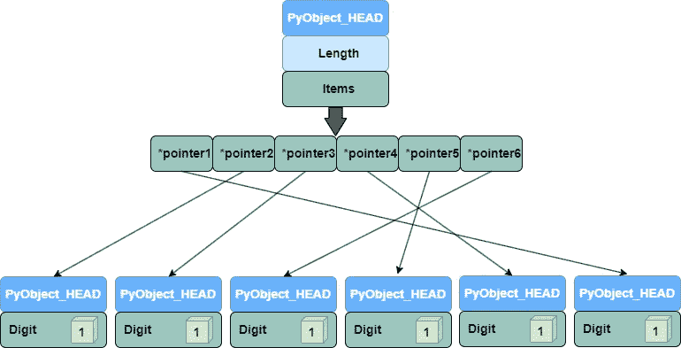

# Python 列表与 NumPy 数组：深入探讨内存布局和性能优势

> 原文：[`towardsdatascience.com/python-lists-vs-numpy-arrays-a-deep-dive-into-memory-layout-and-performance-benefits-a74ce774bc1e`](https://towardsdatascience.com/python-lists-vs-numpy-arrays-a-deep-dive-into-memory-layout-and-performance-benefits-a74ce774bc1e)

## [快速计算](https://medium.com/@qtalen/list/fast-computing-2a37a7e82be5)

## 探索分配差异和效率提升

[](https://qtalen.medium.com/?source=post_page-----a74ce774bc1e--------------------------------)[](https://towardsdatascience.com/?source=post_page-----a74ce774bc1e--------------------------------) [Peng Qian](https://qtalen.medium.com/?source=post_page-----a74ce774bc1e--------------------------------)

·发表于 [Towards Data Science](https://towardsdatascience.com/?source=post_page-----a74ce774bc1e--------------------------------) ·9 分钟阅读·2023 年 7 月 14 日

--


NumPy 数组中的数据像书架上的书一样紧凑地排列。照片由 [Eliabe Costa](https://unsplash.com/@eliabevces?utm_source=medium&utm_medium=referral) 拍摄，来源于 [Unsplash](https://unsplash.com/?utm_source=medium&utm_medium=referral)

在本文中，我们将深入探讨原生 Python 列表和 NumPy 数组之间的内存设计差异，揭示为什么在许多情况下 NumPy 可以提供更好的性能。

我们将比较数据结构、内存分配和访问方法，展示 NumPy 数组的强大功能。

# 介绍

想象一下，你正在准备去图书馆找一本书。现在，你发现图书馆有两个货架：

第一个货架上装满了各种精美的盒子，有些盒子里装着光盘，有些装着图片，还有些装着书籍。只有物品的名称附在盒子上。

这代表了原生 Python 列表，其中每个元素都有自己的内存空间和类型信息。

然而，这种方法存在一个问题：盒子里有许多空余空间，浪费了货架空间。而且，当你想找一本特定的书时，你必须查看每一个盒子，这会花费额外的时间。

现在让我们来看第二个货架。这次没有盒子；书籍、光盘和图片都根据它们的类别紧凑地放在一起。

这是 NumPy 数组，它们在内存中以连续的方式存储数据，从而提高了空间利用率。

由于物品都是按类别分组的，你可以快速找到一本书，而不必在许多盒子中搜索。这就是为什么在许多操作中，NumPy 数组比原生 Python 列表更快的原因。

# Python 列表：一种灵活但效率较低的解决方案

## Python 中的一切都是对象

让我们从 Python 解释器开始：虽然 CPython 是用 C 编写的，但 Python 变量不是 C 中的基本数据类型，而是包含值和附加信息的 C 结构。

以 Python 整数`x = 10_000`为例，`x`不是栈上的基本类型。相反，它是指向内存堆对象的指针。

如果你深入研究`Python 3.10`的源代码，你会发现`x`所指向的 C 结构如下图所示：


Python 整数与 C 原生整数。图像来源：作者。

`PyObject_HEAD`包含了如引用计数、类型信息和对象大小等信息。

## Python 列表是包含一系列对象的对象

从中我们可以推断出，Python 列表也是一个对象，只不过它包含指向其他对象的指针。

我们可以创建一个只包含整数的列表：

```py
integer_list = [1, 2, 3, 4, 5]
```

我们还可以创建一个包含多种对象类型的列表：

```py
mixed_list = [1, "hello", 3.14, [1, 2, 3]]
```

## Python 列表的优缺点

正如我们所看到的，Python 列表包含一系列指针对象。这些指针反过来指向内存中的其他对象。

这种方法的优点是灵活性。你可以将任何对象放入 Python 列表中，而无需担心类型错误。

然而，缺点也很明显：



Python 列表包含一系列指针对象。图像来源：作者

每个指针所指向的对象在内存中是分散的。当你遍历一个 Python 列表时，你需要根据指针查找每个对象的内存位置，这会导致性能下降。

# NumPy 数组：一种用于增强性能的连续内存布局

接下来，让我们探索 NumPy 数组的组成部分和排列方式，以及它如何有利于[缓存局部性](https://en.wikipedia.org/wiki/Locality_of_reference)和[向量化](https://en.wikipedia.org/wiki/Array_programming)。

## NumPy 数组：结构和内存布局

根据 NumPy 的内部描述，NumPy 数组由两部分组成：

1.  一部分存储了 NumPy 数组的元数据，描述了数据类型、数组形状等。

1.  另一部分是数据缓冲区，它以紧凑的方式在内存中存储数组元素的值。


NumPy 数组：结构和内存布局。图像来源：作者

## NumPy 数组的内存布局

当我们观察 ndarray 的`.flags`属性时，我们发现它包括：

```py
 In 1:  np_array = np.arange(6).reshape(2, 3, order='C')
        np_array.flags

Out 1:  C_CONTIGUOUS : True
        F_CONTIGUOUS : False
        OWNDATA : False
        WRITEABLE : True
        ALIGNED : True
        WRITEBACKIFCOPY : False
```

+   `C_CONTIGUOUS`，表示数据是否可以使用行优先顺序读取。

+   `F_CONTIGUOUS`，表示数据是否可以使用列优先顺序读取。

行优先顺序是 C 语言使用的数据排列方式，标记为`order=’C’`。这意味着数据按行存储。

另一方面，列优先顺序由 FORTRAN 使用，标记为`order=’F’`，按列存储数据。


NumPy 数组的内存布局。图片由作者提供

## NumPy 内存布局的优势

由于`ndarray`设计用于矩阵操作，它的所有数据类型都是相同的，具有相同的字节大小和解释。

这使得数据紧密打包在一起，带来了缓存局部性和向量化计算的优势。

# 缓存局部性：NumPy 的内存布局如何提高缓存利用率

## 什么是 CPU 缓存

NumPy 的连续内存布局有助于提高缓存命中率，因为它与 CPU 缓存的工作方式相匹配。为了更好地解释这一点，我们首先了解一下[CPU 缓存](https://en.wikipedia.org/wiki/CPU_cache)的基本概念。

CPU 缓存是 CPU 和主内存（RAM）之间的小型高速存储区域。CPU 缓存的目的是加快内存中的数据访问速度。


CPU 缓存是 CPU 和主内存（RAM）之间的小型高速存储区域。图片由作者提供

当 CPU 需要读写数据时，它首先检查数据是否已经在缓存中。

如果所需数据在缓存中（缓存命中），CPU 可以直接从缓存中读取。如果数据不在缓存中（缓存未命中），CPU 会从 RAM 中加载数据并将其存储在缓存中以供将来使用。

CPU 缓存通常以[缓存行](https://open-cas.github.io/cache_line.html)的形式组织，这些缓存行是连续的内存地址。当 CPU 访问 RAM 时，缓存会将整个缓存行加载到高速缓存中。

这意味着，如果 CPU 访问相邻的内存地址，在加载缓存行之后，后续访问更有可能命中缓存，从而提高性能。


当 CPU 访问 RAM 时，缓存会将整个缓存行加载到高速缓存中。图片由作者提供

## NumPy 如何利用缓存

NumPy 的连续内存布局利用了这一事实。

NumPy 数组将数据存储在连续的内存地址中，这有助于提高缓存局部性。

当访问数组中的一个元素时，整个缓存行（包含相邻的数组元素）会被加载到缓存中。

当你遍历数组时，你会依次访问每个元素。由于数组元素在内存中是连续存储的，因此在遍历过程中缓存命中更有可能发生，从而提高性能。

这类似于去图书馆读书。你不仅取出所需的书，还会拿出相关的书并将它们放在桌子上。

这样，当你需要查阅相关材料时，它们会更容易获取，比起在书架上寻找更加高效。

# 向量化：释放 NumPy 内存布局的威力

## 什么是向量化

向量化是一种利用[单指令多数据（SIMD）](https://en.wikipedia.org/wiki/Single_instruction,_multiple_data)功能的技术，这些功能可在 CPU 或 GPU 上同时执行多个数据操作。

向量化操作可以通过同时处理多个数据项显著提高代码执行效率。

NumPy 的连续内存布局促进了向量化操作。

## 为什么向量化适用

假设你是一个每天必须向不同家庭送货的送货员。

假设包裹在车辆中按顺序排列，而房屋沿街编号。在这种情况下，送货员可以有效地沿街按顺序送达包裹。

这种高效的方法类似于 NumPy 的内存布局，在向量化中带来了以下好处：

+   **数据对齐**：NumPy 数组的连续内存布局确保数据在内存中以向量化友好的方式对齐。这使得 CPU 能够高效地加载和处理 NumPy 中的数据。

+   **顺序访问模式**：NumPy 在内存中紧凑的数据有助于提高向量化性能。顺序访问模式还充分利用了 CPU 缓存和预取功能，减少了内存访问延迟。

+   **简化代码**：NumPy 提供了一系列函数（例如，`np.add`、`np.multiply`）和操作（例如，数组切片），这些函数和操作自动处理向量化操作。你可以编写简洁高效的代码，而无需担心底层实现。

# 副本和视图：NumPy 在性能优化方面的出色设计

在之前的讨论中，我们讨论了 NumPy 如何利用其连续内存布局来实现性能优势。

现在，让我们讨论 NumPy 如何通过副本和视图获得性能优势。

## 副本和视图是什么

副本和视图是定义现有数据与原始数组之间关系的两种选项。根据这两种选项的特性，可以总结如下：

+   **副本**：使用与原始数组不同的内存空间，但数据内容相同。

+   **视图**：引用与原始数组相同的内存地址。


一个副本可以有多个视图。图片来源：作者

如果我们将其与书籍进行比较，视图就像书中的书签，而不需要创建书籍的副本。

另一方面，副本是原书的复制品，包含文本和图像的完整副本。当你在这个副本上做笔记时，原书不会受到影响。

## 充分利用这两种特性

利用视图和副本的特性可以帮助我们编写简洁高效的代码。

以算术操作为例。如果你使用 `a = a + 1`，将会创建一个新的副本。然而，如果你使用 `a += 1` 或 `np.add`，则会应用广播，并且直接在原始数组上进行加法操作。

请看以下代码，该代码测量了执行时间：

执行上述代码将产生类似于以下结果：


使用视图进行计算所需时间更少。截图由作者提供

从结果来看，使用视图进行计算所需时间更少。

## 区分副本和视图

确认每次计算结果是视图还是副本将需要付出很大努力。

不过，还有一种更直接的验证方法：

+   使用`may_share_memory`来判断参数中的两个数组是否引用相同的内存空间。这个判断可能不够严格。True 并不一定意味着数组是共享的，但 False 确认数组绝对不共享。

+   如果你需要更准确的答案，可以使用`share_memory`函数。然而，这个函数的执行时间比`may_share_memory`要长。

# 结论

总结来说，我们了解了 NumPy 数组与原生 Python 列表之间在内存安排上的差异。

由于 NumPy 数组中相同数据类型的连续排列，显著提高了缓存局部性和向量化的性能优势。

在 NumPy 的设计中分离视图和副本，为代码执行性能和内存管理提供了更大的灵活性。

在接下来的系列文章中，我将从基础开始，重申工作中数据科学的最佳实践。如果你有任何建议或问题，请随时评论，我会逐一解答。

除了提高代码执行速度和性能外，使用各种工具提高工作效率也是一种性能提升：


[Peng Qian](https://qtalen.medium.com/?source=post_page-----a74ce774bc1e--------------------------------)

## Python 工具箱

[查看列表](https://qtalen.medium.com/list/python-toolbox-4289824c6407?source=post_page-----a74ce774bc1e--------------------------------)6 个故事[](https://medium.com/@qtalen/membership?source=post_page-----a74ce774bc1e--------------------------------) [## 加入 Medium 使用我的推荐链接 - Peng Qian

### 作为 Medium 的会员，你的部分会员费用将用于你阅读的作者，同时你可以全面访问每个故事……

medium.com](https://medium.com/@qtalen/membership?source=post_page-----a74ce774bc1e--------------------------------)

本文最初发布于：[`www.dataleadsfuture.com/python-lists-vs-numpy-arrays-a-deep-dive-into-memory-layout-and-performance-benefits/`](https://www.dataleadsfuture.com/python-lists-vs-numpy-arrays-a-deep-dive-into-memory-layout-and-performance-benefits/)
