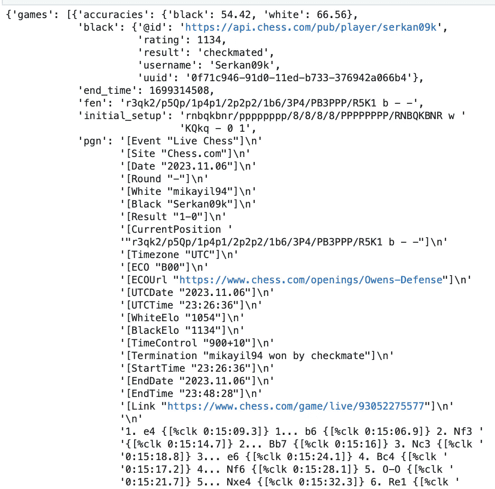
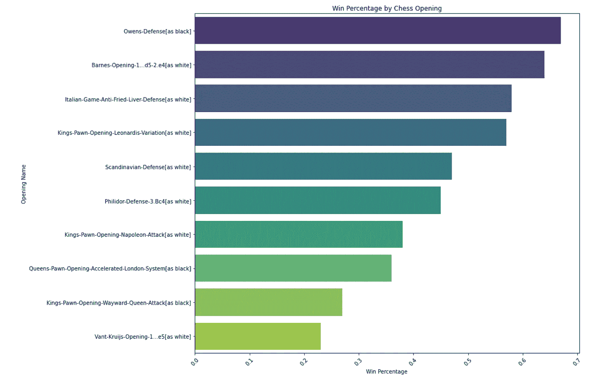
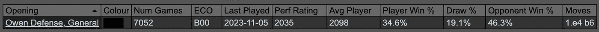
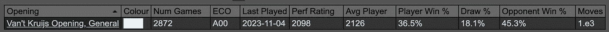

# Python 遇见棋子：通过数据分析解码我的棋局开局

> 原文：[`towardsdatascience.com/python-meets-pawn-decoding-my-chess-openings-with-data-analysis-097a34cef20a`](https://towardsdatascience.com/python-meets-pawn-decoding-my-chess-openings-with-data-analysis-097a34cef20a)

## 在这篇博客中，我将引导你通过使用 Python 分析你在 Chess.com 平台上进行的棋局。

[](https://mikayilahad.medium.com/?source=post_page-----097a34cef20a--------------------------------)[](https://towardsdatascience.com/?source=post_page-----097a34cef20a--------------------------------) [Mikayil Ahadli](https://mikayilahad.medium.com/?source=post_page-----097a34cef20a--------------------------------)

·发表于 [Towards Data Science](https://towardsdatascience.com/?source=post_page-----097a34cef20a--------------------------------) ·8 分钟阅读·2023 年 11 月 17 日

--


照片由 DALL·E 创建

国际象棋一直是我的热情所在，这是一款由我的父亲介绍给我的美丽游戏。我早年间常与家人下棋，后来转向了 Chess.com 的数字棋盘。最近，国际象棋的受欢迎程度有所回升，这得益于知名主播和国际象棋大师的教育努力。这股新的兴趣浪潮激发了我在一系列关于棋局开局的思考：‘我经常使用的开局是什么，它们对我有多成功？’意识到我对自己的偏好或成功率一无所知，我决定将我最热爱的两个事物结合起来：国际象棋和 Python。

让我们开始理解这些步骤，学习如何使用 Chess.com API，并了解如何查看你在国际象棋中的开局动作吧！

附注：这篇博客假设你的笔记本电脑上已经安装了 Python，最好还安装了 Jupyter Notebook（或其他 IDE）。

## Chess.com API

首先，你需要安装 Chess.com 库来使用其 API。你可以使用终端（或命令提示符）中的 “pip” 命令来安装，也可以在 Jupyter Notebook 中使用“!”符号来执行该语法。

```py
pip install chess.com
```

你可以在 [`chesscom.readthedocs.io/en/latest/`](https://chesscom.readthedocs.io/en/latest/) 找到所有的说明和详细信息。这里包含了可以使用的每一种方法和参数。

你还需要传统的 pandas 和 numpy 库，你可以像上面一样安装它们。

## 获取数据

首先，让我们设置好所需的所有库，然后向 API 发出第一次请求。我们将使用一个叫做‘get_player_games_by_month’的方法来查看特定年份和月份玩的所有游戏。为了了解我们获得的数据类型，我们将查看一个示例游戏。通过使用 Python 内置的‘pprint’库，我们可以使 JSON 响应更易于阅读。

```py
# Import necessary libraries
from chessdotcom import get_player_game_archives, get_player_games_by_month, Client
import pandas as pd
import numpy as np
from pprint import pprint

# Configure the user agent for the API requests to Chess.com
# this part is mandatory as per new version of API
Client.request_config["headers"]["User-Agent"] = (
   "My Python Application. "
   "Contact me at xxxx@gmail.com"
)

# get games for the month of November 2023
response_sample = get_player_games_by_month("mikayil94", year=2023, month=11)

# print the JSON
pprint(response_sample.json)
```

真正酷的部分在于 PGN（可移植棋局记录）部分——它包含了我们所需的一切，如开局名称和更多细节的链接（ECOUrl）



有一个叫做‘get_player_game_archives’的方法，它帮助我们获取平台上旧游戏的列表，这些游戏按我们玩它们的年份和月份排序。日期以链接格式呈现，所以我们只需要从每个链接中提取日期部分。

```py
# Retrieve a list of months during which the player 'mikayil94' has played games
response1 = get_player_game_archives("mikayil94")
list_of_played_months = []
for i in response1.json['archives']:
    list_of_played_months.append(i[-7:])
```

现在是重点部分！我们可以使用之前找到的年份和月份，将值传递给‘get_player_games_by_month’方法，以获取关于我们游戏的更多信息。每场游戏将衍生出以下列：‘time_class’，‘date’，‘white’，‘black’，‘game_link’，‘opening_code’，‘opening_name’，‘opening_link’，‘result’。‘time_class’部分来源于不同于其他内容的地方，这些内容都在 PGN 部分内。我们真正需要的分析数据是玩家的名称（白方和黑方）和开局名称。每个开局的链接也是非常有用的。这样，我们可以了解更多信息，并提高使用这个开局的能力。此外，链接到游戏本身也很棒，因为它让我们可以回顾并理解我们是如何赢得或输掉每场游戏的。

```py
# Create a DataFrame to store game information
my_games_df = pd.DataFrame(columns = ['time_class', 'date', 'white', 'black', 'game_link', 'opening_code', 'opening_name', 'opening_link', 'result'])

# Loop through each month and retrieve games played in that month
for months in list_of_played_months:
    response2 = get_player_games_by_month("mikayil94", year=months.split("/")[0], month=months.split("/")[1])  

    # Extract relevant information from each game and add it to the DataFrame
    for i in response2.json['games']:
        time_class = i['time_class']
        pgn = i['pgn']
        if "ECOUrl" not in pgn : continue  # Skip the game if it doesn't have an ECO URL

        # Extract various details from the PGN (Portable Game Notation) of the chess game
        date = pgn[pgn.find("Date"):].split(" ")[1].split("]")[0].strip('\"')
        white = pgn[pgn.find("White"):].split(" ")[1].split("]")[0].strip('\"')
        black = pgn[pgn.find("Black"):].split(" ")[1].split("]")[0].strip('\"')
        game_link = pgn[pgn.find("Link"):].split(" ")[1].split("]")[0].strip('\"')
        opening_code = pgn[pgn.find("ECO"):].split(" ")[1].split("]")[0].strip('\"')
        opening_name = pgn[pgn.find("ECOUrl"):].split(" ")[1].split("]")[0].split("/")[-1].strip('\"')    
        opening_link = pgn[pgn.find("ECOUrl"):].split(" ")[1].split("]")[0].strip('\"')    
        result = np.where(pgn[pgn.find("Termination"):].split(" ")[1].split("]")[0].strip('\"') == 'mikayil94', 'Win', 'Loss') # if my username is in this field, it means I was the Winner.

        # Create a new DataFrame for the current game and append it to the main DataFrame
        my_games_df_new = pd.DataFrame({'time_class' : [time_class], 'date' : [date], 'white' : [white], 'black' : [black], \
                        'game_link' : game_link, 'opening_code' : opening_code, 'opening_name' : [opening_name], 'opening_link' : [opening_link], 'result' : [result]})
        my_games_df = pd.concat([my_games_df, my_games_df_new], ignore_index=True) 
```

## 创建最终结果的变量

现在我们有了数据，我们需要添加一些内容以使其更清晰、更易于了解发生了什么。了解每场游戏中的开局是谁下的很重要。我是黑方时对这个开局进行了应对，还是白方时使用了它？为了解这个问题，我会检查每场游戏中我所处的一方。然后，通过查看我赢了还是输了每场游戏，我可以计算出每种开局的胜率。

```py
# Add a new column 'opening_side' to the DataFrame. If the player 'mikayil94' is white, set the value to 'white', otherwise 'black'
my_games_df['opening_side'] = np.where(my_games_df.white == 'mikayil94', 'white', 'black')

# Add a new column 'result_binary'. If the result of the game is 'Win', set the value to 1, otherwise 0
my_games_df['result_binary'] = np.where(my_games_df.result == 'Win', 1, 0)

# Group the DataFrame by opening name, link, code, and the side 'mikayil94' played.
# Aggregate the data to count the total number of wins and total games played for each group
my_openings = my_games_df.groupby(["opening_name", "opening_link", "opening_code", "opening_side"], as_index=False).agg(
    games_win = ('result_binary', 'sum'),  # Sum of 'result_binary' to get total wins
    games_count = ('result_binary', 'count')  # Count of 'result_binary' to get total games played
)

# Calculate the win percentage for each opening and add it as a new column 'win_percentage'
# The win percentage is rounded to two decimal places
my_openings['win_percentage'] = round(my_openings.games_win / my_openings.games_count, 2)
```

## 结果就在这里！

现在我们可以看到结果了！我使用了 matplotlib 和 seaborn 库（如果没有，使用 pip 安装）来可视化数据。我创建了一个名为“opening_and_side”的新变量，用于可视化，指示哪一方（白方或黑方）使用了这个开局。我只查看了至少玩过 10 次的开局，以确保我的分析是准确的。

```py
import matplotlib.pyplot as plt
import seaborn as sns

# Prepare the data for visualization
# Add new column, to concatenate opening name and opening side, which will be used in visualization
my_openings['opening_and_side'] = my_openings.opening_name + '[as ' + my_openings.opening_side + ']'
# filter data to show only games with at least 10 count
viz_data = my_openings[my_openings.games_count > 10].sort_values("win_percentage", ascending=False)[['opening_and_side', 'win_percentage']]

# Create a bar plot
plt.figure(figsize=(15, 10))
sns.barplot(x='win_percentage', y='opening_and_side', data=viz_data, palette="viridis", ci=None)
plt.title('Win Percentage by Chess Opening')
plt.xlabel('Win Percentage')
plt.ylabel('Opening Name')
plt.xticks(rotation=45)
plt.tight_layout()

# Display the plot
plt.show()
```



## 经过分析后的关键收获：

+   **奥文防御！** 这是我在 2018 年和 2019 年的常用开局，但直到现在我才意识到我其实用得很好。这并不是一个常见的开局，因此对于让对手措手不及非常有效！事实证明，如果查看国际象棋大师的对局，这个开局相当稳固。黑方获胜的概率是 46.3%，而白方的胜率为 34.6%。你可以在国际象棋开局数据库中查看更多信息，地址是：[`old.chesstempo.com/chess-openings.html`](https://old.chesstempo.com/chess-openings.html)。



+   对**Barnes 开局-1…d5–2.e4**表现不错。我之前不知道这个开局叫做 Barnes 开局，也不知道我在这个开局中的胜率很高。即使国际象棋开局数据库说这对白方并不是最佳开局，因为在下 f3 后，白方的评估值为-0.4，这会削弱王翼。但由于这并不是一个常见的开局，它似乎让我的对手感到意外。在这种情况下，黑方不应该吃掉那个兵，但我的对手大多数情况下都吃了，这让局面变得更均衡。


+   **范特-克鲁伊斯开局**——在用白棋下这个开局时，我总是陷入更糟的局面，而当对手使用这个开局时，我则会获得优势，所以，这开局不太好！国际象棋开局数据库支持这一点：它显示，白方玩家使用这个开局时获胜的概率只有 36.5%，而对手的获胜概率是 45.3%！



+   在对抗**国王兵开局-离经叛道的皇后攻击**时表现不佳。在 2019 年之后对这种开局没有近期的记录，我通常容易犯错误，陷入陷阱，不过，生活就是不断学习！:)

+   对**国王兵开局-拿破仑攻击**表现不好。幸运的是，我已经很久没用这个开局了！游戏开始时过早地调动皇后通常不是一个好棋步 :)

+   当我用黑棋对抗**皇后兵开局-加速伦敦系统**时，通常不会立即陷入困境。但回头看，我用这个开局的胜率并不如我所希望的那么高。看来我需要花些时间更多地学习和练习这个开局。

## **结论**

很高兴 Chess.com 提供了这个公开 API，让我们可以进行这种有趣的分析并发现一些有趣的事情。通过查看我的对局，我发现实际上在开始学习所有著名开局之前，我的表现更好。有时候，使用不寻常的开局可能是个好事。那么，为什么不试试让你的对手惊讶的 Barnes 开局或**奥文防御**呢？只要小心对手使用**离经叛道的皇后攻击**时不要犯错误。

感谢你陪伴我读到最后！希望你读得愉快，并且可能对国际象棋、Python，或使用 Python 分析你自己的国际象棋对局感兴趣 :)

Jupyter notebook 文件可以在[这里](https://github.com/mikayil94/medium_articles/blob/main/my_chess_opening_analysis/my_openings_analysis_chessdotcom.ipynb)找到。
