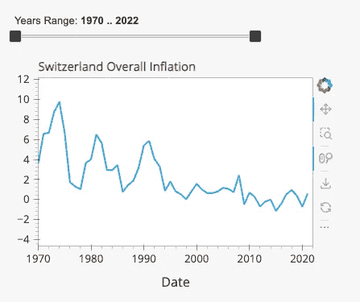
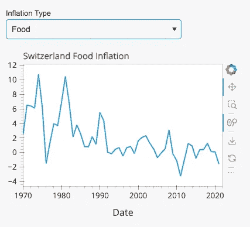

# Python 在网络上

> 原文：[`towardsdatascience.com/python-on-the-web-b819a6a55ec7`](https://towardsdatascience.com/python-on-the-web-b819a6a55ec7)

## 在没有任何服务器的情况下展示 Python 应用

[](https://pierpaoloippolito28.medium.com/?source=post_page-----b819a6a55ec7--------------------------------)[](https://towardsdatascience.com/?source=post_page-----b819a6a55ec7--------------------------------) [Pier Paolo Ippolito](https://pierpaoloippolito28.medium.com/?source=post_page-----b819a6a55ec7--------------------------------)

·发表于 [Towards Data Science](https://towardsdatascience.com/?source=post_page-----b819a6a55ec7--------------------------------) ·阅读时间 9 分钟·2023 年 10 月 11 日

--


图片由 [Ales Nesetril](https://unsplash.com/@alesnesetril?utm_source=medium&utm_medium=referral) 提供，来自 [Unsplash](https://unsplash.com/?utm_source=medium&utm_medium=referral)

# 介绍

使用 流行的 Python 可视化库 可以相对简单地在本地创建各种形式的图表和仪表板。然而，将你的结果分享给其他人则可能复杂得多。

实现这一目标的一种可能方法是使用诸如 Streamlit、Flask、Plotly Dash 等库，并支付网络托管服务费用以覆盖服务器端，并运行你的 Python 脚本在网页上显示。另一种选择是，一些提供商如 Plotly Chart 或 Datapane 也提供免费的云支持，你可以将 Python 可视化图上传并嵌入到网页上。在这两种情况下，如果你的项目预算较小，你都能实现你所需要的功能，但是否有可能免费实现类似的结果呢？

作为本文的一部分，我们将探索三种可能的方法：

+   [Holoviz 面板](https://panel.holoviz.org/)

+   [Python 的 Shiny](https://shiny.posit.co/py/)

+   [PyScript](https://pyscript.net/)

为了展示这三种方法，我们将创建一个简单的应用程序，以探索来自全球的历史通货膨胀数据。为此，我们将使用 [世界银行全球通货膨胀数据库](https://www.worldbank.org/en/research/brief/inflation-database)，有关数据许可的所有信息可以在 [此链接](https://datacatalog.worldbank.org/public-licenses) [1] 中找到。

数据下载后，我们可以使用以下预处理函数，以更好地调整数据集以进行可视化，并仅导入我们将用于分析的 3 个 Excel 表格（总体通胀数据、食品和能源价格的通胀数据）。

```py
import pandas as pd

def import_data(name):
    df = pd.read_excel("Inflation-data.xlsx", sheet_name=name)
    df = df.drop(["Country Code", "IMF Country Code", "Indicator Type", "Series Name", "Unnamed: 58"], axis=1)
    df = (df.melt(id_vars = ['Country', 'Note'], 
              var_name = 'Date', value_name = 'Inflation'))
    df = df.pivot_table(index='Date', columns='Country',  
                        values='Inflation', aggfunc='sum')
    return df

inf_df = import_data("hcpi_a")
food_df = import_data("fcpi_a")
energy_df = import_data("ecpi_a")
```

每个数据集将会有一个日期索引，每年一行，每个国家的通胀百分比值一列（图 1）。


图 1：总体通胀数据集（图像由作者提供）。

本项目中使用的所有代码可以在我的 [GitHub 个人资料](https://github.com/pierpaolo28/Data-Visualization/tree/master)上自由访问，本项目生成的在线仪表板可以通过 [这个链接](https://ppiconsulting.dev/Projects/project23.html)访问。

# 面板

Panel 是 HoloViz 生态系统中的一个开源 Python 库。可以使用以下命令简单安装：

```py
pip install panel
```

数据导入后，我们可以继续开发我们的应用程序：

+   我们首先导入必要的库。

+   指定一个模板来样式化应用程序及其标题。

+   创建一个下拉小部件，用户可以选择一个国家进行检查。在此情况下，瑞士被提供为应用程序加载时的默认选择。

+   3 个辅助函数旨在将所选国家作为输入，然后返回系列的不同时间部分，以便向用户清晰地显示原始通胀数据。

+   最终，3 个辅助函数与下拉小部件绑定，并一起添加到界面上的一列中。

```py
import pandas as pd
import matplotlib.pyplot as plt
import panel as pn
from holoviews import opts
import hvplot.pandas

pn.config.template = 'fast'
pn.config.template.title="Panel Inflation Monitoring Application"

country_widget = pn.widgets.Select(name="Country", value="Switzerland", options=list(inf_df.columns))

def pivot_series(inf_df, country):
    df = pd.DataFrame({'Date':inf_df[country].index, 'Inflation':[round(i, 3) for i in inf_df[country].values]})
    df = df.pivot_table(values='Inflation', columns='Date')
    return df

def make_df_plot(country):
    df = pivot_series(inf_df, country)
    return pn.pane.DataFrame(df.iloc[:, : 17])

def make_df_plot2(country):
    df = pivot_series(inf_df, country)
    return pn.pane.DataFrame(df.iloc[:, 17:34])

def make_df_plot3(country):
    df = pivot_series(inf_df, country)
    return pn.pane.DataFrame(df.iloc[:, 34:])

bound_plot = pn.bind(make_df_plot, country=country_widget)
bound_plot2 = pn.bind(make_df_plot2, country=country_widget)
bound_plot3 = pn.bind(make_df_plot2, country=country_widget)
panel_app = pn.Column(country_widget, bound_plot, bound_plot2, bound_plot3)
panel_app.servable()
```

结果是，我们应得到如下输出（图 2）：


图 2：显示表格数据（图像由作者提供）。

按照类似的结构，我们可以继续制作一个滑块，用户可以选择要检查的年份范围，并创建一个图表以可视化国家历史趋势（图 3）。

```py
years_widget = pn.widgets.RangeSlider(name='Years Range', start=1970, end=2022, value=(1970, 2022), step=1)

def make_inf_plot(country, years):
    df = inf_df[country].loc[inf_df[country].index.isin(range(years[0], years[1]))]
    return df.hvplot(height=300, width=400, label=country + ' Overall Inflation')

bound_plot = pn.bind(make_inf_plot, country=country_widget, years=years_widget)
panel_app = pn.Column(years_widget, bound_plot)
panel_app.servable()
```



图 3：总体通胀趋势（图像由作者提供）。

现在我们已经能够可视化总体通胀数据，我们可以添加第二个图表，用户可以选择检查食品或能源价格的通胀趋势（图 4）。

```py
type_plot_widget = pn.widgets.Select(name="Inflation Type", value="Food", options=["Food", "Energy"])

def make_type_plot(plt_type, country, years):
    if plt_type == "Food":
        df = food_df[country].loc[inf_df[country].index.isin(range(years[0], years[1]))]
        return df.hvplot(height=300, width=400, label=country + ' Food Inflation')
    else:
        df = energy_df[country].loc[inf_df[country].index.isin(range(years[0], years[1]))]
        return df.hvplot(height=300, width=400, label=country + ' Energy Inflation')

bound_plot = pn.bind(make_type_plot, plt_type=type_plot_widget, country=country_widget, years=years_widget)
panel_app = pn.Column(type_plot_widget, bound_plot)
panel_app.servable()
```



图 4：食品/能源通胀趋势（图像由作者提供）。

最后，我们还可以在仪表板上添加一个探索器小部件，以便用户能够创建自己的图表（图 5）。

```py
hvexplorer = hvplot.explorer(inf_df)
pn.Column(
    '## Feel free to explore the entire dataset!', hvexplorer
).servable()
```


图 5：探索器小部件（图像由作者提供）。

一旦创建了完整的应用程序并将其存储在 ***pane_example.py*** 文件中，我们可以运行以下命令以可视化结果。

```py
panel serve panel_example.py --autoreload --show
```

然后，可以使用以下命令将应用程序转换为 HTML 格式：

```py
panel convert panel_example.py --to pyodide-worker --out docs
```

转换后，应该可以使用 HTTP 服务器启动它。网页应该可以通过以下链接访问：[***http://localhost:8000/docs/panel_example.html***](http://localhost:8000/docs/panel_example.html)

```py
python3 -m http.server
```

# Shiny for Python

Shiny 是一个最初为 R 开发的开源库，现在也可供 Python 用户使用。可以使用以下命令轻松安装：

```py
pip install shiny
```

导入数据后，我们可以继续工作，首先导入必要的依赖项，然后构建应用程序的布局。具体采用以下步骤：

+   首先为应用程序创建一个标题。

+   设计一个包含下拉菜单和滑块的侧边栏（用于作为输入填充以下图表）。

+   在侧边栏旁输出 2 个图表（展示一个国家的整体通胀趋势及其年度通胀变化）。

+   在应用程序末尾添加一个最终下拉菜单和图表（用户可以检查食品/能源价格的通胀趋势）。

```py
import pandas as pd
import numpy as np
import matplotlib.pyplot as plt
from shiny import ui, render, reactive, App

app_ui = ui.page_fluid(
    ui.h2("Python Shiny Inflation Monitoring Application"),
    ui.layout_sidebar(
        ui.panel_sidebar(
            ui.input_selectize("country", "Country",
                list(inf_df.columns)
            ),
            ui.input_slider("range", "Years", 1970, 2022, value=(1970, 2022), step=1),
        ),
        ui.panel_main(
            ui.output_plot("overall_inflation"),
            ui.output_plot("annual_change")
        )
    ),
    ui.input_selectize("type", "Inflation Type",
        ["Food", "Energy"]
    ),
    ui.output_plot("inflation_type")
)
```

定义布局后，我们可以继续创建不同的图表：

```py
def server(input, output, session):

    @output
    @render.plot
    def overall_inflation():
        df = inf_df[input.country()].loc[inf_df[input.country()].index.isin(range(input.range()[0], input.range()[1]))]
        plt.title("Overall Inflation")
        return df.plot()

    @output
    @render.plot
    def annual_change():
        annual_change = inf_df[input.country()].diff().loc[inf_df[input.country()].index.isin(range(input.range()[0], input.range()[1]))]
        plt.title("Annual Change in Inflation")
        return plt.bar(annual_change.index, annual_change.values, color=np.where(annual_change>0,"Green", "Red"))

    @output
    @render.plot
    def inflation_type():
        if input.type() == "Food":
            df = food_df[input.country()].loc[inf_df[input.country()].index.isin(range(input.range()[0], input.range()[1]))]
            plt.title(input.country() + ' Food Inflation')
            return df.plot()
        else:
            df = energy_df[input.country()].loc[inf_df[input.country()].index.isin(range(input.range()[0], input.range()[1]))]
            plt.title(input.country() + ' Energy Inflation')
            return df.plot()

app = App(app_ui, server)
```

然后可以使用以下命令在本地启动应用程序（见图 6）：

```py
shiny run --reload app.py
```


图 6：Shiny 应用程序示例（图片来源于作者）。

如果有兴趣将代码转换为 HTML 以便在网页上共享，我们需要首先安装 [***shinylive***](https://shiny.posit.co/py/docs/shinylive.html)，然后使用以下命令（确保将应用程序命名为 ***app.py***！）。

```py
pip install shinylive
shinylive export . docs
```

转换后，应该可以使用 HTTP 服务器启动应用程序。网页应该可以通过以下链接访问：[http://[::1]:8008/](http://[::1]:8008/)

```py
python3 -m http.server --directory docs --bind localhost 8008
```

# PyScript

PyScript 是 Anaconda 开发的一个框架，用于直接在 HTML 文件中编写 Python 代码。导入 ***pyscript.js*** 脚本后，Python 代码将会自动执行并处理，从而在应用程序中呈现结果。

为运行我们的应用程序所需的所有 HTML 代码如下所示。然后，Python 代码可以直接粘贴在 ***<py-config>*** 命令之间。在 ***<py-config>*** 命令之后，还添加了一个 ***div*** 元素，以便为应用程序添加标题，并获取图表的不同输入参数（与我们在 Panel 和 Shiny 仪表板中所用的输入参数方式相同）。

```py
<html>
  <head>
    <title>Inflation Monitoring</title>
    <meta charset="utf-8">
    <link rel="stylesheet" href="https://pyscript.net/latest/pyscript.css" />
    <script defer src="https://pyscript.net/latest/pyscript.js"></script>
  </head>
  <body>

    <py-config>
      packages = ["pandas", "matplotlib", "numpy"]
    </py-config>

    <py-script>
    # TODO: Your Python Code Here
    </py-script>

    <div id="input" style="margin: 20px;">
      <h1> Pyscript Inflation Monitoring Application</h1>
      Choose the paramters to use: <br/>
      <input type="number" id="s_year" name="params" value=1970 min="1970" max="2022"> <br> 
      <label for="s_year">Starting Year</label>
      <input type="number" id="e_year" name="params" value=2022 min="1970" max="2022"> <br>
      <label for="e_year">Ending Year</label>
      <select class="form-control" name="params" id="country">
            <option value="Switzerland">Switzerland</option>
            <option value="Italy">Italy</option>
            <option value="France">France</option>
            <option value="United Kingdom">United Kingdom</option>        
      </select>
      <label for="country">Country</label>
    </div>

    <div id="graph-area"></div>
  </body>
</html>
```

在这种情况下，我们首先导入库并定义一个绘图函数，用于创建整体通胀趋势图和年度变化图。使用 js 库，我们可以获取 HTML 文件中指定的输入参数，并调用我们的绘图函数。

最后，创建一个代理，以便检查最终用户是否随时间更改了任何参数，如果是的话，自动更新其在 Python 中存储的值和相应的图表。

```py
import js
import pandas as pd
import numpy as np
from io import StringIO
import matplotlib.pyplot as plt
from pyodide.ffi import create_proxy

def plot(country, s_year, e_year):
    df = inf_df[country].loc[inf_df[country].index.isin(range(s_year, e_year))]
    annual_change = inf_df[country].diff().loc[inf_df[country].index.isin(range(s_year, e_year))]
    fig, (ax1, ax2) = plt.subplots(2)
    fig.suptitle('Overall inflation and annual change in ' + country)
    ax1.set_ylabel("Inflation Rate")
    ax2.set_ylabel("Annual Change")
    ax1.plot(df.index, df.values)
    ax2.bar(annual_change.index, annual_change.values, color=np.where(annual_change>0,"Green", "Red"))
    display(plt, target="graph-area", append=False)

s_year, e_year = js.document.getElementById("s_year").value, js.document.getElementById("e_year").value
country = js.document.getElementById("country").value
plot(str(country), int(s_year), int(e_year))

def get_params(event):
    s_year, e_year = js.document.getElementById("s_year").value, js.document.getElementById("e_year").value
    country = js.document.getElementById("country").value
    plot(str(country), int(s_year), int(e_year))

ele_proxy = create_proxy(get_params)

params = js.document.getElementsByName("params")
for ele in params:
    ele.addEventListener("change", ele_proxy)
```

一旦开发完成应用程序并将其存储在***.html***文件中，我们可以通过使用网页浏览器打开文件来立即启动它（图 7）。


图 7：PyScript 示例应用程序（图片由作者提供）。

# 部署

为了将我们的应用程序部署到网上，可能需要将我们的输入数据与应用程序一起存储在一个文件中（例如，Python 转换为 HTML 后，可能不再能够从 XLSX 中加载数据）。一种可能的方法是：

+   将最初导入的 3 个数据帧导出为 CSV 文件。

+   一次打开一个 CSV 文件，并将全部内容粘贴到一个变量中（如下所示）。

+   在与应用程序其余部分相同的文件中使用此设置（而不是***import_data***函数）。

```py
from io import StringIO

inf_df = """TODO: PASTE YOUR CSV FILE HERE"""

csvStringIO = StringIO(inf_df)
inf_df = pd.read_csv(csvStringIO, sep=",").set_index('Date')
```

使用上述设置并将 Panel 和 Python Shiny 应用程序转换为 HTML 代码后，便可以在不需要支付任何服务器费用的情况下将应用程序托管到网上。

一种简单的方法是使用 GitHub Pages 并将我们的项目文件添加到在线仓库中。有关 GitHub Pages 的更多信息，请参见[此处](https://pages.github.com/)。

# 结论

在本文中，我们探讨了三种不同的选项，这些选项可以用来在不支付任何服务管理费用的情况下共享你的 Python 应用程序。虽然我们也看到这种方法存在一些固有的局限性，因此在设计更复杂的应用程序或处理大量数据时，可能不是最佳选择。

如果你对在线展示你的机器学习项目感兴趣（无需服务器架构），Tensorflow.js 和 ONNX 可能是你需求的两个优秀解决方案。

# 联系方式

如果你想跟进我最新的文章和项目，*请在 Medium 上关注我*([follow me on Medium](https://pierpaoloippolito28.medium.com/subscribe))并订阅我的[邮件列表](http://eepurl.com/gwO-Dr)。以下是我的一些联系方式：

+   [Linkedin](https://uk.linkedin.com/in/pier-paolo-ippolito-202917146)

+   [个人网站](https://pierpaolo28.github.io/)

+   [Medium 个人资料](https://towardsdatascience.com/@pierpaoloippolito28)

+   [GitHub](https://github.com/pierpaolo28)

+   [Kaggle](https://www.kaggle.com/pierpaolo28)

# 参考文献

[1] 世界银行，全球通货膨胀数据库。访问网址：[`www.worldbank.org/en/research/brief/inflation-database`](https://www.worldbank.org/en/research/brief/inflation-database)。许可：[知识共享署名 4.0 国际许可协议](https://creativecommons.org/licenses/by/4.0) (CC-BY 4.0)。
