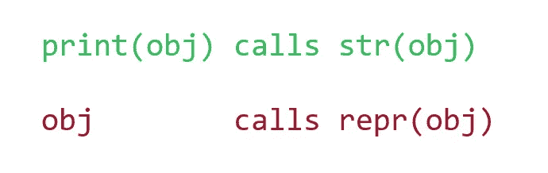
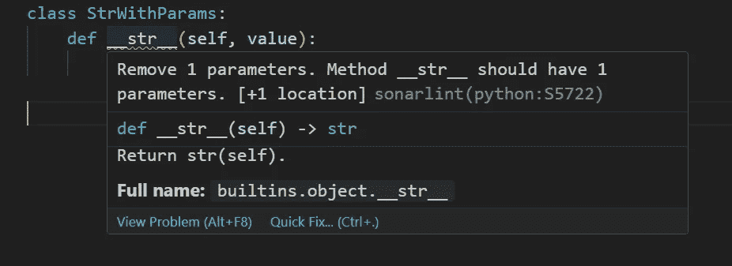
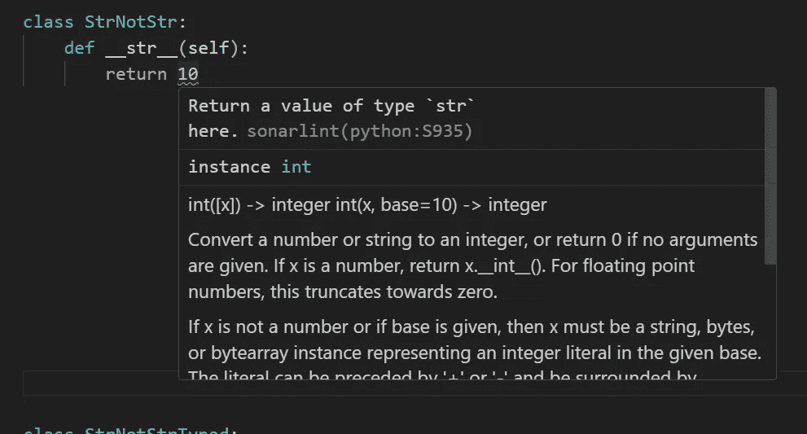
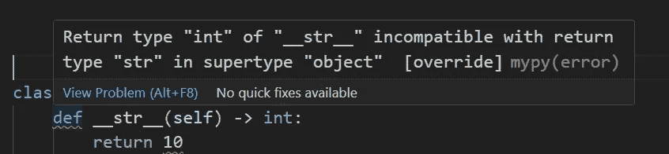

# Python OPP 以及为何 repr() 和 str() 重要

> 原文：[`towardsdatascience.com/python-opp-and-why-repr-and-str-matter-1cff584328f4`](https://towardsdatascience.com/python-opp-and-why-repr-and-str-matter-1cff584328f4)

## PYTHON 编程

## 这篇文章探讨了使用 repr() 和 str() 为 Python 类提供的各种面貌

[](https://medium.com/@nyggus?source=post_page-----1cff584328f4--------------------------------)[](https://towardsdatascience.com/?source=post_page-----1cff584328f4--------------------------------) [Marcin Kozak](https://medium.com/@nyggus?source=post_page-----1cff584328f4--------------------------------)

·发表于 [Towards Data Science](https://towardsdatascience.com/?source=post_page-----1cff584328f4--------------------------------) ·14 分钟阅读·2023 年 11 月 3 日

--


Python 类需要字符串表示，以便向用户和开发者提供比一堆字母更多的信息。图片由 [Surendran MP](https://unsplash.com/@sure_mp?utm_source=medium&utm_medium=referral) 在 [Unsplash](https://unsplash.com/?utm_source=medium&utm_medium=referral) 提供

Python 类有许多面貌。例如，你可以创建一个空类：

```py
class MyClass:
    pass
```

它仍然可以有所用处，例如作为 [哨兵值](https://en.wikipedia.org/wiki/Sentinel_value)。你可以添加一个 `__init__()` 方法：

```py
class MyClass:
    def __init__(self, value):
        self.value = value
```

这仍然会是一个非常简单的类，但这次它将保持一个特定的值。

Python 类的一个极佳功能是它们可以被用作类型，如下所示：

```py
def foo(x: MyClass, n: int) -> list[MyClass]:
    return [x] * n
```

记住，不实现 `__init__()` 方法并不意味着它不存在。实际上，我们上面重载了 `__init__()` 方法，而不仅仅是实现了它。这是 Python 类的另一个重要方面，你应该知道：你可以重载许多其他方法，如 `__new__()`、`__eq__()` 和 `__setattr__()`。如果你不重载这些方法，有些方法会有默认实现（如 `__init__()`、`__new__()`、`__setattr__()` 和 `__eq__()`），而其他方法则没有（如 `__lt__()` 和所有其他比较方法，除了 `__eq__()`、`__getitem__()`、`__setitem__()` 和 `__len__()`）。

一个类可以继承另一个类，如下所示：

```py
class MyClass(dict):
    @staticmethod
    def say_hello(self):
        print("Hello!")
```

同样如上所述，它可以使用静态方法，也可以使用类方法。你可以创建混合类和抽象基类、单例模式，还可以做许多其他事情，有时非常有用。

Python 类有很多面向不同的特性，详细讨论每一种特性需要几年时间，我们将在未来的文章中进行探讨。在这篇文章中，我们将重点关注一个特定方面：`__repr__()` 和 `__str__()` 方法的区别和作用。

初看起来，你可能认为这是一个小话题，但实际上它非常重要。实现一个 Python 类很容易，但实现一个 *好的* Python 类则需要更多的努力。正是这些小细节使得一个熟练的 Python 开发者与普通开发者有所区别。

*注意*：为了运行 doctests，我使用了 Python 3.11。不要惊讶于较旧版本的 Python 可能会提供稍微不同的结果。如果你想了解更多关于 Python `doctest` 的内容，请阅读以下文章：

## Python 文档测试与 doctest：简单方法

### doctest 允许进行文档测试、单元测试、集成测试以及测试驱动开发。

towardsdatascience.com

# `repr` 与 `str`

理论上，`repr()` 应该返回一个明确的对象字符串表示，从中你应该能够重建对象。另一方面，`str()` 应该返回一个人类可读的对象字符串表示。

因此，理论上，`repr()` 应该提供有关其所用对象的详细信息，而 `str()` 应该提供一个可读的字符串来解释对象是什么以及可能包含什么。例如，我们使用 `str()` 来查看交互式会话中的对象或用于日志记录。但当我们调试并需要更多细节时，`repr()` 是更好的选择。正如我们将在下一部分看到的，我们通常会间接调用这些函数，甚至可能不知道这一点——或者至少没有想到这一点。

我们在上面比较了 `repr()` 和 `str()` 函数。要在类中实现或重载它们，我们需要使用相应的方法，分别是 `__repr__()` 和 `__str__()`。如果一个类定义了 `__repr__()` 方法，当你调用 `repr()` 时，它会用于生成该类对象的字符串表示。`str()` 和 `__str__()` 也是如此。

我们很快就会看到这一点——首先让我们了解一下我提到的间接调用 `repr()` 和 `str()` 的含义。

## `间接调用 repr()` 和 `str()`

有一个与这两个函数相关的秘密，了解它是很有帮助的。请考虑以下代码：

```py
>>> class StrAndRepr:
...     def __repr__(self): return f"I am __repr__"
...     def __str__(self): return "I am __str__"
>>> str_and_repr = StrAndRepr()
>>> str_and_repr
I am __repr__
>>> print(str_and_repr)
I am __str__
```

注意最后两个调用。正如你所看到的，在 Python 会话中使用 `print()` 打印对象与仅使用对象名称之间可能会有所不同。



在 Python 会话中调用 `print(obj)` 和仅调用对象名之间的区别。图片由作者提供

下图总结了这一点：`print(obj)`调用`str(obj)`，而`obj`调用`repr(obj)`。

# **repr**与**str**

上面，我解释了`repr()`和`__repr__()`以及`str()`和`__str__()`的概念。前一对应该提供比后一对更多的信息。

然而，实践中往往显示出不同的情况：

```py
>>> class MyClass: ...
>>> inst = MyClass()
>>> inst.__repr__()
'<__main__.MyClass object at 0x7f...>'
>>> inst.__str__()
'<__main__.MyClass object at 0x7f...>'
>>> inst.__repr__() == repr(inst)
True
>>> inst.__str__() == str(inst)
True
```

如你所见，这两个方法的默认实现是相同的：

```py
>>> str(inst) == repr(inst)
True
```

因此，即使是默认实现的`__str__()`和`__repr__()`，当你在 Python 类中没有重载这两个方法时，也违反了上述规则。此外，开发者可以重载这两个方法中的一个或两个，而在实际应用中，这也可能意味着违反这一规则。

当仅实现其中一个方法时会发生什么？为了展示这一点，我将实现以下四个类：

```py
>>> class StrAndRepr:
...     def __repr__(self): return "I am repr of StrAndRepr"
...     def __str__(self): return "I am str of StrAndRepr"
>>> class OnlyStr:
...     def __str__(self): return "I am str of OnlyStr"
>>> class OnlyRepr:
...     def __repr__(self): return "I am repr of OnlyRepr"
>>> class NeietherStrNorRepr: ...
```

因此，我们定义了四个类：一个既没有`__str__()`也没有`__repr__()`，两个有其中一个，和一个两个都有。让我们看看如果我们对它们的实例调用`str()`和`repr()`会发生什么：

```py
>>> str_and_repr = StrAndRepr()
>>> str(str_and_repr)
'I am str of StrAndRepr'
>>> repr(str_and_repr)
'I am repr of StrAndRepr'

>>> only_str = OnlyStr()
>>> str(only_str)
'I am str of OnlyStr'
>>> repr(only_str)
'<__main__.OnlyStr object at 0x7f...>'

>>> only_repr = OnlyRepr()
>>> str(only_repr)
'I am repr of OnlyRepr'
>>> repr(only_repr)
'I am repr of OnlyRepr'

>>> neither_str_nor_repr = NeietherStrNorRepr()
>>> str(neither_str_nor_repr)
'<__main__.NeietherStrNorRepr object at 0x7...>'
>>> repr(neither_str_nor_repr)
'<__main__.NeietherStrNorRepr object at 0x7f...>'
```

以下是上述`doctest`的结论：

+   实现既没有`__str__()`也没有`__repr__()`：对于两者，都会使用默认实现；它们是一样的，都提供类的名称和实例的地址。

+   实现`__str__()`和`__repr__()`：通常，这是一种推荐的方法。它使你的代码更具可读性和可维护性——尽管同时也更长。

+   仅实现`__str__()`：Python 会在`str()`中使用它，但对于`repr()`将使用默认实现。

+   仅实现`__repr__()`：Python 会将其用于`str()`和`repr()`。

# 那么，我应该实现什么呢？

这要看情况。最明显的结论是，如果你实现了一个复杂的类，你应该定义*两个*这些方法。这将给你更多的调试代码和更好的日志记录的机会。

然而，当你没有太多时间编程而截止日期临近时，你至少应该实现其中一个方法。不实现任何方法意味着类的字符串表示将包含很少的有用信息，因为它将包含类的名称和实例的地址。因此，只有在你确定类的名称是你需要的全部信息时才这样做。例如，在原型设计中，这通常是你需要的全部信息。

对于小类，实现其中一个方法可能就足够了，但一定要确保这确实足够。此外，你有多久会没有时间来实现像`__str__()`或`__repr__()`这样简单的方法？我知道这种情况可能会发生——但我认为这种情况不会比偶尔发生的多。说实话，在我超过五年的 Python 开发中，这种情况甚至没有发生过一次。

因此，我认为时间很少是一个问题。而空间，另一方面，可能是。当你的模块包含多个小类，每个类占用几行时，为所有这些类实现`__repr__()`和`__str__()`可能会使模块的长度增加一倍。这可能会带来很大差异，因此值得考虑是否需要这两个方法，如果不需要，应该实现哪个方法。

许多内置类使用相同的实现来处理`__repr__()`和`__str__()`，包括`dict`和`list`。许多来自知名附加包的类也是如此，一个来自数据科学领域的完美例子是`pandas.DataFrame`。

让我们总结一下我们的讨论，形成一套规则。说实话，尽管我已经使用它们很多年了，这还是我第一次想到将它们写下来。我希望你能在编码实践中找到它们的用处，以决定是否实现`__repr__()`和`__str__()`这两个方法中的一个或两个，或者都不实现。

+   当你编写一个原型类且不打算使用它的字符串表示时，可以忽略`__repr__()`和`__str__()`。然而，对于生产代码，最好再三考虑。在开发过程中，除非需要通过类的实例调试代码，否则我通常会跳过这些方法。

+   当你的类生成具有多个属性的复杂实例时，我通常会考虑同时实现`__repr__()`和`__str__()`。然后：（i）`__str__()`方法应提供一个简单的人类可读的字符串表示，这可以通过使用`print()`和`str()`函数打印实例来获得。（ii）`__repr__()`方法应提供尽可能多的信息，包括重建类实例所需的所有信息；这可以通过`repr()`函数或在交互式会话中输入实例名称来获得。

+   如果你的类需要用于调试，无论是否实现`__str__()`，都要使其`__repr__()`方法尽可能详细。这并不意味着`__repr__()`的输出必须异常长；而是，在这种情况下，包含调试所需的任何信息。

+   当一个类需要一个人类可读的字符串表示，并且同时你需要实现详细的`__repr__()`方法时，实现`__str__()`。

+   如果一个类需要一个人类可读的字符串表示，但你不需要详细的`__repr__()`，则仅实现`__repr__()`。这将使用户从两个方法中获得一个不错的人类可读字符串表示，并避免看到默认的`__repr__()`表示，通常这没有太大价值。在仅实现`__repr__()`时，保持返回字符串格式的一致性很重要，这将使用户更容易阅读和理解`str()`和`repr()`的输出。

# 实现`__repr__()`和`__str__()`

现在我们知道了何时实现这两种方法，值得考虑如何实现它们。只有两个规则是你*必须*遵守的，而且幸运的是，这两个规则都很简单。

第一个处理方法的参数，另一个处理其返回值的类型。因此，我们可以使用这两种方法的预期签名来展示它们，即：

```py
def __repr__(self) -> str:
    ...

def __str__(self) -> str:
    ...
```

这就全部了吗？

基本上，是的——但是……我写这些是*预期*的签名，但实际上，你应该将它们视为*必需*的签名。下面你会明白为什么。

为了了解原因，你应该知道一个有趣的事情，我猜很多 Python 用户可能不知道。就我而言，我在很长一段时间内也不知情。

这个规则适用于当你希望类的`__str__()`与`str()`和`print()`配合使用，而`__repr__()`与`repr()`以及在会话中使用实例名称时。为此，让我们实现一个具有非可选参数的`__str__()`的类：

```py
>>> class StrWithParams:
...     def __str__(self, value):
...         return f"StrWithParams with value of {value}"
```

这个方法会工作吗？

```py
>>> inst = StrWithParams()
>>> inst.__str__(10)
'StrWithParams with value of 10'
```

嘿，它确实适用！那我怎么刚才写了`__str__()`应该*不*接受参数呢？

理论上不会——尽管它是可能的。这在一个不切实际的条件下才会发生，即唯一调用该方法的方式是`inst.__str__(10)`（值本身并不重要）。如上所述，我们看到过这样的调用，它确实有效。但接下来我们将看到三个痛苦的失败：

```py
>>> str(inst, value=10)
Traceback (most recent call last):
    ...
TypeError: 'value' is an invalid keyword argument for str()
>>> print(inst)
Traceback (most recent call last):
    ...
TypeError: StrWithParams.__str__() missing 1 required positional argument: 'value'
>>> print(inst, value=10)
Traceback (most recent call last):
    ...
TypeError: 'value' is an invalid keyword argument for print()
```

因此，使用参数的`__str__()`不是语法错误，但它绝对是一个静态错误。



来自 Visual Studio Code 的截图。[Sonarlint](https://www.sonarsource.com/knowledge/languages/python/) 显示`__str__()`不应该接受参数。图片由作者提供

这绝对是一个静态错误，但如上所示，一个更大的问题是，使用参数的`__str__()`很可能会在运行时引发`TypeError`异常，如上所示。

在会话中直接键入`inst`会调用`repr()`，由于我们没有实现它，使用了默认实现：

```py
>>> inst
<__main__.StrWithParams object at 0x7f...>
```

但如前所示，调用`print(inst)`失败了，原因很简单，因为没有直接提供非可选参数`value`的方式。

现在，让我们转到另一个问题，即返回一个非字符串类型的对象。这似乎是一个静态错误。我们考虑两种版本：未类型化和类型化的类定义：



来自 Visual Studio Code 的截图。基于未类型化的类定义，[Sonarlint](https://www.sonarsource.com/knowledge/languages/python/) 显示`__str__()`应该返回一个字符串。图片由作者提供



来自 Visual Studio Code 的截图。基于类型化的类定义，[Mypy](https://mypy.readthedocs.io/en/stable/) 显示`__str__()`应该返回一个字符串。图片由作者提供

因此，从`__str__()`方法返回非字符串对象绝对是一个静态错误——但这是否也会导致在运行时引发`TypeError`异常呢？

是的，会的：

```py
>>> class StrNotStr:
...     def __str__(self):
...         return 10
>>> inst = StrNotStr()
>>> inst.__str__()
10
>>> str(inst)
Traceback (most recent call last):
    ...
TypeError: __str__ returned non-string (type int)
```

`__repr__()` 的规则是一样的：

```py
>>> class ReprWithParams:
...     def __repr__(self, value):
...         return f"ReprWithParams with value of {value}"
>>> inst = ReprWithParams()
>>> inst.__repr__(10)
'ReprWithParams with value of 10'
>>> repr(inst, value=10)
Traceback (most recent call last):
    ...
TypeError: repr() takes no keyword arguments
>>> inst
Traceback (most recent call last):
    ...
TypeError: ReprWithParams.__repr__() missing 1 required positional argument: 'value'

>>> class ReprNotStr:
...     def __repr__(self):
...         return 10
>>> inst = ReprNotStr()
>>> inst.__repr__()
10
>>> repr(inst)
Traceback (most recent call last):
    ...
TypeError: __repr__ returned non-string (type int)
```

因此，请记住*不要*为 `__repr__()` 和 `__str__()` 使用参数，并记住它们都应返回字符串。但也值得记住，当你违反这两个规则中的任何一个时会发生什么。

# 自定义类示例

如上所述，当你实现一个复杂的自定义类时，通常应实现 `__str__()` 和 `__repr__()`，并且它们应有所不同。

在这个上下文中，“复杂”是什么意思？它可能意味着不同的东西，但在下面的例子中，它意味着类包含一些不需要在常规字符串表示中包含的属性，但我们可能希望在调试或日志记录时包含它们。

我们将实现一个流行的 `Point` 类，但我们会使它更复杂一些：

+   它的主要属性是 `x` 和 `y`，定义点的坐标。

+   它还有一个可选的 `group` 属性，用于定义实例的组成员身份；它可以是像著名的 Iris 数据集中的物种这样的组。

+   你还可以给类的实例添加评论。它可以是任何评论，例如“纠正组”，“双重检查坐标”或“可能的错误”。评论不会用于比较—只是作为关于特定点的信息来源；我们将在下面的代码中看到这一点。

这是 `Point` 类的实现：

```py
from typing import Optional

class Point:
    def __init__(
        self,
        x: float,
        y: float,
        group: Optional[str] = None,
        comment: Optional[str] = None) -> None:
        self.x = x
        self.y  = y
        self.group = group
        self.comment = comment

    def distance(self, other: "Point") -> float:
        """Calculates the Euclidean distance between two Point instances.

        Args:
            other: Another Point instance.

        Returns:
            The distance between two Point instances, as a float.

        >>> p1 = Point(1, 2)
        >>> p2 = Point(3, 4)
        >>> p1.distance(p2)
        2.8284271247461903
        >>> p1.distance(Point(0, 0))
        2.23606797749979
        """
        dx = self.x - other.x
        dy = self.y - other.y
        return (dx**2 + dy**2)**.5

    def __str__(self) -> str:
        """String representation of self.

        >>> p1 = Point(1, 2, "c", "Needs checking")
        >>> p1
        Point(x=1, y=2, group=c)
        Comment: Needs checking
        >>> print(p1)
        Point(1, 2, c)

        When group is None, __str__() and __repr__() will
        provide different representations:
        >>> p2 = Point(1, 2, None)
        >>> p2
        Point(x=1, y=2, group=None)
        >>> print(p2)
        Point(1, 2)
        """
        if self.group is not None:
            return f"Point({self.x}, {self.y}, {self.group})"
        return f"Point({self.x}, {self.y})"

    def __repr__(self) -> str:
        msg = (
            f"Point(x={self.x}, y={self.y}, "
            f"group={self.group})"
        )
        if self.comment is not None:
            msg += (
                "\n"
                f"Comment: {self.comment}"
            )
        return msg

    def __eq__(self, other) -> bool:
        """Compare self with another object.

        Group must be provided for comparisons.
        Comment is not used.

        >>> Point(1, 2, "g") == 1
        False
        >>> Point(1, 2, "c") == Point(1, 2, "c")
        True
        >>> Point(1, 2) == Point(1, 2)
        False
        >>> Point(1, 2) == Point(1, 3, "s")
        False
        """
        if not isinstance(other, Point):
            return False
        if self.group is None:
            return False
        return (
            self.group == other.group
            and self.x == other.x
            and self.y == other.y
        )

if __name__ == "__main__":
    import doctest

    doctest.testmod()
```

让我们分析一下 `__repr__()` 和 `__str__()` 之间的区别：

*细节的层次*

如上所述，这种评论通常在类实例的常规字符串表示中不是必需的。因此，我们不需要在 `__str__()` 中包含它们。然而，当我们进行调试时，评论可以非常有用，尤其是当它们提供有关特定类实例的重要信息时。

这就是为什么我们应该在 `__repr__()` 中包含评论，但在 `__str__()` 中不包含评论的原因。请考虑这个例子：

```py
>>> p1 = Point(1, 2, "c", "Needs checking")
>>> p1
Point(x=1, y=2, group=c)
Comment: Needs checking
>>> print(p1)
Point(1, 2, c)
```

*更详细的图片*

在我们的实现中，这两个方法提供了类实例的不同视图。比较

```py
Point(x=1, y=2, group=c)
Comment: Needs checking
```

通过

```py
'Point(1, 2, c)'
```

除了提供评论外，`__repr__()` 通过提供属性名称，提供比 `__str__()` 更详细的图片。在这个特定的类中，这可能差别不大，但当一个类有更多的属性需要包括在字符串表示中，并且它们的名称比这里更长时，差异可能会更加明显。即使在这里，`__str__()` 提供的信息也比 `__repr__()` 更简洁。

*从* `__repr__()` *重建实例*

我们也提到过这一点。如果可能的话，提供在 `__repr__()` 中所需的所有信息以重建实例是一个好的实践。在这里，`__str__()` 对我们来说还不够：

```py
>>> str(p1)
'Point(1, 2, c)'
>>> p1_recreated_from_str = Point(1, 2, "c")
>>> p1
Point(x=1, y=2, group=c)
Comment: Needs checking
>>> p1_recreated_from_str
Point(x=1, y=2, group=c)
```

在这里，评论没有用于比较实例，因此 `p1 == p1_recreated_from_str` 返回 `True` 这并不重要：

```py
>>> p1 == p1_recreated_from_str
True
```

这只是说明从用户的角度来看这两个实例是相等的。然而，从开发者的角度来看，它们并不相同：`p1` *不* 等于 `p1_recreated_from_str`。如果我们想要*完全*重建`p1`，我们需要使用其`__repr__()`表示形式：

```py
>>> p1
Point(x=1, y=2, group=c)
Comment: Needs checking
>>> p1_recreated_from_repr = Point(
...     1, 2, "c", comment="Needs checking")
>>> p1_recreated_from_repr
Point(x=1, y=2, group=c)
Comment: Needs checking
```

# 结论

我希望阅读这篇文章能帮助你理解`repr()`和`str()`之间，以及`__repr__()`和`__str__()`之间的微妙差异。这样的细微差别可能对中级 Python 用户不是必需的，但如果你想成为高级 Python 用户或开发者，这正是你需要在日常编码中了解并使用的。

这只是冰山一角，但我不会仅仅停留在这里。我们之前讨论过 Python 的这些细微之处，未来的文章中我们会进一步探讨。

感谢阅读。如果你喜欢这篇文章，你可能也会喜欢我写的其他文章；你可以在[这里](https://medium.com/@nyggus)看到它们。如果你想加入 Medium，请使用下面的推荐链接：

[## 使用我的推荐链接加入 Medium - Marcin Kozak](https://medium.com/@nyggus/membership?source=post_page-----1cff584328f4--------------------------------)

### 作为一个 Medium 会员，你的一部分会费会分配给你阅读的作者，并且你可以完全访问每一个故事……

[medium.com](https://medium.com/@nyggus/membership?source=post_page-----1cff584328f4--------------------------------)
