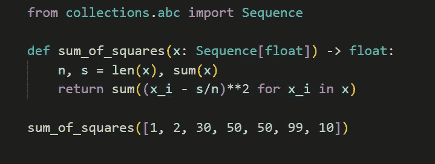
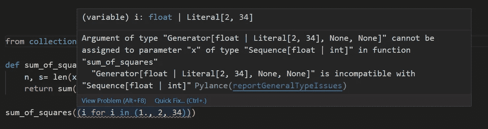

# Python 类型提示：鸭子类型兼容性和与一致

> 原文：[`towardsdatascience.com/python-type-hinting-duck-type-compatibility-and-consistent-with-72e8b348d8ac`](https://towardsdatascience.com/python-type-hinting-duck-type-compatibility-and-consistent-with-72e8b348d8ac)

## PYTHON PROGRAMMING

## 当你在提示`float`时，你不必提示`int`，当你在提示`tuple`时，也不必提示`namedtuple`。为什么？

[](https://medium.com/@nyggus?source=post_page-----72e8b348d8ac--------------------------------)[](https://towardsdatascience.com/?source=post_page-----72e8b348d8ac--------------------------------) [Marcin Kozak](https://medium.com/@nyggus?source=post_page-----72e8b348d8ac--------------------------------)

·发布于[Towards Data Science](https://towardsdatascience.com/?source=post_page-----72e8b348d8ac--------------------------------) ·阅读时间 8 分钟·2023 年 6 月 6 日

--


由[Markus Winkler](https://unsplash.com/@markuswinkler?utm_source=medium&utm_medium=referral)在[Unsplash](https://unsplash.com/?utm_source=medium&utm_medium=referral)提供的照片

有时，Python 类型提示可以使事情变得更简单。确实，并不总是如此——但至少在我看来，通常它确实能做到——前提是明智地使用它。有些人不同意，但我不打算与他们争论：在我看来，这是一个相当主观的话题。

我在以下文章中写了我对 Python 类型提示的看法，如何使用它来提高代码可读性，以及如何*不*使用它以达到其他目的：

[](https://betterprogramming.pub/pythons-type-hinting-friend-foe-or-just-a-headache-73c7849039c7?source=post_page-----72e8b348d8ac--------------------------------) [## Python 的类型提示：朋友、敌人还是仅仅是个头疼的问题？

### 类型提示在 Python 社区中的受欢迎程度正在上升。这会将我们带到哪里？我们可以做些什么来使用它……

betterprogramming.pub](https://betterprogramming.pub/pythons-type-hinting-friend-foe-or-just-a-headache-73c7849039c7?source=post_page-----72e8b348d8ac--------------------------------)

今天，我们将讨论在 Python 类型中，*与一致*（consistent-with）和*鸭子类型兼容性*（duck-type compatibility）的含义。

想象一下你在提示使用`float`，就像下面的函数：

```py
from collections.abc import Sequence

def sum_of_squares(x: Sequence[float]) -> float:
    n, s = len(x), sum(x)
    return sum((x_i - s/n)**2 for x_i in x)
```

这是一个典型的统计函数，用于计算一个变量的平方和。它接受一个浮点数的容器并返回一个浮点数。

正如你所见，为了注释这个函数，我使用了`Sequence`，这是一个从`collections.abc`（在 Python 3.9 之前，你需要使用`typing.Sequence`）中提供的通用抽象基类。这意味着你可以提供一个列表或一个元组——但你不能提供，例如，一个生成器¹。

好的，所以这是一个统计函数，它期望一个浮点数的序列。这是有道理的，对吧？但在实际生活中，相当多的定量变量是整数，比如每个芽的螨虫数量、销售的物品数量、人口数量，仅举几例。

那么我们是不是应该对函数做一些调整，以考虑到这个事实呢？我们都知道，*动态*情况下，函数对整数是完全有效的，而且*动态*情况下，我们可以轻松地将整数和浮点数结合在 `x` 中。但是类型提示和静态检查器呢？

对于这个函数，使用 `int` 是否合适，还是我们应该更清楚地说明它也接受 `int` 值？我们应该像下面这样做吗？

```py
def sum_of_squares(x: Sequence[float | int]) -> float:
    n, s = len(x), sum(x)
    return sum((x_i - s/n)**2 for x_i in x)
```

这很明显：你可以使用浮点数或整数的序列，函数会返回一个浮点数。从类型提示的角度来看，这个版本不是更好吗？

为了回答这个问题，我们回到之前的版本，没有 `int`。静态类型检查器对此有何看法？

一句话也不说！看看 `Pylance`（在 Visual Studio Code 中）对它的说法：



来自 Visual Studio Code 的截图：Pylance 没有指出任何错误。图片由作者提供

没有！如果 `Pylance` 发现静态错误，我们会看到它被红色下划线标出。在这里，这是 `mypy` 的看法：


Mypy 说当你使用 `int` 进行浮点数注解时一切正常。图片由作者提供

# 为什么你可以用 `int` 代替 `float`？

我们已经进入了本文的主要话题。简而言之，当你提示 `float` 时，你可以使用 `int` 代替。

首先，我们来看看 `mypy` 文档中描述鸭子类型兼容性的网页：

[## 鸭子类型兼容性 - mypy 1.3.0 文档

### 在 Python 中，某些类型即使不是彼此的子类，仍然是兼容的。例如，对象是…

[mypy.readthedocs.io](https://mypy.readthedocs.io/en/stable/duck_type_compatibility.html?source=post_page-----72e8b348d8ac--------------------------------)

这就是我们将在那里看到的内容之一：

> 在 Python 中，某些类型即使不是彼此的子类，仍然是兼容的。例如，`int` 对象在期望 `float` 对象的地方是有效的。Mypy 通过 *鸭子类型兼容性* 支持这种惯用法。

哈！

不用担心，这不会过多扩展你对类型提示的知识：

> 这对于一小部分内置类型是被支持的：
> 
> * `int` 是与 `float` 和 `complex` 兼容的鸭子类型。
> 
> * `float` 是与 `complex` 兼容的鸭子类型。
> 
> * `bytearray` 和 `memoryview` 是与 `bytes` 兼容的鸭子类型。

所以现在我们知道了。当我们已经提示使用 `float` 时，不必再提示 `int`。这将和 `float | int`（或 `Union[float, int]`）完全一样。这意味着提示中的 `| int` 部分是多余的。

就像 `int` 与 `float` 是鸭子类型兼容的，它也与 `complex` 是鸭子类型兼容的，`float` 与 `complex` 是鸭子类型兼容的，同时 `bytearray` 和 `memoryview` 也与 `bytes` 是鸭子类型兼容的。

好的，那是 `mypy`。现在，让我们看看我最喜欢的 Python 书籍，我在文章中经常提到的那本书：*Fluent Python*，第 2 版，由 Luciano Ramalho 编写：

[](https://www.fluentpython.com/?source=post_page-----72e8b348d8ac--------------------------------) [## Fluent Python，蜥蜴书

### 一个无障碍友好的 Hugo 主题，从原始的 Cupper 项目移植过来。

www.fluentpython.com](https://www.fluentpython.com/?source=post_page-----72e8b348d8ac--------------------------------)

要了解这里发生了什么，我们应该转到 Luciano 解释 *consistent-with* 意思的地方。他写道，我们不需要将 `int` 添加到 `float` 类型提示中，因为 `int` 是 *consistent-with* `float`。

那么 *consistent-with* 是什么意思呢？（是的，Luciano 每次都使用连字符和斜体来表示 *consistent-with*，这与 [PEP 484](https://peps.python.org/pep-0484/) 不同。）

正如他解释的那样，当 `T1` 是 `T2` 的子类型时，`T2` 是 *consistent-with* `T1`。换句话说，一个子类是 *consistent-with* 所有它的超类——尽管有一些例外，这些例外扩展了 *consistent-with* 的定义。根据 [PEP 484 的这一部分](https://peps.python.org/pep-0484/#the-numeric-tower)，Luciano 解释说，这一定义还包括了上述提到的数字场景。

当我们添加与类型 *consistent-with* `bytes` 的场景时，我们将有以下 *consistent-with* 的定义：


当 `T2` 是 *consistent-with* `T1` 时：

+   `T1` 是 `T2` 的子类型，或者

+   `T1` 与 `T2` 是鸭子类型兼容的。


我们需要记住的是，如果一种类型是 *consistent-with* 另一种类型，它要么是其子类型（子类），要么是与之鸭子类型兼容的——这归结为一个事实：只需对后者进行类型提示即可；你可以简单地省略前者。

说实话，我经常犯这样的错误——我的意思是，我做了这种多余的事情，类似如下：

```py
from typing import Iterable

def sum_of_squares(x: Iterable[float | int]) -> float:
    n, s = len(x), sum(x)
    return sum((x - s/n)**2)
```

我一直认为通过澄清 `x` 可以包含整数和浮点数，我是在让用户的生活更轻松。

我吗？我不知道。确实，我使代码变得冗长。一个不知道`int`是`float`的鸭子类型的人可能会想，为什么只有`float`？另一方面，我们不应该以让那些不了解的人容易理解的方式编写代码。当然，有一些限制，但我认为这种情况并没有越界。此外，任何稍微懂一点 Python 的人应该知道，在期望`float`的地方，可以使用`int`；这是一种相当普遍的知识。无论如何，这也是我写这篇文章的原因之一——让我的读者知道，不仅`int`可以动态地代替`float`，从静态检查器的角度来看这也是可以的。

让我们回到`sum_of_squares()`函数。当你了解鸭子类型兼容性时，简洁版是一样清晰但更短，因此更干净：

```py
from typing import Iterable

def sum_of_squares(x: Iterable[float]) -> float:
    n, s = len(x), sum(x)
    return sum((x - s/n)**2)
```

所以，我可以说，我对 Python 知识的缺乏让我认为我是在为我的代码用户做好事——现在我知道我不是。

# 命名元组

对于`collection.namedtupes`和`typing.NamedTuples`，情况类似，但有一点小差别。这两种类型都是常规`tuple`类型的子类型，这就是它们*与…一致*的原因。

这就是为什么下面的注释是……嗯，它不是最好的：

```py
from collections import namedtuple
from typing import NamedTuple

def join_names(names: tuple | namedtuple | NamedTuple) -> str:
    return " ".join(names)
```

这个函数本身在我写过的函数中不是最聪明的，但这不是重点。重点是，如果你想接受一个`tuple`、一个`namedtuple`和一个`NamedTuple`，你可以这样做：

```py
def join_names(names: tuple) -> str:
    return " ".join(names)
```

然而，如果你只想接受两种命名元组中的一个，你可以进行类型提示，例如：

```py
from collections import namedtuple

def join_names(names: namedtuple) -> str:
    return " ".join(names)
```

在这里，只能使用`collections.namedtuple`及其子类的实例。你当然可以以相同的方式指明`typing.NamedTuple`，这样`collections.namedtuple`就不能使用了。记住，如果`T1`与`T2`*一致*，并不意味着`T2`也*一致*于`T1`。

> 记住，如果`T1`与`T2`*一致*，并不意味着`T2`也*一致*于`T1`。

# 结论

我们了解了*与…一致*和*鸭子类型兼容性*的含义。不要害怕在代码中使用这些知识。你知道如何回应以下问题：“为什么只有`float`？如果我想使用`int`呢？”

# 脚注

¹ `sum_of_squares()`以这种方式定义不接受生成器是有充分理由的。要理解原因，请分析函数的主体，并考虑生成器是如何工作的。

注意，计算`len(x)`会消耗生成器——所以，函数将无法计算`x`的和。看：

```py
>>> sum_of_squares((i for i in (1., 2, 34)))
Traceback (most recent call last):
    ...
    n, s = len(x), sum(x)
    ^^^^^^
TypeError: object of type 'generator' has no len()
```

`Pylance`大喊：



`mypy`也不喜欢：

```py
error: Argument 1 to "sum_of_squares" has incompatible type 
"Generator[float, None, None]"; expected "Sequence[Union[float, int]]"
[arg-type]
```

你是否看到使用静态类型检查器可以帮助你捕捉那些否则会在运行时被发现的错误？

所以，类型提示值得称赞？是的——但要称赞*好的*类型提示！

感谢阅读。如果你喜欢这篇文章，你可能也会喜欢我写的其他文章；你可以在[这里](https://medium.com/@nyggus)看到它们。如果你想加入 Medium，请使用下面的推荐链接：

[](https://medium.com/@nyggus/membership?source=post_page-----72e8b348d8ac--------------------------------) [## 使用我的推荐链接加入 Medium - Marcin Kozak

### 阅读 Marcin Kozak 的每个故事（以及 Medium 上的其他成千上万位作家的故事）。你的会员费将直接支持…

medium.com](https://medium.com/@nyggus/membership?source=post_page-----72e8b348d8ac--------------------------------)
