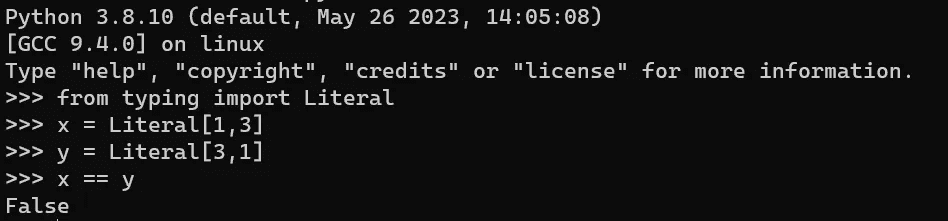
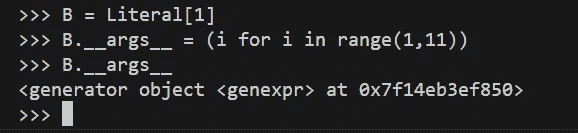

# Python 类型提示与字面量

> 原文：[`towardsdatascience.com/python-type-hinting-with-literal-03c60ce42750`](https://towardsdatascience.com/python-type-hinting-with-literal-03c60ce42750)

## PYTHON 编程

## 比看起来更强大：使用`typing.Literal`创建字面类型

[](https://medium.com/@nyggus?source=post_page-----03c60ce42750--------------------------------)[](https://towardsdatascience.com/?source=post_page-----03c60ce42750--------------------------------) [Marcin Kozak](https://medium.com/@nyggus?source=post_page-----03c60ce42750--------------------------------)

·发布于 [Towards Data Science](https://towardsdatascience.com/?source=post_page-----03c60ce42750--------------------------------) ·15 min read·Nov 28, 2023

--


`typing.Literal`创建具有选定选项的类型。图片由[Caleb Jones](https://unsplash.com/@gcalebjones?utm_source=medium&utm_medium=referral)提供，来源于[Unsplash](https://unsplash.com/?utm_source=medium&utm_medium=referral)

我承认：我并不总是喜欢`typing.Literal`，这是在 Python 中创建字面类型的一种形式。实际上，我不仅低估了字面类型，还完全忽视了它们，拒绝使用它们。出于某种原因，即使今天我也不太明白，我找不到字面类型的实际价值。

我有多么错误。我没有认识到这个简单工具的强大，我的代码因此受到了影响。如果你像我一样忽略了字面类型，我敦促你阅读这篇文章。我希望说服你，尽管它很简单，`typing.Literal`可以成为你 Python 编程工具库中的一个非常有用的工具。

即使你已经认识到字面类型的价值，也不要停止阅读。虽然我们不会深入探讨`typing.Literal`的所有细节，但这篇文章将提供比官方 Python 文档更全面的介绍，而不会像[PEP 586](https://peps.python.org/pep-0586/)那样陷入细节。

字面类型非常直接，可以使代码比没有字面类型的代码更清晰、更易读。这种简单性既是`typing.Literal`的优点，也是其缺点，因为它不提供任何额外的功能。然而，我将向你展示如何自行实现附加功能。

这篇文章的目标是介绍`typing.Literal`并讨论其在 Python 编程中的价值。在过程中，我们将探讨何时使用`typing.Literal`——同样重要的是，何时不要使用它。

# 字面类型

字面量类型是通过[PEP 586](https://peps.python.org/pep-0586/)引入到 Python 类型系统中的。这个 PEP 提供了对字面量类型提案的全面探讨，是一个丰富的信息来源。相比之下，`typing.Literal`类型的官方文档故意简洁，反映了它的直接性质。本文弥补了这两个资源之间的差距，提供了关于字面量类型的基本信息，同时深入探讨了我认为对所讨论用例至关重要的细节。

如[PEP 586](https://peps.python.org/pep-0586/)中所述，字面量类型在 API 根据参数值返回不同类型的场景中特别有用。我会进一步扩展这一说法，指出字面量类型允许创建一个涵盖特定值的类型，这些值不一定都是同一类型的。这并不排除所有值具有相同类型的可能性。

字面量类型提供了一种极其简单的方法来定义和利用具有特定值的类型，这些值是唯一可能的值。这种简单性远远超过任何替代方法。虽然确实可以使用其他方法实现相同的结果，但这些替代方案通常会带来更复杂的实现和潜在的更丰富功能。例如，创建你自己的类型（类）需要仔细考虑设计和实现，而创建字面量类型时可以完全忽略这些问题。

使用`typing.Literal`通常提供了一个更简单的解决方案，往往简单得多，但功能可能有所减少。因此，在做出决定之前，必须仔细权衡两种方法的优缺点。本文可以帮助你做出明智的选择。

# 字面量中可接受的类型

要创建一个`typing.Literal`类型，可以使用以下值：

+   一个`int`、`bool`、`str`或`bytes`的字面量值

+   一个枚举值

+   `None`

像`float`或自定义（非枚举）类的实例是不接受的。

# 字面量类型：用例

现在我们将探讨几个我认为字面量类型是绝佳选择（往往是最佳选择）的用例。我们还将检视一些可能更合适的替代解决方案。每个用例都假设需要一个只接受特定值的类型，这些值不一定都是同一类型的。`typing.Literal`不会创建空类型，因此`Literal[]`是无效的。然而，它可以创建具有单一值的字面量类型。

下述讨论的用例并不构成情境的详尽列表，而是作为示例，其中一些可能会重叠。这个非排他性列表旨在展示`typing.Literal`提供的机会范围，并增强对这个有趣且有价值工具的理解。

## 示例 1：仅一个值

如前所述，当变量只接受单一值时，可以使用字面量类型。虽然这乍一看可能不符合直觉，[文档](https://docs.python.org/3/library/typing.html#typing.Literal)提供了相关示例：

```py
def validate_simple(data: Any) -> Literal[True]:
    ...
```

这个函数旨在进行数据验证，并始终返回 `True`。换句话说，如果验证失败，函数会引发错误；否则，它会返回 `True`。

理论上，如下所示的 `bool` 类型的返回值类型签名，对于静态检查器来说是可以接受的：

```py
def validate_simple(data: Any) -> bool:
    ...
```

然而，该函数从未返回 `False`，使得这个类型提示具有误导性和不准确性。使用 `bool` 表示函数根据情况可以返回两个布尔值中的任意一个。当函数始终只返回其中一个值而从不返回另一个时，使用 `bool` 是误导性的。

这正是字面量类型发挥作用的地方。它不仅满足静态检查器的要求，还为用户提供了有价值的信息。

## 示例 2：需要静态类型

当运行时类型检查不需要时，静态类型通常提供最有效的解决方案。因此，如果你需要一个接受一个或多个特定值的类型，并且你的主要目标是通知静态检查器，创建相应的字面量类型是一个极好的方法。

## 示例 3：多个字符串

此用例包含了一系列字符串，例如模式、产品或颜色。以下是一些示例：

```py
Colors = Literal["white", "black", "grey"]
Grey = Literal["grey", "gray", "shades of grey", "shades of gray"]
Mode = Literal["read", "write", "append"]
```

如你所见，此用例中的字面量类型可以包含两个或更多的字符串。重要的是，使用 `Literal` 不允许我们建立个别值之间的关系。例如，我们可以创建以下字面量类型：

```py
Days = Literal[
    "Monday", "Tuesday", "Wednesday",
    "Thursday", "Friday", "Saturday", "Sunday"
]
```

值的提供顺序是否重要？在 Python 3.9.1 之前，是的：



在 Python 3.9.1 之前，字面量类型中的值的顺序是重要的。图片由作者提供

但自那以后就不再重要了：


从 Python 3.9.1 开始，字面量类型中值的顺序不再重要。图片由作者提供

因此，重要的是可能的选择，而不是它们之间的关系。如果利用值的顺序是关键，考虑使用其他类型，而不是字面量类型。一个解决方案是利用枚举类型，使用 `enum.Enum` 类；我们将很快在专门的文章中深入探讨这个概念。

***谨慎提醒***：Python 3.11 及更新版本引入了`typing.LiteralString`。这是一个不同的工具，因为与`typing.Literal`不同，它作为一种类型存在，而不是创建类型的工具。在本文中，我们探讨了字面量类型的创建，我不希望引入与这个略有不同但相关的工具的混淆。如果你有兴趣了解更多，访问文章末尾的附录。不过，让我们现在将这个话题搁置。关键是，`typing.LiteralString`不是`typing.Literal`的字符串替代品。

> `typing.LiteralString` *不是* `typing.Literal`的字符串替代品。

## 示例 4：相同类型的多个值

这个示例扩展了前一个示例，涵盖了更广泛的数据类型。就像我们为字符串使用字面量类型一样，我们也可以将它们应用于大多数其他数据类型。这里是一些示例：

```py
Literal[1, 5, 22] # integers
Literal["1", "5", "22"] # strings
```

如上所述，你可以使用`int`、`bool`、`str`或`bytes`的字面量值、枚举值和`None`。

## 示例 5：组合各种类型的值

这代表了字面量类型的最通用形式。你可以组合任何类型的对象，它将正常工作。这有些类似于使用`typing.Union`类型，但与典型的`Union`使用情况不同，我们是在组合对象而不是类型。

注意区别：一个常见的 Union 使用案例可能如下所示：

```py
Union[int, str]
```

而一个组合了`int`和`str`类型对象的字面量类型可能如下：

```py
Tens = Literal[10, "10", "ten"]
```

这里是一些其他示例：

```py
Positives = Literal[True, 1, "true", "yes"]
Negatives = Literal[False, 0, "false", "no"]
YesOrNo = Literal[Positives, Negatives]
```

你可以创建以下类型：`Literal[True, False, None]`。它类似于这里描述的`OptionalBool`类型。

[## An OptionalBool Type for Python: None, False or True](https://medium.com/pythoniq/an-optionalbool-type-for-python-none-false-or-true-7667e9cc6dd8?source=post_page-----03c60ce42750--------------------------------)

### 使用 OptionalBool 而不是 Optional[bool]。

[medium.com](https://medium.com/pythoniq/an-optionalbool-type-for-python-none-false-or-true-7667e9cc6dd8?source=post_page-----03c60ce42750--------------------------------)

上述文章中描述的`OptionalBool`类型比基于`Literal`的对应类型要复杂得多，后者既易于使用和理解，又具有显著较差的功能。

上述代码块中的三个例子也很有趣。它们显示了你可以创建两个（或更多）字面量类型的组合。这里，`YesOrNo`是一个将两个其他字面量类型，即`Positives`和`Negatives`组合在一起的字面量类型：


在 Python 3.9.1 及更高版本中连接两个字面量类型。作者想象

但请记住，这在 Python 3.9.1 之前的版本中不会以相同的方式工作（我们之前讨论了类型定义中字面量的顺序）：


在 Python 3.9.1 之前连接两个字面量类型。作者想象

## 示例 6：运行时 m**embershi**p 检查

在前面的例子中，我们专注于字面量类型的静态应用。然而，这并不排除它们在运行时的使用，即使这偏离了 Python 类型提示的原意。在这里，我将演示当需要时，你可以对字面量类型进行运行时成员检查。换句话说，你可以验证一个给定的值是否属于字面量类型的可能选择集合。

坦白说，我认为这一单一能力使 `typing.Literal` 成为一个更强大的工具。虽然它偏离了字面量类型的传统用法（静态代码检查），但这并不是一种黑客行为。这是类型模块的一个合法功能：`typing.get_args()`。

一个例子将最好地说明这个概念。首先，让我们定义一个字面量类型：

```py
from typing import Any, get_args, Literal, Optional

Tens = Literal[10, "10", "ten"]
```

`Tens` 类型涵盖了数字 `10` 的各种表示形式。现在，让我们定义一个函数来验证一个对象是否具有 `Tens` 类型：

```py
def is_ten(obj: Any) -> Optional[Tens]:
    if obj in get_args(Tens):
        return obj
    return None
```

关于这个函数的几点说明：

+   它接受任何对象，并返回 `Optional[Tens]`，这表明如果 `obj` 是 `Tens` 的有效成员，函数将返回它；否则，将返回 `None`。这就是为什么使用 `typing.Optional`（参见 这篇文章）。

+   使用 `typing.get_args()` 函数进行检查。对于字面量类型，它返回所有可能的值。

+   在这里情况变得有趣。从动态的角度来看，函数的最后一行（`return None`）是多余的，因为缺少的 `None` 返回值会被隐式解释为 `None` 返回值。然而，`mypy` 不接受 [隐式 None 返回值](https://mypy.readthedocs.io/en/stable/kinds_of_types.html#optional-types-and-the-none-type)，如下图所示。


Mypy 不接受隐式的 None 返回值。截图来自 Visual Studio Code。图片由作者提供

根据[官方文档](https://mypy.readthedocs.io/en/stable/kinds_of_types.html#disabling-strict-optional-checking)中的`[mypy](https://mypy.readthedocs.io/en/stable/kinds_of_types.html#disabling-strict-optional-checking)`，你可以使用`[--no-strict-optional](https://mypy.readthedocs.io/en/stable/command_line.html#cmdoption-mypy-no-strict-optional)`命令行选项来禁用严格的`None`检查。如果你打算使用这个选项，请三思。我更倾向于明确声明某种类型是否接受`None`。禁用严格检查意味着任何类型都假定接受`None`，这可能导致意外行为，使代码更难以理解和维护。虽然我不是非常喜欢非常详细的类型提示，但在我看来，使用`[--no-strict-optional](https://mypy.readthedocs.io/en/stable/command_line.html#cmdoption-mypy-no-strict-optional)`标志是一种过于简化的做法，因为`None`是一个非常重要的哨兵值，不应如此轻忽。

如果你确实需要在特定情况下禁用严格检查，请记住，当你这样做而其他人没有时，他们可能会在代码中遇到许多静态错误。在整个代码库中保持一致的类型检查设置是一个好的实践。

# 字面量与枚举

在阅读前一部分时，你是否注意到一些字面量类型与枚举类型相似？确实，它们确实有一些相似之处，但字面量类型缺乏枚举固有的自然值顺序。

比较这两种类型定义：

```py
from typing import Literal
from enum import Enum

ColorsL = Literal["white", "black", "grey"]

class ColorsE(Enum):
    WHITE = "white"
    BLACK = "black"
    GREY = "grey"
```

如果你主要注意到的是语法差异，要知道你也可以使用静态工厂方法来定义枚举类型：

```py
ColorsE2 = Enum("ColorsE2", ["WHITE", "BLACK", "GREY"])
ColorsE3 = Enum("ColorsE3", "WHITE BLACK GREY")
```

因此，定义语法并不是字面量类型和枚举类型之间的关键区别。首先，字面量类型是具有少量动态功能的静态类型，而枚举类型则提供了静态和动态能力，使其更加多功能。如果你需要的功能超出了字面量类型的范围，枚举类型可能是更好的选择。

本文不会深入探讨 Python 枚举的复杂性。然而，以下表格比较了这两种工具。在继续之前，请分析表格并观察`typing.literal`提供了`enum.Enum`的一部分功能。


`enum.Enum`与`typing.Literal`的比较。图片由作者提供

尽管字面量类型在简洁性、简短性和可读性方面表现优异。虽然 Python 枚举类型也很简单和可读，但字面量类型提供了更高水平的清晰性和简洁性。

# 结论

本文的核心信息是 `typing.Literal` 和字面量类型是强大的工具，提供的功能超出了最初的假设。它们的简单性掩盖了它们的深度和多功能性。正如我在文章开头提到的，我曾经低估了这个工具的价值。然而，今天我认识到它——以及一般的字面量类型——是增强 Python 代码简洁性同时保持静态正确性的强大而简单的机制。

实际上，使用其他类型提示来表达与字面量类型相同的概念可能会导致混淆，即使静态检查器没有报错。当你只需要静态类型供静态检查器检查时，`typing.Literal` 应该是你的首选。它的使用方法很简单，不需要过多的代码：只需类型定义，这通常需要一行或多行，具体取决于类型中包含的字面量数量。

对于需要更多高级动态功能的场景，枚举可能是更好的选择。它们通过防止无效值分配，在运行时提供了额外的安全层。另一方面，字面量类型并没有提供这种固有的保护，尽管可以像上述 `is_ten()` 函数演示的那样实现。然而，这种保护需要在每次用户提供该类型的值时应用。

本质上，记住字面量类型和 `typing.Literal`。将它们融入你的 Python 代码中，以实现简洁和可读性。我认为在 Python 中，`typing.Literal` 实现了最高的实用性与复杂性的比率之一，使其既非常有用又极其简单。

# 附录 1

## typing.LiteralString

Python 3.11 及更高版本引入了 `typing.LiteralString` 类型。尽管其名称如此，但它并不是 `typing.Literal` 在字符串方面的直接替代品。为了避免不必要的混淆，我们在这里不深入探讨此类型。相反，我们简要概述一下此类型的基本方面。

与用作创建字面量类型机制的 `typing.Literal` 不同，`typing.LiteralString` 本身就是一个类型。它可以用来指定变量应持有一个字面量字符串，如下例所示：

```py
from typing import LiteralString

def foo(s: LiteralString) -> None
    ...
```

请注意文档中的说明：

> 任何字符串字面量都与 `*LiteralString*` 兼容，另一个 `*LiteralString*` 也是如此。然而，单独标记为 `*str*` 的对象则不兼容。

而且

> `*LiteralString*` 对于敏感 API 很有用，在这些 API 中，任意用户生成的字符串可能会产生问题。例如，上述生成类型检查器错误的两个情况可能会受到 SQL 注入攻击的威胁。

这个简要概述应该足以满足我们当前的讨论。如果你有兴趣进一步探索此类型，请参阅 [PEP 675](https://peps.python.org/pep-0675/)，该 PEP 介绍了这个字面量类型。

# 附录 2

## 使用可迭代对象定义字面量类型

***警告***：本节展示了一个静态无法工作的技巧。因此，如果你的唯一目标是创建静态类型，请*不要*使用这个技巧。这更多的是一个有趣的信息，而非生产代码中的内容。

如果你不熟悉`typing.Literal`，`Literal[]`可能类似于索引，而`Literal[1, 2, 3]`可能类似于列表。因此，你可能会被诱导使用列表推导式，如下所示：

```py
>>> OneToTen = Literal[i for i in range(1, 11)]
  File "<stdin>", line 1
    OneToTen = Literal[i for i in range(1, 11)]
                         ^^^
SyntaxError: invalid syntax
```

错误消息表明这不是有效的语法。这是因为`typing.Literal`不应该用作列表推导式。相反，它用于指定类型接受的特定值。

但看看这里：

```py
>>> OneToTen = Literal[[i for i in range(1, 11)]]
```

没有错误？那么，我们没问题，对吧？

不，我们不是。看看`OneToTen`是什么：

```py
>>> OneToTen
typing.Literal[[1, 2, 3, 4, 5, 6, 7, 8, 9, 10]]
>>> get_args(OneToTen)
([1, 2, 3, 4, 5, 6, 7, 8, 9, 10],)
```

如你所见，这个定义有效，但并不是我们想要的方式。`OneToTen`是一个字面量类型，只有一个值：一个从 1 到 10 的整数列表。列表不仅不是一个可接受的字面量类型，这也不是我们期望的！

但别担心，我们还没完成。还有一个技巧可以帮助我们实现预期结果。我们可以通过两种方式访问字面量类型的可能值。一种方法是我们已经看到的`get_args()`函数。另一种方法是使用类型的`.__args__`属性：

```py
>>> get_args(OneToTen)
([1, 2, 3, 4, 5, 6, 7, 8, 9, 10],)
>>> OneToTen.__args__
([1, 2, 3, 4, 5, 6, 7, 8, 9, 10],)
>>> get_args(OneToTen) == OneToTen.__args__
True
```

虽然`get_args()`允许我们获取字面量类型的值，但我们可以利用`.__args__`属性来更新类型。看看：

```py
>>> OneToTen.__args__ = [1, 2, 3, 4, 5, 6, 7, 8, 9, 10]
>>> OneToTen
typing.Literal[1, 2, 3, 4, 5, 6, 7, 8, 9, 10]
```

哈！这就是我之前提到的技巧。我们可以称之为`.__args__`技巧。

上面我使用了一个列表，但你使用什么类型的可迭代对象并不重要：

```py
>>> OneToTen == Literal[1, 2, 3, 4, 5, 6, 7, 8, 9, 10]
True
>>> OneToTen.__args__ = (1, 2, 3, 4, 5, 6, 7, 8, 9, 10)
>>> OneToTen == Literal[1, 2, 3, 4, 5, 6, 7, 8, 9, 10]
True
>>> OneToTen.__args__ = {1, 2, 3, 4, 5, 6, 7, 8, 9, 10}
>>> OneToTen == Literal[1, 2, 3, 4, 5, 6, 7, 8, 9, 10]
True
```

我将一个列表字面量赋值给了`OneToTen.__args__`，但你可以用其他方式实现，比如使用列表推导式或[另一种推导式](https://medium.com/towards-data-science/a-guide-to-python-comprehensions-4d16af68c97e)：

```py
>>> OneToTen.__args__ = [i for i in range(1, 11)]
>>> OneToTen == Literal[1, 2, 3, 4, 5, 6, 7, 8, 9, 10]
True
>>> OneToTen.__args__ = list(range(1, 11))
>>> OneToTen == Literal[1, 2, 3, 4, 5, 6, 7, 8, 9, 10]
True
>>> OneToTen.__args__ = {i for i in range(1, 11)}
>>> OneToTen == Literal[1, 2, 3, 4, 5, 6, 7, 8, 9, 10]
True
```

然而，你确实需要小心，因为`Literal`并不总是表现得可预测。例如，它在`range()`中像上面那样有效，但在生成器表达式中则不行：

```py
>>> OneToTen.__args__ = range(1, 11)
>>> OneToTen == Literal[1, 2, 3, 4, 5, 6, 7, 8, 9, 10]
True
>>> OneToTen.__args__ = (i for i in range(1, 11))
>>> OneToTen == Literal[1, 2, 3, 4, 5, 6, 7, 8, 9, 10]
False
>>> OneToTen.__args__ 
<generator object <genexpr> at 0x7f...>
```

实际上，在使用`Literal`进行生成器表达式实验时，我发现它确实有几次有效……我不知道为什么：通常它不这样工作，所以在我尝试的二十多次中，只有效了 2 或 3 次。这让我担心，因为我讨厌编程语言表现出不可预测的行为——即使是在技巧中。

难以相信这一点？看看这张来自 Python 3.11 的截图：


使用生成器表达式时`typing.Literal.__args__`的不可预测行为。截图来自 Python 3.11。图片由作者提供

仅供参考，之前没有使用`A`，但使用过`OneToTen`——不过，这应该不影响结果。此外，下次我尝试这个时，换了个新名称`B`，结果也没有成功：



`typing.Literal.__args__` 与生成器表达式的行为不同于之前。截图来自 Python 3.11。图像由作者提供

因此，除非你准备好接受 Python 的不可预测行为，否则在这个问题解决之前，不要将 `typing.Literal` 与生成器表达式一起使用。不过没什么好担心的，因为生成器表达式通常用于克服内存问题——创建字面量类型似乎不会导致这样的问题。因此，你可以将其转化为一个列表并使用，而不是用生成器创建字面量类型。

如本节开头所述，你应该避免使用 `.__args__` hack。它会动态工作，但 `mypy` 不会接受它。了解这一点是好的，因为它扩展了你对 `typing` 类型提示的知识，但这不是你应该在生产代码中使用的东西。

感谢阅读。如果你喜欢这篇文章，你也可能喜欢我写的其他文章；你可以在[这里](https://medium.com/@nyggus)查看。如果你想加入 Medium，请使用下面我的推荐链接：

[](https://medium.com/@nyggus/membership?source=post_page-----03c60ce42750--------------------------------) [## 使用我的推荐链接加入 Medium - Marcin Kozak

### 作为 Medium 会员，你的一部分会员费用将会分配给你阅读的作者，并且你可以完全访问每一个故事……

medium.com](https://medium.com/@nyggus/membership?source=post_page-----03c60ce42750--------------------------------)
