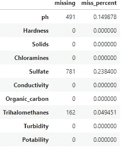

# Python 水质 EDA 和可饮性分析

> 原文：[`towardsdatascience.com/python-water-quality-eda-and-potability-analysis-ebc1cf553081?source=collection_archive---------1-----------------------#2023-07-08`](https://towardsdatascience.com/python-water-quality-eda-and-potability-analysis-ebc1cf553081?source=collection_archive---------1-----------------------#2023-07-08)

## 理解数据分析和可视化技术

[](https://jamesmcneill06.medium.com/?source=post_page-----ebc1cf553081--------------------------------)[](https://towardsdatascience.com/?source=post_page-----ebc1cf553081--------------------------------) [James McNeill](https://jamesmcneill06.medium.com/?source=post_page-----ebc1cf553081--------------------------------)

·

[关注](https://medium.com/m/signin?actionUrl=https%3A%2F%2Fmedium.com%2F_%2Fsubscribe%2Fuser%2Fb8007a8a59af&operation=register&redirect=https%3A%2F%2Ftowardsdatascience.com%2Fpython-water-quality-eda-and-potability-analysis-ebc1cf553081&user=James+McNeill&userId=b8007a8a59af&source=post_page-b8007a8a59af----ebc1cf553081---------------------post_header-----------) 发表在 [Towards Data Science](https://towardsdatascience.com/?source=post_page-----ebc1cf553081--------------------------------) · 11 分钟阅读 · 2023 年 7 月 8 日[](https://medium.com/m/signin?actionUrl=https%3A%2F%2Fmedium.com%2F_%2Fvote%2Ftowards-data-science%2Febc1cf553081&operation=register&redirect=https%3A%2F%2Ftowardsdatascience.com%2Fpython-water-quality-eda-and-potability-analysis-ebc1cf553081&user=James+McNeill&userId=b8007a8a59af&source=-----ebc1cf553081---------------------clap_footer-----------)

--

[](https://medium.com/m/signin?actionUrl=https%3A%2F%2Fmedium.com%2F_%2Fbookmark%2Fp%2Febc1cf553081&operation=register&redirect=https%3A%2F%2Ftowardsdatascience.com%2Fpython-water-quality-eda-and-potability-analysis-ebc1cf553081&source=-----ebc1cf553081---------------------bookmark_footer-----------)

图片来源：[Amritanshu Sikdar](https://unsplash.com/@da_sikka_x?utm_source=medium&utm_medium=referral) 在 [Unsplash](https://unsplash.com/?utm_source=medium&utm_medium=referral)

能够提供足够的饮用水是一个核心要求。在气候变化辩论中，最大的挑战之一是确保足够的淡水供生存使用。水质是一个影响所有生物的重要问题。地球上只有约三百分之一的水是淡水。而其中只有 1.2%可以作为饮用水，其余的被锁在冰川、冰盖和永久冻土中，或深埋在地下。使用数据驱动的方法来评估影响水质的特性，可以大大改善我们对使水可饮用的理解。

在最基本的层面上，水的可饮用性与水的安全性相关。数据技术可以用来审查这个目标特性。还有一些问题超出了我们目前的审查范围：

*我们可以饮用所有类型的淡水吗？*

*世界上可以获取的淡水比例是多少？*

*随着海平面上升，地下水位是否也增加了？*

在本文中，我们将与一个小型水质数据集一起进行探讨。我们将通过使用 pandas 和 numpy 的数据分析技术，从数据中寻找隐藏的见解。对于数据可视化，将使用 matplotlib 和 seaborn 库。将采用一系列探索性数据分析（EDA）技术，以进一步明确数据质量。

每个数据可视化都旨在突出数据的不同特征。它们还将为用户提供模板，以应用于其他挑战。

## **数据集**

对于这项分析，水质数据集取自 Kaggle¹。

[## 水质](https://www.kaggle.com/datasets/adityakadiwal/water-potability?source=post_page-----ebc1cf553081--------------------------------)

### 饮用水的可饮用性

[www.kaggle.com](https://www.kaggle.com/datasets/adityakadiwal/water-potability?source=post_page-----ebc1cf553081--------------------------------)

使用了带有 Python 代码的 jupyter notebook 实例进行处理。

```py
import sys
print(sys.version) # displays the version of python installed
```

运行上述脚本后，输出将显示使用了版本 3.7.10 的 Python。为了能够复制接下来的结果，用户应确保在工作环境中使用 Python 3。

## 理解数据

首先，我们需要了解我们正在使用的数据。由于文件格式为 csv 文件，将使用标准的 pandas 导入语句 read_csv。

```py
# Import the dataset for review as a DataFrame
df = pd.read_csv("../input/water-potability/water_potability.csv")

# Review the first five observations
df.head()
```

导入数据后，代码将变量 df 分配为 pandas 方法生成的 DataFrame 输出结果。

与任何数据集一样，查看样本记录将帮助你获得信心。DataFrame 具有大量与之相关的方法，pandas API 是一个很好的资源。在 API 中，可以使用 head 方法。输出 1.1 默认显示 DataFrame 的前 5 行。为了显示更多的行，需要在括号内输入一个数值。可以应用两种替代方法来对 DataFrame 进行采样：i) sample (df.sample()) 从索引中选择随机行，或者 ii) tail (df.tail()) 从索引中选择最后的 n 行。


输出 1.1 DataFrame 的前五条记录详细信息

运行任何方法时，括号会在方法名后面出现，以便 Python 解释器产生结果。

显示 DataFrame 的内存可能是一个常见的任务，特别是在涉及内存限制时。例如，当要导入的数据集可能大于 Python 会话中可用的内存时。通过使用 pandas 库，DataFrame 会在内存中创建，因此用户应该了解在执行这些处理步骤时可以使用的内存。

```py
# Display information about the DataFrame - contains memory details
df.info(memory_usage="deep")
```

上面的代码可以用作显示输出 1.2 的方法。通过包含关键字 `memory_usage`，Python 解释器会进行更深入的搜索，以了解下面显示的内存使用情况。默认选项会执行一般搜索，因此如果需要评估的准确性，请确保应用上述关键字短语。


输出 1.2 提供了内存使用情况的功能和详细信息概述

从输出 1.2 显示的结果中，可以查看一系列详细信息，从列名称和数据类型，到确认变量的类别和非空值的数量。我们可以看到整个表格中显示了 3,276 行。然而，对于 Sulfate 列，只有 2,495 个非空值。因此，可以查看一些缺失值，以了解这些缺失条目是否与其他列存在模式。我们将在文章后面回顾一种数据可视化技术，可以帮助识别模式。

根据之前的导入语句，用户可以调整列的 Dtype，如果默认选项不符合预期的话。上述结果显示，对于十进制数字，应用了 float Dtype，而整数显示为 int。此外，还包括了这些数字列的最大字节内存类型，以提供潜在输入值的全面覆盖。用户应当评估这些 Dtypes 是否保持了正确的值范围，如果未来预期的范围较小，则可以分配较小的字节值。应用这一逻辑将有助于提高 DataFrame 的内存效率，并在处理时提升性能。

上述 info 方法展示的一个特性是 DataFrame 的结构，这可以通过许多其他方法进行查看。这样的元数据可以让程序员查看行数和列数等基本组件。

```py
# Shape of the DataFrame - shows tuple of (#Rows, #Columns)
print(df.shape)
# Find the number of rows within a DataFrame
print(len(df))
# Extracting information from the shape tuple
print(f'Number of rows: {df.shape[0]} \nNumber of columns: {df.shape[1]}')
```

在 Python 中调用诸如 shape 这样的属性时，不需要加上括号。属性是可以通过类及其对象访问的数据结果。之前我们回顾了一个方法，它是包含在类中的一个函数。要进一步了解 Python 类语句的细节，需要深入研究。然而，我们可以继续使用所展示的代码，并且展示了输出 1.3 中显示的一些值。


输出 1.3 显示了 DataFrame 的结构的元数据

第一行显示了形状输出，这是一个元组，由两个值组成的括号表示。从上面展示的代码中，我们能够访问该元组中的相对位置，以显示第一个和第二个位置的值。由于 Python 使用 0 索引约定，应用 0 在方括号内将返回第一个值。我们可以看到，元组中包含了第一位置的行数，第二位置的列数。找到行数的另一种方法是使用 len 函数，它显示 DataFrame 的长度。

## 摘要统计

在这一部分，我们开始回顾 DataFrame 列的摘要细节。一个简单的 describe 方法可以用于对数字列进行高层次的数据分析。由于我们的 DataFrame 仅包含数字列，因此所有摘要属性都被生成。当存在字符和数字列的混合时，需要包含其他关键字参数以显示相关输出。

```py
# Review the high level summary details for each variable
df.describe()
```

输出 1.4 显示每列的默认总结值。计数值可以解释为非空值的计数。任何总计小于 DataFrame 中行总数的显示列都有缺失值。对于每个变量，我们可以看到一系列值。我们可以使用四种矩方法来理解 i) 平均值，ii) 方差，iii) 偏度，和 iv) 峰度，基于显示的数据。


输出 1.4 标准细节显示 DataFrame 中每个特征的高级指标

在回顾总结细节时，具有外部视角来理解特征属性也是至关重要的。我们从经验中知道，pH 值应在 0 到 14 之间。如果值超出此范围，则必须检查和更正特征值。用于评估水质的数据中，平均值和中位数（由第 50 百分位数显示）接近 7 是水的中性属性的适当值。

如果 DataFrame 中有更多特征，则前一个代码块的输出可能会很难解释。输出可能会横向扩展到比没有滚动显示的范围更宽的范围。

```py
# Transpose the summary details - easier to review larger number of features
df.desribe().T
```

能够转置输出是一种有用的方法。在上面的代码块中，链式调用 T 方法生成了下面的输出 1.5。现在用户可以更容易地查看行索引上显示的列名以及以列标题显示的总结指标。这一小的调整使得 describe 方法在列数较多时效果很好。


输出 1.5 总结细节转置以显示沿行索引的特征名称

要进一步了解 describe 方法的详细信息，我们可以通过使用 jupyter notebook 的问号魔法函数来解释文档字符串。

```py
# Magic function in jupyter to display docstring
df.describe?
```

使用这种方法将帮助用户查看任何方法的默认参数值（关键字和位置）。


输出 1.6 在 jupyter 控制台中显示关于文档字符串和方法参数的详细信息

输出 1.6 提供了方法的内部工作原理，供用户查看。每个参数的默认值范围以及定义，有助于方法的应用。提供了一系列 jupyter 魔法函数，可以帮助提高程序员的生产力。

## 缺失值

如前所述，从元数据和总结统计数据中可以看到 DataFrame 中存在一些缺失值。为了确认这一点，我们可以应用下面的代码块。

```py
# Check for the missing values by column
df.isnull().sum()
```

代码将第一个 isnull 方法与 sum 方法链在一起，以创建每列的缺失值数量。isnull 评估将检查列中的非空值。sum 方法用于执行计数。输出 1.7 突出显示三列显示缺失值。


输出 1.7 每列的缺失值计数

拥有缺失值总行数是一个很好的起点。然而，更好的是审查每列中缺失值的比例。

```py
# Proportion of missing values by column
def isnull_prop(df):
    total_rows = df.shape[0]
    missing_val_dict = {}
    for col in df.columns:
        missing_val_dict[col] = [df[col].isnull().sum(), (df[col].isnull().sum() / total_rows)]
    return missing_val_dict

# Apply the missing value method
null_dict = isnull_prop(df)
print(null_dict.items())
```

创建 isnull_prop 用户定义函数使我们能够为每列创建一个值字典。通过此函数，我们生成了上述计数值，并使用 shape 属性理解缺失值的百分比。


输出 1.8 将缺失值百分比函数应用于每列

输出 1.8 显示的结果难以可视化。为确保不遗漏最终信息，可以生成一个 DataFrame。

```py
# Create a dataframe of the missing value information
df_missing = pd.DataFrame.from_dict(null_dict, 
                                    orient="index", 
                                    columns=['missing', 'miss_percent'])
df_missing
```

将字典变量应用于 pandas DataFrame 方法将使我们更容易理解每列的差异。输出 1.9 现在包括 miss_percent 列。我们现在可以应用阈值来评估缺失值的百分比是否在我们期望的范围内。如果值过高，例如硫酸盐值大于 20%，可以设置用户定义的控制，以突出显示此列需要排除在未来使用之外或更详细地审查。



输出 1.9 创建 DataFrame 以了解每列的缺失百分比

另一种通过缺失值检查是否存在模式的方法是应用来自 seaborn 数据可视化库的热图方法。

```py
# Display missing values using a heatmap to understand any patterns
plt.figure(figsize=(15,8))
sns.heatmap(df.isnull());
```

应用上述代码块将生成输出 1.10。此可视化提供了进一步的上下文，以查看是否有多个行对所有三个变量都有缺失值。这可能是因为填充数据的用户在原始数据集中一致地显示缺失值。获得这一见解将使我们能够生成数据驱动的洞察，以更有效地减少缺失值数量。


输出 1.10 使用 seaborn 数据可视化生成每列每行的缺失值热图

## 理解 pH 变量分布

最终评估将是对我们已知的变量进行审查。使用 seaborn 库，我们能够生成 pH 变量的直方图。

```py
# set the histogram, mean and median
sns.displot(df["ph"], kde=False)
plt.axvline(x=df.ph.mean(), linewidth=3, color='g', label="mean", alpha=0.5)
plt.axvline(x=df.ph.median(), linewidth=3, color='y', label="median", alpha=0.5)

# set title, legends and labels
plt.xlabel("ph")
plt.ylabel("Count")
plt.title("Distribution of ph", size=14)
plt.legend(["mean", "median"]);

print(f'Mean pH value {df.ph.mean()} 
        \n Median pH value {df.ph.median()} 
        \n Min pH value {df.ph.min()} 
        \n Max pH value {df.ph.max()}')
```

与之前的打印语句类似，f 字符串语句允许我们添加均值、中位数、最小值和最大值，以便更容易地查看分布。


输出 1.11 使用直方图查看 pH 变量分布

输出 1.11 显示大多数 pH 值接近中间。其分布类似于正态分布，我们可以利用这一见解在向外部用户展示细节时提供帮助。

## **结论**

在本文中，我们旨在回顾 EDA 评估的早期阶段。最初审查了导入数据的元数据，以展示早期洞察。深入挖掘摘要统计数据让我们关注缺失值。最后，我们审查了 pH 变量的直方图，以确保该变量符合外部预期。

后续文章将继续这一旅程，并寻求开发旨在预测水质的模型。将使用分类机器学习技术提供基线模型。

留下你的评论，非常感谢你的阅读！

**你可以通过** [**LinkedIn**](https://www.linkedin.com/in/james-mc-neill-180a9057/) **与我联系，进行关于数据的一次友好聊天。其他我分享的故事包括：**

[](/declaring-variables-within-sql-fe6a479a7f9c?source=post_page-----ebc1cf553081--------------------------------) ## 在 SQL 中声明变量

### 确保在 SQL 代码的开头声明关键变量，可以帮助自动化代码的重用。

[towardsdatascience.com [](/advanced-sql-operations-8856084a95a8?source=post_page-----ebc1cf553081--------------------------------) ## 高级 SQL 操作

### 审查更高级的 SQL 操作，以从爱尔兰天气数据集中提取更多的数据洞察。

[towardsdatascience.com [](/developing-sql-tables-3f9b96bc21e1?source=post_page-----ebc1cf553081--------------------------------) ## 开发 SQL 表

### 只有通过创建和开发 SQL 表，我们才能理解如何最佳利用可用内存。

[towardsdatascience.com [](/getting-started-with-nlp-in-python-6a14d0bf4cfe?source=post_page-----ebc1cf553081--------------------------------) ## Python 中的 NLP 入门

### 开始进入自然语言处理领域

[towardsdatascience.com

[1] : Kaggle 数据集水质来自 [`www.kaggle.com/datasets/adityakadiwal/water-potability`](https://www.kaggle.com/datasets/adityakadiwal/water-potability)，许可证协议见 [`creativecommons.org/publicdomain/zero/1.0/`](https://creativecommons.org/publicdomain/zero/1.0/)
