# PyTorch 初学者图像分类教程

> 原文：[`towardsdatascience.com/pytorch-image-classification-tutorial-for-beginners-94ea13f56f2`](https://towardsdatascience.com/pytorch-image-classification-tutorial-for-beginners-94ea13f56f2)

## 在 Python 中微调预训练的深度学习模型

[](https://medium.com/@iamleonie?source=post_page-----94ea13f56f2--------------------------------)[](https://towardsdatascience.com/?source=post_page-----94ea13f56f2--------------------------------) [Leonie Monigatti](https://medium.com/@iamleonie?source=post_page-----94ea13f56f2--------------------------------)

·发布于 [Towards Data Science](https://towardsdatascience.com/?source=post_page-----94ea13f56f2--------------------------------) ·22 min 阅读·2023 年 5 月 9 日

--

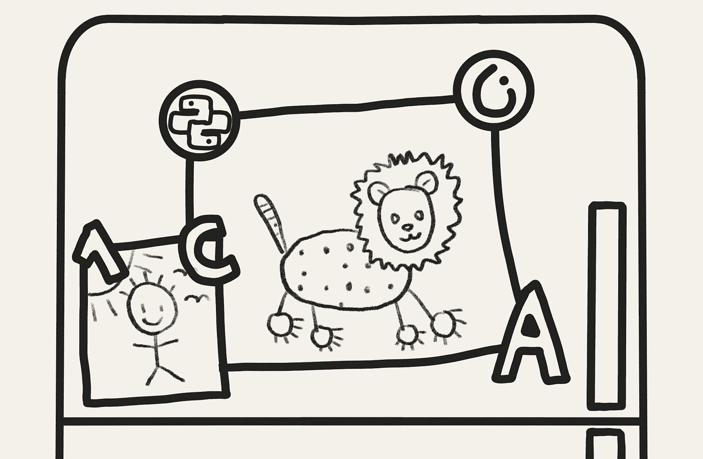

“不确定这应该是狮子还是猎豹……”

这个实用教程将展示如何使用 PyTorch 框架中的预训练深度学习模型进行图像分类。

这个面向初学者的图像分类教程与其他教程的不同之处在于，我们并不会从头开始构建和训练深度神经网络。在实际操作中，只有少数人会从头训练神经网络。相反，大多数深度学习从业者会使用预训练模型，并将其微调以适应新任务。

> 在实际操作中，只有少数人会从头训练神经网络。

特定的问题设置是构建一个二分类图像分类模型，以根据小型数据集对猎豹和狮子的图像进行分类。为此，我们将使用 PyTorch 微调一个预训练的图像分类模型。

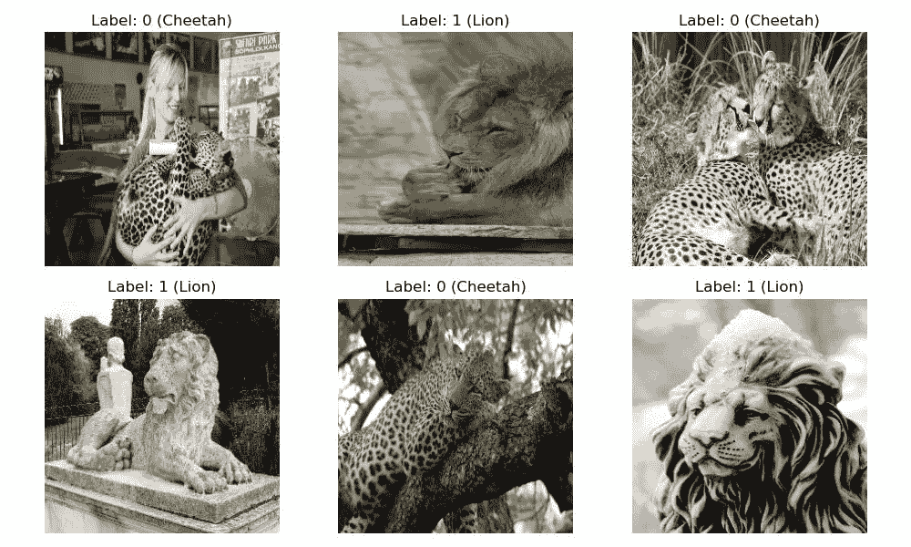

数据集的示例图像 [1]。

本教程遵循基本的机器学习工作流程：

1.  准备和探索数据

1.  建立基准

1.  运行实验

1.  做出预测

你可以在 [我的相关 Kaggle 笔记本](https://www.kaggle.com/iamleonie/pytorch-image-classification-tutorial-for-beginner)中跟随教程。

# 前提条件和设置

理想情况下，你应该对 Python 有一定的了解。

由于这是一个实用教程，我们只会在高层次上覆盖如何构建图像分类模型。我们不会涵盖很多理论，比如卷积层或反向传播的工作原理。一旦你对这个话题感到舒适，我会用这个标志 ⚒️ 标记你可以深入了解的部分。

如果你想为本指南补充一些理论背景信息，我推荐免费的 Kaggle Learn 课程，内容包括[深度学习](https://www.kaggle.com/learn/intro-to-deep-learning)和[计算机视觉](https://www.kaggle.com/learn/computer-vision)。

让我们开始导入 PyTorch 和其他相关库：

```py
import torch
import torch.nn as nn
from torch.utils.data import Dataset, DataLoader

import cv2

import albumentations as A
from albumentations.pytorch import ToTensorV2

import numpy as np # data processing
import matplotlib.pyplot as plt # Data visualization
from tqdm import tqdm # Progress bar
```

关键的库包括用于深度学习的 PyTorch（版本 1.13.0）、用于图像处理的 OpenCV（版本 4.5.4）以及用于数据增强的 Albumentations（版本 1.3.0）。

# 第一步：准备和探索数据

第一步是熟悉数据。对于本教程，我们将简短地进行探索性数据分析。

首先，我们将加载数据。示例数据集[1]包含两个文件夹，每个文件夹中都有图像——每个类别一个文件夹。

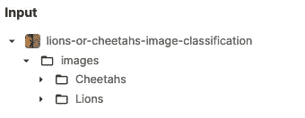

二分类图像分类的示例数据集[1]。

以下代码遍历所有子文件夹，并创建一个包含文件名及其标签的 Pandas 数据框。

```py
import os
import pandas as pd 

root_dir = ... # Insert your data here
sub_folders = ["Cheetahs", "Lions"] # Insert your classes here
labels = [0, 1]

data = []

for s, l in zip(sub_folders, labels):
    for r, d, f in os.walk(root_dir + s):
        for file in f:
            if ".jpg" in file:
                data.append((os.path.join(s,file), l))

df = pd.DataFrame(data, columns=['file_name','label'])
```

*在此处插入你的数据！* — 为了跟上本文的内容，你的数据集应该类似于此：

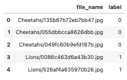

二分类图像分类的示例数据集[1]。在此处插入你的数据。

我们大约有 170 张照片：大致 85 张狮子照片和 85 张猎豹照片（见[1]中的备注）。这是一个非常小但平衡的数据集，非常适合微调！

```py
import seaborn as sns
sns.countplot(data = df, x = 'label');
```

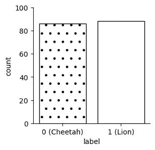

使用 seaborn 绘制的图像分类样本数据集的类别分布

为了对数据集有一个感觉，绘制一些样本总是个好主意：

```py
fig, ax = plt.subplots(2, 3, figsize=(10, 6))

idx = 0
for i in range(2):
    for j in range(3):

        label = df.label[idx]
        file_path = os.path.join(root_dir, df.file_name[idx])

        # Read an image with OpenCV
        image = cv2.imread(file_path)

        # Convert the image to RGB color space.
        image = cv2.cvtColor(image, cv2.COLOR_BGR2RGB)

        # Resize image
        image = cv2.resize(image, (256, 256))

        ax[i,j].imshow(image)
        ax[i,j].set_title(f"Label: {label} ({'Lion' if label == 1 else 'Cheetah'})")
        ax[i,j].axis('off')
        idx = idx+1

plt.tight_layout()
plt.show()
```


数据集[1]中的样本图像。

通过探索这样的数据集，你可以获得一些见解。例如，正如你在这里看到的，图像不仅限于动物，还包括雕像。

在我们进一步操作之前，让我们将数据集拆分为训练数据和测试数据。训练数据将用于构建我们的模型，而测试数据将作为保留数据集来评估最终模型在未见数据上的性能。在本示例中，我们将把 10%的数据留作测试用。

```py
from sklearn.model_selection import train_test_split

train_df, test_df = train_test_split(df, 
                                      test_size = 0.1, 
                                      random_state = 42)
```


将数据拆分为训练集和测试集（灵感来源于[scikit-learn](https://scikit-learn.org/stable/modules/cross_validation.html)）

# 第二步：建立基线

接下来，我们将构建一个基线。基线包括三个关键组件：

+   一个加载图像的数据管道

+   一个模型，包含损失函数和优化器

+   一个训练管道，包括一个交叉验证策略

在本节中，我们将逐个组件进行讲解，并最终整理好。

由于训练深度学习模型涉及大量实验，我们希望能够快速切换代码的特定部分。因此，我们将尽可能使以下代码模块化，并使用配置进行调优：

```py
from types import SimpleNamespace

cfg = SimpleNamespace(**{})
```

我们将随着进展添加可配置参数。

## 构建用于加载图像的数据管道

首先，你必须构建一个管道，以批次方式加载、预处理和喂入图像到神经网络中（而不是一次性加载）。PyTorch 提供了两个核心类供你使用：

+   `Dataset` 类：加载和预处理数据集。你需要根据你的需求自定义这个类。

+   `Dataloader` 类：将数据样本批次加载到神经网络中。

首先，你需要自定义 `Dataset` 类。其关键组件是：

+   构造函数：用于加载数据集，例如 Pandas Dataframe

+   `__len__()`：获取数据集的长度。这通常只需要对数据集传递方式进行最小的调整。

+   `__getitem__()`：通过索引从数据集中获取样本。这通常是你根据需要执行预处理时修改代码的地方。

下面你可以找到一个用于自定义 `Dataset` 类的模板。

```py
class CustomDataset(Dataset):
    def __init__(self, df):
        # Initialize anything you need later here ...
        self.df = df
        self.X = ...
        self.y = ...
        # ...

    # Get the number of rows in the dataset
    def __len__(self):
        return len(self.df)

    # Get a sample of the dataset
    def __getitem__(self, idx):
        return [self.X[idx], self.y[idx]]
```

在加载数据集时，你也可以执行任何需要的预处理，如变换或图像标准化。这发生在 `__getitem__()` 中。

在这个示例中，我们首先使用 OpenCV 从根目录 (`cfg.root_dir`) 加载图像，并将其转换为 RGB 颜色空间。然后我们将应用基本转换：调整图像大小 (`cfg.image_size`)，并将图像从 NumPy 数组转换为张量。最后，我们将图像的值标准化到 [0, 1] 范围，通过除以 255 实现。

```py
cfg.root_dir = ... # Insert your data here
cfg.image_size = 256

class CustomDataset(Dataset):
    def __init__(self, 
                 cfg, 
                 df, 
                 transform=None, 
                mode = "val"):
        self.root_dir = cfg.root_dir
        self.df = df
        self.file_names = df['file_name'].values
        self.labels = df['label'].values

        if transform:
          self.transform = transform
        else:
          self.transform = A.Compose([
                              A.Resize(cfg.image_size, cfg.image_size), 
                              ToTensorV2(),
                           ])

    def __len__(self):
        return len(self.df)

    def __getitem__(self, idx):
        # Get file_path and label for index
        label = self.labels[idx]
        file_path = os.path.join(self.root_dir, self.file_names[idx])

        # Read an image with OpenCV
        image = cv2.imread(file_path)

        # Convert the image to RGB color space.
        image = cv2.cvtColor(image, cv2.COLOR_BGR2RGB)

        # Apply augmentations        
        augmented = self.transform(image=image)
        image = augmented['image']

        # Normalize because ToTensorV2() doesn't normalize the image
        image = image/255

        return image, label
```

接下来，我们需要一个 `Dataloader` 来将 `Dataset` 的样本批次喂入神经网络，因为我们（可能）没有足够的 RAM 一次性喂入所有图像。

你需要提供 `Dataloader` 你要遍历的 `Dataset` 实例、批次大小 (`cfg.batch_size`)，以及是否打乱数据的信息。

```py
cfg.batch_size = 32

example_dataset = CustomDataset(cfg, df)

example_dataloader = DataLoader(example_dataset, 
                              batch_size = cfg.batch_size, 
                              shuffle = True, 
                              num_workers=0,
                             )
```

批次大小应在训练过程中保持固定，不应调整 [2]。因为训练速度与批次大小相关，我们希望使用尽可能大的批次大小。首先使用 32 的批次大小，然后按二的幂次增加（64, 128 等），直到出现内存错误，然后使用最后的批次大小。

当你遍历 `Dataloader` 时，它会给你来自自定义 `Dataset` 的样本批次。让我们取出第一个批次进行验证：

```py
for (image_batch, label_batch) in example_dataloader:
    print(image_batch.shape)
    print(label_batch.shape)
    break
```

```py
torch.Size([32, 3, 256, 256])
torch.Size([32])
```

`Dataloader` 返回图像批次和标签批次。`image_batch` 是形状为 `(32, 3, 256, 256)` 的张量。这是一个包含 32 张图像的批次，每张图像的形状为 `(3, 256, 256)`（`color_channels, image_height, image_width`）。`label_batch` 是形状为 `(32)` 的张量。这些是与 32 张图像对应的标签。

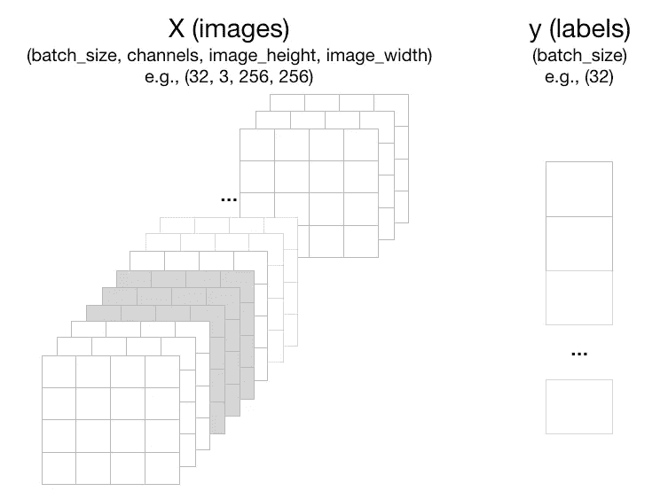

自定义数据集的 Dataloader 示例输出

本节解释了如何构建数据管道。在后面的章节中（见 设置训练管道），我们将使用 `Dataset` 和 `Dataloader` 创建用于训练、验证和测试的独立管道。

在训练模型之前，我们需要将训练数据再次拆分为训练集和验证集。在一个数据集上训练模型然后在相同数据上评估模型是一种方法上的错误，因为模型只需记住已见样本的标签。因此，模型会过拟合训练数据，而不是进行泛化。

为了避免过拟合，我们暂时使用 `train_test_split()` 函数将训练数据随机分割为训练集和验证集。本节稍后将被 交叉验证策略 替代。

```py
X = df
y = df.label

train_df, valid_df, y_train, y_test = train_test_split(X, 
                                                       y, 
                                                       test_size = 0.2, 
                                                       random_state = 42)
```

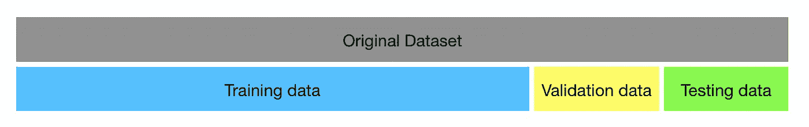

将训练数据再次拆分为训练集和验证集（灵感来源于 [scikit-learn](https://scikit-learn.org/stable/modules/cross_validation.html)）

有了这个分割，我们现在可以为训练和验证数据创建 `Datasets` 和 `Dataloaders`：

```py
train_dataset = CustomDataset(cfg, train_df)
valid_dataset = CustomDataset(cfg, valid_df)

train_dataloader = DataLoader(train_dataset, 
                          batch_size = cfg.batch_size, 
                          shuffle = True)

valid_dataloader = DataLoader(valid_dataset, 
                          batch_size = cfg.batch_size, 
                          shuffle = False)
```

## 准备模型

这部分将学习如何在 PyTorch 中构建神经网络。当我开始学习深度学习时，我认为构建神经网络是训练深度学习模型的重要部分。但实际上，这是研究人员为我们完成的工作。我们这些从业者只需使用最终模型即可。

研究人员尝试不同的模型架构，例如卷积神经网络（CNN），通常会在大型基准数据集（如 ImageNet [3]）上训练图像分类模型。我们称这些模型为 **骨干网**。

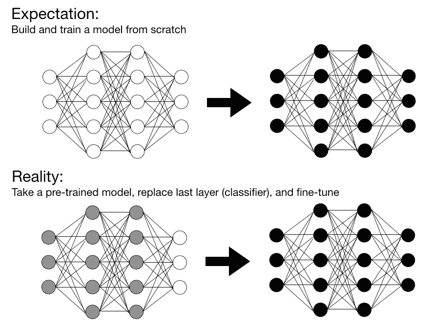

期望与现实：实际上，只有少数人从头开始训练用于图像分类的神经网络

微调预训练神经网络之所以有效，是因为前几层通常会学习到通用特征（如边缘检测）。

*⚒️ 当然，你应该了解神经网络的一般工作原理，包括反向传播，以及不同层（如卷积层）的工作方式。然而，为了跟上这个实际教程，你现在不需要理解这些细节。完成本教程后，你可以通过免费的 Kaggle Learn 课程填补一些理论空白，课程包括* [*深度学习*](https://www.kaggle.com/learn/intro-to-deep-learning) *和* [*计算机视觉*](https://www.kaggle.com/learn/computer-vision)*。*

**绝妙的骨干网及其获取途径** — 现在，你应该选择哪些预训练模型，以及从哪里获得这些模型？

在本教程中，我们将使用 `[timm](https://timm.fast.ai/)` — 一个包含由 [Ross Wightman](https://twitter.com/wightmanr) 创建的先进计算机视觉模型集合的深度学习库 — 来获取预训练模型。（你可以使用 `torchvision.models` 来获取预训练模型，但我个人觉得在实验中使用 `timm` 更容易更换骨干网络。）

```py
import timm

cfg.n_classes = 2
cfg.backbone = 'resnet18'

model = timm.create_model(cfg.backbone, 
                          pretrained = True, 
                          num_classes = cfg.n_classes)
```

这段代码包含很多内容。让我们一步步来解读：

`backbone = 'resnet18'`— 在这个例子中，我们使用一个 18 层的 ResNet [5]。ResNet 代表残差网络，它是一种使用所谓的残差块的 CNN。

⚒️*我们将跳过 ResNet 和残差块的详细内容。如果你对技术细节感兴趣，* *你可以深入了解这篇文章，例如。*

ResNet 系列中有许多不同的模型，如 ResNet18、ResNet34 等，其中的数字表示网络的层数。一个（非常粗略的）经验法则是：层数越多，性能越好。你可以打印 `timm.list_models('*resnet*')` 来查看其他可用的模型。

⚒️ *了解不同的计算机视觉/图像分类骨干网络，如 ResNet、DenseNet 和 EfficientNet。*

`pretrained = True` — 这意味着我们希望使用在 ImageNet [3] 上训练的模型权重。如果设置为 `False`，你将只得到模型的结构而没有权重 [6]。

`num_classes = cfg.n_classes` — 由于模型是在 ImageNet [3] 上预训练的，你将得到一个包含 ImageNet 中 1000 个类别的分类器。因此，你需要移除 ImageNet 分类器并定义你问题中的类别数量 [6]。如果你设置 `num_classes = 0`，你将得到没有分类器的模型 [6]。

要检查输出大小，你可以传入一个具有随机值的 3 通道样本批次 `X`，尺寸为 [6]。

```py
X = torch.randn(cfg.batch_size, 3, cfg.image_size, cfg.image_size)
y = model(X)
```

它将输出 `torch.Size([1, cfg.n_classes])` [6]。

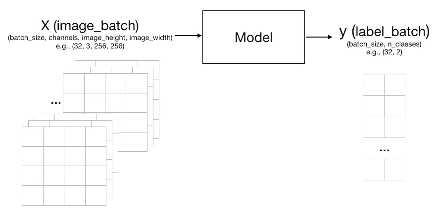

模型的输入和输出

## 准备损失函数和优化器

接下来，训练一个模型有两个关键要素：

+   一个损失函数（准则），

+   一个优化算法（优化器），和

+   可选的学习率调度器。

**损失函数** — 常见的损失函数有：

+   **二分类交叉熵（BCE）损失**用于二分类。

+   **分类交叉熵**损失用于多分类。

+   **均方损失**用于回归。

虽然我们有一个二分类问题，但你也可以使用分类交叉熵损失。如果你愿意，可以将损失函数更换为 BCE。

```py
criterion = nn.CrossEntropyLoss()
```

**优化器 —** 优化算法通过最小化损失函数（在我们的例子中是交叉熵损失）来优化模型。有很多不同的优化器可以选择。我们使用一个流行的优化器：[Adam](https://pytorch.org/docs/stable/optim.html#torch.optim.Adam)。

```py
cfg.learning_rate = 1e-4

optimizer = torch.optim.Adam(
  model.parameters(), 
  lr = cfg.learning_rate, 
  weight_decay = 0,
 )
```

**学习率调度器**— 学习率调度器会在训练过程中调整学习率的值。虽然你不必使用学习率调度器，但使用它可以帮助算法更快收敛。这是因为如果学习率保持不变，如果学习率过大，它可能会阻碍你找到最佳解，如果学习率过小，则可能需要很长时间才能收敛。

有许多不同的学习率调度器可用，但 Kaggle 大师建议将**余弦衰减作为微调的学习率调度器** [2]。

```py
cfg.lr_min = 1e-5
cfg.epochs = 5

scheduler = torch.optim.lr_scheduler.CosineAnnealingLR(
  optimizer, 
  T_max = np.ceil(len(train_dataloader.dataset) / cfg.batch_size) * cfg.epochs,
  eta_min = cfg.lr_min
)
```

`T_max` 定义了半周期，应该等于最大迭代次数（`np.ceil(len(train_dataloader.dataset) /cfg.batch_size)*cfg.epochs`）。

训练过程中，学习率的变化情况如下所示：

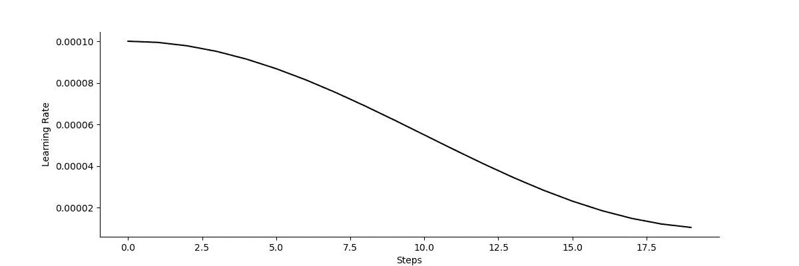

余弦衰减学习率调度器

**指标** — 既然我们在谈论它，我们还需要定义一个指标来评估模型的整体性能。同样，有许多不同的指标。对于这个示例，我们将使用准确率作为指标：

```py
from sklearn.metrics import accuracy_score

def calculate_metric(y, y_pred):
  metric = accuracy_score(y, y_pred)
  return metric
```

不要将指标与损失函数混淆。损失函数用于在训练过程中优化学习函数，而指标则在训练后衡量模型的性能。

⚒️ *了解不同的指标以及哪些指标适用于哪些问题。*

## 设置训练管道

这可能是本教程中最复杂但也是最有趣的部分。你准备好了吗？

模型通常以迭代的方式进行训练。一轮迭代称为一个 epoch。从头开始训练通常需要许多 epochs，而微调只需要几个（大约 5 到 10）epochs。

在每个 epoch 中，模型会在完整的训练数据上进行训练，然后在完整的验证数据上进行验证。我们现在将定义两个函数：一个用于训练（`train_an_epoch()`），另一个用于在一个 epoch 上验证模型（`validate_an_epoch()`）。

下面你可以看到训练函数：

```py
cfg.device = torch.device("cuda:0" if torch.cuda.is_available() else "cpu")

def train_one_epoch(dataloader, model, optimizer, scheduler, cfg):
    # Training mode
    model.train()

    # Init lists to store y and y_pred
    final_y = []
    final_y_pred = []
    final_loss = []

    # Iterate over data
    for step, batch in tqdm(enumerate(dataloader), total=len(dataloader)):
        X = batch[0].to(cfg.device)
        y = batch[1].to(cfg.device)

        # Zero the parameter gradients
        optimizer.zero_grad()

        with torch.set_grad_enabled(True):
            # Forward: Get model outputs
            y_pred = model(X)

            # Forward: Calculate loss
            loss = criterion(y_pred, y)

            # Covert y and y_pred to lists
            y =  y.detach().cpu().numpy().tolist()
            y_pred =  y_pred.detach().cpu().numpy().tolist()

            # Extend original list
            final_y.extend(y)
            final_y_pred.extend(y_pred)
            final_loss.append(loss.item())

            # Backward: Optimize
            loss.backward()
            optimizer.step()

        scheduler.step()

    # Calculate statistics
    loss = np.mean(final_loss)
    final_y_pred = np.argmax(final_y_pred, axis=1)
    metric = calculate_metric(final_y, final_y_pred)

    return metric, loss
```

让我们一步步来看：

1.  将模型设置为训练模式。模型也可以处于评估模式。这种模式会影响模型中 `[Dropout](https://pytorch.org/docs/stable/_modules/torch/nn/modules/dropout.html)` 和 `[BatchNorm](https://pytorch.org/docs/stable/_modules/torch/nn/modules/batchnorm.html)` 层的行为。

1.  以小批量迭代训练数据。如果你使用 GPU 进行更快的训练，则需要将样本和标签移动到 GPU (`cfg.device`)。

1.  清除优化器的最后一个误差梯度。

1.  通过模型进行一次前向传播。

1.  计算模型输出的损失。

1.  通过模型反向传播误差。

1.  更新模型以减少损失。

1.  步进学习率调度器。

1.  计算损失和指标以获取统计数据。由于预测将是 GPU 上的张量，就像输入一样，我们需要[分离张量](https://pytorch.org/docs/stable/autograd.html#torch.Tensor.detach)以便将它们从自动微分图中分离，并调用 NumPy 函数将其转换为 NumPy 数组。

接下来，我们定义如下所示的验证函数：

```py
def validate_one_epoch(dataloader, model, cfg):
    # Validation mode
    model.eval()

    final_y = []
    final_y_pred = []
    final_loss = []

    # Iterate over data
    for step, batch in tqdm(enumerate(dataloader), total=len(dataloader)):
        X = batch[0].to(cfg.device)
        y = batch[1].to(cfg.device)

        with torch.no_grad():
            # Forward: Get model outputs
            y_pred = model(X)

            # Forward: Calculate loss
            loss = criterion(y_pred, y)  

            # Covert y and y_pred to lists
            y =  y.detach().cpu().numpy().tolist()
            y_pred =  y_pred.detach().cpu().numpy().tolist()

            # Extend original list
            final_y.extend(y)
            final_y_pred.extend(y_pred)
            final_loss.append(loss.item())

    # Calculate statistics
    loss = np.mean(final_loss)
    final_y_pred = np.argmax(final_y_pred, axis=1)
    metric = calculate_metric(final_y, final_y_pred)

    return metric, loss
```

让我们再一步步看一遍：

1.  将模型设置为评估模式。

1.  对验证数据进行小批量迭代。如果使用 GPU 进行更快的训练，样本和标签需要移动到 GPU 上。

1.  通过模型进行前向传播。

1.  计算损失和指标以获取统计数据。

初看，训练和验证一个时期看起来很相似。让我们看看代码比较，以使差异更清晰：

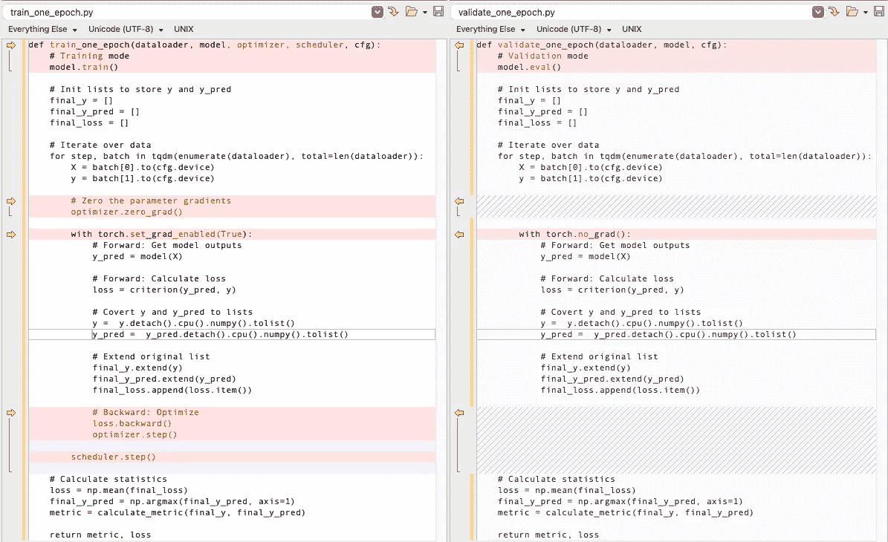

在 PyTorch 中训练和验证代码的对比截图

你可以看到以下差异：

+   模型必须处于训练或评估模式。

+   训练模型时，我们需要一个优化器和一个可选的调度器。对于验证，我们只需要模型。

+   梯度计算仅在训练时激活。对于验证，我们不需要它。

## 交叉验证策略

现在，我们还没有完成训练管道。之前，我们将训练数据分为训练数据和验证数据。但是，将可用数据分为两个固定的集合限制了训练样本的数量。

相反，我们将使用交叉验证策略，将训练数据分为*k*个折叠。然后，模型将在*k*次独立的迭代中训练，其中每次迭代模型在*k*-1 个折叠上训练，并在一个折叠上进行验证，每次迭代折叠都会切换，如下所示：

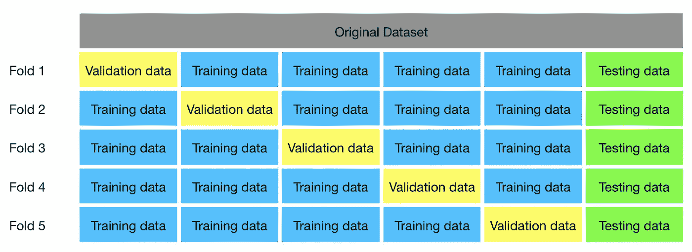

将训练数据再次分为训练和验证（灵感来源于[scikit-learn](https://scikit-learn.org/stable/modules/cross_validation.html)）

在这个例子中，我们使用了`[StratifiedKFold](https://scikit-learn.org/stable/modules/generated/sklearn.model_selection.StratifiedKFold.html)`来创建分割。你也可以使用`KFold`，但`StratifiedKFold`的优点是它保持了类分布。

```py
from sklearn.model_selection import StratifiedKFold

cfg.n_folds = 5

# Create a new column for cross-validation folds
df["kfold"] = -1

# Initialize the kfold class
skf = StratifiedKFold(n_splits=cfg.n_folds)

# Fill the new column
for fold, (train_, val_) in enumerate(skf.split(X = df, y = df.label)):
      df.loc[val_ , "kfold"] = fold

for fold in range(cfg.n_folds):
    train_df = df[df.kfold != fold].reset_index(drop=True)
    valid_df = df[df.kfold == fold].reset_index(drop=True)
```

## 添加数据增强

当训练和验证指标之间的差异显著时，这表明模型正在过拟合训练数据。过拟合发生在模型仅在少量示例上进行训练，并从训练数据中学习无关的细节或噪声。这会对模型在呈现新示例时的表现产生负面影响。结果，模型在新图像上的泛化能力受限。

为了在训练过程中克服过拟合，你可以使用数据增强。数据增强通过随机变换现有图像生成额外的训练数据。这种技术让模型接触到数据的更多方面，从而帮助它更好地泛化。

我们可以使用`albumentations`包中的一些准备好的数据增强方法，例如：

+   图像旋转（`A.Rotate()`）

+   水平翻转（`A.HorizontalFlip()`）

+   切割 [4]（`A.CoarseDropout()`）

之前，我们定义了一个基本的变换来调整图像大小并将其转换为张量。我们将继续在验证和测试数据集中使用它，因为它们不需要任何增强。对于训练数据集，我们创建了一个新的变换`transform_soft`，它在调整大小和转换为张量之外，还包含了上述三种增强。

```py
transform_soft = A.Compose([A.Resize(cfg.image_size, cfg.image_size),
                             A.Rotate(p=0.6, limit=[-45,45]),
                             A.HorizontalFlip(p = 0.6),
                             A.CoarseDropout(max_holes = 1, max_height = 64, max_width = 64, p=0.3),
                             ToTensorV2()])
```

你可以通过参数`p`来控制增强应用到图像的百分比。

如果我们可视化从增强数据集中提取的一些样本，我们可以看到三种增强成功应用：

+   图像 0、1、2、4 中的旋转

+   水平翻转很难检测，如果你不知道原始图像，但我们可以看到图像 2 必须是水平翻转的

+   图像 1 和 4 中的切割（粗略丢弃）

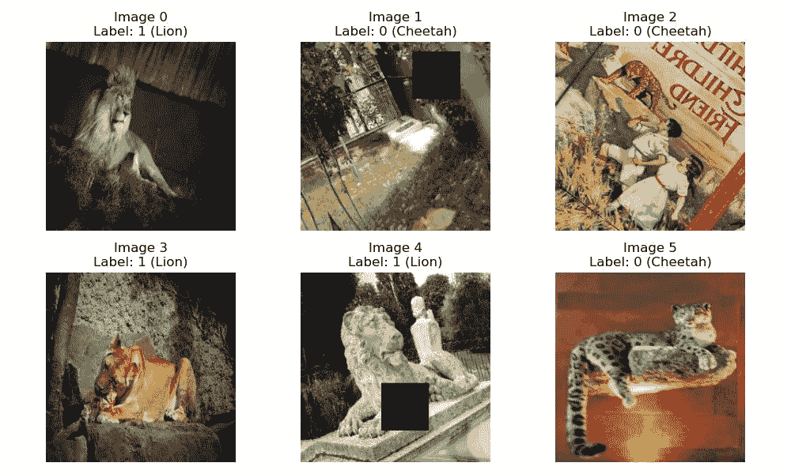

增强后的训练数据集

⚒️ *接下来，你可以审查并添加其他图像增强技术，例如 Mixup 和 Cutmix，到你的管道中。*

[](/cutout-mixup-and-cutmix-implementing-modern-image-augmentations-in-pytorch-a9d7db3074ad?source=post_page-----94ea13f56f2--------------------------------) ## Cutout, Mixup, and Cutmix: 在 PyTorch 中实现现代图像增强

### 在 Python 中实现的计算机视觉数据增强技术

towardsdatascience.com

## 将所有内容整合在一起

现在我们已经讨论了从 data pipeline 到 model 的基线的每个组件，包括 loss function and optimizer，到 training pipeline，以及 cross-validation strategy，我们可以将它们综合起来，如下图所示：

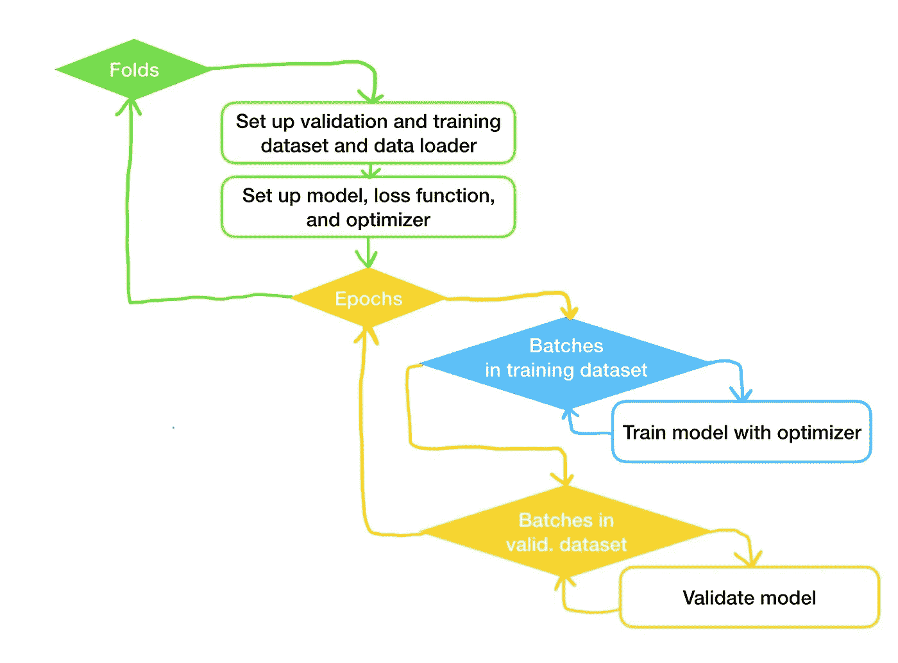

基线代码的流程图

我们将遍历交叉验证策略的每一个折叠。在每个折叠中，我们为训练和验证数据设置一个 data pipeline 和一个 model，并配备 loss function and optimizer。然后，对于每个时期，我们将训练和验证模型。

在动手之前，让我们为成功做好准备，固定随机种子以确保**可重复**的结果。

```py
import random

def set_seed(seed=1234):
    random.seed(seed)
    os.environ["PYTHONHASHSEED"] = str(seed)
    np.random.seed(seed)

    # In general seed PyTorch operations
    torch.manual_seed(seed)

    # If you are using CUDA on 1 GPU, seed it
    torch.cuda.manual_seed(seed)

    # If you are using CUDA on more than 1 GPU, seed them all
    torch.cuda.manual_seed_all(cfg.seed)

    # Certain operations in Cudnn are not deterministic, and this line will force them to behave!
    torch.backends.cudnn.deterministic = True 

    # Disable the inbuilt cudnn auto-tuner that finds the best algorithm to use for your hardware.
    torch.backends.cudnn.benchmark = False
```

接下来，我们将编写一个`fit()`函数，该函数为所有周期拟合模型。该函数会迭代周期数，而训练和验证函数包含内循环，这些内循环会迭代训练和验证数据集中的批次，如训练管道部分所述。

```py
cfg.seed = 42

def fit(model, optimizer, scheduler, cfg, train_dataloader, valid_dataloader=None):
    acc_list = []
    loss_list = []
    val_acc_list = []
    val_loss_list = []

    for epoch in range(cfg.epochs):
        print(f"Epoch {epoch + 1}/{cfg.epochs}")

        set_seed(cfg.seed + epoch)

        acc, loss = train_one_epoch(train_dataloader, model, optimizer, scheduler, cfg)

        if valid_dataloader:
            val_acc, val_loss = validate_one_epoch(valid_dataloader, model, cfg)

        print(f'Loss: {loss:.4f} Acc: {acc:.4f}')
        acc_list.append(acc)
        loss_list.append(loss)

        if valid_dataloader:
            print(f'Val Loss: {val_loss:.4f} Val Acc: {val_acc:.4f}')
            val_acc_list.append(val_acc)
            val_loss_list.append(val_loss)

    return acc_list, loss_list, val_acc_list, val_loss_list, model
```

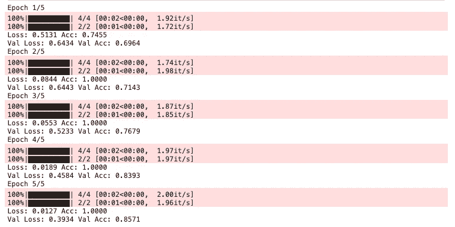

拟合函数的日志

为了可视化目的，我们还将创建训练和验证集上的损失和准确性图：

```py
def visualize_history(acc, loss, val_acc, val_loss):
    fig, ax = plt.subplots(1,2, figsize=(12,4))

    ax[0].plot(range(len(loss)), loss,  color='darkgrey', label = 'train')
    ax[0].plot(range(len(val_loss)), val_loss,  color='cornflowerblue', label = 'valid')
    ax[0].set_title('Loss')

    ax[1].plot(range(len(acc)), acc,  color='darkgrey', label = 'train')
    ax[1].plot(range(len(val_acc)), val_acc,  color='cornflowerblue', label = 'valid')
    ax[1].set_title('Metric (Accuracy)')

    for i in range(2):
        ax[i].set_xlabel('Epochs')
        ax[i].legend(loc="upper right")
    plt.show()
```

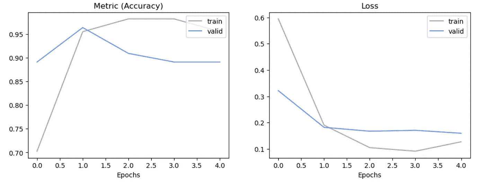

绘制的指标和损失随周期变化的历史

当我们将所有内容结合起来时，它将如下所示：

```py
for fold in range(cfg.n_folds):
    train_df = df[df.kfold != fold].reset_index(drop=True)
    valid_df = df[df.kfold == fold].reset_index(drop=True)

    train_dataset = CustomDataset(cfg, train_df, transform = transform_soft)
    valid_dataset = CustomDataset(cfg, valid_df)

    train_dataloader = DataLoader(train_dataset, 
                              batch_size = cfg.batch_size, 
                              shuffle = True, 
                              num_workers = 0,
                             )
    valid_dataloader = DataLoader(valid_dataset, 
                              batch_size = cfg.batch_size, 
                              shuffle = False, 
                              num_workers = 0,
                             )

    model = timm.create_model(cfg.backbone, 
                              pretrained = True, 
                              num_classes = cfg.n_classes)

    model = model.to(cfg.device)

    criterion = nn.CrossEntropyLoss()

    optimizer = torch.optim.Adam(model.parameters(), 
                                 lr = cfg.learning_rate, 
                                 weight_decay = 0,
                                )

    scheduler = torch.optim.lr_scheduler.CosineAnnealingLR(optimizer, 
                                                           T_max= np.ceil(len(train_dataloader.dataset) / cfg.batch_size) * cfg.epochs,
                                                           eta_min=cfg.lr_min)

    acc, loss, val_acc, val_loss, model, lrs = fit(model, optimizer, scheduler, cfg, train_dataloader, valid_dataloader)

    visualize_history(acc, loss, val_acc, val_loss)
```

# 步骤 3：运行实验

数据科学是一门实验科学。因此，这一步的目的是找到实现最佳性能的超参数配置、数据增强、模型主干和交叉验证策略（或任何你的目标，例如，性能和推理时间之间的最佳权衡）。

## 设置实验跟踪

在进入这一步之前，花点时间考虑一下你将如何跟踪实验。[实验跟踪](https://medium.com/@iamleonie/intro-to-mlops-experiment-tracking-for-machine-learning-858e432bd133)可以简单到用笔和纸记录一切。或者，你可以在电子表格中跟踪所有内容，甚至使用实验跟踪系统来自动化整个过程。

[](https://medium.com/@iamleonie/intro-to-mlops-experiment-tracking-for-machine-learning-858e432bd133?source=post_page-----94ea13f56f2--------------------------------) [## 介绍 MLOps：机器学习的实验跟踪

### 这为什么重要，以及你可以用笔和纸、电子表格等三种不同方式记录和组织你的 ML 实验。

medium.com](https://medium.com/@iamleonie/intro-to-mlops-experiment-tracking-for-machine-learning-858e432bd133?source=post_page-----94ea13f56f2--------------------------------)

如果你是绝对初学者，我建议一开始简单地手动在电子表格中跟踪你的实验。打开一个空电子表格，并为所有输入创建列，例如：

+   主干，

+   学习率，

+   周期，

+   增强方式，以及

+   图像大小

以及你想要跟踪的输出，如训练和验证的损失和指标。

结果电子表格可能会如下所示：

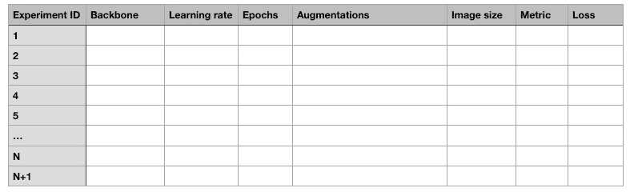

初学者跟踪实验的示例电子表格

⚒️ *一旦你对深度学习技术感到舒适，你可以通过* [*实现实验跟踪系统*](https://medium.com/@iamleonie/intro-to-mlops-experiment-tracking-for-machine-learning-858e432bd133) *来提升你的水平，以自动化实验跟踪，例如* [*Weights & Biases*](https://wandb.ai/site)*，* [*Neptune*](https://neptune.ai/)*，或* [*MLFlow*](https://mlflow.org/docs/latest/tracking.html)*。*

## 实验和超参数调整

现在你有了实验跟踪系统，让我们开始进行一些实验。你可以从调整以下超参数开始：

+   训练步骤数：范围为 2 到 10

+   学习率：范围为 0.0001 到 0.001

+   图像大小：范围为 128 到 1028

+   主干网络：尝试不同的主干网络。首先，尝试 ResNet 家族的更深模型（打印 `timm.list_models('*resnet*')` 查看其他可用模型），然后尝试不同的主干网络家族，如 `timm.list_models('*densenet*')` 或 `timm.list_models('*efficientnet*')`

⚒️ *当你对深度学习技术感到熟练时，可以通过使用* [*Optuna*](https://optuna.org/) *或* [*Weights & Biases*](https://wandb.ai/site)* 来自动化这一步，进一步提升自己。*

现在轮到你了！— 调整几个参数，看看模型的性能如何变化。一旦你对结果满意，就可以进入下一步。

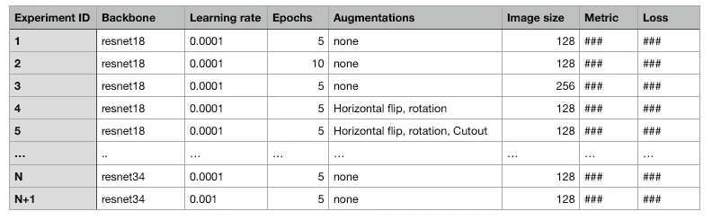

实验日志示例

# 第四步：进行预测（推断）

请敲鼓！现在我们已经找到能够给我们最优模型的配置，我们希望将其充分利用。

首先，让我们用最佳配置在完整数据集上微调模型，以利用每个数据样本。在这一步中，我们不会将数据拆分为训练数据和验证数据。相反，我们只有一个大的训练数据集。

```py
train_df = df.copy()

train_dataset = CustomDataset(cfg, train_df, transform = transform_soft)

train_dataloader = DataLoader(train_dataset, 
                          batch_size = cfg.batch_size, 
                          shuffle = True, 
                          num_workers = 0,
                         )
```

但其余的训练流程保持不变。

```py
model = timm.create_model(cfg.backbone, 
                          pretrained = True, 
                          num_classes = cfg.n_classes)

model = model.to(cfg.device)

criterion = nn.CrossEntropyLoss()

optimizer = torch.optim.Adam(model.parameters(), 
                             lr = cfg.learning_rate, 
                             weight_decay = 0,
                            )

scheduler = torch.optim.lr_scheduler.CosineAnnealingLR(optimizer, 
                                                       T_max= np.ceil(len(train_dataloader.dataset) / cfg.batch_size) * cfg.epochs,
                                                       eta_min=cfg.lr_min)

acc, loss, val_acc, val_loss, model = fit(model, optimizer, scheduler, cfg, train_dataloader)
```

**推断** — 最后，我们将使用模型来预测保留的测试集。

```py
test_dataset = CustomDataset(cfg, test_df)

test_dataloader = DataLoader(test_dataset, 
                          batch_size = cfg.batch_size, 
                          shuffle = False, 
                          num_workers = 0,
                         )

dataloader = test_dataloader

# Validation mode
model.eval()

final_y = []
final_y_pred = []

# Iterate over data
for step, batch in tqdm(enumerate(dataloader), total=len(dataloader)):
    X = batch[0].to(cfg.device)
    y = batch[1].to(cfg.device)

    with torch.no_grad():
        # Forward: Get model outputs
        y_pred = model(X)

        # Covert y and y_pred to lists
        y =  y.detach().cpu().numpy().tolist()
        y_pred =  y_pred.detach().cpu().numpy().tolist()

        # Extend original list
        final_y.extend(y)
        final_y_pred.extend(y_pred)

# Calculate statistics
final_y_pred_argmax = np.argmax(final_y_pred, axis=1)
metric = calculate_metric(final_y, final_y_pred_argmax)

test_df['prediction'] = final_y_pred_argmax
```

下面你可以看到我们模型的结果：

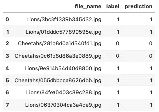

预测

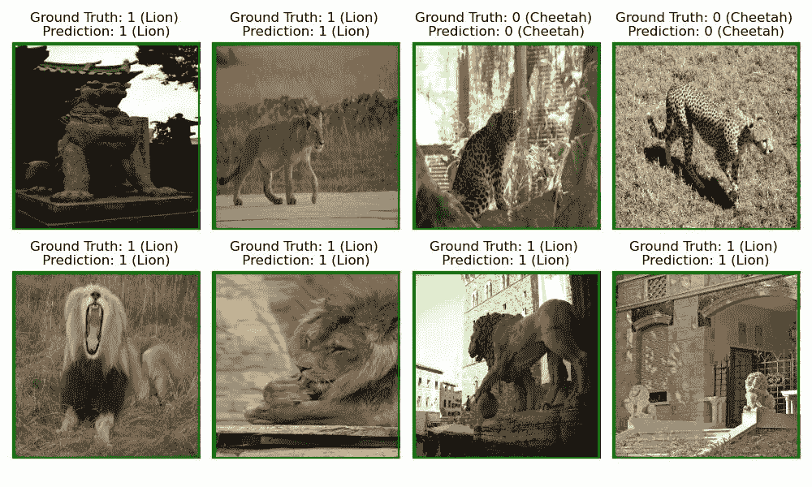

# 总结与下一步

本教程向你展示了如何微调预训练的图像分类模型以适应你的特定任务，评估它，并使用 Python 中的 PyTorch 框架对未见数据进行推断。

当你感到熟练后，可以通过查看标有 ⚒️ 的部分来提升到中级水平。

[](/intermediate-deep-learning-with-transfer-learning-f1aba5a814f?source=post_page-----94ea13f56f2--------------------------------) ## 中级深度学习与迁移学习

### 深度学习模型在计算机视觉和自然语言处理中的微调实用指南

towardsdatascience.com

# 喜欢这个故事吗？

[*免费订阅*](https://medium.com/subscribe/@iamleonie) *以便在我发布新故事时获得通知。*

[](https://medium.com/@iamleonie/subscribe?source=post_page-----94ea13f56f2--------------------------------) [## 每当 Leonie Monigatti 发布新内容时获取电子邮件通知。

### 每当 Leonie Monigatti 发布新内容时获取电子邮件通知。通过注册，如果你还没有的话，你将创建一个 Medium 账户……

medium.com](https://medium.com/@iamleonie/subscribe?source=post_page-----94ea13f56f2--------------------------------)

*在* [*LinkedIn*](https://www.linkedin.com/in/804250ab/)，[*Twitter*](https://twitter.com/helloiamleonie)*，以及* [*Kaggle*](https://www.kaggle.com/iamleonie)*上找到我！*

# 参考文献

## 数据集

[1] [MikołajFish99](https://www.kaggle.com/mikoajfish99) (2023). [狮子还是猎豹——图像分类](https://www.kaggle.com/datasets/mikoajfish99/lions-or-cheetahs-image-classification/code) 在 Kaggle 数据集中。

**许可：** 根据原始图像来源 [(开放图像数据集 V6](https://storage.googleapis.com/openimages/web/factsfigures.html))，注释由 Google LLC 根据[CC BY 4.0](https://creativecommons.org/licenses/by/4.0/)许可授权，图像的许可列为[CC BY 2.0](https://creativecommons.org/licenses/by/2.0/)。

*注意，原始数据集包含 200 张图像，每个类别各 100 张图像。但数据集需要一些清理，包括移除其他动物的图像；因此，最终数据集略小。为了保持教程简短，我们将跳过数据清理过程。*

## 图像

如果没有其他说明，所有图像均由作者创作。

## 文献

[2] S. Bhutani 与 H20.ai (2023). [训练 ML 模型的最佳实践 | @ChaiTimeDataScience #160](https://www.youtube.com/watch?v=_mzrfMA8Qx4) 在 2023 年 1 月于 YouTube 上发布。

[3] Deng, J., Dong, W., Socher, R., Li, L. J., Li, K., & Fei-Fei, L. (2009 年 6 月). Imagenet：一个大规模的分层图像数据库。见 *2009 年 IEEE 计算机视觉与模式识别会议*（第 248–255 页）。Ieee。

[4] DeVries, T., & Taylor, G. W. (2017). 使用 cutout 改进卷积神经网络的正则化。 *arXiv 预印本 arXiv:1708.04552*。

[5] K. He, X. Zhang, S. Ren, & J. Sun (2016). 深度残差学习用于图像识别。见 *IEEE 计算机视觉与模式识别会议论文集*（第 770–778 页）。

[6] timmdocs (2022). [Pytorch 图像模型（timm）](https://timm.fast.ai/)（访问日期：2023 年 4 月 10 日）。
